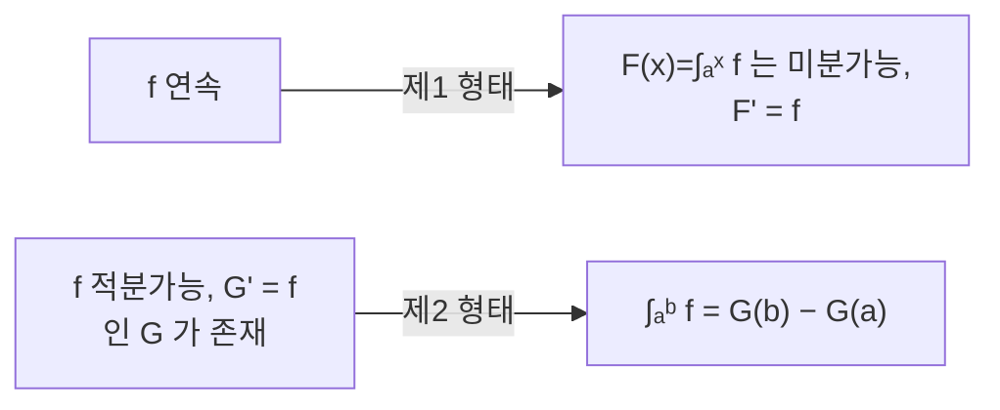

# 미적분학의 기본 정리

# 개요

[미분](derivative.md)과 [적분](riemann-integral.md)은 전혀 다른 곳에서 출발했다. 하나는 접선의 기울기를 구하려는 국소적 계산이고, 다른 하나는 넓이를 재려는 전역적 합이다. 두 절차 사이에 논리적 연결이 있어야 할 이유는 없어 보인다.

미적분학의 기본 정리는 그 둘이 서로의 역연산이라고 말한다. 누적하면 미분이 원래 함수를 돌려주고, 거꾸로 원시함수를 알면 적분을 양 끝값의 차로 계산할 수 있다. 이 정리 덕분에 정적분을 계산할 때 매번 분할합의 극한을 다룰 필요가 없어졌고, 미적분이 기법의 모음에서 계산 가능한 도구로 바뀌었다.

# 직관

## 왜 역연산인가

`F(x)` 를 `a` 부터 `x` 까지 쌓인 양이라고 하자. `x` 를 아주 조금 `h` 만큼 늘리면 새로 쌓이는 양은 폭이 `h` 이고 높이가 대략 `f(x)` 인 얇은 띠다. 따라서

$$
F(x+h)-F(x)\approx f(x)\,h
$$

이고 양변을 `h` 로 나누면 `F' = f` 다. 증명이 하는 일은 이 "대략" 을 연속성으로 정당화하는 것뿐이다.

반대 방향은 망원경 합으로 읽는다. $[a,b]$ 를 잘게 나누고 각 조각에서 $G(x_i) - G(x_{i-1})$ 를 평균값 정리로 $G'(\xi_i) \cdot \Delta x_i = f(\xi_i)\Delta x_i$ 로 바꾸면, 좌변의 합은 중간항이 모두 지워져 $G(b) - G(a)$ 가 되고 우변은 Riemann 합이다. 극한을 취하면 정리가 나온다.

## 두 방향은 같은 정리가 아니다

미분과 적분이 서로의 역이라는 말은 편리한 요약이지만 정확하지 않다. 두 진술의 가정과 결론이 다르다.



제1 형태는 원시함수의 존재를 주장한다. 연속함수에는 반드시 원시함수가 있다는 뜻이다. 제2 형태는 원시함수가 이미 있다고 가정하고 계산 공식을 준다. 원시함수가 존재하지만 초등함수로 적을 수 없는 경우가 흔하므로, 제1 형태가 성립한다고 해서 제2 형태로 실제 계산이 되는 것은 아니다.

# 정의

## 누적함수

실수 `a < b` 를 고정하고 `f` 를 `[a,b]` 에서 Riemann 적분 가능한 함수라 하자.

$$
F(x)=\int_a^x f(t)\,dt,\qquad x\in[a,b]
$$

를 누적함수라 한다. `G' = f` 인 `G` 를 `f` 의 원시함수라 하며, 두 원시함수는 상수만큼만 다르다.

## 제1 형태

`f` 가 `[a,b]` 에서 적분 가능하면 `F` 는 연속이다. 나아가 `f` 가 점 `x` 에서 연속이면 `F` 는 그 점에서 미분가능하고

$$
F'(x)=f(x)
$$

가 성립한다. 특히 `f` 가 `[a,b]` 에서 연속이면 `F` 가 `f` 의 원시함수다.

## 제2 형태

`f` 가 `[a,b]` 에서 적분 가능하고, `[a,b]` 에서 연속이며 내부에서 미분가능한 `G` 가 `G' = f` 를 만족하면

$$
\int_a^b f(t)\,dt=G(b)-G(a)
$$

이다. `f` 의 연속성은 요구하지 않는다는 점이 제1 형태와 다르다.

# 성질

## 제1 형태의 증명

`h > 0` 에 대해

$$
\frac{F(x+h)-F(x)}h=\frac1h\int_x^{x+h}f(t)\,dt
$$

이고 우변은 $[x, x+h]$ 에서의 $f$ 의 평균이다. $f$ 가 $x$ 에서 연속이므로 $|f(t) - f(x)| < \varepsilon$ 를 만드는 $\delta$ 를 잡으면 $0 < h < \delta$ 에서

$$
\left|\frac{F(x+h)-F(x)}h-f(x)\right|\le\frac1h\int_x^{x+h}|f(t)-f(x)|\,dt<\varepsilon
$$

이다. $h < 0$ 에서도 같다. 연속성 없이 적분 가능성만 있으면 $|F(x+h)-F(x)| \le M|h|$ 로 $F$ 의 Lipschitz 연속성까지만 얻는다.

## 연속성은 충분조건이지 필요조건이 아니다

$[-1,1]$ 에서 $f(0) = 1$ 이고 나머지 점에서 $0$ 인 함수를 보자. 모든 누적적분이 $0$ 이므로 $F \equiv 0$ 이고 $F'(0) = 0 \ne f(0)$ 이다. 적분 가능성만으로는 모든 점에서 $F' = f$ 를 보장할 수 없다.

거꾸로, 원시함수가 있다고 해서 $f$ 가 연속인 것도 아니다. $f(x) = 2x \sin(1/x^2) - (2/x)\cos(1/x^2)$ 는 $x = 0$ 근처에서 유계가 아니지만 원시함수 $x^2 \sin(1/x^2)$ 를 갖는다. 도함수가 될 수 있는 함수의 모임은 연속함수보다 넓으며, 다만 Darboux 성질(중간값 성질)은 반드시 만족한다.

## 정확한 판본

두 형태를 최대한 넓힌 진술은 Lebesgue 적분에서 나온다. $F$ 가 $[a,b]$ 에서 절대연속인 것과, 어떤 $f \in L^1$ 에 대해 $F(x) = F(a) + \int_a^x f$ 로 쓰이는 것이 동치다. 이때 $F' = f$ 가 거의 어디서나 성립한다.

절대연속성이 필요한 이유는 Cantor 함수가 보여 준다. 이 함수는 연속이고 단조증가하며 거의 어디서나 도함수가 $0$ 인데도 $0$ 에서 $1$ 까지 올라간다. $\int_0^1 F' = 0 \ne 1 = F(1) - F(0)$ 이므로 제2 형태가 깨진다. 연속성과 거의 어디서나의 미분가능성만으로는 부족하다.

## 따름정리

- **치환적분.** $\int f(g(x))g'(x)\,dx = \int f(u)\,du$ 는 연쇄법칙을 뒤집은 것이다.
- **부분적분.** $\int uv' = uv - \int u'v$ 는 곱의 미분법을 뒤집은 것이다.
- **Leibniz 적분 규칙.** 적분 구간의 끝이 변수일 때 $\frac{d}{dx} \int_{a(x)}^{b(x)} f = f(b(x))b'(x) - f(a(x))a'(x)$ 로 미분한다.

미분 공식 하나하나가 적분 공식 하나로 번역된다는 것이 이 정리의 실용적 내용이다.

```python
def antiderivative_check(f, G, a, b, n=200000):
    """정리의 두 방향을 수치로 대조한다."""
    h = (b - a) / n
    riemann = h * sum(f(a + (i + 0.5) * h) for i in range(n))
    return riemann, G(b) - G(a)


import math
print(antiderivative_check(lambda t: 2 * t, lambda t: t * t, 0, 3))
print(antiderivative_check(math.cos, math.sin, 0, math.pi / 2))
# 원시함수를 초등함수로 적을 수 없어도 누적함수는 존재한다
print(antiderivative_check(lambda t: math.exp(-t * t),
                           lambda t: math.sqrt(math.pi) / 2 * math.erf(t), 0, 1))
```

$\int_0^3 2t\,dt = 9$ 이고, 원시함수에 상수를 더해도 양 끝의 차에서 사라진다.

# 활용

## 계산 도구로서의 적분

분할합의 극한을 매번 다루는 대신 원시함수를 찾아 양 끝값을 대입한다. 다만 원시함수가 초등함수로 표현되지 않는 경우가 흔하며, $e^{-t^2}$ , $\sin(t)/t$ , $1/\ln t$ 가 그렇다. Risch 알고리즘은 주어진 초등함수의 원시함수가 초등함수인지 판정하고 존재하면 구성한다. 초등적 표현이 없으면 수치 적분이나 특수함수로 넘어간다.

## 적분으로 정의된 함수

오차함수, 감마함수, 로그적분, 확률의 누적분포함수는 모두 적분으로 정의된다. 제1 형태가 이들의 미분을 즉시 알려 주므로, 정의식을 직접 다루지 않고도 도함수를 이용한 근사와 점근 분석이 가능하다. 통계에서 누적분포함수를 미분하면 밀도함수가 되는 관계도 같은 정리다.

## 미분방정식과 복소해석

[상미분방정식](ordinary-differential-equations.md)을 푸는 첫 단계는 양변을 적분해 초기조건을 반영한 적분방정식으로 바꾸는 것이고, 이 변환이 곧 기본 정리다. Picard 반복법이 그 적분방정식에 [Banach 부동점 정리](banach-fixed-point.md)를 적용한 것이다.

복소평면에서는 같은 발상이 훨씬 강한 결과를 낳는다. [정칙함수](holomorphic-functions.md)의 경로적분이 경로에 무관하다는 Cauchy 적분 정리가 "원시함수가 존재한다" 는 진술의 복소판이며, 여기서 Cauchy 적분 공식과 유수 정리가 이어진다. 실수에서 계산을 편하게 해 주던 정리가 복소에서는 구조를 결정하는 정리가 된다.[^1]

[^1]: Jiří Lebl, *Basic Analysis*, The fundamental theorem of calculus. 두 형태의 정리와 증명, 연속성 가정의 역할. https://www.jirka.org/ra/html/sec_ftc.html

# 연관 문서

## 선수지식

- [미분](derivative.md)
- [Riemann 적분](riemann-integral.md)

## 더 알아보기

- [정칙함수와 Cauchy 적분 정리](holomorphic-functions.md)
- [상미분방정식](ordinary-differential-equations.md)

#analysis #theorem
