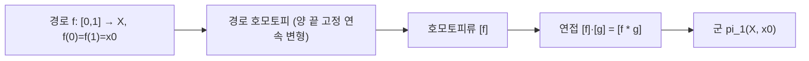

# 기본군

# 개요

기본군은 위상공간의 한 점을 기준으로 잡은 닫힌 경로들을 연속 변형으로 동일시하여 얻는 [군](groups.md)이다. 구멍을 감아 도는 횟수 같은 정보를 대수적으로 기록하므로, 두 공간이 위상동형이 아님을 증명하는 데 쓸 수 있다. 연속사상은 기본군 사이의 준동형을 유도하므로 기본군은 위상공간의 범주에서 군의 범주로 가는 [functor](functors.md)다. 원의 기본군이 정수군이라는 계산 하나로 원판에서 경계 원으로의 retraction이 없다는 사실이 나오고, 여기서 2차원 Brouwer 고정점 정리와 대수학의 기본정리가 따라 나온다.

# 직관

고무줄 하나를 공간 안의 한 점에 양 끝을 고정한 채 놓아 둔다. 고무줄을 끊지 않고 미끄러뜨려 다른 고무줄로 옮길 수 있으면 두 고무줄을 같은 것으로 본다. 평면에서는 어떤 고무줄도 한 점으로 수축된다. 그러나 원점을 제거한 평면에서는 원점을 한 바퀴 감은 고무줄을 점으로 줄일 수 없고, 감은 횟수와 방향만이 남는다. 그 결과가 정수군이다.

연산은 "먼저 f를 돌고 이어서 g를 돈다"이다. 이 연접은 경로 수준에서는 결합법칙을 만족하지 않는다(구간을 나누는 비율이 달라진다). 그러나 호모토피류 수준에서는 재매개화가 호모토피이므로 결합법칙이 성립하고, 상수 경로가 항등원, 역방향 경로가 역원이 된다.

# 정의

$X$ 를 위상공간, $x_0$ 를 $X$ 의 한 점(기준점)이라 하자. $X$ 의 $x_0$ 에 기반한 **loop** 는 단위구간에서 $X$ 로 가는 연속함수로 양 끝이 모두 $x_0$ 인 것이다. 두 loop $f,g$ 가 **경로 호모토피**(path-homotopic)라는 것은 양 끝을 고정한 연속 변형이 있다는 뜻이다.

$$
H:[0,1]\times[0,1]\to X\ \text{연속},\quad H(s,0)=f(s),\ H(s,1)=g(s),\ H(0,t)=H(1,t)=x_0
$$

경로 호모토피는 loop 들 사이의 [동치관계](relations.md)이고, $f$ 의 동치류를 $[f]$ 로 표기한다. 연접은 다음으로 정의된다.

$$
(f\astg)(s)=\begin{cases} f(2s), & 0\le s\le \tfrac12\cr g(2s-1), & \tfrac12\le s\le 1\end{cases}
$$

기본군은 이 연산을 가진 동치류들의 집합이다[^1].

$$
\pi_1(X,x_0)=\bigl\lbrace\thinspace[f]\ \big|\ f\ \text{는 } x_0 \text{ 기반 loop}\thinspace\bigr\rbrace,\qquad [f]\cdot[g]=[f\astg]
$$

항등원은 상수 loop의 류이고 역원은 방향을 뒤집은 loop의 류다.

## 기준점과 유도 준동형

$X$ 가 경로연결(path-connected)이면 서로 다른 기준점에서 얻은 기본군은 동형이므로 기준점을 생략하고 적기도 한다. 연속사상 $h$ 가 $X$ 의 $x_0$ 를 $Y$ 의 $y_0$ 로 보내면 다음 준동형이 유도된다.

$$
h_\ast:\pi_1(X,x_0)\to\pi_1(Y,y_0),\qquad h_\ast[f]=[h\circ f]
$$

항등사상은 항등준동형으로, 합성은 합성으로 가므로 기본군은 함자다. 따라서 $X$ 와 $Y$ 가 위상동형이면 기본군이 동형이다. 기본군이 자명한 경로연결 공간을 **단일연결**(simply connected)이라 한다.

## 피복공간

연속 전사 $p$ 가 **피복사상**(covering map)이라는 것은 밑공간의 각 점이 열린근방 $U$ 를 가져 그 역상이 서로소인 열린집합들의 합집합이고 각 조각이 $p$ 에 의해 $U$ 와 위상동형이 되는 것이다.

$$
p^{-1}(U)=\bigsqcup_{\alpha}V_\alpha,\qquad p\big|\_{V_\alpha}:V_\alpha\xrightarrow{\ \cong\ }U
$$

피복공간은 기본군 계산의 주된 도구다. 핵심 보조정리는 경로 올림(path lifting)과 호모토피 올림(homotopy lifting)이며, 둘 모두 올림이 시작점을 정하면 유일하다.

# 성질

## 원의 기본군

원의 기본군은 정수군과 동형이며, 동형사상은 loop에 감김수(winding number)를 대응시킨다[^2].

$$
\pi_1(S^1)\cong\mathbb{Z}
$$

증명 개요. 실수 직선에서 원으로 가는 지수사상을 피복사상으로 쓴다.

$$
p:\mathbb{R}\to S^1,\qquad p(t)=(\cos 2\pi t,\ \sin 2\pi t),\qquad p^{-1}(1)=\mathbb{Z}
$$

기준점 1에 기반한 loop f를 올려서 0에서 시작하는 유일한 경로를 얻으면 그 끝점은 정수이고, 이 정수를 f의 차수라 한다. 호모토피 올림 보조정리에 의해 차수는 호모토피류에만 의존하고, 연접은 차수의 덧셈이 되므로 준동형이다. 정수 n에 대해 t를 n배 감는 loop가 차수 n을 주므로 전사이고, 차수가 0이면 올림이 닫힌 경로이며 실수 직선은 볼록하므로 직선호모토피로 상수로 줄어들어 단사다.

## 기본 계산 결과

- Euclidean 공간, 볼록집합, 별모양집합은 simply connected다(직선호모토피).
- 원환 영역(annulus), 원점을 제거한 평면, 원기둥, Möbius 띠는 모두 원과 호모토피 동치이므로 기본군이 정수군이다.
- 2차원 이상 차원의 구면은 simply connected다.
- 원환면의 기본군은 정수군의 두 번 곱이며 가환이다. 일반적으로 곱공간의 기본군은 기본군의 곱이다.
- 8자 모양(두 원을 한 점에서 붙인 것)의 기본군은 두 생성원의 자유군이며 비가환이다. 기본군은 가환일 필요가 없다.
- 실사영평면의 기본군은 위수 2의 순환군이다.

## Brouwer 고정점 정리 (2차원)

닫힌 원판에서 자신으로 가는 연속사상은 고정점을 가진다[^3].

증명 개요. 고정점이 없다고 가정하면 각 점 x에서 f(x)에서 x로 향하는 방향으로 반직선을 그어 경계와 만나는 점을 대응시키는 연속사상을 얻고, 이는 원판에서 경계 원으로의 retraction이 된다. 즉 경계의 포함사상 i와 이 retraction r에 대해 r∘i가 항등사상이다. 기본군의 functor 성질을 적용하면

$$
\pi_1(S^1)\xrightarrow{\thinspace i_\ast\thinspace}\pi_1(D^2)\xrightarrow{\thinspace r_\ast\thinspace}\pi_1(S^1)
$$

의 합성이 항등준동형이어야 한다. 그러나 가운데 군은 자명하므로 합성은 자명한 준동형이고, 정수군의 항등사상은 자명하지 않아 모순이다.

같은 논법으로 고차원을 다루려면 기본군만으로는 부족하다. 3차원 이상에서는 구면의 기본군이 자명하므로 대신 [단체 호몰로지](homology.md)를 쓴다. 한편 일반 거리공간의 축약사상에 대한 고정점 정리는 성격이 다른 결과다([축약사상 고정점 정리](banach-fixed-point.md)).

## 계산 도구

Seifert–van Kampen 정리는 공간을 열린집합 두 개로 덮었을 때 전체의 기본군을 조각들의 기본군과 교집합의 기본군으로부터 amalgamated product로 기술한다. 이것이 cell complex의 기본군을 생성원과 관계식으로 읽어내는 방법이다.

# 활용

- 위상동형 판별: 기본군이 다르면 위상동형이 아니다. 원과 구면, 원환면과 구면이 다름을 이렇게 확인한다. 반대는 성립하지 않는다. 2차원 구면과 3차원 구면은 둘 다 simply connected지만 위상동형이 아니다.
- 대수학의 기본정리: 복소 다항식의 근이 없다고 가정하면 큰 원의 상의 감김수가 차수와 0 양쪽이 되어 모순이다.
- 로봇 경로계획과 동역학: 장애물이 있는 배위공간(configuration space)의 기본군이 본질적으로 다른 경로류를 분류한다.
- 복소해석: 단순연결 영역에서 정칙함수의 적분이 경로에 무관하다는 사실이 Cauchy 정리의 위상적 내용이다([정칙함수](holomorphic-functions.md)).
- 피복공간과 군론: 경로연결·국소적으로 좋은 공간의 피복공간들은 기본군의 부분군들과 대응한다. 자유군의 부분군이 자유군임을 그래프의 피복으로 증명할 수 있다([그래프](graphs.md)).

[^1]: J. R. Munkres, *Topology*, 2nd ed., §51–52 (경로 호모토피와 기본군), §53–54 (피복공간과 올림 보조정리). 같은 내용의 강의노트: A. Landesman, "Notes on the fundamental group". https://people.math.harvard.edu/~landesman/assets/fundamental-group.pdf
[^2]: 원의 기본군이 정수군임을 지수 피복과 올림 보조정리로 증명한 서술. S. Dooley, "Basic algebraic topology: the fundamental group of a circle", UChicago REU. https://www.math.uchicago.edu/~may/VIGRE/VIGRE2011/REUPapers/Dooley.pdf
[^3]: 기본군의 functor 성질로 retraction의 부재를 보이고 2차원 Brouwer 정리를 얻는 논법. N. Gill, "The fundamental group and the Brouwer fixed point theorem", UChicago REU. http://math.uchicago.edu/~may/REU2013/REUPapers/Gill.pdf

# 연관 문서

## 선수지식

- [위상 공간](topology.md)
- [군](groups.md)

## 더 알아보기

- [곡면의 분류](classification-of-surfaces.md)
- [덮개공간](covering-spaces.md)
- [매듭 불변량과 Jones 다항식](knot-invariants.md)

#algebraic_topology #topology #group_theory
