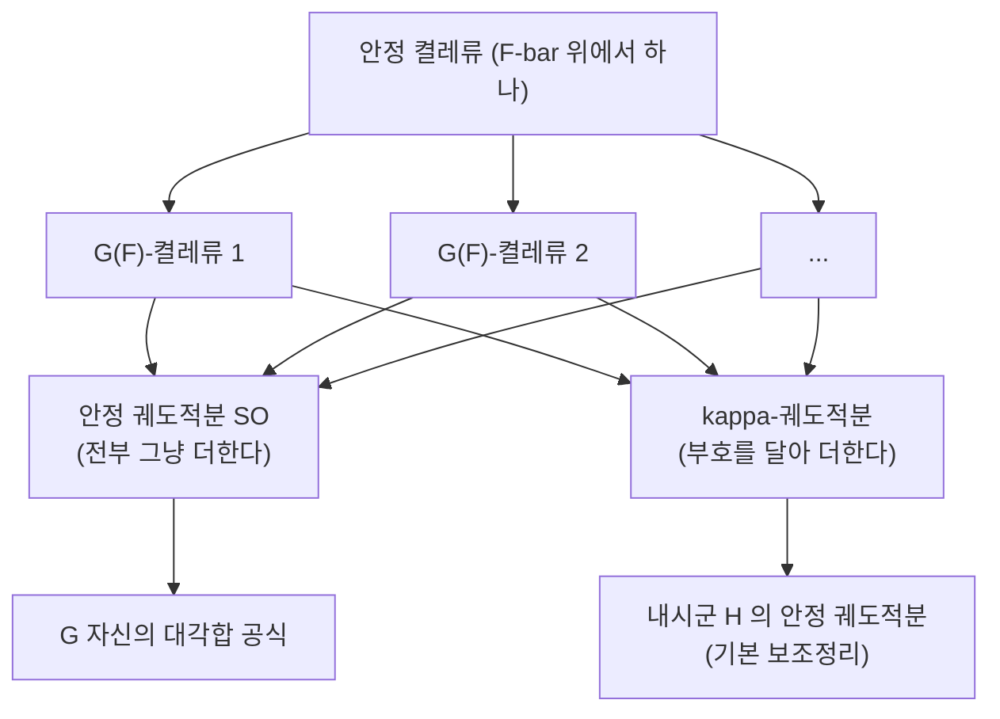

# 기본 보조정리와 대각합 공식의 안정화

# 개요

[Selberg 대각합 공식](selberg-trace-formula.md)은 $\mathrm{SL}_2(\mathbb Z)\backslash\mathbb H$ 의 Laplace 스펙트럼을 닫힌 측지선으로 바꿔 놓았다. 왼쪽이 해석(스펙트럼), 오른쪽이 기하였다. Arthur 가 이것을 임의의 환원군 $G$ 와 아델 상 $G(\mathbb Q)\backslash G(\mathbb A)$ 로 올린 것이 **Arthur–Selberg 대각합 공식**이고, 그 모양은 여전히 같다.

$$
\underbrace{\sum_\pi m(\pi)\,\mathrm{tr}\,\pi(f)}_{\text{스펙트럼}}\;=\;\underbrace{\sum_{\{\gamma\}}\mathrm{vol}(\cdot)\,O_\gamma(f)}_{\text{기하}}
$$

측지선 자리에 들어온 것이 **궤도적분** $O_\gamma(f)$ 다. 곡면에서 측지선이 켤레류에 대응했던 것과 같은 자리다.

이 공식이 쓰이는 방식은 두 군에 대해 나란히 써 놓고 비교하는 것이다. 군 $H$ 의 자기동형 표현이 $G$ 의 것으로 올라간다는 함수성 명제를 증명하고 싶다면, 스펙트럼 쪽은 직접 비교할 방법이 없으므로 **기하 쪽을 비교한다.** $H$ 의 궤도적분과 $G$ 의 궤도적분이 짝이 맞으면 스펙트럼 쪽 등식이 따라 나온다.

그런데 여기서 걸린다. $G$ 의 켤레류는 대수적 폐포 위에서 보는 것과 바닥체 위에서 보는 것이 다르다. 폐포에서 하나였던 켤레류가 바닥체 위에서는 여러 조각으로 갈라진다. 갈라진 조각들을 그냥 더한 것(안정 궤도적분)은 잘 다뤄지지만, 조각마다 부호를 달아 더한 것($\kappa$ 궤도적분)은 $G$ 안에서 해석되지 않는다. **Langlands 의 발견은 그 $\kappa$ 궤도적분이 더 작은 군 $H$ — 내시군(endoscopic group) — 의 안정 궤도적분과 같아 보인다는 것이었다.**

$$
O^\kappa_\gamma(f)\;\stackrel?=\;\Delta(\gamma_H,\gamma)\;SO_{\gamma_H}(f^H)
$$

가장 기본이 되는 경우, 곧 $f$ 가 극대 콤팩트 부분군의 특성함수이고 $f^H$ 가 [Satake 동형](satake-isomorphism.md)으로 정의된 기본 사상 $b$ 의 상일 때 이 등식이 성립한다는 것이 **기본 보조정리**다. Satake 동형이 여기서 필수인 이유는 $f\mapsto f^H$ 라는 대응이 달리 정의될 방법이 없기 때문이다. 쌍대군 준동형 $\widehat H\to\widehat G$ 를 표현환 사이의 사상으로 읽고, 양쪽에서 Satake 동형으로 Hecke 대수로 끌어내린다.

$$
\mathcal H(G,K)\;\xrightarrow{\ \mathcal S\ }\;R(\widehat G)\;\longrightarrow\;R(\widehat H)\;\xrightarrow{\ \mathcal S^{-1}\ }\;\mathcal H(H,K_H)
$$

Langlands 는 이것을 남은 기술적 단계로 보고 "보조정리" 라 불렀다. 완전한 증명까지 30 년이 걸렸고, Ngô Bảo Châu 가 2008 년에 Hitchin 올뭉치의 기하로 증명해 2010 년 Fields 메달을 받았다. 이름만 보조정리로 남았다.

# 직관

## 안정 켤레와 유리 켤레

$\gamma,\gamma'\in G(F)$ 가 **안정 켤레**라는 것은 $\bar F$ 위에서 켤레라는 뜻이다. 곧 $g\gamma g^{-1}=\gamma'$ 인 $g\in G(\bar F)$ 가 있되 $g$ 가 $F$ 위에 있을 필요는 없다.

$g$ 를 $F$ 로 내리려 하면 Galois 로 뒤틀린 정도가 남는다. $\sigma\in\mathrm{Gal}(\bar F/F)$ 에 대해 $g^{-1}\sigma(g)$ 는 $\gamma$ 의 중심화군 $T=Z_G(\gamma)$ 안에 있고, 이 대응이 코사이클을 준다. 그래서 하나의 안정 켤레류 안에 든 $G(F)$ 켤레류들이 다음으로 매겨진다.

$$
\ker\bigl(H^1(F,T)\to H^1(F,G)\bigr)
$$

**이것이 갈라짐의 전부다.** $H^1(F,T)$ 가 자명하면 안정 켤레류와 켤레류가 같고 아무 문제도 없다. 자명하지 않을 때 비로소 내시가 필요해진다.



## $\kappa$ 는 어디서 오는가

갈라진 조각들의 집합이 유한 아벨군 $\mathfrak D=\ker(H^1(F,T)\to H^1(F,G))$ 이다. 아벨군 위의 함수는 그 지표로 분해된다. 지표 하나를 $\kappa$ 라 하면 두 극단이 있다.

- $\kappa=1$ 이면 조각을 전부 같은 무게로 더한다. **안정 궤도적분** $SO_\gamma$ 다.
- $\kappa\neq1$ 이면 조각마다 $\kappa$ 값을 곱해 더한다. **$\kappa$ 궤도적분** $O^\kappa_\gamma$ 다.

대각합 공식의 기하 쪽을 안정 궤도적분만으로 다시 쓰려는 작업을 **안정화**라 한다. 실제로 해 보면 $\kappa=1$ 항만으로는 닫히지 않고 $\kappa\neq1$ 항들이 남는다. 그 남는 항들을 어떻게 할 것인가가 문제의 전부다.

Langlands 의 통찰은 이 지표 $\kappa$ 를 쌍대군 쪽에서 읽으면 $\widehat T\subset\widehat G$ 안의 반단순 원소 하나가 되고, 그 중심화군 $Z_{\widehat G}(\kappa)$ 가 다시 어떤 복소 환원군의 쌍대군이라는 것이다. 그 군이 **내시군** $H$ 다. 곧 $\kappa$ 라는 뒤틀림 자료 하나가 새 군을 낳는다.

$$
\kappa\in\widehat T\ \leadsto\ \widehat H=Z_{\widehat G}(\kappa)^\circ\ \leadsto\ H
$$

$H$ 는 $G$ 의 부분군이 아니다. 계수는 같고 크기는 작다. $\mathrm{SL}_2$ 의 내시군이 토러스이고, $\mathrm{SO}_{2n+1}$ 의 내시군이 $\mathrm{SO}_{2a+1}\times\mathrm{SO}_{2b+1}$ 꼴인 식이다. $G$ 안에서 설명되지 않던 $\kappa$ 항이 다른 군의 안정 항으로 설명된다 — 이것이 내시라는 이름(내시경으로 들여다본다)의 뜻이다.

## 왜 그렇게 어려웠는가

진술만 보면 유한 계산처럼 보인다. 양쪽 다 유한합이고, 각 항은 격자 세기다. 그런데 그 세기가 $G$ 의 종류와 $\gamma$ 의 위치에 따라 제멋대로 바뀌고, 일반적인 $G$ 에 대해 직접 셀 방법이 없었다. $\mathrm{SL}_2$ 와 $\mathrm{SL}_3$ 과 $\mathrm{U}(3)$ 같은 작은 경우는 손으로 확인되었지만 그 계산들이 일반화되지 않았다.

돌파구는 두 단계였다. 먼저 Waldspurger 가 문제를 여러 번 옮겼다. 군에서 Lie 대수로, 표수 0 에서 양의 표수로, 그리고 가중 판으로. 옮겨진 형태는 **등표수 국소체** $\mathbb F_q((t))$ 위의 진술이고, 거기서는 기하학을 쓸 수 있다. 그다음 Ngô 가 그 기하를 실제로 해냈다.

# 정의

## 궤도적분

$F$ 를 국소체, $G$ 를 $F$ 위의 환원군, $f\in C_c^\infty(G(F))$ 라 하자. 정칙 반단순 $\gamma$ 에 대해 $T=Z_G(\gamma)$ 를 두고

$$
O_\gamma(f)=\int_{T(F)\backslash G(F)}f(x^{-1}\gamma x)\,dx
$$

를 **궤도적분**이라 한다. 이것이 대각합 공식의 기하 쪽에 나타나는 양이다. $f=\mathbf 1_K$ 이면 적분은 $K$ 안에서 $\gamma$ 와 켤레가 되는 점들을 세는 것이 된다.

## 안정 궤도적분과 $\kappa$ 궤도적분

$\gamma$ 의 안정 켤레류에 든 $G(F)$ 켤레류 대표들을 $\gamma_1,\dots,\gamma_r$ 이라 하고, 각각에 $\mathfrak D$ 의 원소 $\mathrm{inv}(\gamma,\gamma_i)$ 를 대응시킨다. $\mathfrak D$ 의 지표 $\kappa$ 에 대해

$$
SO_\gamma(f)=\sum_{i=1}^re(\gamma_i)\,O_{\gamma_i}(f),\qquad
O^\kappa_\gamma(f)=\sum_{i=1}^r\kappa\bigl(\mathrm{inv}(\gamma,\gamma_i)\bigr)\,e(\gamma_i)\,O_{\gamma_i}(f)
$$

로 둔다. $e(\gamma_i)$ 는 측도를 맞추는 인자다. $\kappa=1$ 이면 앞의 것이 뒤의 것의 특수한 경우다.

## 기본 사상

비분기 상황에서 $\mathcal H(G,K)=C_c^\infty(K\backslash G(F)/K)$ 이고 Satake 동형이 이것을 $R(\widehat G)$ 와 동일시한다. 내시 자료가 주는 쌍대군 준동형 $\eta:\widehat H\to\widehat G$ 는 표현의 제한 $R(\widehat G)\to R(\widehat H)$ 를 낳는다. 그 합성이 **기본 사상**이다.

$$
b:\mathcal H(G,K)\xrightarrow{\ \mathcal S\ }R(\widehat G)\xrightarrow{\ \eta^*\ }R(\widehat H)\xrightarrow{\ \mathcal S^{-1}\ }\mathcal H(H,K_H)
$$

$f^H:=b(f)$ 로 쓴다. 정의가 전적으로 쌍대군 쪽에서 이루어졌다는 점이 중요하다. $G(F)$ 위의 함수와 $H(F)$ 위의 함수를 잇는 직접적인 기하적 이유는 아무것도 주어지지 않았다.

## 진술

> **기본 보조정리 (Langlands–Shelstad 추측, Ngô 정리).** $G$ 가 비분기이고 $(H,\kappa,\eta)$ 가 비분기 내시 자료라 하자. $G$ 의 정칙 반단순 $\gamma$ 와 그에 대응하는 $H$ 의 $\gamma_H$ 에 대해
> $$
> \Delta(\gamma_H,\gamma)\,SO_{\gamma_H}(\mathbf 1_{K_H})=O^\kappa_\gamma(\mathbf 1_K)
> $$
> 가 성립한다. 더 일반적으로 $\mathbf 1_K$ 자리에 임의의 $f\in\mathcal H(G,K)$ 와 $f^H=b(f)$ 를 넣어도 성립한다(가중 판).

$\Delta(\gamma_H,\gamma)$ 는 Langlands–Shelstad 의 이동 인자(transfer factor)로, 부호와 정규화를 맞추는 명시적인 양이다.

# 성질

## 갈라짐을 직접 센다

가장 작은 예에서 갈라짐이 실제로 일어나는지 확인한다. $G=\mathrm{SL}_2$ 를 유한체 $\mathbb F_q$ 위에서 보고, 하나의 안정 켤레류(= 같은 특성다항식을 갖는 원소들)가 $\mathrm{SL}_2(\mathbb F_q)$ 켤레류 몇 개로 갈라지는지 센다.

```python
def sl2(q):
    return [(a, b, c, d) for a in range(q) for b in range(q) for c in range(q)
            for d in range(q) if (a*d - b*c) % q == 1]

def mul(A, B, q):
    a, b, c, d = A; e, f, g, h = B
    return ((a*e+b*g) % q, (a*f+b*h) % q, (c*e+d*g) % q, (c*f+d*h) % q)

def inv(A, q):
    a, b, c, d = A
    return (d % q, (-b) % q, (-c) % q, a % q)      # det = 1 이므로 여인수가 곧 역행렬

def classes_in(St, G, q):
    """St 를 SL_2(F_q)-켤레류로 쪼갠다"""
    rem, out = set(St), []
    while rem:
        A = next(iter(rem))
        orb = {mul(mul(g, A, q), inv(g, q), q) for g in G}
        out.append(orb); rem -= orb
    return sorted(out, key=len, reverse=True)

for q in [5, 7, 11, 13]:
    G = sl2(q)
    regular, unipotent = set(), []
    for t in range(q):                              # 특성다항식 x^2 - tx + 1
        St = [A for A in G if (A[0] + A[3]) % q == t]
        cls = classes_in(St, G, q)
        big = sorted(len(c) for c in cls if len(c) > 1)   # 중심 원소 ±1 은 뺀다
        if (t*t - 4) % q != 0:
            regular.add(len(big))                   # 정칙 반단순
        else:
            unipotent.append((t, big))              # t = ±2
    print(f"q={q:3d}  |SL2(F_q)| = {len(G):5d}")
    print(f"   정칙 반단순 (t^2 != 4): 안정류 하나당 SL2-켤레류 {regular} 개")
    for t, big in unipotent:
        print(f"   t={t:2d} 유니포턴트: 켤레류 크기 {big}"
              f"   ->  안정 O = {sum(big)},   kappa-O = {big[0] - big[1]}")

# q=  5  |SL2(F_q)| =   120
#    정칙 반단순 (t^2 != 4): 안정류 하나당 SL2-켤레류 {1} 개
#    t= 2 유니포턴트: 켤레류 크기 [12, 12]   ->  안정 O = 24,   kappa-O = 0
#    t= 3 유니포턴트: 켤레류 크기 [12, 12]   ->  안정 O = 24,   kappa-O = 0
# q=  7  |SL2(F_q)| =   336
#    정칙 반단순 (t^2 != 4): 안정류 하나당 SL2-켤레류 {1} 개
#    t= 2 유니포턴트: 켤레류 크기 [24, 24]   ->  안정 O = 48,   kappa-O = 0
#    t= 5 유니포턴트: 켤레류 크기 [24, 24]   ->  안정 O = 48,   kappa-O = 0
# q= 11  |SL2(F_q)| =  1320
#    정칙 반단순 (t^2 != 4): 안정류 하나당 SL2-켤레류 {1} 개
#    t= 2 유니포턴트: 켤레류 크기 [60, 60]   ->  안정 O = 120,   kappa-O = 0
#    t= 9 유니포턴트: 켤레류 크기 [60, 60]   ->  안정 O = 120,   kappa-O = 0
# q= 13  |SL2(F_q)| =  2184
#    정칙 반단순 (t^2 != 4): 안정류 하나당 SL2-켤레류 {1} 개
#    t= 2 유니포턴트: 켤레류 크기 [84, 84]   ->  안정 O = 168,   kappa-O = 0
#    t=11 유니포턴트: 켤레류 크기 [84, 84]   ->  안정 O = 168,   kappa-O = 0
```

두 줄이 정반대의 것을 말한다.

**정칙 반단순에서는 갈라짐이 없다.** 네 소수 모두에서 안정류 하나가 $\mathrm{SL}_2(\mathbb F_q)$ 켤레류 하나다. 이유는 Lang 정리다. 유한체 위의 연결 대수군은 $H^1$ 이 자명하고, 정칙 반단순 원소의 중심화군은 연결 토러스이므로 $\mathfrak D$ 가 소멸한다. **유한체 위에서는 내시가 필요 없다.**

**유니포턴트에서는 갈라진다.** $t=\pm2$ 자리의 비중심 원소들이 정확히 두 켤레류로 쪼개지고, 크기가 정확히 같다. 갈라지는 이유가 앞과 같다. 유니포턴트 원소 $u$ 의 $\mathrm{SL}_2$ 중심화군은 $\{\pm1\}\times U$ 로 **비연결**이고, 그 성분군 $\mathbb Z/2$ 가 Lang 정리를 피해 간다.

$$
u_1=\begin{pmatrix}1&1\\0&1\end{pmatrix},\qquad
u_\epsilon=\begin{pmatrix}1&\epsilon\\0&1\end{pmatrix}\ (\epsilon\ \text{는 비제곱수})
$$

두 조각의 대표를 이렇게 잡을 수 있고, 둘을 잇는 대각행렬 $\mathrm{diag}(\sqrt\epsilon,\sqrt\epsilon^{-1})$ 가 $\mathbb F_q$ 안에 없다는 것이 전부다. 갈라짐이 $\mathbb F_q^\times/(\mathbb F_q^\times)^2\cong\mathbb Z/2$ 로 매겨진다.

**그리고 $\kappa$ 궤도적분이 0 이다.** 두 조각의 크기가 같으므로 부호를 달아 더하면 상쇄된다. 유한체에서 이 문제가 자명해지는 이유이고, 동시에 진짜 내용이 어디 있는지를 가리킨다. 국소체 $F=\mathbb Q_p$ 나 $\mathbb F_q((t))$ 로 가면 사정이 달라진다. 거기서는 $H^1(F,T)$ 가 국소 유체론으로 $F^\times/N_{E/F}E^\times\cong\mathbb Z/2$ 가 되어 **정칙 반단순 타원 원소도 두 조각으로 갈라지고**, 두 조각의 궤도적분 값이 같지 않다. 그 차이가 내시군의 안정 궤도적분과 맞아야 한다는 것이 기본 보조정리다.

$\mathrm{SL}_2$ 의 경우 내시군 $H$ 는 $\gamma$ 의 중심화군인 타원 토러스 $T$ 자신이고, $T$ 는 가환이므로 안정 궤도적분이 그냥 함수값이다. 등식이 "두 궤도적분의 차가 토러스 위의 어떤 명시적 양과 같다" 는 형태로 떨어지고, 이 경우는 손으로 확인된다. 계수가 커지면 손으로 세는 것이 불가능해진다.

## Ngô 의 증명

핵심은 세는 대상을 바꾸는 것이다. 등표수 $F=\mathbb F_q((t))$ 에서 궤도적분 $O_\gamma(\mathbf 1_K)$ 는 $\gamma$ 가 안정화시키는 아핀 Grassmann 다양체의 점들을 세는 것이고, 그 점 집합이 **아핀 Springer 올**의 $\mathbb F_q$ 점이다.

$$
O_\gamma(\mathbf 1_K)=\#\mathcal X_\gamma(\mathbb F_q)
$$

이제 문제는 두 다양체의 점 개수 비교가 되었고, 그것은 코호몰로지 비교로 하면 된다. 그런데 아핀 Springer 올은 국소적이고 특이해서 직접 다루기 어렵다. Ngô 의 방법은 이 국소 대상들을 **대역적으로 묶는 것**이다.

곡선 $X/\mathbb F_q$ 위의 **Hitchin 올뭉치**를 생각한다. 점은 벡터다발과 그 위의 Higgs 장 $(E,\phi)$ 이고, Hitchin 사상은 $\phi$ 의 특성다항식을 취한다.

$$
h:\mathcal M\longrightarrow\mathcal A
$$

$\mathcal A$ 의 한 점 $a$ 위의 올 $h^{-1}(a)$ 를 국소적으로 분해하면 각 점에서의 아핀 Springer 올들의 곱이 된다. 곧 **Hitchin 사상의 올이 궤도적분들을 한데 묶은 것**이다. 대역적 대상이 되었으므로 이제 무기가 생긴다. $\mathcal M$ 이 매끄럽고 $h$ 가 적절히 좋으면 Deligne 의 순수성 정리와 분해 정리를 쓸 수 있다.

여기서 결정적인 것이 Ngô 의 **지지 정리**다. $Rh_*\mathbb Q_\ell$ 의 분해에 나타나는 단순 성분들의 지지가 예상보다 훨씬 크다는 것, 곧 작은 닫힌 부분다양체에 국한된 성분이 없다는 진술이다. 이것이 있으면 $\mathcal A$ 의 일반점에서 확인한 등식이 모든 점으로 퍼진다. 일반점에서의 확인은 쉽다. 거기서는 스펙트럼 곡선이 매끄럽고 모든 것이 명시적이다.

$\kappa$ 는 이 그림에서 어디에 있는가. Hitchin 올의 자연스러운 대칭군(Picard 스택)이 올에 작용하고, 코호몰로지가 그 작용의 지표에 따라 분해된다.

$$
H^*(h^{-1}(a))=\bigoplus_\kappa H^*(h^{-1}(a))_\kappa
$$

$\kappa=1$ 부분이 안정 궤도적분이고, $\kappa\neq1$ 부분이 $\kappa$ 궤도적분이다. 그리고 $\kappa$ 성분이 내시군 $H$ 의 Hitchin 올뭉치의 안정 부분과 동일시된다. **기본 보조정리가 코호몰로지의 한 성분을 다른 다양체의 코호몰로지로 알아보는 문제가 된다.** 국소 항등식 하나가 기하적 진술로 바뀌었고, 그 기하가 다룰 수 있는 것이었다.

# 활용

## 대각합 공식의 안정화

기본 보조정리가 있으면 $G$ 의 대각합 공식을 내시군들의 안정 대각합 공식의 합으로 쓸 수 있다.

$$
T_G=\sum_{H}\iota(G,H)\,ST_H
$$

합은 $G$ 의 내시군들에 걸친다. $G$ 자신도 그 목록에 있고($\kappa=1$ 인 항이다), 나머지가 더 작은 군이므로 귀납이 돌아간다. 이것이 Arthur 가 30 년에 걸쳐 완성한 작업의 핵심 입력이었다.

## Arthur 의 고전군 분류

안정화가 끝나자 곧바로 나온 결과가 고전군의 자기동형 스펙트럼 분류다.

> **정리 (Arthur, 2013).** 유사분할 고전군 $\mathrm{SO}_n,\mathrm{Sp}_{2n}$ 의 이산 자기동형 표현이 $\mathrm{GL}_N$ 의 자기쌍대 첨점 표현들의 자료로 매개된다.

곧 고전군의 표현론이 $\mathrm{GL}_N$ 의 표현론으로 환원된다. 중복도 공식까지 명시적으로 나오고, 국소 성분의 구조($L$ 다발의 성분군으로 매겨지는 $L$ 꾸러미)도 함께 결정된다. Langlands 함수성의 가장 큰 덩어리가 이 정리로 확보되었다.

## Shimura 다양체의 zeta 함수

Kottwitz 의 계획은 Shimura 다양체의 Hasse–Weil zeta 함수를 자기동형 $L$ 함수로 표현하는 것이었다. 유한체 위의 점 개수를 Lefschetz 자취 공식으로 세면 궤도적분의 합이 나오고, 그것을 안정화해야 자기동형 쪽으로 옮겨진다. 그 안정화가 기본 보조정리에 걸려 있었다. 보조정리가 증명되면서 여러 경우에 이 계획이 완결되었다.

## 다른 결과들

- **Sato–Tate 추측**: 대칭 거듭제곱 $L$ 함수의 potential 자기동형성 증명이 고전군 쪽 결과를 거쳐 가고, 그 사슬에 안정화가 들어 있다.
- **국소 Langlands 대응**: 고전군에 대한 국소 대응이 Arthur 의 대역 결과에서 국소화로 얻어진다.
- **상대 대각합 공식**: 주기 적분과 $L$ 값을 잇는 계열(Gan–Gross–Prasad 등)에서도 같은 구조의 기본 보조정리가 필요하고, 일부는 여전히 열려 있다.

기본 보조정리가 해결하고 나서 드러난 것은, 이 명제가 기술적 단계가 아니라 **국소 조화해석과 대역 기하가 만나는 자리**였다는 점이다. 문제를 유한 계산으로 보고 30 년을 보낸 뒤에야 그것이 대수기하의 문제임이 밝혀졌다.

[^1]: 추측의 원형은 R. P. Langlands, D. Shelstad, *On the definition of transfer factors*, Math. Ann. **278** (1987). 여러 환원은 J.-L. Waldspurger, *Le lemme fondamental implique le transfert*, Compositio Math. **105** (1997) 와 *Endoscopie et changement de caractéristique*, J. Inst. Math. Jussieu **5** (2006).
[^2]: 증명은 Ngô Bảo Châu, *Le lemme fondamental pour les algèbres de Lie*, Publ. Math. IHÉS **111** (2010). 개요는 같은 저자의 ICM 2010 강연록과 T. Hales, *The fundamental lemma and the Hitchin fibration* 류의 해설을 보라. Hitchin 올뭉치 쪽 배경은 N. Hitchin, *Stable bundles and integrable systems*, Duke Math. J. **54** (1987).
[^3]: 대각합 공식 일반은 J. Arthur, *An introduction to the trace formula*, Clay Math. Proc. **4** (2005). 고전군 분류는 J. Arthur, *The Endoscopic Classification of Representations*, AMS Colloq. Publ. **61** (2013). 본문의 $\mathrm{SL}_2(\mathbb F_q)$ 계산은 직접 한 것이다.

# 연관 문서

## 선수지식

- [Satake 동형과 비분기 Hecke 대수](satake-isomorphism.md)
- [Selberg 대각합 공식](selberg-trace-formula.md)

## 더 알아보기

- [Gan–Gross–Prasad 추측](gan-gross-prasad.md)
- [Arthur 매개변수와 비템퍼드 표현](arthur-parameters.md)

#number_theory #group_theory #algebra #theorem
