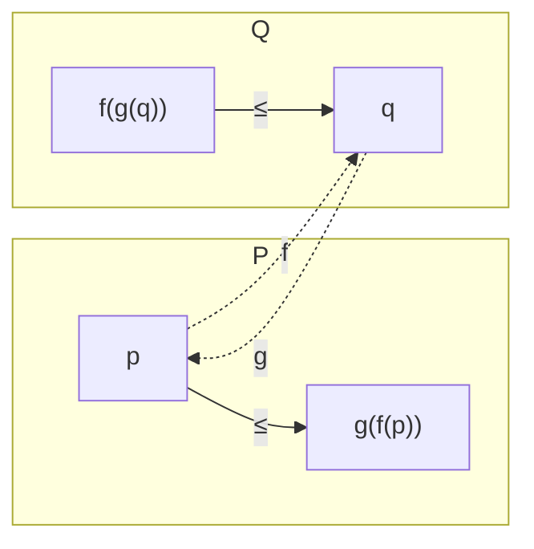

# Galois 연결

# 개요

**Galois 연결**[^1]은 두 [부분순서](partial-orders.md) 집합 사이를 오가는 사상 한 쌍으로, 한쪽에서 저쪽으로 갔다가 돌아오면 원래 자리보다 커지거나 같은 것이다.

이름은 체의 확대 $L/K$ 에서 중간체와 부분군이 뒤집힌 순서로 대응하는 갈루아 이론에서 왔다. 같은 구조가 여러 곳에 나타난다.

- 논리에서 이론과 모형: 공리를 늘리면 모형이 줄고, 모형을 늘리면 참인 문장이 준다.
- 위상에서 집합과 폐포: 폐포 연산은 Galois 연결을 자기 자신에 붙여 만든 것이다.
- 자료 분석에서 객체와 속성: 객체를 늘리면 공통 속성이 줄고, 속성을 늘리면 해당 객체가 준다. 이것이 형식 개념 분석이다.
- 프로그램 검증에서 구체 상태와 추상 상태: 추상해석의 $\alpha,\gamma$ 쌍이 정확히 Galois 연결이다.

공통점은 두 세계가 서로 반대 방향으로 커진다는 것이고, 이 반대 방향성이 폐포 연산과 고정점을 낳는다.

Galois 연결은 [수반](adjunctions.md)을 순서 [범주](category.md)에 제한한 것이다. 순서 하나만으로 정의되므로 범주론 없이 서술할 수 있다.

# 직관

## 왕복의 확대성

두 부분순서 집합 $P$ 와 $Q$ 위에 사상 $f:P\to Q$ 와 $g:Q\to P$ 를 잡는다. 단조 판본의 조건은

$$
f(p)\le q\iff p\le g(q)
$$

이다. $q=f(p)$ 를 넣으면 $p\le g(f(p))$ 를, $p=g(q)$ 를 넣으면 $f(g(q))\le q$ 를 얻는다. $g\circ f$ 는 커지는 방향이고 $f\circ g$ 는 작아지는 방향이다.

$f(p)$ 는 $p$ 를 $Q$ 쪽에서 덮는 가장 작은 것이고 $g(q)$ 는 $q$ 를 $P$ 쪽에서 채우는 가장 큰 것이다.

$f$ 와 $g$ 는 서로를 결정한다. 한쪽이 주어지면 다른 쪽이 위 조건을 만족하도록 유일하게 정해지므로 왼쪽 짝과 오른쪽 짝이라 부른다.

## 반변 판본과 자기수반

갈루아 이론의 원래 형태는 순서를 뒤집는다. $f:P\to Q^{\mathrm{op}}$ 를 $P\to Q$ 로 보면 조건이 다음이 된다.

$$
q\le f(p)\iff p\le g(q)
$$

두 사상 모두 순서를 뒤집고, 합성 $g\circ f$ 와 $f\circ g$ 가 둘 다 커지는 방향이다. $c=g\circ f$ 는 다음 세 성질을 갖는다.

$$
p\le c(p),\qquad p\le p'\Rightarrow c(p)\le c(p'),\qquad c(c(p))=c(p)
$$

이것이 **폐포 연산**의 정의다. 위상의 폐포, 선형대수의 생성공간, 군론의 생성부분군, 논리의 연역적 폐포가 여기 들어간다. 폐포 연산이 나타나는 자리에는 짝이 되는 반대 방향 사상이 있다.

멱등성 $c\circ c=c$ 는 $f(g(f(p)))=f(p)$ 가 두 부등식에서 따라오므로 성립한다. 한 번 닫으면 더 닫히지 않는다.

## 닫힌 원소 사이의 대응

$f$ 가 정보를 잃으므로 Galois 연결은 보통 일대일 대응이 아니다. 양쪽에서 닫힌 원소, 곧 $c(p)=p$ 인 것만 남기면 $f$ 와 $g$ 가 서로 역인 일대일 대응이 된다.

갈루아 이론에서는 이것이 갈루아 확대에서만 대응이 완전하다는 사실이다. 임의의 확대에서는 부분군에서 중간체로 갔다 오면 커질 수 있고 닫힌 중간체에서만 맞는다. 형식 개념 분석에서는 닫힌 쌍이 개념이고 그것들이 [격자](order-lattices.md)를 이룬다.

# 정의

## Galois 연결

부분순서 집합 $(P,\le)$ 와 $(Q,\le)$ 와 사상 $f:P\to Q$ 와 $g:Q\to P$ 에 대해

$$
\forall p\in P,\ \forall q\in Q:\quad f(p)\le q\iff p\le g(q)
$$

가 성립하면 $(f,g)$ 를 **단조 Galois 연결**이라 하고 $f\dashv g$ 로 쓴다. $f$ 를 왼쪽 짝, $g$ 를 오른쪽 짝이라 한다.

동치인 조건은 $f$ 와 $g$ 가 모두 단조이고 $p\le g(f(p))$ 와 $f(g(q))\le q$ 가 성립하는 것이다.

**반변 Galois 연결**은 위 조건을 $q\le f(p)\iff p\le g(q)$ 로 바꾼 것이고, 이때 $f$ 와 $g$ 는 순서를 뒤집는다. 두 판본은 $Q$ 를 $Q^{\mathrm{op}}$ 로 바꾸면 서로 옮겨진다.

## 완비 격자

부분순서 집합 $L$ 의 모든 부분집합이 상한과 하한을 가지면 $L$ 을 **완비 격자**라 한다. 공집합도 포함되므로 완비 격자에는 최대 원소 $\top=\bigvee L$ 과 최소 원소 $\bot=\bigwedge L$ 이 있다.

$\bigwedge S=\bigvee\lbrace x:\forall s\in S,\ x\le s\rbrace$ 이므로 상한이 전부 존재하면 하한도 존재한다. 완비성은 한쪽만 확인하면 된다.

## 짝의 존재 판정

$P$ 와 $Q$ 가 완비 격자일 때 다음이 성립한다.

> $f:P\to Q$ 가 오른쪽 짝을 가질 필요충분조건은 $f$ 가 모든 상한을 보존하는 것이다. 대칭적으로 $g:Q\to P$ 가 왼쪽 짝을 가질 필요충분조건은 $g$ 가 모든 하한을 보존하는 것이다.

이때 짝은 명시적으로 주어진다.

$$
g(q)=\bigvee\lbrace p\in P: f(p)\le q\rbrace
$$

추상해석에서 구체화 사상 $\gamma$ 를 설계하고 하한 보존을 확인하면 추상화 사상 $\alpha$ 가 존재하고 유일하다. 두 사상을 각각 만들어 정합성을 맞출 필요가 없다.

## Knaster–Tarski 정리

완비 격자 $L$ 과 단조사상 $h:L\to L$ 에 대해 고정점 집합

$$
\mathrm{Fix}(h)=\lbrace x\in L: h(x)=x\rbrace
$$

은 공집합이 아니며, 그 자체로 완비 격자다. 특히 최소 고정점과 최대 고정점이 존재하고 다음과 같이 주어진다.

$$
\mu h=\bigwedge\lbrace x: h(x)\le x\rbrace,\qquad \nu h=\bigvee\lbrace x: x\le h(x)\rbrace
$$

$A=\lbrace x:h(x)\le x\rbrace$ 라 두고 $a=\bigwedge A$ 로 놓는다. $x\in A$ 마다 $a\le x$ 이므로 단조성에서 $h(a)\le h(x)\le x$ 이고, $x$ 전체에 대해 하한을 취하면 $h(a)\le a$ 다. 그러면 다시 단조성에서 $h(h(a))\le h(a)$ 이므로 $h(a)\in A$ 이고, 따라서 $a\le h(a)$ 다. 두 부등식을 합치면 $h(a)=a$ 다.

가정은 $h$ 의 단조성뿐이고 연속성은 필요하지 않다. 다만 고정점이 초한 반복으로 얻어질 뿐 유한 반복으로 도달한다는 보장은 없다. 연속성을 가정해 $\bigvee_n h^n(\bot)$ 로 도달하는 것이 Kleene 고정점 정리다.

# 성질

## 짝의 유일성

$f$ 에 대해 오른쪽 짝 $g$ 와 $g'$ 가 둘 다 있으면 $g=g'$ 다. 정의에서 $p\le g(q)\iff f(p)\le q\iff p\le g'(q)$ 이고, 부분순서에서 모든 $p$ 에 대해 $p\le x\iff p\le y$ 이면 $x=y$ 다. 왼쪽 짝을 갖는 것은 성질이지 추가 구조가 아니다.

## 합성과 보존

Galois 연결은 합성에서 닫혀 있다. $f_1\dashv g_1:P\to Q$ 와 $f_2\dashv g_2:Q\to R$ 이면 $f_2f_1\dashv g_1g_2$ 다. 왼쪽 짝은 존재하는 모든 상한을, 오른쪽 짝은 모든 하한을 보존한다. 왼쪽 짝이 하한을 보존하지는 않는다.

추상해석에서 두 분석 결과의 상한은 추상화가 정확하고 하한에서는 정보를 잃는 것이 이 비대칭의 귀결이다.

## 닫힌 원소의 격자

반변 Galois 연결 $(f,g)$ 에서 $P_c=\lbrace p:gf(p)=p\rbrace$ 와 $Q_c=\lbrace q:fg(q)=q\rbrace$ 로 두면 $f|\_{P_c}:P_c\to Q_c$ 가 순서를 뒤집는 전단사이고 역이 $g|\_{Q_c}$ 다. 나아가 $P$ 가 완비 격자면 $P_c$ 도 완비 격자다. 단 $P_c$ 의 상한은 $P$ 의 상한이 아니라 그것을 닫은 것이다.

$$
\bigvee_{P_c}S=c\left(\bigvee_P S\right),\qquad \bigwedge_{P_c}S=\bigwedge_P S
$$

하한은 그대로이고 상한만 닫는다. 부분공간의 교집합은 부분공간이지만 합집합은 생성공간을 취해야 하는 것과 같다.

## 개념 격자의 일반성

형식 개념 분석의 기본 정리(Wille)에 따르면[^2] 임의의 완비 격자가 어떤 객체–속성 표의 개념 격자와 동형이다. 개념 격자는 특별한 종류의 격자가 아니라 완비 격자를 표로 제시하는 방법이고, 자료에서 개념 격자를 뽑는 것은 자료에 있는 완비 격자 구조를 드러내는 작업이다.

## 격자 크기의 폭발

객체 $n$ 개와 속성 $m$ 개인 표에서 개념의 개수는 최악의 경우 $2^{\min(n,m)}$ 이다. 객체 $i$ 가 속성 $i$ 만 없는 대각 표가 그 예다. 개념 전체의 열거에는 다항 지연 알고리즘이 있지만 출력이 지수적일 수 있어, 실무에서는 안정성(support) 기준으로 자르거나 함의 기저만 뽑는다.

# 활용

## 형식 개념 분석

객체와 속성의 표에서 $\mathrm{up}(A)$ 를 $A$ 의 모든 객체가 공유하는 속성 집합으로, $\mathrm{down}(B)$ 를 $B$ 의 속성을 모두 갖는 객체 집합으로 정의한다. 이 쌍이 반변 Galois 연결이고 합성이 폐포 연산이며 닫힌 쌍이 완비 격자를 이룬다.

$2^5=32$ 개의 객체 부분집합 가운데 닫힌 것은 8 개다. $\lbrace\text{박쥐},\text{고래}\rbrace$ 는 닫혀 있고 $\lbrace\text{참새},\text{고래}\rbrace$ 는 닫혀 있지 않다. 둘의 공통 속성이 척추뿐이고 척추를 갖는 객체가 다섯 마리 전부이기 때문이다. 닫힘은 그 조합을 속성으로 지목할 수 있다는 뜻이고, 지목할 수 없는 조합은 격자에서 사라진다.

교집합은 다시 개념이고 합집합은 닫아야 개념이 된다.

## 갈루아 이론, 추상해석, 고정점 정의

- **갈루아 이론**: 중간체와 부분군의 반변 대응. 유한 갈루아 확대에서는 모든 원소가 닫혀 있어 대응이 완전해진다.
- **추상해석**: 프로그램의 구체 의미 영역과 추상 영역을 $\alpha\dashv\gamma$ 로 잇고, 전이함수의 최소 고정점을 Knaster–Tarski 로 보장한다. 정적 분석기의 건전성 증명이 이 틀 위에 선다.
- **논리와 모형**: 문장 집합과 구조 집합 사이의 반변 연결에서 닫힌 문장 집합이 이론, 닫힌 구조 집합이 기본 클래스다. 완전성 정리는 두 폐포가 일치한다는 진술이다.
- **재귀적 정의**: 최소 고정점이 귀납적 정의를, 최대 고정점이 공귀납적 정의(무한 자료구조, 쌍모의)를 준다.
- **자료 마이닝**: 형식 개념 분석은 이진 표에서 최대 직사각형을 전부 찾는 문제로, 함의 규칙 추출과 빈발 항목집합 이론의 격자론적 구조다.

[^1]: B. A. Davey, H. A. Priestley, *Introduction to Lattices and Order*, 2nd ed., Cambridge, 2002. 5 장이 Galois 연결과 폐포 연산의 표준 서술이다.
[^2]: B. Ganter, R. Wille, *Formal Concept Analysis: Mathematical Foundations*, Springer, 1999. 기본 정리와 개념 격자의 계산.

# 연관 문서

## 선수지식

- [순서 이론 개관](order-theory-overview.md)
- [부분순서](partial-orders.md)

## 더 알아보기

- [추상해석](abstract-interpretation.md)
- [영역 이론과 Kleene 고정점 정리](domain-theory.md)

#order_theory #logic #computation
