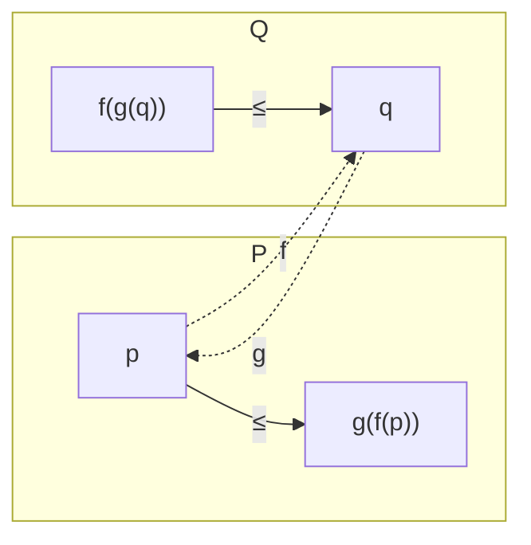

# Galois 연결과 완비 격자

# 개요

두 [부분순서](partial-orders.md) 집합 사이를 오가는 사상 한 쌍이 있다. 한쪽에서 저쪽으로 갔다가 돌아오면 원래 자리보다 커지거나 같고, 반대로 가도 마찬가지다. 이런 쌍을 **Galois 연결**이라 한다. 정의가 이렇게 헐거운데도 결론이 많이 나온다.

이름은 갈루아 이론에서 왔다. 체의 확대 `L/K` 에서 중간체와 부분군이 서로 뒤집힌 순서로 대응하는 그 현상이 가장 유명한 사례다. 그런데 같은 구조가 전혀 다른 자리에도 있다.

- 논리에서 이론과 모형: 공리를 늘리면 모형이 줄고, 모형을 늘리면 참인 문장이 준다.
- 위상에서 집합과 폐포: 폐포 연산은 Galois 연결을 자기 자신에 붙여 만든 것이다.
- 자료 분석에서 객체와 속성: 객체를 늘리면 공통 속성이 줄고, 속성을 늘리면 해당 객체가 준다. 이것이 형식 개념 분석이다.
- 프로그램 검증에서 구체 상태와 추상 상태: 추상해석의 `\alpha,\gamma` 쌍이 정확히 Galois 연결이다.

공통점은 하나다. **두 세계가 서로 반대 방향으로 커지고, 그 반대 방향성이 폐포 연산과 고정점을 낳는다.** 이 문서는 정의에서 Knaster–Tarski 고정점 정리까지 가고, 형식 개념 분석의 작은 예를 전수 계산으로 확인한다.

범주론을 아는 독자라면 이것이 adjunction 을 순서 범주에 제한한 것임을 알아볼 것이다. 그 관점은 이 문서 뒤에 와야 자연스럽다. Galois 연결은 순서 하나만으로 자족적으로 설명되고, 범주론적 일반화는 그 다음 이야기다.

# 직관

## 갔다 오면 커진다

두 부분순서 집합 `P,Q` 와 사상 `f:P\to Q`, `g:Q\to P` 를 잡는다. 단조 판본의 조건은

$$
f(p)\le q\iff p\le g(q)
$$

이다. 이 한 줄에서 나오는 것을 보자. `q=f(p)` 를 넣으면 오른쪽에서 `p\le g(f(p))` 를 얻고, `p=g(q)` 를 넣으면 `f(g(q))\le q` 를 얻는다. 즉 `g\circ f` 는 커지는 방향, `f\circ g` 는 작아지는 방향이다.



`f` 를 "최선의 근사를 위로 잡는 것", `g` 를 "아래로 잡는 것" 으로 읽으면 그림이 맞는다. `f(p)` 는 `p` 를 `Q` 쪽에서 덮는 가장 작은 것이고, `g(q)` 는 `q` 를 `P` 쪽에서 채우는 가장 큰 것이다.

여기서 중요한 따름이 나온다. `f` 와 `g` 는 서로를 결정한다. 한쪽이 주어지면 다른 쪽은 위 조건을 만족하도록 유일하게 정해진다. 그래서 "왼쪽 짝" 과 "오른쪽 짝" 이라는 말을 쓴다.

## 반변 판본과 자기 자신에 붙이기

갈루아 이론에서 나오는 원래 형태는 순서를 뒤집는다. `f:P\to Q^{\mathrm{op}}` 를 그냥 `P\to Q` 로 보면 조건이 이렇게 된다.

$$
q\le f(p)\iff p\le g(q)
$$

두 사상 모두 순서를 뒤집고, 합성 `g\circ f` 와 `f\circ g` 는 **둘 다** 커지는 방향이다. 이때 `c=g\circ f` 는 다음 세 성질을 갖는다.

$$
p\le c(p),\qquad p\le p'\Rightarrow c(p)\le c(p'),\qquad c(c(p))=c(p)
$$

이것이 **폐포 연산**의 정의다. 위상의 폐포, 선형대수의 생성공간, 군론의 생성부분군, 논리의 연역적 폐포가 전부 여기 들어간다. 폐포 연산이 여기저기서 같은 모양으로 나타나는 이유가 "어딘가에 짝이 되는 반대 방향 사상이 있다" 는 것이다.

멱등성 `c\circ c=c` 가 공짜로 나오는 것을 눈여겨본다. `f(g(f(p)))=f(p)` 가 두 부등식에서 바로 따라오고, 그래서 한 번 닫으면 더 닫히지 않는다. 폐포를 반복 적용해도 안정한다는 사실을 따로 증명할 필요가 없다.

## 닫힌 원소들만 남기면 일대일이 된다

Galois 연결은 보통 일대일 대응이 아니다. `f` 가 정보를 잃기 때문이다. 그런데 양쪽에서 **닫힌** 원소, 곧 `c(p)=p` 인 것들만 남기면 남은 것들 사이에서는 `f,g` 가 서로 역이 되는 일대일 대응이 된다.

갈루아 이론에서 이 현상이 "갈루아 확대에서만 대응이 완전하다" 로 나타난다. 임의의 확대에서는 부분군에서 중간체로 갔다 오면 커질 수 있고, 닫힌 중간체만 보면 정확히 맞는다. 형식 개념 분석에서는 닫힌 쌍이 곧 "개념" 이고, 그것들이 격자를 이룬다.

# 정의

## Galois 연결

부분순서 집합 `(P,\le)`, `(Q,\le)` 와 사상 `f:P\to Q`, `g:Q\to P` 에 대해

$$
\forall p\in P,\ \forall q\in Q:\quad f(p)\le q\iff p\le g(q)
$$

가 성립하면 `(f,g)` 를 **단조 Galois 연결**이라 하고 `f\dashv g` 로 쓴다. `f` 를 왼쪽 짝, `g` 를 오른쪽 짝이라 한다.

동치인 서술은 이렇다. `f,g` 가 모두 단조이고 `p\le g(f(p))`, `f(g(q))\le q` 가 성립한다.

**반변 Galois 연결**은 위 조건을 `q\le f(p)\iff p\le g(q)` 로 바꾼 것이고, 이때 `f,g` 는 순서를 뒤집는다. 두 판본은 `Q` 를 `Q^{\mathrm{op}}` 로 바꾸면 서로 옮겨진다.

## 완비 격자

부분순서 집합 `L` 의 모든 부분집합이 상한과 하한을 가지면 `L` 을 **완비 격자**라 한다. 공집합도 포함되므로 완비 격자에는 최대 원소 `\top=\bigvee L` 과 최소 원소 `\bot=\bigwedge L` 이 있다.

상한만 전부 존재해도 하한이 따라온다. `\bigwedge S=\bigvee\{x:\forall s\in S,\ x\le s\}` 이기 때문이다. 그래서 완비성 확인은 한쪽만 보면 된다.

## 짝의 존재 판정

`P,Q` 가 완비 격자일 때 다음이 성립한다.

> `f:P\to Q` 가 오른쪽 짝을 가질 필요충분조건은 `f` 가 모든 상한을 보존하는 것이다. 대칭적으로 `g:Q\to P` 가 왼쪽 짝을 가질 필요충분조건은 `g` 가 모든 하한을 보존하는 것이다.

이때 짝은 명시적으로 주어진다.

$$
g(q)=\bigvee\{p\in P: f(p)\le q\}
$$

이 판정이 실무에서 쓰인다. 추상해석에서 구체화 사상 `\gamma` 를 먼저 설계하고 그것이 하한을 보존하는지 확인하면 추상화 사상 `\alpha` 가 자동으로 존재하고 유일하다. 둘 다 손으로 만들고 나서 정합성을 맞출 필요가 없다.

## Knaster–Tarski 정리

완비 격자 `L` 과 단조사상 `h:L\to L` 에 대해 고정점 집합

$$
\mathrm{Fix}(h)=\{x\in L: h(x)=x\}
$$

은 공집합이 아니며, 그 자체로 완비 격자다. 특히 최소 고정점과 최대 고정점이 존재하고 다음과 같이 주어진다.

$$
\mu h=\bigwedge\{x: h(x)\le x\},\qquad \nu h=\bigvee\{x: x\le h(x)\}
$$

증명은 짧다. `A=\{x:h(x)\le x\}` 라 두고 `a=\bigwedge A` 로 놓는다. `x\in A` 마다 `a\le x` 이므로 단조성에서 `h(a)\le h(x)\le x` 이고, `x` 전체에 대해 하한을 취하면 `h(a)\le a` 다. 그러면 다시 단조성에서 `h(h(a))\le h(a)` 이므로 `h(a)\in A`, 따라서 `a\le h(a)`. 두 부등식을 합치면 `h(a)=a` 다.

연속성 같은 추가 가정이 전혀 없다는 점이 중요하다. `h` 가 단조이기만 하면 된다. 값이 초한 반복으로 얻어질 뿐 유한 반복으로 도달한다는 보장은 없고, 그 차이가 Kleene 고정점 정리(연속성을 가정하고 `\bigvee_n h^n(\bot)` 로 도달)와의 경계다.

# 성질

## 짝은 유일하다

`f` 에 대해 오른쪽 짝 `g,g'` 가 둘 다 있으면 `g=g'` 다. 정의에서 `p\le g(q)\iff f(p)\le q\iff p\le g'(q)` 이고, 부분순서에서 "모든 `p` 에 대해 `p\le x\iff p\le y`" 는 `x=y` 를 준다. 그러므로 "왼쪽 짝을 갖는다" 는 성질이지 추가 구조가 아니다.

## 합성과 보존

Galois 연결은 합성에서 닫혀 있다. `f_1\dashv g_1:P\to Q`, `f_2\dashv g_2:Q\to R` 이면 `f_2f_1\dashv g_1g_2` 다. 또한 왼쪽 짝은 존재하는 모든 상한을 보존하고 오른쪽 짝은 모든 하한을 보존한다. 반대는 일반적으로 성립하지 않는다 — 왼쪽 짝이 하한을 보존할 이유가 없다.

이 비대칭이 실무에서 자주 문제가 된다. 추상해석에서 두 분석 결과를 합칠 때(상한) 추상화가 정확하지만 교차할 때(하한)는 정보를 잃는 것이 이 사실의 직접적 귀결이다.

## 고정점만 남기면 동형이다

반변 Galois 연결 `(f,g)` 에서 `P_c=\{p:gf(p)=p\}`, `Q_c=\{q:fg(q)=q\}` 로 두면 `f|_{P_c}:P_c\to Q_c` 가 순서를 뒤집는 전단사이고 역이 `g|_{Q_c}` 다. 나아가 `P` 가 완비 격자면 `P_c` 도 완비 격자다. 단 `P_c` 의 상한은 `P` 의 상한이 아니라 그것을 닫은 것이다.

$$
\bigvee_{P_c}S=c\left(\bigvee_P S\right),\qquad \bigwedge_{P_c}S=\bigwedge_P S
$$

하한은 그대로이고 상한만 닫아야 한다는 비대칭을 기억해 두면 계산에서 헷갈리지 않는다. 부분공간의 교집합은 부분공간이지만 합집합은 생성공간을 취해야 하는 것과 같은 현상이다.

## 어떤 격자가 개념 격자인가

형식 개념 분석의 기본 정리(Wille)는 답이 "전부" 라고 말한다. 임의의 완비 격자는 어떤 객체–속성 표의 개념 격자와 동형이다. 그러므로 개념 격자는 특별한 종류의 격자가 아니라 완비 격자를 표로 제시하는 방법이다. 역으로, 자료에서 개념 격자를 뽑는 것은 자료에 숨은 완비 격자 구조를 드러내는 작업이 된다.

## 격자 크기의 폭발

객체 `n` 개, 속성 `m` 개인 표에서 개념의 개수는 최악의 경우 `2^{\min(n,m)}` 까지 간다. 대각 표(객체 `i` 가 속성 `i` 만 없는 표)가 그 예다. 개념 전체를 열거하는 문제는 다항 지연 알고리즘이 알려져 있지만 출력 자체가 지수적일 수 있으므로, 실무에서는 안정성(support) 기준으로 자르거나 함의 기저만 뽑는다.

# 활용

## 형식 개념 분석을 전수로 확인한다

객체와 속성의 표에서 두 사상을 정의한다. `\mathrm{up}(A)` 는 `A` 의 모든 객체가 공유하는 속성 집합, `\mathrm{down}(B)` 는 `B` 의 속성을 모두 갖는 객체 집합이다. 이 쌍이 반변 Galois 연결을 이루는지, 합성이 폐포 연산인지, 닫힌 쌍이 완비 격자를 이루는지를 부분집합 전체를 돌며 확인한다.

```python
from itertools import combinations

OBJ = ["박쥐", "참새", "타조", "고래", "연어"]
ATTR = ["척추", "날개", "난다", "젖먹임", "물속"]
TABLE = {
    "박쥐": {"척추", "날개", "난다", "젖먹임"},
    "참새": {"척추", "날개", "난다"},
    "타조": {"척추", "날개"},
    "고래": {"척추", "젖먹임", "물속"},
    "연어": {"척추", "물속"},
}

def up(A):
    """A 의 객체가 모두 공유하는 속성. 공집합이면 전체 속성."""
    if not A:
        return frozenset(ATTR)
    return frozenset.intersection(*[frozenset(TABLE[o]) for o in A])

def down(B):
    """B 의 속성을 모두 갖는 객체."""
    return frozenset(o for o in OBJ if B <= TABLE[o])

def subsets(xs):
    xs = list(xs)
    return [frozenset(c) for r in range(len(xs) + 1) for c in combinations(xs, r)]

# 1. 반변 Galois 연결 공리 : B ⊆ up(A) ⟺ A ⊆ down(B)
bad = [(A, B) for A in subsets(OBJ) for B in subsets(ATTR)
       if (B <= up(A)) != (A <= down(B))]
print("Galois 연결 공리 위반 쌍:", len(bad))

# 2. 합성이 폐포 연산인가
cl = lambda A: down(up(A))
print("확장적 A ⊆ cl(A) :", all(A <= cl(A) for A in subsets(OBJ)))
print("멱등 cl(cl(A))=cl(A) :", all(cl(cl(A)) == cl(A) for A in subsets(OBJ)))
print("단조 :", all(not (A <= B) or cl(A) <= cl(B)
                    for A in subsets(OBJ) for B in subsets(OBJ)))

# 3. 개념 = 닫힌 쌍 (A, up(A))
concepts = sorted({(cl(A), up(A)) for A in subsets(OBJ)},
                  key=lambda p: (len(p[0]), sorted(p[0])))
print(f"\n개념 {len(concepts)} 개   (객체 | 공통 속성)")
for A, B in concepts:
    print(f"  {str(sorted(A)):<34} | {sorted(B)}")

# 4. 개념 격자의 완비성 : 하한은 그대로, 상한은 닫아야 한다
ext = [A for A, _ in concepts]
print("\n교집합이 다시 개념 :", all(a & b in ext for a in ext for b in ext))
print("합집합은 닫아야 개념 :", all(cl(a | b) in ext for a in ext for b in ext))
print("합집합 그대로는 개념이 아닐 수 있다 :",
      any(a | b not in ext for a in ext for b in ext))

# Galois 연결 공리 위반 쌍: 0
# 확장적 A ⊆ cl(A) : True
# 멱등 cl(cl(A))=cl(A) : True
# 단조 : True
#
# 개념 8 개   (객체 | 공통 속성)
#   []                                 | ['난다', '날개', '물속', '젖먹임', '척추']
#   ['고래']                             | ['물속', '젖먹임', '척추']
#   ['박쥐']                             | ['난다', '날개', '젖먹임', '척추']
#   ['고래', '박쥐']                       | ['젖먹임', '척추']
#   ['고래', '연어']                       | ['물속', '척추']
#   ['박쥐', '참새']                       | ['난다', '날개', '척추']
#   ['박쥐', '참새', '타조']                 | ['날개', '척추']
#   ['고래', '박쥐', '연어', '참새', '타조']     | ['척추']
#
# 교집합이 다시 개념 : True
# 합집합은 닫아야 개념 : True
# 합집합 그대로는 개념이 아닐 수 있다 : True
```

`2^5=32` 개의 객체 부분집합 가운데 닫힌 것은 8 개뿐이다. 예컨대 `\{박쥐,고래\}` 는 닫혀 있지만 `\{참새,고래\}` 는 닫혀 있지 않다 — 둘의 공통 속성이 척추뿐이고, 척추를 갖는 객체는 다섯 마리 전부이기 때문이다. 닫힘이 "이 조합을 속성으로 지목할 수 있는가" 를 뜻하고, 지목할 수 없는 조합은 격자에서 사라진다.

마지막 세 줄이 성질 절의 비대칭을 그대로 보여 준다. 교집합은 그냥 개념이지만 합집합은 닫아야 개념이 된다.

## 어디에 쓰이는가

- **갈루아 이론**: 중간체와 부분군의 반변 대응. 유한 갈루아 확대에서는 모든 원소가 닫혀 있어 대응이 완전해진다.
- **추상해석**: 프로그램의 구체 의미 영역과 추상 영역을 `\alpha\dashv\gamma` 로 잇고, 전이함수의 최소 고정점을 Knaster–Tarski 로 보장한다. 정적 분석기의 건전성 증명이 이 틀 위에 선다.
- **논리와 모형**: 문장 집합과 구조 집합 사이의 반변 연결에서 닫힌 문장 집합이 이론, 닫힌 구조 집합이 기본 클래스다. 완전성 정리는 두 폐포가 일치한다는 주장으로 읽힌다.
- **재귀적 정의**: 최소 고정점으로 귀납적 정의를, 최대 고정점으로 공귀납적 정의(무한 자료구조, 쌍모의)를 준다. 두 정의가 같은 정리의 양쪽 끝이다.
- **자료 마이닝**: 형식 개념 분석은 이진 표에서 최대 직사각형을 전부 찾는 문제로, 함의 규칙 추출과 빈발 항목집합 이론의 격자론적 뼈대다.

[^1]: B. A. Davey, H. A. Priestley, *Introduction to Lattices and Order*, 2nd ed., Cambridge, 2002. 5 장이 Galois 연결과 폐포 연산의 표준 서술이다.
[^2]: B. Ganter, R. Wille, *Formal Concept Analysis: Mathematical Foundations*, Springer, 1999. 기본 정리와 개념 격자의 계산.

# 연관 문서

## 선수지식

- [부분순서](partial-orders.md)

## 더 알아보기

- [추상해석과 정적 분석의 건전성](abstract-interpretation.md)
- [영역 이론과 Kleene 고정점 정리](domain-theory.md)

#order_theory #logic #computation
