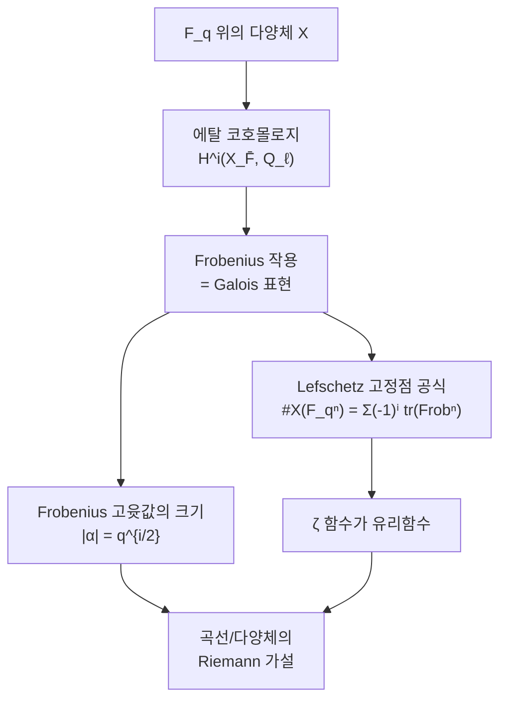

# Galois 표현과 에탈 코호몰로지

# 개요

[Langlands 강령](langlands-program.md)에서 Galois 표현 `\rho\colon G_K\to\mathrm{GL}_n(E)` 를 대상으로 삼았다. 그런데 그런 표현이 실제로 어디서 오는가.

계수를 `\mathbb C` 로 잡으면 상이 유한군일 수밖에 없어 유한 Galois 확대의 표현밖에 나오지 않는다. 풍부한 공급원은 `\ell` 진 계수 쪽이다. 대수다양체 `X` 에 [코호몰로지](homology.md)를 붙이되, 위상적 코호몰로지가 아니라 `\mathbb Q_\ell` 계수의 에탈 코호몰로지를 붙이면

$$
H^i_{\mathrm{et}}(X_{\bar K},\mathbb Q_\ell)
$$

가 유한차원 `\mathbb Q_\ell` 벡터공간이면서 `G_K` 의 연속 작용을 받는다. 기하가 표현을 낳는 것이다.

이 구성이 왜 가능한가. 대수다양체에는 Zariski 위상밖에 없고 그 위상은 코호몰로지를 만들기에 너무 성기다. Grothendieck 은 "열린 부분집합" 을 "에탈 사상" 으로 바꿔 위상 없이 위상수학을 했다. 그 결과가 Weil 추측의 증명이며, 유한체 위에서 점을 세는 일이 코호몰로지의 Lefschetz 고정점 공식으로 환원된다.

$$
\#X(\mathbb F_{q^n})=\sum_i(-1)^i\mathrm{tr}\big(\mathrm{Frob}^n\mid H^i_{\mathrm{et}}\big)
$$

산술의 양이 Frobenius 의 대각합이 되고, 대각합을 통제하는 것이 표현의 구조다. 여기서 Galois 표현이 정수론의 중심 대상이 된다.

# 직관

## Zariski 위상은 왜 부족한가

복소다양체에서는 고전적 위상으로 특이 코호몰로지를 만들면 된다. 유한체 위의 다양체에는 그런 위상이 없고, Zariski 위상은 열린집합이 너무 커서 상수층의 코호몰로지가 전부 0 이 된다. 실제로 Zariski 위상에서 기약 다양체 위의 상수층은 뭉툭해서 `H^i=0`(`i>0`) 이다.

핵심 진단은 "덮개" 의 개념이 잘못되었다는 것이다. 위상에서 덮개는 열린 포함사상의 모임인데, 대수기하에서 그 역할을 해야 하는 것은 **국소적으로 동형에 가까운 사상**이다. 복소해석에서 국소 미분동형이 하는 일을 대수적으로 옮긴 것이 에탈 사상이다.

그래서 열린집합의 격자 대신 에탈 사상들의 범주를 놓고, 그 위에서 층과 코호몰로지를 정의한다. 위상공간 없이 위상수학을 하는 셈이다.

## `\ell` 은 왜 `p` 와 달라야 하는가

표수 `p` 인 체 위의 다양체에서 `\mathbb Z/p` 계수는 병리적이다. Artin–Schreier 열 때문에 코호몰로지가 기대한 차원을 갖지 않는다. `\ell\ne p` 로 잡으면 `\mathbb Z/\ell^n` 계수 에탈 코호몰로지가 잘 작동하고, 극한을 취해 `\mathbb Q_\ell` 계수를 얻는다.

$$
H^i_{\mathrm{et}}(X_{\bar K},\mathbb Q_\ell)=\Big(\varprojlim_nH^i_{\mathrm{et}}(X_{\bar K},\mathbb Z/\ell^n)\Big)\otimes\mathbb Q_\ell
$$

`\bar K` 로 올린 뒤에 코호몰로지를 취하는 것이 요점이다. `G_K=\mathrm{Gal}(\bar K/K)` 가 `X_{\bar K}` 에 작용하므로 코호몰로지에도 작용하고, 그것이 우리가 원하던 표현이다.

## 점을 세는 일이 대각합이 된다

유한체 `\mathbb F_q` 위의 다양체에서 `\mathbb F_{q^n}` 유리점은 `q^n` 제곱 Frobenius 사상의 고정점이다. 위상수학에서 사상의 고정점을 세는 도구가 Lefschetz 공식이므로, 에탈 코호몰로지에서 같은 공식을 세우면 점 개수가 대각합의 교대합으로 나온다.



Weil 추측의 세 항목이 이 그림에서 읽힌다. `\zeta` 함수의 유리성은 대각합의 생성함수가 유리함수라는 선형대수적 사실이고, 함수방정식은 Poincaré 쌍대성이며, Riemann 가설은 Frobenius 고윳값의 절댓값이 `q^{i/2}` 라는 진술이다. 앞의 둘은 코호몰로지 이론이 있으면 형식적으로 따라 나오고, 마지막 하나가 Deligne 의 어려운 정리다.

# 정의

## `\ell` 진 표현

`G_K` 는 profinite 군이다. 연속 준동형

$$
\rho\colon G_K\to\mathrm{GL}_n(\mathbb Q_\ell)
$$

을 `\ell` 진 표현이라 한다. `\mathbb Q_\ell` 의 위상이 profinite 위상과 어울리므로 상이 무한할 수 있다. 이것이 `\mathbb C` 계수와의 결정적 차이다.

다음 용어가 표준이다.

- **불분기.** `\mathfrak p` 에서의 관성군이 자명하게 작용하면 `\rho` 가 `\mathfrak p` 에서 불분기다. 그때 `\rho(\mathrm{Frob}_{\mathfrak p})` 가 켤레를 빼고 정해진다.
- **도체.** 분기가 얼마나 나쁜지를 재는 아이디얼. 유한 개의 소수에서만 분기한다.
- **기하적 Frobenius.** 산술 Frobenius 의 역원. 부호 관례가 문헌마다 다르므로 주의한다.

## Tate 가군

가장 구체적인 예가 타원곡선에서 온다. `E` 가 `K` 위의 타원곡선이고 `\ell\ne\mathrm{char}\,K` 일 때

$$
T_\ell E=\varprojlim_nE[\ell^n](\bar K)\cong\mathbb Z_\ell^2,
\qquad V_\ell E=T_\ell E\otimes\mathbb Q_\ell
$$

이다. `G_K` 가 꼬임점에 작용하므로 2 차원 표현 `\rho_{E,\ell}\colon G_K\to\mathrm{GL}_2(\mathbb Q_\ell)` 을 얻는다. 이것이 `H^1_{\mathrm{et}}(E_{\bar K},\mathbb Q_\ell)` 의 쌍대이며, 좋은 환원을 갖는 `\mathfrak p` 에서

$$
\mathrm{tr}\,\rho_{E,\ell}(\mathrm{Frob}_{\mathfrak p})=a_{\mathfrak p}=N\mathfrak p+1-\#E(\mathbb F_{\mathfrak p})
$$

가 성립한다. 점 개수가 대각합이다.

## 에탈 코호몰로지와 Weil 추측

`X` 가 `\mathbb F_q` 위의 매끄러운 사영다양체일 때 zeta 함수를 정의한다.

$$
Z(X,t)=\exp\Big(\sum_{n\ge1}\#X(\mathbb F_{q^n})\frac{t^n}n\Big)
$$

> **Weil 추측(정리).**
> 1. `Z(X,t)` 는 유리함수이고 `\prod_iP_i(t)^{(-1)^{i+1}}` 로 쓰인다. 여기서 `P_i(t)=\det(1-\mathrm{Frob}\,t\mid H^i_{\mathrm{et}})` 다.
> 2. `t\mapsto1/(q^dt)` 에 대한 함수방정식이 성립한다(Poincaré 쌍대성).
> 3. `P_i` 의 역근 `\alpha` 는 모두 `|\alpha|=q^{i/2}` 를 만족한다(Riemann 가설).
> 4. `X` 가 표수 0 의 다양체의 환원이면 `\deg P_i` 가 그 다양체의 Betti 수와 같다.

1, 2, 4 는 Grothendieck 이 에탈 코호몰로지를 세우며 얻었고, 3 은 Deligne 이 1974 년에 증명했다.

# 성질

## 곡선의 경우

`X` 가 종수 `g` 인 곡선이면 `H^0` 과 `H^2` 이 1 차원이고 `H^1` 이 `2g` 차원이다. 따라서

$$
Z(X,t)=\frac{P_1(t)}{(1-t)(1-qt)},\qquad \deg P_1=2g
$$

이고 점 개수 공식이

$$
\#X(\mathbb F_{q^n})=q^n+1-\sum_{j=1}^{2g}\alpha_j^n
$$

가 된다. Riemann 가설 `|\alpha_j|=\sqrt q` 를 넣으면 Hasse–Weil 한계 `|\#X(\mathbb F_q)-q-1|\le2g\sqrt q` 가 나온다. 타원곡선(`g=1`)에서는 `|a_q|\le2\sqrt q` 라는 Hasse 정리다.

## 모듈러성과의 연결

Deligne 은 무게 `k\ge2` 의 Hecke 고유형식마다 2 차원 `\ell` 진 표현 `\rho_f` 를 모듈러 곡선의 에탈 코호몰로지에서 잘라냈다. `\mathrm{tr}\,\rho_f(\mathrm{Frob}_p)=a_p` 이고, 계수의 크기 상계인 Ramanujan 추측이 Weil 추측의 Riemann 가설에서 따라온다.

반대 방향, 곧 주어진 Galois 표현이 어떤 고유형식에서 오는지를 보이는 것이 모듈러성이다. 이 방향의 도구가 변형 이론이다. mod `\ell` 표현 `\bar\rho` 를 고정하고 그것으로 환원되는 `\ell` 진 표현들의 보편 변형환 `R` 을 만든 뒤, 모듈러 표현만 모은 Hecke 대수 `T` 와 비교한다. `R=T` 를 증명하면 모든 변형이 모듈러라는 결론이 나오며, 이것이 Wiles 의 전략이다.

Serre 추측은 그 출발점을 준다. `\bar\rho\colon G_{\mathbb Q}\to\mathrm{GL}_2(\bar{\mathbb F}_\ell)` 이 기약이고 홀수면 반드시 어떤 모듈러 형식의 mod `\ell` 표현이며, 그 무게와 레벨까지 `\bar\rho` 의 분기 자료로 예측된다. Khare 와 Wintenberger 가 2009 년에 증명했다.

## 무엇이 어렵고 무엇이 쉬운가

에탈 코호몰로지는 기하에서 표현을 만들어 주지만, 그 표현이 자기동형 쪽과 대응하는지는 말해 주지 않는다. 그래서 다음과 같은 비대칭이 생긴다.

- **기하 → Galois 표현**: 구성적이고 잘 확립되어 있다.
- **자기동형 → Galois 표현**: 많은 경우 알려져 있다. 모듈러 곡선이나 시무라 다양체의 코호몰로지에서 잘라낸다.
- **Galois 표현 → 자기동형**: 가장 어렵다. `\mathrm{GL}_2` 의 특정 상황을 넘어서면 대부분 열려 있다.

마지막 방향이 Langlands 상호성의 본체이며, 모듈러성 올림 정리들이 조금씩 영역을 넓혀 왔다.

# 활용

## Weil 추측을 점 개수로 확인한다

`E\colon y^2=x^3+x+1` 을 `\mathbb F_5` 위에서 보자. `\mathbb F_5`, `\mathbb F_{25}`, `\mathbb F_{125}` 에서 점을 직접 세고, `\mathbb F_5` 의 결과만으로 나머지가 예측되는지 확인한다.

```python
import cmath
from itertools import product

def count_points(p, n, a, b):
    """E: y² = x³ + ax + b 의 F_{p^n} 위 점 개수. F_{p^n} = F_p[t]/(f) 로 구현한다."""
    def mul(u, v):
        r = [0]*(2*n - 1)
        for i, ui in enumerate(u):
            if ui:
                for j, vj in enumerate(v): r[i+j] = (r[i+j] + ui*vj) % p
        for k in range(2*n - 2, n - 1, -1):                 # t^n = -(f₀ + f₁t + ...)
            c, r[k] = r[k], 0
            for i in range(n): r[k-n+i] = (r[k-n+i] - c*f[i]) % p
        return r[:n]

    f = [0]                                                 # n=1 이면 쓰이지 않는다
    if n > 1:                                               # n ≤ 3 에서는 근이 없으면 기약
        f = next(list(t) for t in product(range(p), repeat=n)
                 if all(sum((list(t) + [1])[i]*pow(x, i, p) for i in range(n+1)) % p
                        for x in range(p)))
    els = [list(c) for c in product(range(p), repeat=n)]
    add = lambda u, v: [(u[i] + v[i]) % p for i in range(n)]
    A, B = [a % p] + [0]*(n-1), [b % p] + [0]*(n-1)

    squares = {}
    for y in els:                                           # 각 원소가 제곱근을 몇 개 갖는가
        k = tuple(mul(y, y)); squares[k] = squares.get(k, 0) + 1
    return 1 + sum(squares.get(tuple(add(add(mul(mul(x, x), x), mul(A, x)), B)), 0)
                   for x in els)                            # 무한원점 + 아핀 점

p, a, b = 5, 1, 1                                           # E : y² = x³ + x + 1
N = [count_points(p, n, a, b) for n in (1, 2, 3)]
a_p = p + 1 - N[0]
al = (a_p + cmath.sqrt(complex(a_p*a_p - 4*p)))/2           # x² - a_p x + p 의 근
print(f"#E(F_5^n), n=1,2,3 : {N}")
print(f"a_p = {a_p},  α = {al:.6f},  |α| = {abs(al):.6f},  √p = {p**0.5:.6f}")
for n in (1, 2, 3):
    pred = round((p**n + 1 - (al**n + al.conjugate()**n)).real)
    print(f"  n={n} : 실제 {N[n-1]:>4}   p^n + 1 - (αⁿ + ᾱⁿ) = {pred:>4}   {N[n-1] == pred}")

# #E(F_5^n), n=1,2,3 : [9, 27, 108]
# a_p = -3,  α = -1.500000+1.658312j,  |α| = 2.236068,  √p = 2.236068
#   n=1 : 실제    9   p^n + 1 - (αⁿ + ᾱⁿ) =    9   True
#   n=2 : 실제   27   p^n + 1 - (αⁿ + ᾱⁿ) =   27   True
#   n=3 : 실제  108   p^n + 1 - (αⁿ + ᾱⁿ) =  108   True
```

`\mathbb F_5` 에서 점을 센 결과 하나가 모든 확대체의 점 개수를 결정한다. 자유도가 `a_p` 하나뿐인 이유는 `H^1` 이 2 차원이고 Frobenius 의 특성다항식이 `x^2-a_px+p` 이기 때문이다. 행렬식이 `p` 로 고정되는 것은 Weil 쌍이 주는 제약이다.

`|\alpha|=\sqrt5` 도 정확히 맞는다. 곡선에 대한 Riemann 가설이며, 이 한 줄이 점 개수의 요동을 `2\sqrt q` 안에 가둔다. 위에서 본 `\ell` 진 표현이 실제로 어떤 정보를 나르는지가 이 숫자들에 그대로 드러난다.

## 어디에 쓰이는가

- **부호와 암호.** Hasse–Weil 한계가 대수기하 부호의 성능을 결정하고, 타원곡선 암호에서 군의 위수를 추정하는 근거가 된다. Schoof 알고리즘은 `\ell` 진 표현을 작은 `\ell` 마다 계산해 `a_p` 를 다항시간에 구한다.
- **지수합 추정.** Kloosterman 합 같은 지수합이 어떤 다양체의 점 개수로 해석되고, Riemann 가설이 그 크기의 상계를 준다. 해석적 정수론의 여러 추정이 여기에 기댄다.
- **모듈러성 증명.** 변형 이론과 `R=T` 논법의 모든 단계가 `\ell` 진 표현의 언어로 진행된다.
- **동기 이론.** 서로 다른 `\ell` 에서 만든 표현들이 같은 정보를 담고 있다는 관찰이 동기라는 가상의 대상을 시사한다. 이 관점의 정리화가 아직 진행 중인 큰 과제다.

# 연관 문서

## 선수지식

- [Langlands 강령](langlands-program.md)
- [단체 호몰로지](homology.md)

## 더 알아보기

아직 연결한 문서가 없다.

#number_theory #algebraic_topology #group_theory
