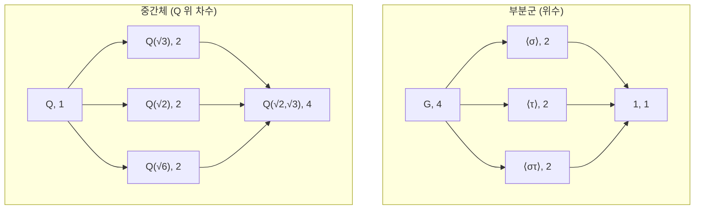

# Galois 이론

# 개요

Galois 이론은 [체의 확대](field-extensions.md)를 [군](groups.md)으로 번역한다. 확대 $K/k$ 의 대칭, 즉 $k$ 를 고정하는 $K$ 의 자기동형들을 모으면 유한군 $G$ 가 되고, 적절한 조건(Galois 확대) 아래 $K$ 와 $k$ 사이의 중간체들과 $G$ 의 부분군들이 서로 일대일로 대응한다. 이 대응은 포함관계를 뒤집으며 차수와 지수를 맞바꾼다.

이 번역이 강력한 이유는 체의 격자가 일반적으로 다루기 어려운 반면 유한군의 부분군 격자는 계산 가능하기 때문이다. 대표적인 결론이 방정식의 가해성이다. 다항식이 거듭제곱근으로 풀린다는 것은 그 Galois 군이 가해군(solvable group)이라는 것과 동치이고, 5차 이상의 일반 방정식은 대칭군이 가해가 아니므로 근의 공식이 없다.

# 직관

$\mathbb Q(\sqrt2)$ 의 원소 $a+b\sqrt2$ 에서 $\sqrt2$ 를 $-\sqrt2$ 로 바꾸는 사상은 덧셈과 곱셈을 보존한다. $x^2-2$ 의 두 근을 맞바꾸는 이 조작이 확대의 유일한 비자명 대칭이고, 따라서 Galois 군은 위수 2 다. 중간체가 없다는 사실이 부분군이 두 개뿐이라는 사실과 짝을 이룬다.

$\mathbb Q(\sqrt2,\sqrt3)$ 에서는 $\sqrt2$ 와 $\sqrt3$ 의 부호를 독립적으로 뒤집을 수 있어 대칭이 네 개다. 부분군 격자와 중간체 격자는 위아래가 뒤집힌 같은 그림이다.

$\sigma$ 는 $\sqrt2$ 의 부호만 뒤집는 사상이다. $\sigma$ 가 고정하는 원소는 $\sqrt3$ 을 포함하므로 $\sigma$ 가 생성하는 부분군의 고정체는 $\mathbb{Q}(\sqrt3)$ 이다. 큰 부분군이 작은 체에 대응한다.

# 정의

$K/k$ 를 유한 확대라 하자. $k$ 의 모든 원소를 고정하는 $K$ 의 체 자기동형 전체는 합성에 대해 군을 이루며, 이를 $\mathrm{Aut}(K/k)$ 로 쓴다. 부분군 $H$ 의 고정체(fixed field)는 $H$ 가 움직이지 않는 원소들의 모임이다.

$$
K^{H}=\lbrace a\in K:\ \sigma(a)=a\ \ \text{for all } \sigma\in H\rbrace
$$

$K/k$ 가 Galois 확대라는 것은 전체 자기동형군의 고정체가 정확히 $k$ 라는 뜻이며, 이때 $\mathrm{Aut}(K/k)$ 를 Galois 군이라 하고 $\mathrm{Gal}(K/k)$ 로 쓴다.

$$
K/k \text{ Galois} \iff K^{\mathrm{Aut}(K/k)}=k \iff \lvert\mathrm{Aut}(K/k)\rvert=[K:k]
$$

동치인 조건은 $K$ 가 $k$ 위 어떤 separable 다항식의 분해체라는 것이다. 다항식이 separable이라는 것은 각 기약인수가 중근을 갖지 않는다는 뜻이고, 표수 0이거나 [유한체](finite-fields.md)에서는 기약다항식이 항상 separable이므로 분해체는 곧 Galois 확대다. 표수 $p$ 에서 $\mathbb{F}_p(t)$ 위의 $x^p-t$ 같은 예는 separable이 아니다.

거듭제곱근 확대(radical extension)는 각 층이 어떤 원소의 $n$ 제곱근을 추가해 얻어지는 확대의 탑이다.

$$
k=K_0\subseteq K_1\subseteq\cdots\subseteq K_r,\qquad K_{i+1}=K_i(\alpha_i),\ \ \alpha_i^{\thinspace n_i}\in K_i
$$

# 성질

## Galois 군의 작용

$\mathrm{Gal}(K/k)$ 는 $K$ 에 [군 작용](group-actions.md)으로 작용하고, 이 작용은 $k[x]$ 에 속한 다항식의 근 집합을 보존한다. $\sigma$ 가 $k$ -자기동형이면 $f(\sigma\alpha)=\sigma(f(\alpha))=0$ 이기 때문이다. 따라서 $f$ 의 분해체에 대해 Galois 군은 근들의 집합에 충실하게 작용하여 대칭군에 단사로 들어간다.

$$
\mathrm{Gal}(K/k)\hookrightarrow S_n,\qquad n=\deg f
$$

이 작용이 추이적(transitive)인 것과 $f$ 가 $k$ 위 기약인 것이 동치다. 또 $\alpha$ 와 $\beta$ 가 같은 기약다항식의 근이면 두 원소는 같은 orbit에 있다. 즉 최소다항식이 orbit의 불변량이다.

## 기본 정리

$K/k$ 를 유한 Galois 확대, $G=\mathrm{Gal}(K/k)$ 라 하자. 다음 두 대응은 서로 역이며, 부분군과 중간체 사이에 포함관계를 뒤집는 일대일 대응을 준다[^1].

$$
H\longmapsto K^{H},\qquad L\longmapsto \mathrm{Gal}(K/L)
$$

$$
[K:K^{H}]=\lvert H\rvert,\qquad [K^{H}:k]=[G:H]
$$

나아가 부분군 $H$ 가 정규부분군인 것과 대응하는 중간체가 $k$ 위 Galois인 것이 동치이고, 이때 자기동형을 그 중간체로 제한하는 사상이 다음 동형을 준다[^1].

$$
H\trianglelefteq G\iff K^{H}/k \text{ Galois},\qquad \mathrm{Gal}(K^{H}/k)\cong G/H
$$

증명 개요: 차수 등식은 Artin의 보조정리(유한군 $H$ 가 작용하는 체 $K$ 에서 $K$ 의 $H$ -고정체 위 차수가 $\lvert H\rvert$ 이하)와 선형독립성 논증으로 얻는다. 두 대응이 서로 역임을 보이려면 $H$ 의 고정체의 Galois 군이 다시 $H$ 라는 것과, 중간체 $L$ 의 Galois 군의 고정체가 다시 $L$ 이라는 것을 확인하면 된다. 정규성 부분은 $H$ 의 켤레 부분군이 고정체의 상에 대응한다는 관찰에서 나온다.

## 예제

$\mathbb Q(\sqrt2,\sqrt3)/\mathbb Q$ 는 $(x^2-2)(x^2-3)$ 의 분해체이므로 Galois 이고 차수가 4 다. Galois 군은 부호 뒤집기 두 개가 생성하는 Klein 4-군이다.

$$
\mathrm{Gal}(\mathbb{Q}(\sqrt2,\sqrt3)/\mathbb{Q})\cong \mathbb{Z}/2\mathbb{Z}\times\mathbb{Z}/2\mathbb{Z}
$$

부분군이 5개(자명군, 위수 2가 세 개, 전체)이므로 중간체도 정확히 5개다. 진짜 중간체는 $\mathbb Q(\sqrt2)$ , $\mathbb Q(\sqrt3)$ , $\mathbb Q(\sqrt6)$ 뿐이다. abelian 군이므로 모든 부분군이 정규이고, 따라서 모든 중간체가 $\mathbb Q$ 위 Galois다.

유한체의 경우 Galois 군이 Frobenius가 생성하는 순환군이므로 대응이 특히 단순하다.

$$
\mathrm{Gal}(\mathbb{F}_{p^n}/\mathbb{F}_p)\cong\mathbb{Z}/n\mathbb{Z}
$$

부분군은 $n$ 의 약수 $m$ 에 대응하고 그 고정체가 부분체 $\mathbb{F}_{p^m}$ 이다.

## 가해성

표수 0의 체 k 위 다항식 f가 거듭제곱근으로 풀린다는 것은 f의 분해체의 Galois 군이 가해군이라는 것과 동치다[^2]. 가해군이란 각 몫이 abelian인 정규열을 갖는 군이다.

$$
1=G_0\trianglelefteq G_1\trianglelefteq\cdots\trianglelefteq G_r=G,\qquad G_{i+1}/G_i \text{ abelian}
$$

번역의 방향은 명확하다. 거듭제곱근 확대의 탑은 부분군의 사슬을 주고, n제곱근을 추가하는 층이 abelian 몫에 대응한다. 반대 방향은 abelian 몫을 근호로 실현하는 것이며, 이때 1의 원시 n제곱근을 미리 추가해 둔다.

## Abel–Ruffini

$S_n$ 은 $n\ge 5$ 에서 가해가 아니다. $A_n$ 이 $n\ge 5$ 에서 비가환 단순군이기 때문이다. Galois 군이 $S_5$ 인 5차 다항식이 존재하므로(예: $x^5-6x+3$ ) 5차 일반 방정식에는 근의 공식이 없다[^2]. 반면 $S_4$ 는 가해이므로 4차 이하의 모든 다항식은 근호로 풀린다. 이것이 2·3·4차 근의 공식은 있고 5차부터 없는 이유다.

주의할 점은 이 정리가 "5차 방정식은 풀 수 없다"가 아니라 "계수의 사칙연산과 거듭제곱근만으로 쓴 일반 공식이 없다"라는 진술이라는 것이다. 개별 5차 방정식은 Galois 군이 가해이면 근호로 풀리고, 수치해는 언제나 존재한다.

# 활용

## 작도 문제의 마무리

정n각형이 컴퍼스와 직선자로 작도 가능한 것과 n이 2의 거듭제곱과 서로 다른 Fermat 소수들의 곱인 것이 동치다(Gauss–Wantzel). 1의 n제곱근이 생성하는 원분체의 Galois 군이 Z/nZ의 곱셈군과 동형이라는 사실과, 작도 가능성이 2차 확대 탑과 동치라는 사실을 결합해 얻는다.

## 대수적 수론

$\mathbb{Q}$ 의 Galois 확대에서 [소수](primes.md)의 분해 양상이 Galois 군의 부분군으로 기술된다. 각 소수에 Frobenius 켤레류가 대응하며, 이것이 class field theory와 Chebotarev 밀도 정리의 출발점이다.

## 작은 차수의 판정

작은 차수 다항식의 Galois 군은 판별식과 resolvent 다항식으로 판정한다. 기약 3차 다항식의 경우 판별식이 유리수체에서 완전제곱인지가 군이 위수 3의 순환군인지 $S_3$ 인지를 가른다.

## 다른 분야로의 이식

"대칭군과 부분대상 격자의 대응"이라는 형태는 위상수학의 피복공간과 [기본군](fundamental-group.md)의 대응, 미분방정식의 미분 Galois 이론 등으로 반복된다. 이 대응들을 한 언어로 묶는 관점이 [범주](category.md)와 Galois 범주다.

[^1]: MathWorld, "Fundamental Theorem of Galois Theory" — 유한 Galois 확대에서 부분군과 중간체의 일대일 대응, 차수와 지수의 관계, 정규부분군과 Galois 중간체의 대응. https://mathworld.wolfram.com/FundamentalTheoremofGaloisTheory.html
[^2]: M. Mrinal, "Galois theory and the Abel–Ruffini theorem", University of Chicago REU 2019 — 근호 가해성과 Galois 군 가해성의 동치, $S_n$ 이 $n\ge 5$ 에서 비가해임, Galois 군이 $S_5$ 인 5차 다항식( $x^5-6x+3$ ) 예. https://math.uchicago.edu/~may/REU2019/REUPapers/Mrinal.pdf

# 연관 문서

## 선수지식

- [체의 확대](field-extensions.md)
- [군 작용](group-actions.md)

## 더 알아보기

- [대수적 수체와 정수환](algebraic-number-fields.md)

#field_theory #group_theory
