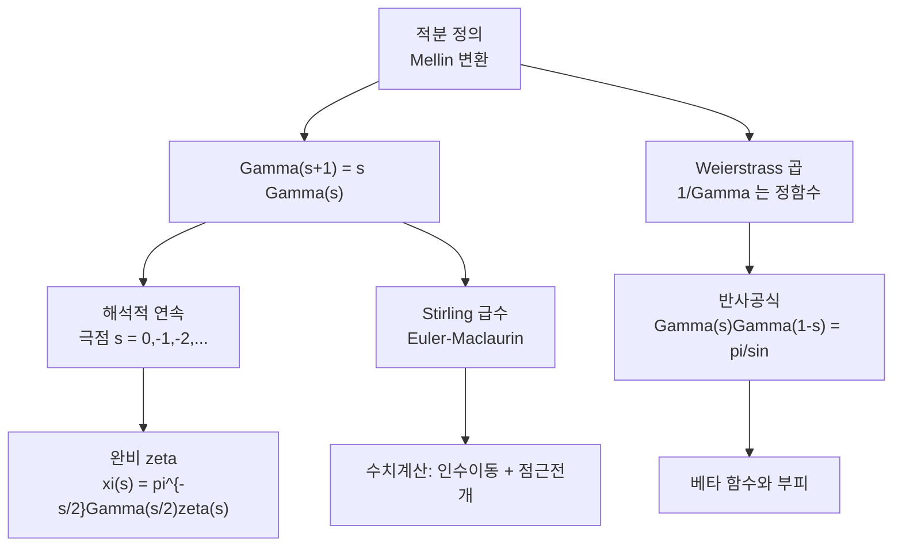

# 감마 함수와 Stirling 근사

# 개요

$n!$ 은 자연수에서만 정의된다. 이것을 실수와 복소수로 잇는 함수가 감마 함수다.

$$
\Gamma(s)=\int_0^{\infty}t^{s-1}e^{-t}\,dt\quad(\operatorname{Re}s>0),
\qquad
\Gamma(n+1)=n!
$$

보간이라면 방법은 무수히 많다. 감마가 **그 중 유일하게 옳은 보간**으로 자리 잡은 이유는 두 가지다.

- 함수방정식 $\Gamma(s+1)=s\,\Gamma(s)$ 를 로그볼록성과 함께 요구하면 후보가 하나로 좁혀진다(Bohr–Mollerup).
- 적분 정의가 $e^{-t}$ 의 Mellin 변환이어서, **적분과 급수의 변환 공식마다 자동으로 나타난다**. [유수 정리](residue-theorem.md)로 윤곽을 옮길 때 붙는 인자, zeta 의 함수방정식에 붙는 인자, 확률분포의 정규화 상수가 모두 감마다.

이 문서가 그래프에서 두 부모를 갖는 것도 같은 이유다. 극점의 위치와 유수, 무한곱, 해석적 연속은 복소해석의 이야기이고, 큰 $s$ 에서의 크기—Stirling 급수—는 [Euler–Maclaurin](euler-maclaurin.md)이 그대로 주는 점근전개다. 감마는 두 세계가 만나는 가장 단순한 예다.

# 직관

## 계승을 잇는 방법을 하나로 고르는 조건

$f(x+1)=xf(x)$ 와 $f(1)=1$ 만으로는 부족하다. 주기 1 인 아무 양함수 $p$ 를 곱한 $f\cdot p$ 도 같은 조건을 만족한다. 여기에 **$\log f$ 가 볼록** 이라는 조건 하나를 더하면 답이 유일해진다.

$$
\log\Gamma\ \text{가 볼록}\ \Longleftrightarrow\ \frac{\Gamma'}{\Gamma}\ \text{가 증가}
$$

$\sin$ 을 곱해 흔드는 순간 로그볼록성이 깨지므로 그런 변형이 배제된다. 계승이 "곱셈적으로 매끄럽게" 자라는 성질을 그대로 요구한 셈이다. 로그볼록성은 [볼록성](convexity.md)이 유일성 정리를 만드는 드문 예다.

## 왜 하필 이 적분인가

$\int_0^\infty t^{s-1}e^{-t}dt$ 는 $e^{-t}$ 의 Mellin 변환이다. Mellin 변환은 곱셈군 $(0,\infty)$ 위의 Fourier 변환이므로, **스케일 변환에 대한 지표 $t^{s}$ 로 함수를 분해하는 조작**이다. 어떤 계산이든 스케일을 바꾸며 적분을 정리하면 감마가 나온다.

$$
\int_0^{\infty}t^{s-1}e^{-\lambda t}dt=\frac{\Gamma(s)}{\lambda^{s}},
\qquad
\sum_{n\ge1}\frac{1}{n^{s}}\cdot\Gamma(s)=\int_0^{\infty}\frac{t^{s-1}}{e^{t}-1}dt
$$

오른쪽 식이 $\zeta(s)$ 를 적분으로 바꾸는 표준 통로다. 감마가 "$\zeta$ 의 무한소수 자리 인자" 로 불리는 이유가 여기 있고, 이 관점을 끝까지 밀면 [Tate 논문](tate-thesis.md)이 된다.

## 극점은 원점의 꼬리에서 온다

$t\to0$ 에서 $e^{-t}=1-t+\tfrac{t^2}2-\cdots$ 이므로

$$
\int_0^{1}t^{s-1}e^{-t}dt=\sum_{n\ge0}\frac{(-1)^{n}}{n!}\cdot\frac1{s+n}
$$

가 되어 **극점이 $s=0,-1,-2,\dots$ 에 정확히 하나씩, 유수 $(-1)^n/n!$ 로** 나타난다. 적분의 수렴을 막는 것은 언제나 $t=0$ 쪽이고, $e^{-t}$ 의 Taylor 계수가 그대로 유수가 된다. 감마는 영점이 하나도 없고 극점만 있는 함수이며, 따라서 $1/\Gamma$ 는 정함수다.

## 반사공식은 영점을 맞춰 본 결과다

$1/\Gamma(s)$ 는 $s=0,-1,-2,\dots$ 에서 영점을 갖고 $1/\Gamma(1-s)$ 는 $s=1,2,3,\dots$ 에서 영점을 갖는다. 둘을 곱하면 **모든 정수에서 단순영점**을 갖는 정함수가 되고, 그런 함수의 가장 단순한 후보는 $\sin\pi s$ 다. 증가 차수를 맞춰 보면 실제로 같다.

$$
\Gamma(s)\Gamma(1-s)=\frac{\pi}{\sin\pi s}
$$

$s=\tfrac12$ 을 넣으면 $\Gamma(\tfrac12)=\sqrt\pi$, 곧 Gauss 적분이다. 정함수를 영점으로 판별하는 이 논법은 Hadamard 인수분해의 전형이다.



# 정의

## 적분과 해석적 연속

$\operatorname{Re}s>0$ 에서 적분이 절대수렴하고 정칙이다. 연속은 함수방정식을 거꾸로 쓰면 된다.

$$
\Gamma(s)=\frac{\Gamma(s+n)}{s(s+1)\cdots(s+n-1)}
$$

우변은 $\operatorname{Re}s>-n$ 에서 정의되므로 $n$ 을 키우면 $\mathbb C$ 전체로 이어진다. 이 식은 그대로 수치계산의 방법이기도 하다.

## Euler 곱과 Weierstrass 곱

$$
\Gamma(s)=\lim_{n\to\infty}\frac{n!\,n^{s}}{s(s+1)\cdots(s+n)},
\qquad
\frac1{\Gamma(s)}=s\,e^{\gamma s}\prod_{n\ge1}\Big(1+\frac sn\Big)e^{-s/n}
$$

두 번째 식이 $1/\Gamma$ 가 위수 1 의 정함수임을 보여 준다. 수렴인자 $e^{-s/n}$ 이 필요한 자리에서 [Euler 상수](euler-maclaurin.md) $\gamma$ 가 튀어나오는 것이 인상적이다. $\gamma$ 는 $\sum1/n$ 과 $\log n$ 의 차이였고, 여기서는 곱의 재정렬 비용으로 나타난다.

## 베타 함수

$$
\mathrm B(x,y)=\int_0^1t^{x-1}(1-t)^{y-1}dt=\frac{\Gamma(x)\Gamma(y)}{\Gamma(x+y)}
$$

이항계수의 연속판이다. 증명은 $\Gamma(x)\Gamma(y)$ 를 이중적분으로 쓰고 극좌표 비슷한 치환을 하는 것으로 끝난다. 조합론의 항등식 대부분이 이 한 줄의 특수화다.

# 성질

## 극점과 유수

$\Gamma$ 는 $\mathbb C$ 에서 유리형이고 영점이 없다. 극점은 $s=-n$ ($n\ge0$) 의 단순극점뿐이며

$$
\operatorname*{Res}_{s=-n}\Gamma(s)=\frac{(-1)^{n}}{n!}
$$

**영점이 없다는 사실**이 실용적으로 중요하다. $\Gamma$ 로 나누는 조작이 언제나 허용되므로, 함수방정식에서 감마 인자를 옮겨 붙이는 계산에 제약이 없다.

## Bohr–Mollerup 정리

**정리.** $f:(0,\infty)\to(0,\infty)$ 가 $f(1)=1$, $f(x+1)=xf(x)$, $\log f$ 볼록을 만족하면 $f=\Gamma$ 다.

**증명의 착상.** 로그볼록성으로 $\log f(n+x)$ 를 $\log f(n)$ 과 $\log f(n+1)$ 사이의 기울기로 가두면 Euler 곱의 표현이 그대로 유도된다. 조건 세 개가 함수를 완전히 결정한다. $\square$

이 정리는 "감마를 왜 이렇게 정의하는가" 라는 물음의 표준 답이다. 적분이 본질이 아니라 **세 조건이 본질**이라는 것이다.

## 반사, 배가, 승법

$$
\Gamma(s)\Gamma(1-s)=\frac{\pi}{\sin\pi s},
\qquad
\Gamma(s)\Gamma\!\left(s+\tfrac12\right)=2^{1-2s}\sqrt\pi\,\Gamma(2s)
$$

$$
\prod_{k=0}^{n-1}\Gamma\!\left(s+\frac kn\right)=(2\pi)^{(n-1)/2}\,n^{1/2-ns}\,\Gamma(ns)
$$

세 번째가 Gauss 승법공식이고 두 번째(Legendre 배가)는 $n=2$ 인 경우다. 승법공식은 $\Gamma$ 가 **곱셈군의 $n$ 배 사상과 정합한다**는 진술이며, 지표합에서 [Gauss 합](gauss-sums.md)이 만족하는 Hasse–Davenport 관계의 원형이다.

## Stirling 급수

$f=\log x$ 에 Euler–Maclaurin 을 적용하면 $\log\Gamma$ 의 점근전개가 나온다.

$$
\log\Gamma(z)=\Big(z-\tfrac12\Big)\log z-z+\tfrac12\log2\pi
+\sum_{k=1}^{K}\frac{B_{2k}}{2k(2k-1)z^{2k-1}}+R_K
$$

$|\arg z|<\pi$ 인 임의의 닫힌 부채꼴에서 균등하게 성립한다. 지수를 취하면 익숙한 꼴이다.

$$
\Gamma(z)\sim\sqrt{\frac{2\pi}{z}}\left(\frac ze\right)^{z},
\qquad n!\sim\sqrt{2\pi n}\left(\frac ne\right)^{n}
$$

상수 $\sqrt{2\pi}$ 는 Euler–Maclaurin 이 주지 못하고 반사공식이나 Wallis 곱으로 따로 정한다. 급수는 발산하므로 최적 절단은 $K\approx\pi|z|$, 그때 상대오차가 $e^{-2\pi|z|}$ 규모다.

## 감마 인자와 함수방정식

$$
\xi(s)=\pi^{-s/2}\Gamma\!\left(\frac s2\right)\zeta(s)
\quad\Longrightarrow\quad
\xi(s)=\xi(1-s)
$$

[Riemann zeta](prime-number-theorem.md) 의 함수방정식은 $\zeta$ 만으로는 대칭적이지 않고 감마 인자를 붙여야 대칭이 된다. 소수 하나마다 Euler 인자 $(1-p^{-s})^{-1}$ 가 있듯 **"무한대 자리" 에도 인자가 하나 있고 그것이 감마**라는 것이 이 식의 읽는 법이다. $\zeta$ 의 자명한 영점 $s=-2,-4,\dots$ 는 $\Gamma(s/2)$ 의 극점을 상쇄하느라 생긴 것이지 $\zeta$ 자신의 성질이 아니다. [모듈러 형식](modular-forms.md)과 [Dirichlet $L$ 함수](dirichlet-l-functions.md)의 완비화에도 무게에 맞춘 감마 인자가 같은 자리에 붙는다.

# 활용

## 수치계산

작은 $z$ 에서는 점근전개가 쓸모없으므로 함수방정식으로 $z$ 를 키운 뒤 Stirling 을 쓰고 되돌린다. 이 두 줄이 표준 구현의 뼈대다.

```python
from fractions import Fraction as F
from math import comb, log, pi, lgamma, sin, exp

M = 40
B = [F(0)] * (M + 1); B[0] = F(1)
for n in range(1, M + 1):
    B[n] = -sum(comb(n + 1, k) * B[k] for k in range(n)) / F(n + 1)

def loggamma(z, K=8, shift=12):
    s = 0.0
    while z < shift:                       # Gamma(z) = Gamma(z+1)/z 로 끌어올린다
        s -= log(z); z += 1
    r = (z - 0.5) * log(z) - z + 0.5 * log(2 * pi)
    for k in range(1, K + 1):              # Stirling 급수
        r += float(B[2 * k]) / (2 * k * (2 * k - 1) * z ** (2 * k - 1))
    return r + s

for z in (0.1, 0.5, 2.5, 7.0):
    print(z, "%.2e" % abs(loggamma(z) - lgamma(z)))
# 0.1 1.3e-15 / 0.5 7.1e-15 / 2.5 4.4e-15 / 7.0 8.9e-16

print(exp(2 * loggamma(0.5)), pi)                          # Gamma(1/2)^2 = pi
z = 0.3
print(exp(loggamma(z) + loggamma(1 - z)), pi / sin(pi * z))  # 반사공식
```

$\log\Gamma$ 를 먼저 계산하는 것도 요령이다. $\Gamma$ 자체는 금방 넘치지만 로그는 넘치지 않고, 이항계수나 확률밀도처럼 실제로 필요한 양은 대개 감마의 비 $\Gamma(a)\Gamma(b)/\Gamma(a+b)$ 라 로그로 더하고 빼는 쪽이 안전하다.

## 부피와 확률분포

$n$ 차원 단위공의 부피와 감마분포의 정규화 상수가 같은 뿌리에서 나온다.

$$
\operatorname{vol}(B^{n})=\frac{\pi^{n/2}}{\Gamma\!\left(\frac n2+1\right)},
\qquad
p(x)=\frac{\lambda^{\alpha}}{\Gamma(\alpha)}x^{\alpha-1}e^{-\lambda x}
$$

앞의 식에서 $\Gamma$ 가 분모에 있으므로 부피는 $n$ 이 커질 때 **0 으로 급격히 줄어든다**. 고차원 기하의 직관에 반하는 현상 대부분이 이 한 줄에서 시작하고, [구 채우기](sphere-packing.md)의 밀도 평가에도 그대로 들어간다. 뒤의 감마분포는 지수분포의 합이며 $\alpha=n/2$, $\lambda=1/2$ 이면 자유도 $n$ 의 카이제곱분포가 되어 [가설검정](hypothesis-testing.md)의 기본 분포가 된다. [지수족](exponential-families.md)의 로그분배함수가 $\log\Gamma$ 로 쓰이는 것도 같은 사정이다.

## 조합론적 근사

$$
\binom{2n}{n}=\frac{(2n)!}{(n!)^{2}}\sim\frac{4^{n}}{\sqrt{\pi n}}
$$

Stirling 을 세 번 써서 얻는 이 식이 [확률](probability.md)의 거의 모든 중심극한형 계산에 쓰인다. 정확한 계승을 다루면 자리수가 폭발하지만 $\sqrt{\pi n}$ 하나로 본질이 드러난다. **$4^{n}$ 이 주도항이고 $\sqrt{n}$ 이 보정** 이라는 구조가 대칭 랜덤워크의 되돌아옴 확률, 이항분포의 최대값, 엔트로피 계산에서 반복해 나타난다.[^1]

[^1]: 표준 참고는 E. Artin, *The Gamma Function* (Bohr–Mollerup 을 중심에 둔 짧은 고전)과 E. T. Whittaker, G. N. Watson, *A Course of Modern Analysis* 12 장. 수치구현은 W. Press 외, *Numerical Recipes* 6.1 절의 Lanczos 근사와 비교해 볼 만하다. 본문의 수치는 모두 직접 실행해 확인했다.

# 연관 문서

## 선수지식

- [Laurent 급수와 유수 정리](residue-theorem.md)
- [Euler–Maclaurin 공식과 점근급수](euler-maclaurin.md)

## 더 알아보기

- [Laplace 방법과 안장점](laplace-method.md)

#analysis #complex_analysis #computation
