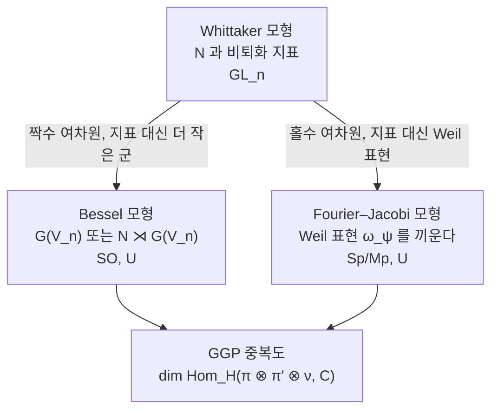

# Gan–Gross–Prasad 추측

# 개요

[Whittaker 모형의 유일성](whittaker-models.md)은 $\mathrm{GL}_n$ 의 특권이다. 직교군, 유니터리군, 심플렉틱군 같은 고전군에서는 Whittaker 모형이 아예 없는 표현이 흔하고, 있어도 유일하지 않다. 중복도 1 이라는 좋은 성질을 고전군에서 되찾으려면 모형을 바꿔야 한다.

**Gan–Gross–Prasad 추측**의 출발점은 한 군의 표현이 아니라 **군의 쌍**을 보는 것이다. 크기가 하나 차이나는 고전군의 쌍 $G_{n+1}\supset G_n$ 을 잡고, $G_{n+1}$ 의 표현을 $G_n$ 으로 제한했을 때 $G_n$ 의 주어진 표현이 몇 번 나타나는지 묻는다. 이 **분지 중복도**가 GGP 가 다루는 양이다.

추측은 두 층으로 되어 있다.

- **국소 GGP**: 중복도의 합은 정확히 1 이고, 어느 표현에서 그 1 이 나오는지를 $\varepsilon$ 인자가 결정한다.
- **전역 GGP**: 아델 위의 **주기 적분**이 0 이 아닌 것과 Rankin–Selberg $L$ 함수의 **중심값** $L(1/2,\pi_{n+1}\times\pi_n)$ 이 0 이 아닌 것이 동치다.

$$
\int_{H(F)\backslash H(\mathbb A)}\varphi(h)\,\varphi'(h)\,dh\ne0
\quad\Longleftrightarrow\quad
L\!\left(\tfrac12,\pi_{n+1}\times\pi_n\right)\ne0
$$

왼쪽은 표현론의 양이고 오른쪽은 해석적 정수론의 양이다. GGP 는 콤팩트군에서 조합적 사실에 불과했던 분지 법칙이 아델 위로 올라가면 $L$ 함수의 산술을 통째로 담게 된다고 말한다. $n=1$ 로 내리면 이것이 Waldspurger 정리이고, 다시 [Birch–Swinnerton-Dyer 추측](birch-swinnerton-dyer.md)과 [Heegner 점](heegner-points.md)의 세계로 이어진다.

# 직관

## 인터레이싱이라는 조합 사실에서 시작한다

콤팩트 유니터리군 $U(n+1)\supset U(n)$ 의 분지 법칙은 완전히 조합적이다. 최고무게 $\lambda=(\lambda_1\ge\cdots\ge\lambda_{n+1})$ 의 기약표현을 $U(n)$ 으로 제한하면

$$
\mathrm{Res}^{U(n+1)}_{U(n)}V_\lambda=\bigoplus_{\mu\ \text{interlaces}\ \lambda}V_\mu,
\qquad
\lambda_1\ge\mu_1\ge\lambda_2\ge\mu_2\ge\cdots\ge\mu_n\ge\lambda_{n+1}
$$

이고 **각 $\mu$ 가 정확히 한 번**씩 나온다. 중복도가 전부 1 이다. Gelfand–Tsetlin 패턴이 이 사실을 기저 하나까지 구현한다.

$$
\dim\mathrm{Hom}_{U(n)}\bigl(V_\lambda\otimes V_\mu^\vee,\mathbb C\bigr)\le1
$$

GGP 의 물음은 단순하다. **이 부등식이 $p$ 진군과 아델군에서도 성립하는가, 그리고 성립한다면 그 1 은 어디에 있는가.**

콤팩트군에서는 인터레이싱 조건이 답을 준다. 그런데 $p$ 진 고전군에서는 기약표현이 무한차원이고, 게다가 같은 [Langlands 매개변수](langlands-program.md)를 갖는 표현이 여럿(L 꾸러미)이며, 그 표현들은 서로 다른 **순수 내부형식** 위에 흩어져 있다. 즉 같은 $n$ 차원 에르미트 공간이 아니라 판별식이 다른 여러 공간을 동시에 봐야 한다. 답은 이렇다. 중복도 1 은 **하나의 군이 아니라 순수 내부형식 전체에 걸쳐** 성립하고, 어느 군 어느 표현이 그 1 을 갖는지는 $\varepsilon$ 인자가 지정한다.

## 왜 모형을 바꿔야 하는가

$\mathrm{GL}_n$ 에서 Whittaker 모형이 유일한 이유는 $N\backslash G/N$ 에서 비퇴화 지표가 살아남는 궤도가 하나뿐이기 때문이었다. 고전군에서는 이 궤도 구조가 무너진다. 멱단근기 위의 지표 궤도가 여러 개이고, 그중 어느 것도 $\mathrm{GL}_n$ 만큼 좋지 않다. 실제로 고전군의 표현 중 Whittaker 모형을 갖는 것(일반 표현)은 L 꾸러미 안에서 보통 하나뿐이다.

대신 쓰는 것이 **더 작은 군을 짝지은 모형**이다.



Whittaker 모형은 이 그림에서 $G_n$ 이 자명군까지 줄어든 극단이다. 반대쪽 극단이 여차원 0, 곧 $G\times G$ 의 대각 부분군이고 이때는 Weil 표현을 끼워 넣어야 중복도 1 이 회복된다.

## 중심값이 왜 나타나는가

전역 쪽 직관은 [Rankin–Selberg 적분](rankin-selberg.md)과 같은 자리에서 나온다. 주기 적분을 펼치면 자리마다의 국소 적분의 곱이 되고, 비분기 자리의 국소 적분은 [Satake 매개변수](satake-isomorphism.md)로 계산되어 $L$ 함수의 국소 인자를 내놓는다. 다른 점은 적분이 복소 변수 $s$ 를 달고 있지 않다는 것이다. 주기 적분에는 Eisenstein 급수가 들어가지 않으므로 $s$ 를 움직일 자유가 없고, 결과는 **$s=1/2$ 한 점에서의 값**으로 고정된다. 함수방정식의 대칭점이 바로 이 자리다.

그래서 "주기가 0 이 아니다"가 "중심값이 0 이 아니다"와 맞물린다. 중심값이 0 이면 주기가 사라지고, 그때 정보는 도함수로 옮겨간다. 이것이 산술 GGP 의 출발점이다.

# 정의

## 관련된 쌍

$F$ 를 국소체 또는 수체라 하고, $E/F$ 를 $F$ 자신 또는 이차 확대라 한다. $V$ 를 $E/F$ 에 대한 비퇴화 에르미트(또는 이차, 교대) 공간이라 하고, 부분공간 $W\subset V$ 를 $V=W\oplus W^\perp$ 가 되도록 잡는다. 여차원 $d=\dim W^\perp$ 에 따라 두 경우로 나뉜다.

**Bessel 경우 ($d$ 홀수).** $W^\perp$ 안에 극대 등방부분공간 $X$ 를 잡으면 $\dim X=(d-1)/2$ 이다. $P\subset G(V)$ 를 $X$ 의 안정자 포물부분군, $N$ 을 그 멱단근기라 하고

$$
H=N\rtimes G(W),\qquad \nu:N\to\mathbb C^\times
$$

로 둔다. $\nu$ 는 $G(W)$ 의 작용으로 안정되는 일반 지표다. 가장 단순한 $d=1$ 에서는 $N$ 이 자명하고 $H=G(W)$, $\nu=1$ 이다. 이때 쌍은

$$
\bigl(\mathrm{SO}(n+1)\times\mathrm{SO}(n),\ \mathrm{SO}(n)\bigr),
\qquad
\bigl(U(n+1)\times U(n),\ U(n)\bigr)
$$

이고, 앞 절의 인터레이싱 상황이 정확히 이것이다.

**Fourier–Jacobi 경우 ($d$ 짝수).** 이때는 $G(W)$ 만으로 부족하고 Heisenberg 군과 [Weil 표현](theta-functions.md) $\omega_\psi$ 를 끼워야 한다. $d=0$ 에서 쌍은

$$
\bigl(\mathrm{Mp}(2n)\times\mathrm{Sp}(2n),\ \mathrm{Sp}(2n)\bigr),
\qquad
\bigl(U(n)\times U(n),\ U(n)\bigr)
$$

이고 중복도를 잴 때 $\omega_\psi$ 를 함께 텐서한다.

## 국소 GGP

$F$ 가 국소체일 때, $G_{n+1}\times G_n$ 의 기약 매끄러운 표현 $\pi=\pi_{n+1}\otimes\pi_n$ 에 대해

$$
m(\pi)=\dim\mathrm{Hom}_{H(F)}\bigl(\pi\otimes\nu,\ \mathbb C\bigr)
$$

(Fourier–Jacobi 경우에는 $\pi\otimes\omega_\psi$) 로 둔다. 국소 GGP 는 두 부분이다.

**(a) 중복도 1.** 언제나 $m(\pi)\le1$ 이다.

**(b) 지표 공식.** $\varphi=\varphi_{n+1}\otimes\varphi_n$ 을 $\pi$ 의 Langlands 매개변수라 하자. 이 매개변수를 공유하는 표현들은 여러 순수 내부형식 위의 Vogan 꾸러미 $\Pi_\varphi$ 를 이루고, 성분군의 지표로 매개된다. 그러면

$$
\sum_{\pi\in\Pi_\varphi}m(\pi)=1
$$

이고, $m(\pi)=1$ 인 유일한 $\pi$ 는 다음 지표로 지정된다.

$$
\chi\bigl(\pi_{n+1}\otimes\pi_n\bigr)
=\varepsilon\!\left(\tfrac12,\ \varphi_{n+1}\otimes\varphi_n,\ \psi\right)
$$

즉 **어느 군의 어느 표현이 그 1 을 갖는지를 $\varepsilon$ 인자의 부호가 결정한다.** 이것이 GGP 의 핵심이고, 순수 내부형식 여럿을 동시에 봐야 하는 이유다. 하나만 보면 중복도가 0 일 수 있다.

## 전역 GGP

$F$ 가 수체이고 $\pi_{n+1},\pi_n$ 이 첨점 자기동형 표현일 때, 주기 적분을

$$
\mathcal P(\varphi,\varphi')=\int_{H(F)\backslash H(\mathbb A)}\varphi(h)\,\varphi'(h)\,\nu(h)\,dh
$$

로 둔다(Fourier–Jacobi 경우 $\theta$ 급수를 함께 넣는다). 추측은 다음이다. $\pi_{n+1}\times\pi_n$ 의 근접동치류(near-equivalence class, 거의 모든 자리에서 같은 Satake 매개변수를 갖는 표현들의 모임) 안에서

$$
\exists\,(\pi_{n+1},\pi_n)\ \text{with}\ \mathcal P\not\equiv0
\quad\Longleftrightarrow\quad
L\!\left(\tfrac12,\pi_{n+1}\times\pi_n\right)\ne0
$$

이고, 주기가 살아남는 그 하나를 찾는 일이 자리마다의 국소 GGP 다. 전역 조건이 국소 조건들의 곱으로 분해된다는 구조가 [Whittaker 유일성](whittaker-models.md)이 Euler 곱을 보장했던 것과 같은 자리에 있다.

# 성질

## 콤팩트 경우의 검산

Bessel 쌍 $U(n+1)\supset U(n)$ 의 중복도 1 은 인터레이싱으로 확인된다. 제한의 차원 합이 원래 차원과 맞는지 Weyl 차원 공식으로 세어 보면 된다.

```javascript
// U(n) 기약표현의 차원 (Weyl 차원 공식)
function dimU(lambda) {
  const n = lambda.length
  let num = 1, den = 1
  for (let i = 0; i < n; i++)
    for (let j = i + 1; j < n; j++) {
      num *= lambda[i] - lambda[j] + j - i
      den *= j - i
    }
  return num / den
}

// lambda 와 인터레이싱하는 mu 를 모두 나열한다
function interlacing(lambda) {
  const out = []
  const rec = (i, acc) => {
    if (i === lambda.length - 1) { out.push(acc); return }
    for (let m = lambda[i + 1]; m <= lambda[i]; m++) rec(i + 1, [...acc, m])
  }
  rec(0, [])
  return out
}

const lambda = [4, 2, 1, 0]               // U(4) 의 최고무게
const mus = interlacing(lambda)           // U(3) 성분들
const total = mus.reduce((s, mu) => s + dimU(mu), 0)
console.log(dimU(lambda), total, mus.length)
// 140 140 12  — 중복도를 모두 1 로 놓고 더해도 차원이 맞는다
```

차원이 정확히 맞으므로 각 $\mu$ 는 많아야 한 번 나올 수밖에 없다. 콤팩트군에서는 이것이 전부이고, $p$ 진군에서 같은 결론을 얻는 데 훨씬 깊은 도구가 필요하다.

## 중복도 1 정리

국소 GGP 의 (a) 는 정리로 확립되어 있다.

- **비아르키메데스 자리**: Aizenbud–Gourevitch–Rallis–Schiffmann 이 $(\mathrm{GL}_{n+1},\mathrm{GL}_n)$ 을, Waldspurger 와 Jiang–Sun–Zhu 가 고전군의 Bessel 경우를 처리했다. 증명은 Gelfand–Kazhdan 식 대합을 분포에 적용하는 것으로, $\mathrm{GL}_n$ 의 논법과 뼈대가 같다.
- **아르키메데스 자리**: Sun–Zhu 가 실군과 복소군에서 증명했다.[^1]

여기서 쓰이는 대합은 $\mathrm{GL}_n$ 의 $g\mapsto{}^tg^{-1}$ 에 해당하는 것으로, 관련된 분포가 전부 이 대합에 대해 불변임을 보이면 $\mathrm{Hom}$ 공간이 2 차원 이상일 수 없다. 이 구조는 실은 $(G\times H, H)$ 가 **Gelfand 쌍**이라는 말과 같다.

## 지표 공식과 증명된 범위

(b) 와 전역 추측은 군에 따라 상황이 다르다.

| 군 | 국소 | 전역 |
| --- | --- | --- |
| 유니터리 $U(n+1)\times U(n)$ | 증명됨 (Beuzart-Plessis, Gan–Ichino) | 증명됨 |
| 직교 $\mathrm{SO}(n+1)\times\mathrm{SO}(n)$ | 이산계열에서 증명됨 (Waldspurger, Mœglin–Waldspurger) | 부분적 |
| 심플렉틱/메타플렉틱 | Fourier–Jacobi, 대체로 증명됨 | 부분적 |

유니터리군 전역 GGP 의 증명은 **Jacquet–Rallis 상대 대각합 공식**을 쓴다. 두 개의 대각합 공식을 비교하는 방식이며, 그 비교가 성립하려면 궤도적분 사이의 항등식이 필요하다. 이것이 [기본 보조정리](fundamental-lemma.md)의 상대판이고, Zhiwei Yun 이 양의 표수에서 증명한 뒤 Julia Gordon 이 표수 0 으로 옮겼다. W. Zhang 이 이 공식을 조립해 국소 조건을 붙인 형태로 증명했고, Beuzart-Plessis–Chaudouard–Zydor 가 대각합 공식의 안정화를 완성해 조건을 제거했다.[^2] 안정화된 대각합 공식이라는 도구가 GGP 쪽에서도 그대로 결정적이었던 셈이다.

## 낮은 계수의 특수 사례

$n$ 을 내리면 이미 알려진 정리들이 나온다.

- $\mathrm{SO}(3)\times\mathrm{SO}(2)$, 곧 $\mathrm{PGL}_2\times$ 토러스: **Waldspurger 정리**다. 토릭 주기(허수이차체 관련 토러스 위의 적분)가 0 이 아닌 것이 $L(1/2,\pi\times\chi)\ne0$ 과 동치이고, 주기의 제곱이 중심값과 명시적 상수배로 같다.
- $U(3)\times U(2)$: Gross–Prasad 가 1992 년에 처음 제기한 형태다.[^3]
- $\mathrm{SO}(4)\times\mathrm{SO}(3)$: $\mathrm{GL}_2\times\mathrm{GL}_2$ 의 삼중곱 $L$ 함수와 연결되어 Ichino 의 삼중곱 공식이 된다.

## Ichino–Ikeda 정련

전역 GGP 는 "0 인가 아닌가"만 말한다. Ichino–Ikeda 는 값 자체를 예측한다. 주기의 절댓값 제곱이 중심값과 국소 적분의 곱으로 명시적으로 주어진다는 것이다. 개략적으로

$$
\frac{|\mathcal P(\varphi,\varphi')|^2}{\langle\varphi,\varphi\rangle\langle\varphi',\varphi'\rangle}
=\frac{1}{|S_\varphi|}\cdot
\frac{L\!\left(\tfrac12,\pi_{n+1}\times\pi_n\right)}{L(1,\pi,\mathrm{Ad})}
\cdot\prod_v\alpha_v
$$

의 꼴이고, $\alpha_v$ 는 거의 모든 자리에서 1 이 되는 국소 적분이다. 이 등식은 수치적으로 확인할 수 있는 형태라는 점이 중요하다. 실제로 유니터리군 경우에는 증명되었다.

## 산술 GGP

중심값이 0 이면 주기도 0 이 되어 전역 GGP 는 더 말할 것이 없다. 그때 정보는 도함수에 있다. **산술 GGP** 는 [Gross–Zagier 공식](heegner-points.md)의 일반화로, $L'(1/2,\pi_{n+1}\times\pi_n)$ 이 유니터리 Shimura 다양체 안의 **순환 사이클의 높이 쌍**과 같다고 예측한다.

$$
L'\!\left(\tfrac12,\pi_{n+1}\times\pi_n\right)\ \sim\ \langle\,\Delta,\ \Delta\,\rangle_{\mathrm{NT}}
$$

여기서 $\Delta$ 는 $\mathrm{Sh}(U(n))\hookrightarrow\mathrm{Sh}(U(n+1)\times U(n))$ 의 상이 주는 사이클이다. 증명의 국소 성분이 **산술 기본 보조정리**이고, W. Zhang 이 이를 증명했으며 Rapoport–Smithling–Zhang 이 관련 산술 이전 추측을 다루었다. $n=1$ 로 내리면 사이클이 Heegner 점이 되고 원래의 Gross–Zagier 가 회복된다.

# 활용

## BSD 로 가는 길

$n=1$ 의 Waldspurger 정리와 Gross–Zagier 를 합치면 타원곡선 $E/\mathbb Q$ 에 대해 다음을 얻는다. $L(E,1)\ne0$ 이면 주기가 0 이 아니고, $L(E,1)=0$ 이면서 $L'(E,1)\ne0$ 이면 Heegner 점이 무한위수다. 이것이 계수 $\le1$ 에서 BSD 의 절반을 증명한 Gross–Zagier–Kolyvagin 논법의 입력이고, [Selmer 군](selmer-groups.md) 쪽 통제와 맞물린다. GGP 는 이 구조가 낮은 계수의 우연이 아니라 고전군 전반의 현상임을 말한다.

## 비소멸 판정의 도구

전역 GGP 의 실질적 쓸모는 방향에 있다. 중심값의 비소멸은 해석적으로 다루기 어렵지만, 주기 적분은 표현론적으로 구성할 수 있다. 명시적인 벡터 $\varphi,\varphi'$ 를 잡아 주기가 0 이 아님을 보이면 $L(1/2)\ne0$ 이 따라 나온다. 반대 방향으로는 $\varepsilon$ 인자 계산만으로 어떤 주기가 반드시 0 인지 예측할 수 있고, 이는 순수하게 국소적인 계산이다.

## 분지 법칙의 산술화

표현론 쪽에서 보면 GGP 는 분지 법칙을 $L$ 함수로 번역하는 사전이다. 콤팩트군에서 [Weyl 지표공식](weyl-character-formula.md)과 [근계](root-systems.md)로 답이 나오던 문제가, $p$ 진군에서는 Langlands 매개변수와 $\varepsilon$ 인자의 문제가 된다. 이 번역이 가능하다는 사실 자체가 국소 Langlands 대응이 표현의 이름표를 붙이는 데 그치지 않고 **표현 사이의 관계까지 기술한다**는 증거다. [Casselman–Shalika 공식](casselman-shalika.md)이 비분기 Whittaker 함수를 Schur 다항식으로 적었던 것처럼, GGP 는 분지 중복도를 $\varepsilon$ 부호로 적는다.

[^1]: B. Sun, C.-B. Zhu, *Multiplicity one theorems: the Archimedean case*, Ann. of Math. 175 (2012).

[^2]: R. Beuzart-Plessis, P.-H. Chaudouard, M. Zydor, *The global Gan–Gross–Prasad conjecture for unitary groups: the endoscopic case*, Publ. IHÉS 135 (2022).

[^3]: B. Gross, D. Prasad, *On the decomposition of a representation of $\mathrm{SO}_n$ when restricted to $\mathrm{SO}_{n-1}$*, Canad. J. Math. 44 (1992). 일반형은 W. T. Gan, B. Gross, D. Prasad, Astérisque 346 (2012).

# 연관 문서

## 선수지식

- [Whittaker 모형과 중복도 1](whittaker-models.md)
- [기본 보조정리와 대각합 공식의 안정화](fundamental-lemma.md)
- [Vogan L 꾸러미와 순수 내부형식](vogan-packets.md)

## 더 알아보기

- [Waldspurger 정리와 토릭 주기](waldspurger-formula.md)

#number_theory #group_theory #theorem
