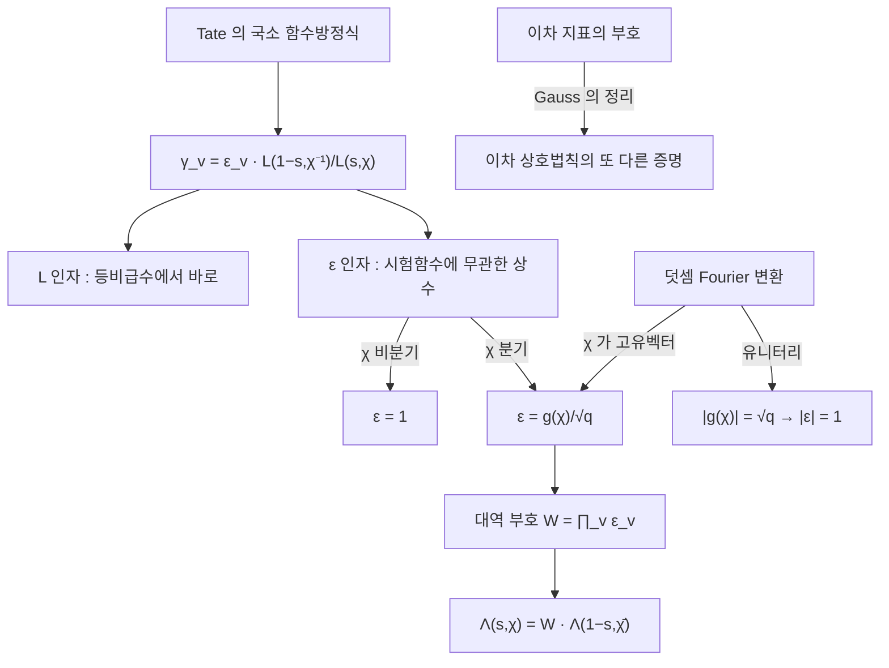

# Gauss 합

# 개요

[Tate 논문](tate-thesis.md)은 자리마다 국소 함수방정식을 준다. 두 국소 zeta 적분의 비가 시험함수에 의존하지 않는 인자 하나로 정리된다.

$$
Z_v(\hat f_v,\chi_v^{-1},1-s)=\gamma_v(\chi_v,s)\thinspace Z_v(f_v,\chi_v,s),
\qquad
\gamma_v=\varepsilon_v(\chi_v,s)\thinspace\frac{L(1-s,\chi_v^{-1})}{L(s,\chi_v)}
$$

$L$ 인자는 국소 계산에서 읽히는 유리함수다. 남은 $\varepsilon_v$ 가 **국소 근 수**이고, 비분기 자리에서 $1$ 이며 분기 자리에서 **Gauss 합**이 된다.

$$
\varepsilon\big(\chi,\psi,\tfrac12\big)=\frac{g(\chi)}{\sqrt q},
\qquad
g(\chi)=\sum_{n}\chi(n)\thinspace\psi(n)
$$

Gauss 합은 곱셈 지표와 덧셈 지표를 한 식에 섞어 유한체의 두 군 구조를 잇고, 절댓값이 언제나 $\sqrt q$ 다. 이 값이 근 수의 절댓값을 $1$ 로 만들고 [Dirichlet L 함수](dirichlet-l-functions.md)의 함수방정식에 나오는 부호를 단위원 위에 놓는다.

절댓값과 달리 부호는 어렵다. 이차 지표의 Gauss 합에서 어느 제곱근을 택하는지를 Gauss 가 정하는 데 4 년이 걸렸고, 그 답이 [이차 상호법칙](quadratic-reciprocity.md)의 또 다른 증명을 준다.

# 직관

## Fourier 변환의 고유벡터

$\mathbb Z/p$ 위의 함수 공간에서 덧셈 Fourier 변환의 기저는 덧셈 지표 $\psi(n)=e^{2\pi in/p}$ 이고, 곱셈군 $(\mathbb Z/p)^\times$ 에는 곱셈 지표 $\chi$ 가 있다.

$\chi$ 를 덧셈 Fourier 변환으로 보내면 상수배만 붙어 $\chi$ 가 되돌아온다.

$$
\sum_n\chi(n)\psi(mn)=\chi^{-1}(m)\thinspace g(\chi)
$$

$\chi$ 가 덧셈 Fourier 변환의 고유벡터이고 $g(\chi)$ 가 고유값이다. Fourier 변환이 유니터리이고 네 번 하면 항등이므로 고유값의 절댓값이 $\sqrt p$ 다.

$$
|g(\chi)|=\sqrt p\qquad(\chi\ne\text{자명})
$$

$\varepsilon$ 을 $\sqrt q$ 로 정규화하므로 근 수의 절댓값이 $1$ 이다. 함수방정식의 부호가 단위원 위에 있는 것이 Fourier 변환의 유니터리성에서 나온다.

## 분기 자리에서만 생기는 인자

국소 적분 $\int_{K_v^\times}f_v(x)\chi_v(x)|x|^s\thinspace d^\times x$ 에 $f_v=\mathbf 1_{\mathcal O_v}$ 를 넣고 $\chi_v$ 가 $\mathcal O_v^\times$ 에서 자명하면(비분기) 적분이 단순한 등비급수가 되고, Fourier 변환한 쪽도 마찬가지라 두 결과의 비에 상수가 남지 않는다. 근 수가 $1$ 이다.

$\chi_v$ 가 분기하면 $\mathcal O_v^\times$ 위에서 진동하므로 $\mathbf 1_{\mathcal O_v}$ 를 넣은 적분이 지표의 직교성으로 $0$ 이 된다. $\chi_v$ 가 살아남는 크기의 시험함수를 골라야 하고, 그 함수의 Fourier 변환이 유한 잉여환 위의 지표합, 곧 Gauss 합이다.

근 수는 분기가 만드는 위상이고, 분기하지 않으면 대칭이 깨질 곳이 없다.

## 부호의 결정

$|g(\chi)|=\sqrt p$ 는 $g(\chi)\overline{g(\chi)}$ 를 전개해 지표의 직교성을 쓰면 나온다. 이차 지표에서 $g(\chi)$ 는 실수이거나 순허수이므로 $\pm\sqrt p$ 또는 $\pm i\sqrt p$ 인데, 이 논법은 부호를 주지 않는다.

$$
\sum_{n=0}^{p-1}e^{2\pi in^2/p}=
\begin{cases}\sqrt p&p\equiv1\pmod4\cr i\sqrt p&p\equiv3\pmod4\end{cases}
$$

부호에는 theta 함수의 극한이나 유수 계산 같은 해석적 논증이 필요하다. 크기는 대수적으로, 부호는 해석적으로만 나오며 대역 근 수의 값을 명시적으로 아는 경우가 드물다.

# 정의

## Gauss 합

소수 $p$ 와 곱셈 지표 $\chi\colon(\mathbb Z/p)^\times\to\mathbb C^\times$ 에 대해

$$
g(\chi)=\sum_{n=1}^{p-1}\chi(n)\thinspace e^{2\pi in/p}
$$

를 **Gauss 합**이라 한다. $\chi$ 는 법 $m$ 의 지표일 수 있고, 덧셈 지표 $\psi$ 를 명시하면 $g(\chi,\psi)$ 로 쓴다.

**Jacobi 합**은 곱셈 지표 두 개의 합성곱이다.

$$
J(\chi_1,\chi_2)=\sum_{n}\chi_1(n)\chi_2(1-n),\qquad
J(\chi_1,\chi_2)=\frac{g(\chi_1)g(\chi_2)}{g(\chi_1\chi_2)}\ \ (\chi_1\chi_2\ne1)
$$

유한체 위 방정식의 해의 개수가 Jacobi 합으로 표현되고, Weil 추측의 최초 사례가 이 계산이다.

## 도체와 국소 근 수

국소체 $K_v$ 의 곱셈 지표 $\chi_v$ 에 대해, $\chi_v(U^{(n)})=1$ 이 되는 최소의 $n\ge0$ 을 **도체 지수** $a(\chi_v)$ 라 한다. $a=0$ 이면 비분기다. 덧셈 지표 $\psi_v$ 에도 비슷하게 준위 $n(\psi_v)$ 가 정의된다.

국소 근 수는 국소 함수방정식에서 $L$ 인자를 걷어낸 나머지로 정의된다.

$$
\varepsilon_v(\chi_v,\psi_v,s)=q_v^{(\frac12-s)(a(\chi_v)+n(\psi_v))}\thickspace\varepsilon_v\big(\chi_v,\psi_v,\tfrac12\big)
$$

$s$ 의존성이 지수 하나로 빠지므로 정보는 $s=1/2$ 에서의 값에 있다. 그 값은 비분기 자리에서 $1$ 이고 분기 자리에서 도체를 법으로 한 Gauss 합을 $\sqrt{q^{a}}$ 로 나눈 것이다.

## 대역 근 수

대역 함수방정식의 부호는 국소 근 수의 곱이다.

$$
\Lambda(s,\chi)=W(\chi)\thinspace\Lambda(1-s,\bar\chi),\qquad
W(\chi)=\prod_v\varepsilon_v\big(\chi_v,\psi_v,\tfrac12\big)
$$

거의 모든 자리에서 인자가 $1$ 이라 유한 곱이다. 법 $q$ 의 원시 Dirichlet 지표에서는 다음과 같다.

$$
W(\chi)=\frac{g(\chi)}{i^{\delta}\sqrt q},\qquad
\delta=\begin{cases}0&\chi(-1)=1\cr 1&\chi(-1)=-1\end{cases}
$$

$i^\delta$ 는 무한 자리의 근 수다. 지표가 홀이면 감마 인자가 $\Gamma(\frac{s+1}2)$ 로 바뀌면서 $i$ 가 붙는다.

# 성질

## 기본 항등식

> $\chi$ 가 법 $p$ 의 비자명한 지표일 때
> 1. $g(\chi)\thinspace g(\bar\chi)=\chi(-1)\thinspace p$
> 2. $|g(\chi)|=\sqrt p$
> 3. $m\not\equiv0$ 일 때 $\displaystyle\sum_n\chi(n)\psi(mn)=\bar\chi(m)\thinspace g(\chi)$ 다
> 4. $\chi$ 가 이차이면 $p\equiv1\bmod4$ 일 때 $g(\chi)=\sqrt p$ 이고 $p\equiv3\bmod4$ 일 때 $g(\chi)=i\sqrt p$ 다

첫째와 둘째는 같은 계산의 두 표현이다. 셋째는 $\chi$ 가 Fourier 변환의 고유벡터라는 진술이고 국소 근 수의 계산이 이 식을 쓴다.

넷째가 **Gauss 의 부호 정리**다[^1]. Gauss 는 1801 년에 부호를 예상하고 1805 년에 증명했으며, 여기서 이차 상호법칙의 네 번째 증명이 나왔다.

## 근 수의 성질

- **절댓값.** $\chi_v$ 가 유니터리이면 $|\varepsilon_v(\chi_v,\psi_v,\frac12)|=1$ 이다. 따라서 $|W(\chi)|=1$ 이고 함수방정식의 부호가 단위원 위에 있다.
- **비분기에서 자명.** $a(\chi_v)=0$ 이고 $\psi_v$ 의 준위가 $0$ 이면 $\varepsilon_v=1$ 이다. 유한 곱이 되는 이유다.
- **실수성.** $\chi$ 가 실수값(이차) 지표이면 $W(\chi)=1$ 이다. 이차 지표의 $L$ 함수는 부호가 $+1$ 이고, Gauss 의 부호 정리가 이를 준다.
- **곱셈성의 실패.** 일반적으로 $\varepsilon(\chi_1\chi_2)\ne\varepsilon(\chi_1)\varepsilon(\chi_2)$ 다. 그 차이를 재는 것이 Jacobi 합이고, Langlands–Deligne 의 국소 상수 이론이 이 실패를 통제한다.

## 중심값과 패리티

$W(\chi)=-1$ 이면 함수방정식이 $\Lambda(\frac12)=-\Lambda(\frac12)$ 를 강제해 중심값이 $0$ 이 된다. 타원곡선의 $L$ 함수에서 이 부호가 **패리티**이고, [Birch–Swinnerton-Dyer 추측](birch-swinnerton-dyer.md)을 통해 계수의 홀짝을 예측한다.

Deligne 은 국소 근 수가 [Galois 표현](galois-representations.md)의 자료만으로 정해지는 방식을 확립했다. 자기동형 쪽의 $\varepsilon$ 과 Galois 쪽의 $\varepsilon$ 이 일치해야 한다는 조건이 [Langlands 강령](langlands-program.md)에서 대응을 특정한다.

# 활용

- **$L$ 함수의 계산.** 함수방정식으로 임계띠 안의 값을 계산하려면 $W(\chi)$ 가 필요하므로, $L$ 함수를 다루는 코드가 근 수를 먼저 구한다.
- **패리티와 BSD(Birch–Swinnerton-Dyer).** 타원곡선 $L$ 함수의 근 수가 $-1$ 이면 중심값이 $0$ 이고, BSD 추측에 따라 계수가 홀수다. 근 수는 국소 자료에서 계산되므로 계수의 홀짝을 곡선의 환원 자료만으로 예측할 수 있다.
- **지수합 추정.** Gauss 합과 Jacobi 합의 절댓값 $\sqrt p$ 가 유한체 위 방정식의 점 개수 추정을 준다. Weil 추측의 곡선 사례가 이 계산의 일반화다.
- **상호법칙.** 이차 Gauss 합의 부호에서 이차 상호법칙이, 높은 차수의 Gauss 합에서 삼차와 사차 상호법칙이 나온다. [유체론](class-field-theory.md) 이전의 고전적 경로다.

[^1]: Gauss 합의 기본 성질과 부호 정리는 K. Ireland, M. Rosen, *A Classical Introduction to Modern Number Theory* (2판, 1990) 6장과 8장. 국소 근 수의 정의와 Tate 의 국소 함수방정식은 J. Tate, *Local Constants*, in *Algebraic Number Fields* (Durham 1975), 89–131. Galois 쪽 근 수와의 일치는 P. Deligne, *Les constantes des équations fonctionnelles des fonctions L*, Antwerp II (1973).

# 연관 문서

## 선수지식

- [Tate 의 논문](tate-thesis.md)
- [Dirichlet L 함수](dirichlet-l-functions.md)

## 더 알아보기

- [Dwork 의 유리성 정리와 지수합](dwork-rationality.md)
- [Stickelberger 원소와 Gauss 합](stickelberger.md)

#number_theory #complex_analysis #analysis
