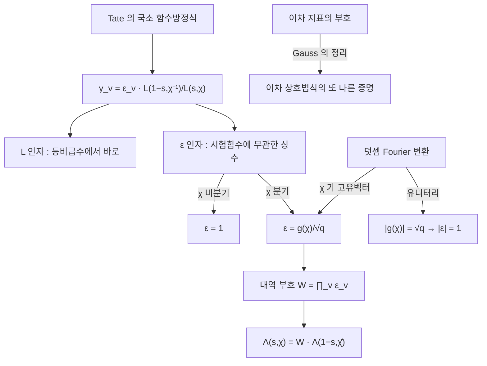

# Gauss 합과 국소 근 수

# 개요

[Tate 논문](tate-thesis.md)은 자리마다 국소 함수방정식을 준다. 두 국소 zeta 적분의 비가 시험함수에 의존하지 않는 인자 하나로 정리되는 것이었다.

$$
Z_v(\hat f_v,\chi_v^{-1},1-s)=\gamma_v(\chi_v,s)\,Z_v(f_v,\chi_v,s),
\qquad
\gamma_v=\varepsilon_v(\chi_v,s)\,\frac{L(1-s,\chi_v^{-1})}{L(s,\chi_v)}
$$

$L$ 인자는 국소 계산에서 바로 읽히는 유리함수다. 남은 $\varepsilon_v$ 가 **국소 근 수**이고, 이것만이 자명하지 않다. 비분기 자리에서는 $1$ 이라 아무 일도 하지 않고, 분기 자리에서만 값이 생긴다. 그리고 그 값이 정확히 **Gauss 합**이다.

$$
\varepsilon\big(\chi,\psi,\tfrac12\big)=\frac{g(\chi)}{\sqrt q},
\qquad
g(\chi)=\sum_{n}\chi(n)\,\psi(n)
$$

Gauss 합은 곱셈 지표와 덧셈 지표를 한 식에 섞는다. 유한체에서 두 군 구조를 잇는 유일한 다리이고, 절댓값이 언제나 $\sqrt q$ 다. 이 사실이 근 수의 절댓값을 $1$ 로 만들고, [Dirichlet L 함수](dirichlet-l-functions.md)의 함수방정식에 나오는 부호가 크기 $1$ 인 복소수임을 보장한다.

절댓값은 쉽고 **부호는 어렵다**. 이차 지표의 Gauss 합에서 어느 제곱근을 택해야 하는지를 Gauss 가 정하는 데 4 년이 걸렸다. 그 답이 이차 상호법칙의 또 다른 증명을 준다.

# 직관

## Fourier 변환이 지표를 지표로 보낸다

$\mathbb Z/p$ 위의 함수 공간에서 덧셈 Fourier 변환의 기저는 덧셈 지표 $\psi(n)=e^{2\pi in/p}$ 다. 한편 곱셈군 $(\mathbb Z/p)^\times$ 에는 곱셈 지표 $\chi$ 가 있다. 서로 다른 두 군 구조에 딸린 두 기저다.

$\chi$ 를 덧셈 Fourier 변환으로 보내면 어떻게 되는가. 계산하면 $\chi$ 자신이 되돌아온다. 상수배만 붙는다.

$$
\sum_n\chi(n)\psi(mn)=\chi^{-1}(m)\,g(\chi)
$$

$\chi$ 가 덧셈 Fourier 변환의 **고유벡터**이고 $g(\chi)$ 가 그 고유값인 셈이다. 그런데 Fourier 변환은 유니터리이고 네 번 하면 항등이므로 고유값의 절댓값이 $\sqrt p$ 로 고정된다.

$$
|g(\chi)|=\sqrt p\qquad(\chi\ne\text{자명})
$$

근 수의 절댓값이 $1$ 인 이유가 여기서 끝난다. $\varepsilon$ 을 $\sqrt q$ 로 정규화했기 때문이다. 함수방정식의 부호가 단위원 위에 있다는 사실이 Fourier 변환의 유니터리성이라는 한 줄로 설명된다.

## 왜 분기 자리에서만 생기는가

국소 적분 $\int_{K_v^\times}f_v(x)\chi_v(x)|x|^s\,d^\times x$ 에 $f_v=\mathbf 1_{\mathcal O_v}$ 를 넣고 $\chi_v$ 가 $\mathcal O_v^\times$ 에서 자명하면(비분기) 적분이 단순한 등비급수가 되고, Fourier 변환한 쪽도 마찬가지라 두 결과의 비에 상수가 남지 않는다. 근 수가 $1$ 이다.

$\chi_v$ 가 분기하면 $\mathcal O_v^\times$ 위에서 $\chi_v$ 가 진동한다. 그러면 $\mathbf 1_{\mathcal O_v}$ 를 넣은 적분은 지표의 직교성으로 $0$ 이 되어 버리고, 대신 $\chi_v$ 가 정확히 살아남는 크기의 시험함수를 골라야 한다. 그 함수의 Fourier 변환을 계산하는 일이 곧 유한 잉여환 위의 지표합, 곧 Gauss 합이다.

곧 근 수는 **분기가 만드는 위상**이다. 분기하지 않으면 대칭이 깨질 곳이 없다.



## 부호가 왜 어려운가

$|g(\chi)|=\sqrt p$ 의 증명은 반 쪽이면 된다. $g(\chi)\overline{g(\chi)}$ 를 전개해 지표의 직교성을 쓰면 끝난다. 그런데 이차 지표에서는 $g(\chi)$ 가 실수이거나 순허수이므로 $\pm\sqrt p$ 또는 $\pm i\sqrt p$ 중 하나인데, **어느 부호인지**는 이 논법이 말해 주지 않는다.

$$
\sum_{n=0}^{p-1}e^{2\pi in^2/p}=
\begin{cases}\sqrt p&p\equiv1\pmod4\\ i\sqrt p&p\equiv3\pmod4\end{cases}
$$

부호를 결정하려면 크기가 아니라 실제 값을 봐야 하고, 그러려면 해석적 논증(theta 함수의 극한, 또는 유수 계산)이 필요하다. 크기는 대수적으로 나오고 부호는 해석적으로만 나온다는 이 비대칭이 근 수 이론 전반의 성격이다. 대역 근 수의 값을 명시적으로 아는 경우가 드문 것도 같은 이유다.

# 정의

## Gauss 합

소수 $p$ 와 곱셈 지표 $\chi\colon(\mathbb Z/p)^\times\to\mathbb C^\times$ 에 대해

$$
g(\chi)=\sum_{n=1}^{p-1}\chi(n)\,e^{2\pi in/p}
$$

를 **Gauss 합**이라 한다. 일반적으로 $\chi$ 는 법 $m$ 의 지표일 수 있고, 덧셈 지표 $\psi$ 를 명시해 $g(\chi,\psi)$ 로 쓴다.

**Jacobi 합**은 곱셈 지표 두 개의 합성곱이다.

$$
J(\chi_1,\chi_2)=\sum_{n}\chi_1(n)\chi_2(1-n),\qquad
J(\chi_1,\chi_2)=\frac{g(\chi_1)g(\chi_2)}{g(\chi_1\chi_2)}\ \ (\chi_1\chi_2\ne1)
$$

유한체 위의 방정식의 해의 개수가 Jacobi 합으로 표현되며, Weil 추측의 최초 사례가 이 계산이었다.

## 도체와 국소 근 수

국소체 $K_v$ 의 곱셈 지표 $\chi_v$ 에 대해, $\chi_v(U^{(n)})=1$ 이 되는 최소의 $n\ge0$ 을 **도체 지수** $a(\chi_v)$ 라 한다. $a=0$ 이면 비분기다. 덧셈 지표 $\psi_v$ 에도 비슷하게 준위 $n(\psi_v)$ 가 정의된다.

국소 근 수는 국소 함수방정식에서 $L$ 인자를 걷어낸 나머지로 정의된다.

$$
\varepsilon_v(\chi_v,\psi_v,s)=q_v^{(\frac12-s)(a(\chi_v)+n(\psi_v))}\;\varepsilon_v\big(\chi_v,\psi_v,\tfrac12\big)
$$

$s$ 의존성이 지수 하나로 전부 빠지므로, 본질적인 정보는 $s=1/2$ 에서의 값 하나다. 그 값이 비분기 자리에서는 $1$ 이고, 분기 자리에서는 도체를 법으로 한 Gauss 합을 $\sqrt{q^{a}}$ 로 나눈 것이다.

## 대역 근 수

대역 함수방정식의 부호는 국소 근 수의 곱이다.

$$
\Lambda(s,\chi)=W(\chi)\,\Lambda(1-s,\bar\chi),\qquad
W(\chi)=\prod_v\varepsilon_v\big(\chi_v,\psi_v,\tfrac12\big)
$$

거의 모든 자리에서 인자가 $1$ 이라 유한 곱이다. 법 $q$ 의 원시 Dirichlet 지표에서는 명시적으로 쓸 수 있다.

$$
W(\chi)=\frac{g(\chi)}{i^{\delta}\sqrt q},\qquad
\delta=\begin{cases}0&\chi(-1)=1\\1&\chi(-1)=-1\end{cases}
$$

$i^\delta$ 는 무한 자리의 근 수다. 지표가 홀이면 감마 인자가 $\Gamma(\frac{s+1}2)$ 로 바뀌고 그 대가로 $i$ 가 붙는다.

# 성질

## 기본 항등식

> $\chi$ 가 법 $p$ 의 비자명한 지표일 때
> 1. $g(\chi)\,g(\bar\chi)=\chi(-1)\,p$
> 2. $|g(\chi)|=\sqrt p$
> 3. $\displaystyle\sum_n\chi(n)\psi(mn)=\bar\chi(m)\,g(\chi)$ ($m\not\equiv0$)
> 4. $\chi$ 가 이차이면 $g(\chi)=\sqrt p$ ($p\equiv1\bmod4$), $i\sqrt p$ ($p\equiv3\bmod4$)

첫째와 둘째는 같은 계산의 두 표현이다. 셋째는 $\chi$ 가 Fourier 변환의 고유벡터라는 진술이고, 실제로 국소 근 수의 계산이 이 식 하나로 정리된다.

넷째가 **Gauss 의 부호 정리**다[^1]. 1801년에 부호를 예상했고 1805년에 증명했다. 이 정리로부터 이차 상호법칙이 따라 나오며, Gauss 자신의 네 번째 증명이 그것이다.

## 근 수의 성질

- **절댓값.** $\chi_v$ 가 유니터리이면 $|\varepsilon_v(\chi_v,\psi_v,\frac12)|=1$ 이다. 따라서 $|W(\chi)|=1$ 이고 함수방정식의 부호가 단위원 위에 있다.
- **비분기에서 자명.** $a(\chi_v)=0$ 이고 $\psi_v$ 의 준위가 $0$ 이면 $\varepsilon_v=1$ 이다. 유한 곱이 되는 이유다.
- **실수성.** $\chi$ 가 실수값(이차) 지표이면 $W(\chi)=1$ 이다. 이차 지표의 $L$ 함수는 언제나 부호가 $+1$ 이라는 뜻이고, Gauss 의 부호 정리가 이 사실을 담고 있다.
- **곱셈성의 실패.** $\varepsilon(\chi_1\chi_2)\ne\varepsilon(\chi_1)\varepsilon(\chi_2)$ 가 일반적이다. 그 차이를 재는 것이 Jacobi 합이며, Langlands–Deligne 의 국소 상수 이론이 이 실패를 정확히 통제한다.

## 무엇에 쓰이는가

근 수는 장식이 아니다. $W(\chi)=-1$ 이면 함수방정식이 $\Lambda(\frac12)=-\Lambda(\frac12)$ 를 강제해 중심값이 $0$ 이 된다. 타원곡선의 $L$ 함수에서 이 부호가 **패리티**이고, Birch–Swinnerton-Dyer 추측을 통해 계수의 홀짝을 예측한다. 계산으로 확인할 수 있는 부호 하나가 무한군의 계수에 대한 정보를 준다.

Deligne 은 국소 근 수가 Galois 표현의 자료만으로 정해지는 방식을 확립했다. 자기동형 쪽의 $\varepsilon$ 과 Galois 쪽의 $\varepsilon$ 이 일치해야 한다는 요구가 [Langlands 강령](langlands-program.md)에서 대응을 특정하는 조건 가운데 하나가 된다.

# 활용

## 절댓값과 부호를 직접 계산한다

원시근으로 지표를 모두 만들고 Gauss 합을 정의대로 더한다. 확인할 것은 세 가지다. 모든 비자명 지표에서 $|g(\chi)|=\sqrt p$ 인지, $g(\chi)g(\bar\chi)=\chi(-1)p$ 인지, 그리고 이차 Gauss 합의 부호가 Gauss 의 정리와 맞는지다. 마지막으로 근 수 $W(\chi)$ 를 계산해 절댓값이 $1$ 임을 본다.

```python
import cmath, math

def chars_mod_p(p):
    """(Z/p)^× 의 지표 전체. 원시근 g 를 잡아 χ_k(g^j) = e^{2πi kj/(p-1)}."""
    for g in range(2, p):
        seen, x = [], 1
        for _ in range(p - 1):
            x = x * g % p; seen.append(x)
        if len(set(seen)) == p - 1: break
    log = {}
    x = 1
    for j in range(p - 1):
        log[x] = j; x = x * g % p
    return [lambda n, k=k, p=p, log=log, m=p - 1:
            0 if n % p == 0 else cmath.exp(2j * math.pi * k * log[n % p] / m)
            for k in range(p - 1)]

def gauss(chi, p):
    return sum(chi(n) * cmath.exp(2j * math.pi * n / p) for n in range(1, p))

print(f"{'p':>4} {'|g(χ)| = √p (비자명 χ 전부)':>28} {'g(χ)g(χ̄) = χ(−1)p':>22}")
for p in (5, 7, 11, 13, 17, 19, 23):
    chis = chars_mod_p(p)
    absok = all(abs(abs(gauss(c, p)) - math.sqrt(p)) < 1e-9 for c in chis[1:])
    prodok = all(abs(gauss(c, p) * gauss(lambda n, c=c: c(n).conjugate(), p)
                     - c(p - 1) * p) < 1e-8 for c in chis[1:])
    print(f"{p:>4} {str(absok):>28} {str(prodok):>22}")

# Gauss 의 부호 정리 : Σ_n e^{2πi n²/p} = √p (p≡1 mod 4),  i√p (p≡3 mod 4)
print(f"\n{'p':>4} {'Σ e^{2πin²/p}':>26} {'예측':>14} {'p mod 4':>8}")
ok = True
for p in (5, 7, 11, 13, 17, 19, 23, 29, 31):
    s = sum(cmath.exp(2j * math.pi * n * n / p) for n in range(p))
    pred = math.sqrt(p) if p % 4 == 1 else 1j * math.sqrt(p)
    ok &= abs(s - pred) < 1e-9
    print(f"{p:>4} {s.real:>12.6f}{s.imag:>+12.6f}i {abs(pred):>12.6f}{'' if p%4==1 else 'i':<2} {p % 4:>8}")
print("Gauss 의 부호 정리가 모든 p 에서 성립 :", ok)

# 근 수 W(χ) = g(χ)/(i^δ √p),  δ = 0 (짝) 또는 1 (홀).  |W| = 1 이어야 한다
print()
for k, c in enumerate(chars_mod_p(7)):
    if k == 0: continue
    d = 0 if abs(c(6) - 1) < 1e-9 else 1
    W = gauss(c, 7) / ((1j) ** d * math.sqrt(7))
    print(f"  p=7 χ_{k}  δ={d}  W = {W.real:+.6f}{W.imag:+.6f}i   |W| = {abs(W):.10f}")

#    p       |g(χ)| = √p (비자명 χ 전부)     g(χ)g(χ̄) = χ(−1)p
#    5                         True                   True
#    7                         True                   True
#   11                         True                   True
#   13                         True                   True
#   17                         True                   True
#   19                         True                   True
#   23                         True                   True
#
#    p              Σ e^{2πin²/p}             예측  p mod 4
#    5     2.236068   -0.000000i     2.236068          1
#    7     0.000000   +2.645751i     2.645751i         3
#   11     0.000000   +3.316625i     3.316625i         3
#   13     3.605551   -0.000000i     3.605551          1
#   17     4.123106   +0.000000i     4.123106          1
#   19     0.000000   +4.358899i     4.358899i         3
#   23    -0.000000   +4.795832i     4.795832i         3
#   29     5.385165   -0.000000i     5.385165          1
#   31     0.000000   +5.567764i     5.567764i         3
# Gauss 의 부호 정리가 모든 p 에서 성립 : True
#
#   p=7 χ_1  δ=1  W = +0.386514+0.922284i   |W| = 1.0000000000
#   p=7 χ_2  δ=0  W = +0.895953-0.444148i   |W| = 1.0000000000
#   p=7 χ_3  δ=1  W = +1.000000-0.000000i   |W| = 1.0000000000
#   p=7 χ_4  δ=0  W = +0.895953+0.444148i   |W| = 1.0000000000
#   p=7 χ_5  δ=1  W = +0.386514-0.922284i   |W| = 1.0000000000
```

부호 표에서 $p\equiv1\pmod4$ 이면 합이 실수 $\sqrt p$, $p\equiv3$ 이면 순허수 $i\sqrt p$ 로 정확히 갈린다. 절댓값은 어느 쪽이든 $\sqrt p$ 인데 방향이 $p$ 의 법 4 잉여로 결정된다.

마지막 묶음에서 $\chi_3$ 가 법 7 의 이차 지표다. $7\equiv3\pmod4$ 이므로 $\chi_3(-1)=-1$ 이라 $\delta=1$ 이고, $g(\chi_3)=i\sqrt7$ 을 $i\sqrt7$ 로 나누어 $W=1$ 이 나온다. 이차 지표의 근 수가 언제나 $+1$ 이라는 성질이 확인된다. 다른 지표들은 $W$ 가 단위원 위의 일반적인 점이고, 켤레 지표끼리 $W$ 도 켤레다.

## 어디에 쓰이는가

- **$L$ 함수의 계산.** $W(\chi)$ 를 알아야 함수방정식을 써서 임계띠 안의 값을 계산할 수 있다. 수치적으로 $L$ 함수를 다루는 모든 코드가 근 수를 먼저 구한다.
- **패리티와 BSD.** 타원곡선 $L$ 함수의 근 수가 $-1$ 이면 중심값이 $0$ 이고, BSD 추측에 따라 계수가 홀수다. 근 수는 국소 자료에서 계산되므로 계수의 홀짝을 곡선의 환원 자료만으로 예측할 수 있다.
- **지수합 추정.** Gauss 합과 Jacobi 합의 절댓값 $\sqrt p$ 가 유한체 위 방정식의 점 개수 추정을 준다. Weil 추측의 곡선 사례가 이 계산의 일반화다.
- **상호법칙.** 이차 Gauss 합의 부호에서 이차 상호법칙이, 더 높은 차수의 Gauss 합에서 삼차·사차 상호법칙이 나온다. 유체론이 나오기 전의 고전적 길이다.

[^1]: Gauss 합의 기본 성질과 부호 정리는 K. Ireland, M. Rosen, *A Classical Introduction to Modern Number Theory* (2판, 1990) 6장과 8장. 국소 근 수의 정의와 Tate 의 국소 함수방정식은 J. Tate, *Local Constants*, in *Algebraic Number Fields* (Durham 1975), 89–131. Galois 쪽 근 수와의 일치는 P. Deligne, *Les constantes des équations fonctionnelles des fonctions L*, Antwerp II (1973). 본문의 수치 계산은 직접 한 것이다.

# 연관 문서

## 선수지식

- [논문: Fourier Analysis in Number Fields and Hecke's Zeta-Functions](tate-thesis.md)
- [Dirichlet 지표와 L 함수](dirichlet-l-functions.md)

## 더 알아보기

- [Dwork 의 유리성 정리와 지수합](dwork-rationality.md)
- [Stickelberger 원소와 Gauss 합](stickelberger.md)

#number_theory #complex_analysis #analysis
