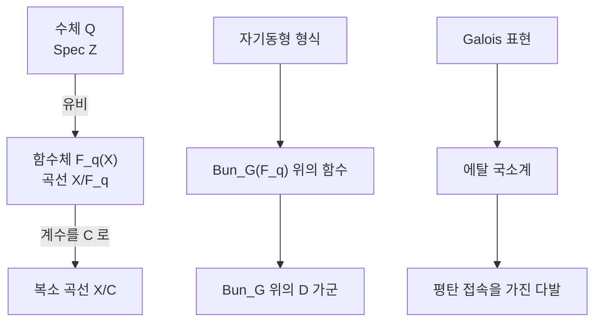

# 기하학적 Langlands 강령

# 개요

[기하학적 Satake 대응](geometric-satake.md)은 Hecke 대수의 등식을 층의 [범주](category.md) 사이 동치로 올린다. 기하학적 Langlands 강령은 같은 승격을 Langlands 대응 전체에 적용한다.

출발점은 세 열의 유비다. 수체와 함수체가 나란하고, 함수체 $\mathbb F_q(X)$ 가 곡선 $X/\mathbb F_q$ 의 함수체이므로 곡선 자체를 다룰 수 있다. 계수체를 $\mathbb C$ 로 바꾸면 산술이 사라지고 기하만 남는다.

$$
\text{자기동형 형식}\ \rightsquigarrow\ \mathrm{Bun}\_G\ \text{위의 함수}\ \rightsquigarrow\ \mathrm{Bun}\_G\ \text{위의 층}
$$

Grothendieck 의 사전에서 층은 Frobenius 대각합을 통해 함수를 낳고, 함수보다 많은 정보를 담는다. 대응의 진술이 수의 등식이 아니라 범주의 동치가 된다.

$$
\mathrm{D}(\mathrm{Bun}\_G)\thickspace\simeq\thickspace\mathrm{QCoh}\big(\mathrm{LocSys}\_{\hat G}\big)\quad(\text{대략})
$$

왼쪽은 $G$ 다발의 모듈라이 위의 $D$ [가군](modules.md), 오른쪽은 쌍대군 $\hat G$ 의 국소계가 이루는 스택 위의 준연접층이다. 2024년에 Gaitsgory, Raskin 과 공저자들이 이 진술(비분기, 표수 0)의 증명을 아홉 편의 논문으로 발표했다[^1].

# 직관

## 세 개의 열

왼쪽 열에서는 $\mathrm{Spec}\thinspace\mathbb Z$ 가 곡선처럼 보이는 유비만 있고 기하적 도구를 쓸 수 없다. 가운데 열에는 실제 곡선이 있어 에탈 코호몰로지를 쓴다. 오른쪽 열은 $\mathbb F_q$ 를 $\mathbb C$ 로 바꿔 산술을 버리고 미분기하와 복소해석을 얻는다.

기하학적 Langlands 는 오른쪽 열의 진술이다. 산술적 결론을 직접 주지 않고 대응의 구조를 드러낸다.

## 함수의 층으로의 승격

유한체 위에서 [층](sheaves.md) $\mathcal F$ 와 함수 $f_{\mathcal F}$ 를 잇는 사전이 있다.

$$
f_{\mathcal F}(x)=\mathrm{tr}\big(\mathrm{Frob}\_x\mid\mathcal F_{\bar x}\big)
$$

이 대응은 층의 여섯 연산을 함수의 연산(당김, 밂, 곱)으로 옮긴다. 서로 다른 층이 같은 함수를 줄 수 있으므로 층 쪽이 더 섬세하고, 함수 사이의 등식을 층 사이의 동형으로 올리면 진술이 강해진다.

자기동형 형식은 $G(F)\backslash G(\mathbb A)/K$ 위의 함수인데, 함수체의 경우 이 이중잉여가 기하적 대상으로 해석된다.

$$
G(F)\backslash G(\mathbb A_F)/G(\mathcal O)\thickspace\cong\thickspace\mathrm{Bun}\_G(\mathbb F_q)
$$

오른쪽은 곡선 $X$ 위 $G$ 다발의 동형류다. Weil 의 이 관찰에 따라 자기동형 형식이 모듈라이 공간 위의 함수이고, 층으로 올릴 자리가 $\mathrm{Bun}\_G$ 다.

## Hecke 작용소와 다발의 수정

고전적 [Hecke 작용소](hecke-operators.md)는 한 자리 $x$ 에서 준위 구조를 바꾸는 평균이고, 기하적으로는 $G$ 다발을 점 $x$ 에서만 수정한다.

$$
\mathrm{Hecke}=\lbrace(\mathcal P,\mathcal P',x,\ \varphi\colon\mathcal P|\_{X\setminus x}\xrightarrow{\sim}\mathcal P'|\_{X\setminus x})\rbrace
$$

이 대응 스택이 $\mathrm{Bun}\_G\times\mathrm{Bun}\_G\times X$ 로 사상하고, 두 사영을 따라 당기고 미는 것이 Hecke 작용이다. 수정의 종류는 아핀 Grassmannian 의 궤도가 분류하고 기하적 Satake 가 그 궤도를 $\hat G$ 의 기약표현 $V$ 로 이름 붙이므로, Hecke [함자](functors.md)가 $\hat G$ 의 표현으로 매개된다.

$$
H^V_x\colon\ \mathrm{D}(\mathrm{Bun}\_G)\longrightarrow\mathrm{D}(\mathrm{Bun}\_G)
$$

## Hecke 고유층

고전 쪽에서 자기동형 형식은 Hecke 고유함수이고 고윳값의 모임이 [Galois 표현](galois-representations.md)을 결정한다. 기하 쪽의 대응물이 **Hecke 고유층**이다. $\hat G$ 국소계 $\sigma$ 에 대해

$$
H^V_x(\mathcal F)\thickspace\cong\thickspace\mathcal F\boxtimes V_\sigma\qquad(\text{모든 }V,\ x\ \text{에 대해 정합적으로})
$$

를 만족하는 $\mathcal F$ 가 $\sigma$ 의 고유층이다. $V_\sigma$ 는 국소계 $\sigma$ 에 표현 $V$ 를 적용해 얻는 $X$ 위의 국소계다. 기하판에서는 고윳값이 수가 아니라 국소계이고, 대응이 $\sigma$ 마다 고유층 하나라는 형태를 띤다.

## 범주 동치로서의 진술

국소계마다 고유층이 하나씩이라는 진술은 부정확하다. $\mathrm{LocSys}\_{\hat G}$ 가 스택이라 자기동형과 특이점을 갖고, 기약이 아닌 국소계에서는 고유층이 유일하지 않다. 정확한 진술은 범주 전체의 동치다.

$$
\mathbb L_G\colon\quad\mathrm{D}\text{-}\mathrm{mod}(\mathrm{Bun}\_G)\thickspace\xrightarrow{\ \sim\ }\thickspace\mathrm{IndCoh}\_{\mathcal N}\big(\mathrm{LocSys}\_{\hat G}\big)
$$

Arinkin–Gaitsgory 의 형태이고, 오른쪽의 받침 조건 $\mathcal N$ (멱영 특이 받침)이 유일성 문제를 고친다. 이 동치가 Hecke 작용과 호환되며 왼쪽의 건너뜀 층(skyscraper)이 오른쪽의 고유층에 대응한다.

# 정의

## 대상

$X$ 를 $\mathbb C$ 위의 매끄러운 사영 곡선, $G$ 를 환원군, $\hat G$ 를 Langlands 쌍대군이라 하자.

| 자기동형 쪽 | Galois 쪽 |
|---|---|
| $\mathrm{Bun}\_G$ 은 $X$ 위 $G$ 다발의 모듈라이 스택 | $\mathrm{LocSys}\_{\hat G}$ 는 $X$ 위 $\hat G$ 국소계의 스택 |
| $\mathrm{D}\text{-}\mathrm{mod}(\mathrm{Bun}\_G)$ | $\mathrm{IndCoh}\_{\mathcal N}(\mathrm{LocSys}\_{\hat G})$ |
| Hecke 함자 $H^V_x$ | $V$ 를 통한 텐서 $\otimes V_\sigma$ |

$\mathrm{LocSys}\_{\hat G}$ 는 $\pi_1(X)\to\hat G$ 의 표현 다양체를 공액으로 나눈 것과 같고, 곡선의 종수 $g\ge2$ 이면 차원이 $(2g-2)\dim\hat G$ 다.

## Hecke 스택과 함자

$\mathrm{Hecke}$ 스택에서 두 사영 $p,q$ 와 $X$ 로의 사상 $\pi$ 를 두면

$$
H^V_x(\mathcal F)=q_\ast\big(p^\ast\mathcal F\otimes\mathcal S^V\big)
$$

로 정의한다. $\mathcal S^V$ 는 기하적 Satake 가 표현 $V$ 에 대응시킨 편향층이다. 기하적 Satake 의 텐서 구조가 $H^{V_1}\circ H^{V_2}\cong H^{V_1\otimes V_2}$ 를 보장한다.

## 고유층 조건

$\sigma\in\mathrm{LocSys}\_{\hat G}$ 에 대해 $\mathcal F$ 가 $\sigma$ 고유층이라 함은 모든 $V$ 에 대해

$$
H^V(\mathcal F)\cong\mathcal F\boxtimes V_\sigma\ \ \text{on}\ \ \mathrm{Bun}\_G\times X
$$

이고 이 동형이 $V$ 에 대해 함자적이며 합성과 호환된다는 뜻이다.

# 성질

## 아벨 경우

$G=\mathrm{GL}\_1$ 이면 $\mathrm{Bun}\_{\mathrm{GL}\_1}=\mathrm{Pic}(X)$ 이고 $\hat G=\mathrm{GL}\_1$ 이므로 국소계는 계수 1 의 국소계, 곧 지표다. 대응은 $X$ 위의 계수 1 국소계 $\sigma$ 마다 $\mathrm{Pic}(X)$ 위의 곱셈적 국소계가 하나 있다는 진술이 되고, 이것이 Deligne 이 증명한 **기하적 유체론**이다. 고전 유체론의 상호사상은 여기서 Abel–Jacobi 사상 $X\to\mathrm{Pic}(X)$ 를 따라 국소계를 밀어내는 조작이다.

## 비아벨 경우의 역사

| 시기 | 결과 |
|---|---|
| 1980년대 | Drinfeld 의 $\mathrm{GL}\_2$ 와 고유층의 구성 |
| 1990–2000년대 | Laumon, Frenkel–Gaitsgory–Vilonen: $\mathrm{GL}\_n$ 의 고유층 존재 |
| 2002 | Beilinson–Drinfeld: $\hat G$ 의 여정칙 국소계에 대한 구성(공형장론 경유) |
| 2015 | Arinkin–Gaitsgory: 받침 조건을 포함한 올바른 범주적 진술 |
| 2024 | Gaitsgory–Raskin 등: 비분기 범주적 대응의 증명 |

2024 년 증명은 $\mathrm{Bun}\_G$ 를 Whittaker 정규화된 조각으로 분해하고, 각 조각에서 대응을 세운 뒤 열 정리(trace)로 붙인다. Poincaré 층의 구성과 국소 기하 Langlands 가 재료다.

## 산술로의 환원

기하 쪽 정리는 수체 Langlands 를 직접 주지 않는다. $\mathbb F_q$ 계수로 옮기면 함수체 Langlands 에 대한 정보가 나오고, V. Lafforgue 의 함수체 Langlands(모든 환원군, 자기동형에서 Galois 방향)가 기하적 기법의 산술판이다. 그의 방법은 층 이론 대신 잉여 작용소를 써서 대각합 공식 없이 Galois 매개변수를 만든다.

국소 Langlands 도 두 쪽을 잇는다. Fargues–Scholze 가 $p$ 진 체 위의 국소 Langlands 를 Fargues–Fontaine 곡선 위의 기하적 Langlands 로 재구성했고, 기하 쪽 언어가 산술 쪽 정리의 증명 도구가 되었다.

## 물리와의 관계

Kapustin–Witten 은 4 차원 $\mathcal N=4$ 초대칭 게이지 이론을 곡면 $X\times\Sigma$ 에서 축소하면 기하적 Langlands 가 나온다고 논증했다. $S$ 이중성이 $G\leftrightarrow\hat G$ 교환에, Hecke 작용소가 't Hooft 작용소에, 고유층이 브레인에 대응한다. 수학적 증명은 아니지만 쌍대군이 나타나는 까닭을 설명하고 양자 기하적 Langlands 같은 변형으로 이어졌다.

# 활용

## 대응의 사전

| 고전 Langlands | 기하 Langlands |
|---|---|
| 자기동형 형식 | $\mathrm{Bun}\_G$ 위의 $D$ 가군 |
| Hecke 고유함수 | Hecke 고유층 |
| Hecke 고윳값 (수) | $X$ 위의 국소계 |
| Galois 표현 $\rho$ | $\hat G$ 국소계 $\sigma$ |
| $L$ 함수 | (직접적 대응물 없음) |
| 대각합 공식 | 범주 분해, 열 정리 |

$L$ 함수는 Frobenius 고윳값으로 만든 산술적 양이라 계수를 $\mathbb C$ 로 바꾸면 사라지고, 오른쪽 열에 대응물이 없다.

## 표현론으로의 환류

아핀 Grassmannian 과 아핀 flag 다양체의 층 이론, 인수분해 대수(factorization algebra), 파생 대수기하의 스택 이론이 이 강령의 필요에서 나왔다. 기하적 Satake 도 그중 하나이고, 지금은 모듈러 표현론과 $p$ 진 군의 표현론에 독립적으로 쓰인다.

[^1]: 개설로는 E. Frenkel, *Lectures on the Langlands program and conformal field theory* (2005) 과 D. Gaitsgory, *Progrès récents dans la théorie de Langlands géométrique*, Séminaire Bourbaki (2015). 범주적 진술은 D. Arinkin, D. Gaitsgory, *Singular support of coherent sheaves and the geometric Langlands conjecture*, Selecta Math. (2015). 2024년 증명은 D. Gaitsgory, S. Raskin 외, *Proof of the geometric Langlands conjecture* I–V (2024). 물리 쪽은 A. Kapustin, E. Witten, *Electric-magnetic duality and the geometric Langlands program*, Commun. Number Theory Phys. **1** (2007).

# 연관 문서

## 선수지식

- [기하학적 Satake 대응](geometric-satake.md)

## 더 알아보기

- [Fargues–Scholze 기하화와 국소 Langlands](fargues-scholze.md)

#number_theory #category_theory #algebraic_topology #group_theory
