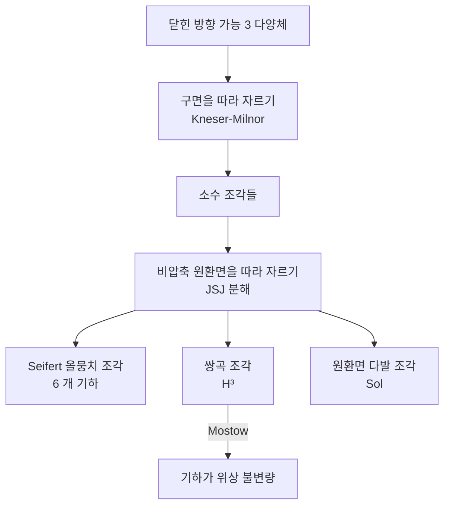

# 기하화 정리와 8 개 모형 기하

# 개요

[곡면의 분류](classification-of-surfaces.md)에는 기하 판본이 있다. 닫힌 곡면은 모두 구면기하, 유클리드기하, 쌍곡기하 가운데 정확히 하나를 갖고, 어느 것인지는 Euler 지표의 부호가 정한다. 종수 2 이상이면 전부 쌍곡이다. 위상적 분류와 기하적 분류가 같은 목록을 준다.

3 차원에서도 같은 일을 하려 하면 두 가지가 곧바로 달라진다.

- **기하가 세 개가 아니라 여덟 개다.** 등방적이지 않은 기하, 곧 방향마다 다르게 보이는 기하가 다섯 개 더 있다.
- **자르지 않으면 안 된다.** 다양체 하나에 기하 하나를 통째로 줄 수 없는 경우가 있다. 먼저 표준적인 방식으로 조각내야 한다.

> **기하화 정리 (Thurston 추측, Perelman 증명).** 닫힌 방향 가능 3 다양체는 연결합 분해와 원환면 분해를 거쳐 조각으로 잘리고, 각 조각은 8 개 모형 기하 가운데 하나를 갖는다.

자르는 방법이 표준적이고, 조각의 기하가 유일하며, 목록이 유한하다. 3 차원 위상수학의 분류 문제가 이 한 문장으로 정리된다. Poincaré 추측은 이 정리의 특수한 경우, 곧 "단순연결이면 조각이 하나이고 그 기하가 구면기하"라는 진술이다.

여덟 기하 중 일곱은 완전히 분류되어 있다. 실질적인 내용은 여덟 번째, [쌍곡 3 다양체](hyperbolic-3-manifolds.md)에 몰려 있고, 거기서는 Mostow 강직성 덕분에 기하가 곧 위상이 된다.

# 직관

## 왜 잘라야 하는가

두 다양체의 연결합 $M_1\char35{} M_2$ 를 생각하자. 양쪽 모두 쌍곡이라 해도 합에는 쌍곡 계량이 들어가지 않는다. 연결합에는 $M_1$ 과 $M_2$ 를 가르는 2 구면이 있고, 그 구면은 어느 쪽으로도 오그라들지 않는다. 그런데 완비 쌍곡 다양체의 보편덮개는 $\mathbb H^3$ 이라 $\pi_2=0$ 이다. 오그라들지 않는 구면이 있을 수 없다.

같은 일이 원환면에서도 벌어진다. 오그라들지 않는 원환면이 박혀 있으면 $\pi_1$ 안에 $\mathbb Z^2$ 가 들어가는데, 쌍곡 다양체의 기본군에는 그런 부분군이 (cusp 를 빼면) 없다.

그래서 순서가 정해진다.

1. **연결합 분해.** 구면을 따라 잘라 소수 조각으로 나눈다 (Kneser–Milnor, 분해가 유일).
2. **원환면 분해.** 각 소수 조각을 비압축 원환면을 따라 자른다 (JSJ 분해, 원환면족이 유일).
3. 남은 조각마다 기하를 준다.

장애가 있으면 그 장애를 따라 자르고, 더 자를 것이 없으면 기하가 들어간다는 구조다.

## 여덟 개는 어디서 오는가

모형 기하는 "단연결 등질 공간 가운데 콤팩트 몫을 갖는 것"이다. 등질이라는 조건은 어느 점에서 봐도 똑같아야 한다는 말이고, 3 차원에서는 **점 하나를 고정하는 대칭군이 얼마나 큰가**로 분류가 갈린다.

| 점을 고정하는 대칭 | 기하의 성격 | 개수 |
|---|---|---|
| $\mathrm{SO}(3)$ 전부 | 등방적, 상수 곡률 | 3 |
| $\mathrm{SO}(2)$ | 한 방향이 특별함, 곱 또는 꼬인 곱 | 3 |
| 유한군만 | 방향마다 다름 | 2 |

첫 줄이 $S^3,\ \mathbb E^3,\ \mathbb H^3$ 이다. 곡면에서 보던 셋이 그대로 올라온다. 둘째 줄은 2 차원 기하에 직선을 곱하거나 꼬아 올린 것이고, 셋째 줄이 3 차원에만 있는 $\mathrm{Nil}$ 과 $\mathrm{Sol}$ 이다. 왜 곡면에는 뒤의 다섯이 없는가 하면, 2 차원에서는 특별한 방향을 하나 지정하면 남는 방향이 하나뿐이라 새 기하가 생길 여지가 없기 때문이다.

# 정의

## 모형 기하

> **정의.** 단연결 리만 다양체 $X$ 와 그 위에 추이적으로 작용하는 Lie 군 $G$ 의 쌍 $(X,G)$ 가 **모형 기하**라 함은
> 1. $G$ 가 등거리사상으로 추이적으로 작용하고 점 고정군이 콤팩트이며,
> 2. $X/\Gamma$ 가 콤팩트인 이산 부분군 $\Gamma\le G$ 가 존재하고,
> 3. $G$ 가 이 성질을 갖는 군 가운데 극대인 것.

극대성 조건이 없으면 목록이 지저분해진다. 예컨대 $\mathbb E^3$ 를 $\mathbb E^2\times\mathbb R$ 로도 볼 수 있는데, 대칭군이 더 큰 쪽만 남긴다.

## 여덟 개의 목록

| 기하 | 곡률 성격 | 등거리군 차원 | 전형적인 다양체 |
|---|---|---|---|
| $S^3$ | 상수 $+1$ | 6 | 렌즈 공간, Poincaré 구면 |
| $\mathbb E^3$ | 상수 $0$ | 6 | 3 차원 원환면과 그 유한 몫 |
| $\mathbb H^3$ | 상수 $-1$ | 6 | 대부분의 매듭 여집합 |
| $S^2\times\mathbb R$ | 혼합 | 4 | $S^2\times S^1$ |
| $\mathbb H^2\times\mathbb R$ | 혼합 | 4 | 쌍곡 곡면 $\times S^1$ |
| $\widetilde{\mathrm{SL}_2\mathbb R}$ | 꼬인 곱 | 4 | 쌍곡 곡면 위의 단위 접다발 |
| $\mathrm{Nil}$ | 멱영 | 4 | 원환면 위의 비자명 원다발 |
| $\mathrm{Sol}$ | 가해 | 3 | Anosov 사상의 사상원환면 |

$\mathrm{Nil}$ 은 3 차원 Heisenberg 군이고 $\mathrm{Sol}$ 은 $\mathbb R^2\rtimes\mathbb R$ 로, 두 방향이 각각 지수적으로 늘어나고 줄어드는 군이다. 이 둘이 등거리군 차원이 가장 작은, 곧 대칭이 가장 적은 기하다.

## 분해 정리

> **정리 (Kneser–Milnor).** 닫힌 방향 가능 3 다양체는 소수 다양체들의 연결합으로 분해되고, 그 분해는 순서와 $S^3$ 인자를 빼고 유일하다.

> **정리 (Jaco–Shalen–Johannson).** 닫힌 소수 3 다양체 안에 비압축 원환면들의 유한족이 있어, 그것을 따라 자르면 각 조각이 Seifert 올뭉치이거나 원자적(atoroidal)이다. 그런 원환면족은 동위상을 빼고 유일하다.

여기서 원자적 조각이 쌍곡이 된다는 것이 기하화의 실질이고, 그 부분이 가장 어려운 부분이다.

# 성질

## 일곱은 쉽고 하나가 어렵다

$\mathbb H^3$ 을 뺀 일곱 기하의 다양체는 전부 분류되어 있다.

- $S^3,\ \mathbb E^3,\ S^2\times\mathbb R,\ \mathbb H^2\times\mathbb R,\ \widetilde{\mathrm{SL}_2\mathbb R},\ \mathrm{Nil}$ 의 여섯은 **Seifert 올뭉치**다. 곧 원으로 채워져 있고, 밑공간인 2 차원 오비폴드와 몇 개의 수치 불변량으로 완전히 결정된다.
- $\mathrm{Sol}$ 다양체는 원환면 위의 다발이고, 붙임사상이 $\mathrm{SL}_2(\mathbb Z)$ 의 쌍곡 원소인 경우다.

Seifert 조각은 밑 오비폴드의 Euler 지표와 다발의 Euler 수, 두 부호가 어느 기하인지를 정한다.

| $\chi^{\mathrm{orb}}$ \\ 다발 Euler 수 | $=0$ | $\ne0$ |
|---|---|---|
| $>0$ | $S^2\times\mathbb R$ | $S^3$ |
| $=0$ | $\mathbb E^3$ | $\mathrm{Nil}$ |
| $<0$ | $\mathbb H^2\times\mathbb R$ | $\widetilde{\mathrm{SL}_2\mathbb R}$ |

곡면의 분류에서 Euler 지표의 부호가 기하를 정하던 것이 여기서도 반복되고, 다발 방향이 더해져 표가 2 열이 되었다.

남은 $\mathbb H^3$ 조각에는 이런 유한한 매개변수 목록이 없다. 대신 Mostow 강직성이 있어서 기하 자체가 불변량이 된다. 분류 문제가 유한 자료의 열거에서 **Kleinian 군의 분류**로 성격을 바꾼다.

## Poincaré 추측

> **따름정리.** 단순연결 닫힌 3 다양체는 $S^3$ 와 미분동형이다.

단순연결이면 오그라들지 않는 구면도 원환면도 없으므로 분해가 자기 자신에서 끝나고, 유한 기본군을 가진 기하는 $S^3$ 뿐이다. 그 몫이 단순연결이려면 $\Gamma$ 가 자명해야 하므로 다양체가 $S^3$ 다.

3 차원에서는 위상 범주와 매끄러운 범주가 갈라지지 않으므로 결론이 곧바로 미분동형이다. [s-코보디즘 정리](s-cobordism.md)로 고차원에서 얻었던 결론이 위상동형까지였던 것과 대비된다.

## Ricci 흐름이 하는 일

Perelman 의 증명은 계량을 직접 찾지 않는다. 임의의 계량에서 출발해 방정식

$$
\frac{\partial g}{\partial t}=-2\,\mathrm{Ric}(g)
$$

를 따라 흘려보낸다. 곡률이 큰 곳이 빨리 변형되어 계량이 균질해지는 경향이 있고, 흐름이 끝까지 가면 상수 곡률 계량이 남는다.

문제는 끝까지 가지 않는다는 것이다. 유한 시간에 곡률이 발산하는 특이점이 생기는데, Perelman 은 그 특이점이 **목이 가늘어지는 형태**임을 보이고 그 자리를 잘라 낸 뒤 흐름을 다시 시작하는 절차(수술을 동반한 Ricci 흐름)를 세웠다. 잘라 내는 자리가 바로 연결합 분해의 구면이다.

곧 해석학적 흐름이 위상적 분해를 **스스로 찾아낸다**. 유한 시간 안에 수술이 유한 번만 일어난다는 것과, 남은 조각들이 기하를 갖는다는 것이 증명의 두 축이다.

# 활용

## 매듭 여집합을 분류하는 방식

매듭 $K$ 의 여집합을 위 절차에 넣으면 세 갈래로 갈린다.

| 여집합의 유형 | 매듭 | 기하 |
|---|---|---|
| Seifert 올뭉치 | 원환면 매듭 | $\widetilde{\mathrm{SL}_2\mathbb R}$ 또는 $\mathbb H^2\times\mathbb R$ |
| JSJ 로 잘림 | 위성 매듭 | 조각마다 다름 |
| 원자적 | 쌍곡 매듭 | $\mathbb H^3$ |

Thurston 의 정리가 이 목록이 전부임을 말한다. 교차수 16 이하의 매듭을 세어 보면 대다수가 세 번째 줄에 들어간다. 쌍곡 부피, cusp 모양, 자취체 같은 강직한 불변량을 쓸 수 있는 이유가 이것이고, 매듭표가 부피 순으로 정렬되는 이유이기도 하다.

## 기하를 판정하는 순서

실제로 주어진 다양체의 기하를 알아내는 절차는 대체로 이렇다.

1. $\pi_1$ 이 유한인가 → $S^3$ 기하.
2. $\pi_1$ 이 거의 아벨(virtually abelian)인가 → $\mathbb E^3$ 또는 $S^2\times\mathbb R$ 기하.
3. $\pi_1$ 에 정규 $\mathbb Z$ 가 있는가 → Seifert 올뭉치. 위의 표로 여섯 중 하나를 고른다.
4. $\pi_1$ 에 정규 $\mathbb Z^2$ 가 있는가 → $\mathrm{Sol}$ 기하.
5. 그 밖 → $\mathbb H^3$ 기하.

기본군의 대수적 성질이 기하를 결정한다는 점이 요지다. 기하화 정리가 없다면 이 목록이 완전하다고 말할 수 없고, 5 번을 "그 밖"이라고 쓸 수도 없다.

## 더 넓은 그림에서

- **오비폴드 판본.** 유한군 작용이 있는 경우로 확장되며, 3 차원 결정군의 분류에 쓰인다.
- **기하군론.** 기본군의 성장률, 거의 등거리 유형이 기하마다 다르다. $\mathrm{Nil}$ 은 다항 성장, $\mathrm{Sol}$ 과 $\mathbb H^3$ 은 지수 성장이다.
- **높은 차원.** 4 차원 이상에서는 모형 기하가 무한히 많아 같은 형태의 정리를 기대할 수 없다. 기하화가 3 차원에 특유한 현상인 이유다.

# 연관 문서

## 선수지식

- [쌍곡 3 다양체와 Mostow 강직성](hyperbolic-3-manifolds.md)

## 더 알아보기

아직 연결한 문서가 없다.

#topology #differential_geometry #algebraic_topology #theorem
