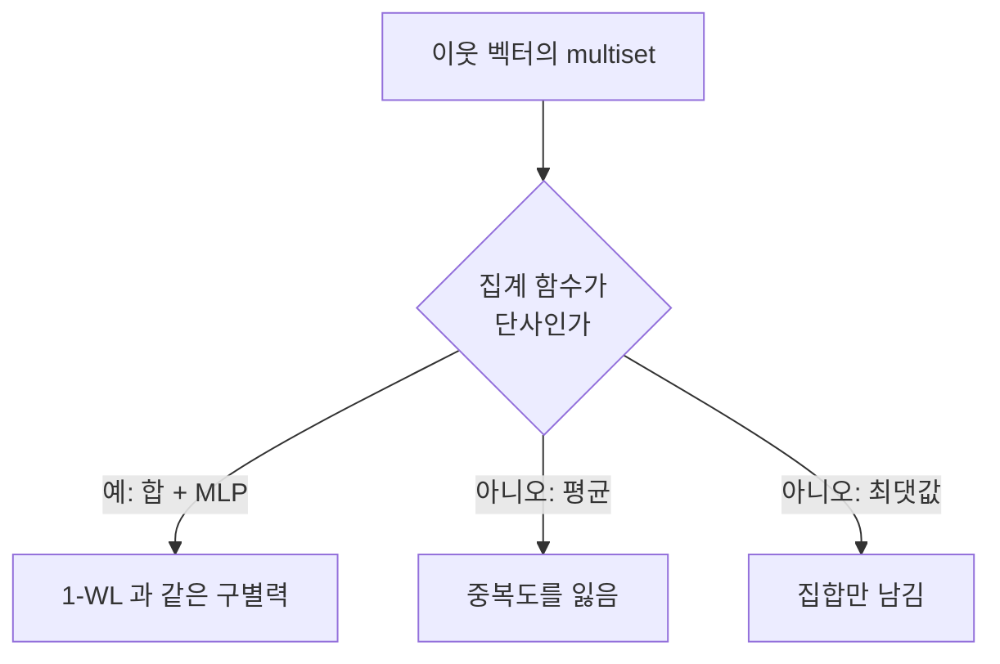

# 논문: How Powerful are Graph Neural Networks?

# 개요

그래프 신경망은 각 정점이 이웃의 특징을 모아 자기 특징을 갱신하는 일을 반복한다. 이 틀은 널리 쓰였지만 무엇을 구별할 수 있고 무엇을 구별할 수 없는지가 오래 불분명했다. 성능은 실험으로만 비교되었고, 어떤 구조를 못 배우는지는 사례별로 발견되었다.

Xu, Hu, Leskovec, Jegelka 는 이 물음에 정확한 답을 준다. 이웃을 집계하는 모든 그래프 신경망은 [color refinement](color-refinement.md), 즉 1-WL 보다 강할 수 없다. 그리고 집계와 갱신이 단사이면 그 상한에 도달한다. 표현력의 천장과 그 천장에 닿는 조건이 함께 제시된다.

따라서 설계 지침이 나온다. 집계 함수는 multiset 에 대해 단사여야 하고, 평균이나 최댓값은 그 조건을 깨뜨린다. 논문은 이 조건을 만족하는 Graph Isomorphism Network 를 제시한다[^1].

# 직관

## 이웃 집계는 색 갱신과 같은 일을 한다

1-WL 의 갱신은 자기 색과 이웃 색의 multiset 으로 새 색을 만든다. 그래프 신경망의 갱신은 자기 [벡터](vector-spaces.md)와 이웃 벡터의 multiset 으로 새 벡터를 만든다. 형태가 같다.

차이는 하나뿐이다. 1-WL 은 서로 다른 입력에 반드시 서로 다른 색을 준다. 신경망의 집계 함수는 그렇지 않을 수 있다. 그러면 1-WL 이 나눈 두 정점이 신경망에서는 같은 벡터를 받는다. 정보를 합칠 수는 있어도 없던 정보를 만들 수는 없으므로, 신경망은 1-WL 보다 강해질 수 없고 집계가 단사일 때만 같아진다.

## 평균과 최댓값이 잃는 것

특징이 실수 하나인 경우로 본다. multiset `{{1, 3}}` 과 `{{2, 2}}` 는 평균이 모두 2 다. 합도 4 로 같다. 즉 원시 특징에 그대로 합을 취해도 단사가 아니다.

그래서 논문은 특징을 먼저 변환한다. $\sum_{u} f(h_u)$ 꼴에서 `f` 를 적절히 고르면, 가산 집합에서 뽑은 크기가 제한된 multiset 에 대해 이 합이 단사가 된다. `f` 를 신경망으로 근사하는 것이 설계의 핵심이다.

평균과 최댓값은 이런 구제가 불가능하다. 평균은 중복도를 지우므로 `{{1,1,2}}` 와 `{{1,2}}` 를 구별할 수 없고, 최댓값은 multiset 을 그 지지집합으로 축소한다. 두 집계가 잃는 정보의 종류가 다르다는 점도 논문이 표로 정리한다.

| 집계 | 구별하는 것 | 잃는 것 |
|---|---|---|
| 합 | multiset 전체 | 없음(적절한 `f` 와 함께) |
| 평균 | 특징의 분포 | 개수, 즉 중복도 |
| 최댓값 | 나타나는 특징의 집합 | 개수와 작은 원소 |

평균이 늘 나쁘다는 뜻은 아니다. 과제가 분포에만 달려 있으면 평균이 더 나은 귀납 편향이 된다. 논문의 주장은 구조 구별이 목표일 때의 상한에 관한 것이다.

# 정의

## message-passing 그래프 신경망

각 정점이 이웃 특징의 순서 무관 집계값과 자기 특징으로 새 특징을 계산하는 모형을 대상으로 한다. 정점 `v` 의 `t` 번째 특징을 `h_t(v)`, 이웃 집합을 `N(v)`, 집계 함수를 `A_t`, 결합 함수를 `U_t` 라 한다.

$$
h_{t+1}(v)=U_t\Big(h_t(v),\,A_t\big(\{\!\{h_t(u):u\in N(v)\}\!\}\big)\Big)
$$

그래프 전체의 출력은 정점 특징들에 순열 불변 readout 을 적용해 만든다. 여기서 표현력은 두 입력 그래프에 서로 다른 출력을 줄 수 있는 능력을 뜻한다.

## Graph Isomorphism Network

논문이 제시하는 구성이다. 합 집계에 학습 가능한 스칼라 $\epsilon$ 과 다층 퍼셉트론을 붙인다.

$$
h_{t+1}(v)=\mathrm{MLP}_t\Big((1+\epsilon_t)\,h_t(v)+\sum_{u\in N(v)}h_t(u)\Big)
$$

$(1+\epsilon_t)$ 계수가 자기 특징과 이웃 합을 구별해 준다. 그래프 수준 readout 은 각 층의 정점 특징 합을 이어 붙인다. 얕은 층의 정보가 깊은 층에서 뭉개지는 것을 막기 위해서다.

# 성질

## 상한: 1-WL 을 넘지 못한다

같은 초기 특징에서 출발하면, 위 형태의 어떤 그래프 신경망도 1-WL 이 구별하지 못하는 두 그래프를 구별하지 못한다.

`t` 에 대한 귀납으로 보인다. `c_t(v) = c_t(w)` 이면 `h_t(v) = h_t(w)` 라는 명제를 유지한다. `t=0` 은 초기 특징이 초기 색에 의해 결정된다는 가정이다. `t` 에서 성립하면 1-WL 이 같은 색을 준 두 정점은 이웃 색의 multiset 이 같으므로 이웃 특징의 multiset 도 같고, `A_t` 와 `U_t` 가 함수이므로 `h_{t+1}` 도 같다. 색이 같은 정점들이 늘 같은 특징을 받으므로 그래프 수준 출력도 같다.

여기서 쓴 것은 `A_t`, `U_t` 가 함수라는 사실뿐이다. 학습을 아무리 해도 이 상한은 움직이지 않는다.

## 하한: 단사이면 도달한다

반대로 반복 횟수가 충분하고 `A_t`, `U_t`, readout 이 모두 단사이면 1-WL 이 구별하는 두 그래프에 서로 다른 출력을 준다. 단사 조건은 갱신 과정이 1-WL 의 `ID` 함수와 같은 역할을 한다는 뜻이므로, 신경망의 특징이 1-WL 색을 그대로 재현한다.

단사성을 실제로 얻을 수 있다는 것이 별도의 보조정리다. 특징 공간이 가산이고 multiset 의 크기가 유계이면, 어떤 `f` 가 존재해 $\sum_{x \in X} f(x)$ 가 multiset `X` 에 대해 단사다. 보편 근사 정리로 `f` 와 바깥 함수를 다층 퍼셉트론으로 근사할 수 있으므로 위 구성이 정당화된다.

가산성과 유계 조건은 논문 구성이 실제로 쓰는 가정이다. 실수 특징 전체를 다루는 일반 진술로 확대해 읽으면 안 된다.

## 상한이 실제로 의미가 있다

1-WL 의 한계는 추상적 우려가 아니다. 정칙 그래프는 모든 정점의 색이 처음부터 끝까지 같으므로 통째로 구별되지 않는다. 육각형과 삼각형 두 개, 그리고 같은 차수의 서로 다른 정칙 그래프 쌍들이 전부 여기 걸린다.

실용적으로 중요한 결과 하나는 삼각형 개수를 셀 수 없다는 것이다. 이웃 집계는 이웃들 사이의 간선을 보지 않기 때문이다. 분자 구조나 소셜 네트워크에서 순환 구조가 라벨을 결정한다면 이 모형 범위 안에서는 학습이 불가능하다.

# 활용

## 설계 지침

집계를 multiset 에 대해 단사가 되도록 고른다. 구체적으로는 평균이나 최댓값 대신 합을 쓰고, 합 앞뒤에 충분한 표현력의 변환을 둔다. 자기 특징과 이웃 합을 구별하고, 각 층의 출력을 readout 에 모두 반영한다.

성능이 나오지 않을 때 층을 더 쌓거나 학습을 더 하는 대신, 과제가 요구하는 구별이 1-WL 범위 안에 있는지를 먼저 확인하라는 것이 이 논문의 실천적 함의다.

## 한계를 넘는 방향

정점 식별자나 무작위 특징을 넣으면 초기 색이 달라지므로 상한의 전제가 깨진다. 위치 인코딩, 부분구조 개수, 거리 정보를 특징으로 넣는 방법도 같은 효과를 낸다. 다만 순열 불변성을 잃거나 별도의 대칭화가 필요해진다.

정점 튜플에 특징을 두어 `k`-WL 에 대응하는 모형을 만들 수도 있다. 표현력은 올라가지만 비용이 `n^k` 로 커진다. 이 논문 이후의 연구 대부분이 표현력과 비용의 이 교환을 어디에 놓을지를 다룬다.

## 결과를 읽을 때 주의할 점

표현할 수 있다는 것이 학습으로 찾을 수 있다는 뜻은 아니다. 단사성은 존재 정리이고, 최적화가 그 해에 도달한다는 보장은 없다. 일반화 성능도 별개의 문제다. 논문의 실험 결과를 현재 모형 전체의 성능 순위로 읽지 않아야 한다.

[^1]: Xu, Hu, Leskovec, Jegelka, *How Powerful are Graph Neural Networks?*, ICLR 2019, https://arxiv.org/abs/1810.00826. 상한은 Lemma 2, 단사 조건은 Theorem 3, 합의 단사성은 Lemma 5, 평균과 최댓값의 한계는 Section 5.2. 평균과 합의 반례는 본문에서 직접 계산했다.

# 연관 문서

## 선수지식

- [Color refinement](color-refinement.md)
- [벡터 공간](vector-spaces.md)

## 더 알아보기

아직 연결한 문서가 없다.

#graph_theory #machine_learning #paper
