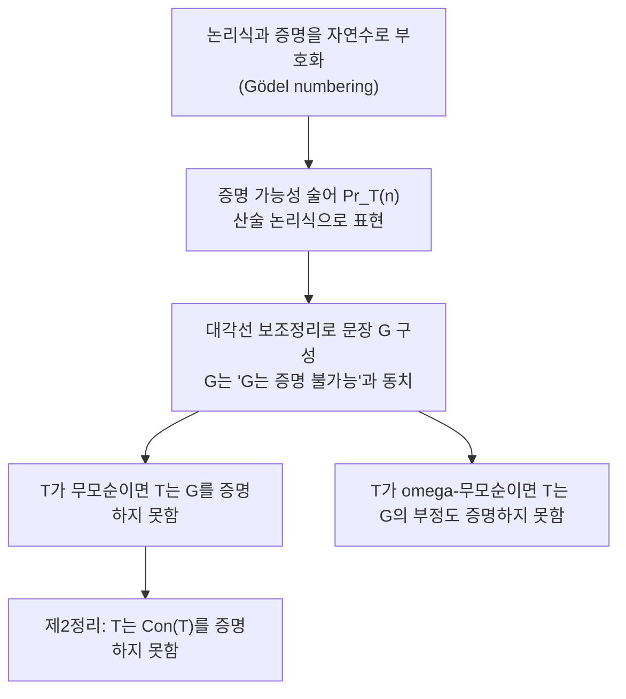

# Gödel 불완전성 정리

# 개요

Gödel 불완전성 정리는 산술을 충분히 담을 수 있는 무모순 형식체계라면 증명도 반증도 되지 않는 문장이 반드시 존재한다는 결과다(1931). 제2정리는 그런 체계가 자기 자신의 무모순성을 증명할 수 없다고 말한다.

증명의 기술적 핵심은 산술화다. 논리식과 증명을 자연수로 부호화하면 "증명 가능성"이 산술의 술어가 되고, 그러면 체계가 자기 자신에 대해 말할 수 있다. 여기에 대각선 논법을 적용해 "나는 증명될 수 없다"에 해당하는 문장을 만든다.

이 정리는 Hilbert 계획이 원래 목표한 형태, 즉 유한적 수단만으로 수학 전체의 무모순성을 증명하려는 시도를 무너뜨렸다([Hilbert 계획과 형식주의](formalism-hilbert-program.md)). 동시에 [계산 가능성과 정지 문제](computability.md)와 같은 뿌리를 공유한다.

# 직관

거짓말쟁이 문장 "이 문장은 거짓이다"는 참도 거짓도 될 수 없다. Gödel은 "거짓"을 체계 안에서 정의할 수 없는 개념(Tarski의 정의 불가능성)임을 피해, 대신 "증명 가능"으로 바꾸었다. "이 문장은 증명될 수 없다"는 모순이 아니라 참이면서 증명 불가능한 문장이 된다.



제2정리의 직관: 제1정리의 증명 자체를 체계 안에서 형식화할 수 있다. 그러면 "T가 무모순이면 G가 증명 불가능"이라는 함의가 T 안에서 증명된다. 그런데 "G가 증명 불가능"은 곧 G다. 따라서 T가 자기 무모순성 Con(T)를 증명하면 G도 증명하게 되어 제1정리에 모순이다.

# 정의

이론 T가 아래 조건을 만족한다고 하자. 이 조건들이 정리의 가설이며 하나라도 빠지면 결론이 성립하지 않는다.

- T는 [1차 논리](first-order-logic.md)의 이론이고 공리 집합이 recursively enumerable하다(효과적 공리화).
- T는 무모순이다.
- T는 충분히 강하다. 구체적으로는 Robinson 산술 Q를 해석할 수 있으면 된다. Peano 산술 PA, [ZFC](zfc-axioms.md), Q 자신 모두 해당한다.

## 산술화

각 기호, 논리식, 유한 증명열에 자연수를 단사로 대응시킨다. 논리식 phi의 부호를 꺾쇠로 쓴다.

$$
\ulcorner\varphi\urcorner\in\mathbb{N}
$$

"n은 T에서의 증명의 부호이고 그 결론은 m이다"라는 관계는 순수하게 구문적 검사이므로 primitive recursive하다. 따라서 산술 논리식으로 표현된다. 이를 써서 증명 가능성 술어를 정의한다.

$$
\mathrm{Pr}_T(m)\ :\equiv\ \exists n\ \mathrm{Proof}_T(n,m)
$$

증명 가능성 술어는 다음 세 성질(Hilbert–Bernays–Löb 파생 조건)을 만족한다.

$$
T\vdash\varphi \implies T\vdash \mathrm{Pr}_T(\ulcorner\varphi\urcorner)
$$

$$
T\vdash \mathrm{Pr}_T(\ulcorner\varphi\to\psi\urcorner)\to\bigl(\mathrm{Pr}_T(\ulcorner\varphi\urcorner)\to \mathrm{Pr}_T(\ulcorner\psi\urcorner)\bigr)
$$

$$
T\vdash \mathrm{Pr}_T(\ulcorner\varphi\urcorner)\to \mathrm{Pr}_T(\ulcorner \mathrm{Pr}_T(\ulcorner\varphi\urcorner)\urcorner)
$$

무모순성 문장은 모순이 증명되지 않는다는 진술로 정의한다.

$$
\mathrm{Con}(T)\ :\equiv\ \neg\,\mathrm{Pr}_T(\ulcorner 0=1\urcorner)
$$

## 대각선 보조정리

자유 변수 하나를 가진 임의의 논리식 psi에 대해, 다음을 만족하는 문장 D가 존재한다[^1].

$$
T\vdash\ D\ \leftrightarrow\ \psi(\ulcorner D\urcorner)
$$

증명 개요: 대입 연산 "논리식의 부호와 수를 받아 대입 결과의 부호를 내놓는 함수"가 산술적으로 표현 가능하다는 사실을 쓴다. 자기 자신의 부호를 자기에게 대입하는 논리식을 만들면 위 동치가 T 안에서 증명된다.

# 성질

## 제1정리

T가 효과적으로 공리화된 무모순 이론이고 Robinson 산술을 해석하면, T에서 증명도 반증도 되지 않는 산술 문장이 존재한다[^2].

대각선 보조정리를 psi(x)로 "x는 증명 불가능"을 두어 적용하면 Gödel 문장 G를 얻는다.

$$
T\vdash\ G\ \leftrightarrow\ \neg\,\mathrm{Pr}_T(\ulcorner G\urcorner)
$$

**G는 증명되지 않는다**: T가 G를 증명하면 첫 번째 파생 조건으로 T는 증명 가능성도 증명하고, G의 동치에서 그 부정도 증명한다. 이는 T의 무모순성에 반한다.

**G의 부정도 증명되지 않는다**: T가 G의 부정을 증명하면 T는 "G의 증명이 존재한다"를 증명한다. 그런데 위에서 보았듯 실제 증명은 없다. 즉 각 구체적 n에 대해 "n은 G의 증명이 아니다"가 증명되면서 존재 문장도 증명되는 상황이다. 이를 배제하는 원래 가정이 omega-무모순성이다. Rosser(1936)는 증명 가능성 대신 "이 증명보다 짧은 반증이 없는 증명"이라는 변형 술어를 써서, 단순 무모순성만으로 같은 결론을 얻었다[^3].

표준 모델에서 G는 참이다. 실제로 증명이 없으므로 "증명이 없다"는 참이다. 다만 이 "참"은 T 밖에서의 판정이다.

## 제2정리

T가 위 조건을 만족하고 무모순이면 T는 Con(T)를 증명하지 못한다.

제1정리의 전반부 논법을 형식화하면 다음이 T 안에서 증명된다.

$$
T\vdash\ \mathrm{Con}(T)\to G
$$

만약 T가 Con(T)를 증명하면 G도 증명하게 되어 제1정리에 모순이다. 세 파생 조건만으로 이 결론이 나오므로, 증명은 산술의 세부가 아니라 증명 가능성 술어의 형식적 성질에만 의존한다. 같은 조건에서 Löb 정리가 따라 나온다.

$$
T\vdash \mathrm{Pr}_T(\ulcorner\varphi\urcorner)\to\varphi\ \Longrightarrow\ T\vdash\varphi
$$

## 정지 문제와의 관계

효과적으로 공리화된 무모순 이론 T의 정리 집합은 recursively enumerable하지만 결정 가능하지 않다. 결정 가능하다면 문장마다 증명 여부를 판정할 수 있어 T가 완전해지는데, 제1정리가 이를 막는다. 거꾸로 정지 문제의 결정 불가능성에서 제1정리를 얻을 수도 있다. "프로그램 p가 입력 x에서 멈추지 않는다"는 문장들이 모두 증명 가능한 완전한 체계가 있다면, 증명 탐색과 실행을 병렬로 돌려 정지 문제를 결정할 수 있게 된다([계산 가능성과 정지 문제](computability.md), [Rice 정리](rice-theorem.md)). 두 결과 모두 대각선 논법에 기반하며, [P 대 NP 문제](p-np.md)와 달리 이미 증명된 정리다.

## 흔한 오해

- "참인데 증명 불가능한 문장이 있다"는 절대적 의미가 아니다. 각 문장은 어떤 이론에 대해 증명 불가능하다. G는 T에서 증명되지 않지만 T에 G를 공리로 추가한 이론에서는 증명된다. 그 새 이론에는 다시 새로운 Gödel 문장이 생긴다.
- 수학의 특정 문제가 원리적으로 해결 불가능하다는 뜻이 아니다. 정리는 "모든 문장을 결정하는 완전한 효과적 체계가 없다"를 말한다.
- 사람의 마음이 기계를 넘어선다는 결론은 따라 나오지 않는다. 정리는 형식체계에 대한 진술이며, 사람의 수학적 판단이 무모순임을 전제하지 않는다.
- 자기 무모순성을 증명하는 체계가 아예 없다는 뜻도 아니다. 무모순이지만 약해서 가설을 만족하지 못하는 체계나, 애초에 모순인 체계는 자기 무모순성을 증명할 수 있다. 또 T의 무모순성은 더 강한 이론에서 증명될 수 있다. Gentzen은 epsilon_0까지의 초한귀납법으로 PA의 무모순성을 증명했다([서수와 초한귀납법](ordinals.md)).
- Gödel의 완전성 정리와 불완전성 정리는 서로 다른 "완전"을 쓴다. 전자는 논리의 증명 규칙이 의미론적 귀결을 모두 포착한다는 뜻이고, 후자는 특정 이론이 자기 언어의 모든 문장을 결정하지 못한다는 뜻이다. 둘은 모순이 아니다.

# 활용

## 독립 문장의 실제 예

Gödel 문장은 인공적이지만, 자연스러운 수학 문장 중에도 PA에서 독립인 것이 있다.

- Goodstein 정리: 어떤 자연수에서 시작하는 Goodstein 수열도 유한 단계에서 0에 도달한다. 증명은 각 항에 서수를 배정해 감소함을 보이는 것으로, epsilon_0까지의 초한귀납법을 요구하며 PA에서 증명되지 않는다.
- Paris–Harrington 정리: Ramsey 정리의 강화판으로, PA에서 독립이다([Ramsey 이론](ramsey-theory.md)).
- ZFC에서는 연속체 가설과 [선택공리](axiom-of-choice.md)의 독립성이 forcing으로 증명되었다. 다만 이 독립성은 불완전성 정리의 논법과는 다른 방법의 결과다.

## 증명 가능성 논리

파생 조건 세 개를 양상 논리의 공리로 읽으면 체계 GL(Gödel–Löb)이 된다. 증명 가능성 술어를 상자 기호로 쓰면 Löb 공리는 다음과 같고, Solovay의 정리에 의해 GL은 PA의 증명 가능성에 대해 건전하고 완전하다.

$$
\Box(\Box\varphi\to\varphi)\to\Box\varphi
$$

## 계산적 확인

산술화는 기계적이어서 증명 보조기에서 실제로 형식화되었다. 다음은 개념적 골격이다.

```python
# 개념 스케치. Proof_T 는 결정 가능한 술어라는 점이 핵심이다.
def provable_witness(T, sentence, bound):
    """부호가 bound 미만인 증명을 전수 탐색한다. 찾으면 반환, 없으면 None."""
    for n in range(bound):
        if is_proof_of(T, decode(n), sentence):   # 구문 검사만 하므로 결정 가능
            return n
    return None

# Pr_T(s) = "어떤 n 이 존재하여 is_proof_of(T, decode(n), s)"
# 이 존재 양화를 없앨 수 있다면(즉 결정 가능하다면) T 는 완전해지고,
# 제1정리에 모순이다. 따라서 위 탐색에는 유한한 bound 를 줄 수 없다.
```

이 한계는 자동 정리 증명의 원리적 제약이기도 하다. 증명 탐색은 반결정 절차이므로, 정리가 아닌 문장에 대해서는 영원히 답하지 않을 수 있다.

[^1]: Gödel's Incompleteness Theorems, Stanford Encyclopedia of Philosophy (대각선 보조정리와 파생 조건). https://plato.stanford.edu/entries/goedel-incompleteness/
[^2]: Gödel's incompleteness theorems, Wikipedia. https://en.wikipedia.org/wiki/G%C3%B6del%27s_incompleteness_theorems
[^3]: Rosser's trick, Wikipedia (omega-무모순성 가정의 제거). https://en.wikipedia.org/wiki/Rosser%27s_trick

# 연관 문서

## 선수지식

- [1차 논리](first-order-logic.md)
- [계산 가능성과 정지 문제](computability.md)

## 더 알아보기

- [형식주의와 Hilbert 프로그램](formalism-hilbert-program.md)

#logic #foundations #theorem
