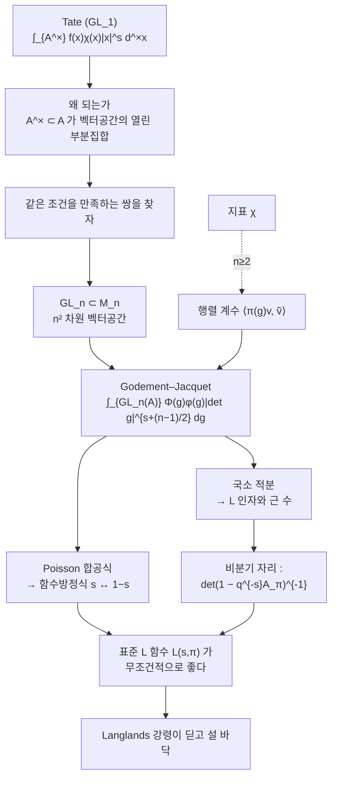

# Godement–Jacquet 적분

# 개요

[Tate 의 논문](tate-thesis.md)은 Hecke 의 $L$ 함수를 아델 위의 적분 하나로 다시 썼다. 해석적 접속과 함수방정식이 Fourier 해석과 Poisson 합공식에서 형식적으로 나왔고, 자리마다의 국소 인자와 근 수가 국소 적분에서 읽혔다.

그 논문은 $\mathrm{GL}_1$ 의 이야기다. Godement 와 Jacquet 이 1972 년에 같은 일을 $\mathrm{GL}_n$ 에서 했다.

$$
Z(s,\Phi,\varphi)=\int_{\mathrm{GL}_n(\mathbb A)}\Phi(g)\,\varphi(g)\,
\lvert\det g\rvert^{\,s+\frac{n-1}2}\,dg
$$

$\Phi$ 는 행렬공간 위의 Schwartz 함수이고 $\varphi$ 는 표현 $\pi$ 의 **행렬 계수**다. 이 적분 하나가 $\mathrm{GL}_n$ 의 모든 첨점 자기동형 표현에 대해 **표준 $L$ 함수** $L(s,\pi)$ 의 해석적 접속과 함수방정식을 준다.

일반화의 핵심은 뜻밖에 단순하다. Tate 가 $\mathbb A^\times$ 위의 적분을 다룰 수 있었던 것은 $\mathbb A^\times$ 가 **벡터공간 $\mathbb A$ 의 열린 부분집합**이기 때문이다. 벡터공간이라야 Schwartz 함수가 있고 Fourier 변환이 있고 Poisson 합공식이 있다. 그렇다면 $\mathrm{GL}_n$ 을 담는 벡터공간을 찾으면 된다. 답은 **행렬대수** $M_n$ 이다.

$$
\mathbb G_m\subset\mathbb A^1
\qquad\longleftrightarrow\qquad
\mathrm{GL}_n\subset M_n
$$

$M_n$ 은 $n^2$ 차원 벡터공간이고 $\mathrm{GL}_n$ 은 그 안에서 $\det\ne0$ 인 열린 부분집합이다. Tate 의 기계가 그대로 작동한다. 곱셈 지표 $\chi$ 의 자리에 표현의 행렬 계수가 들어가고, $\lvert x\rvert^s$ 의 자리에 $\lvert\det g\rvert^s$ 가 들어간다. 나머지는 같다.

이 구성이 왜 중요한가. [Langlands 강령](langlands-program.md)은 자기동형 표현에 $L$ 함수를 붙이고 그것이 Galois 쪽의 $L$ 함수와 같기를 요구한다. 그 요구가 의미를 가지려면 **먼저 자기동형 쪽 $L$ 함수가 잘 정의되고 해석적으로 좋아야** 한다. Godement–Jacquet 이 $\mathrm{GL}_n$ 의 표준 $L$ 함수에 대해 그것을 무조건적으로 보장한다. 강령이 딛고 설 바닥이다.

# 직관

## Tate 의 기계를 다시 본다

$\mathrm{GL}_1$ 에서 Tate 의 적분은

$$
Z(s,f,\chi)=\int_{\mathbb A^\times}f(x)\,\chi(x)\,\lvert x\rvert^s\,d^\times x
$$

였다. 세 부품이 있다.

1. $f$ : 벡터공간 $\mathbb A$ 위의 Schwartz 함수. Fourier 변환 $\hat f$ 가 있다.
2. $\chi$ : 군 $\mathbb A^\times$ 의 지표. 곧 1 차원 표현.
3. $\lvert x\rvert^s$ : 군에서 $\mathbb C^\times$ 로 가는 매개변수족.

함수방정식은 $f\leftrightarrow\hat f$ 와 $\chi\leftrightarrow\chi^{-1}$ 과 $s\leftrightarrow1-s$ 의 대칭에서 나온다. 증명은 Poisson 합공식 한 줄이다.

## 지표 대신 행렬 계수

$n\ge2$ 에서 $\pi$ 는 1 차원이 아니다. 그러면 $\chi(x)$ 자리에 무엇을 넣는가.

표현 $\pi$ 의 **행렬 계수**를 넣는다. $v\in V_\pi$ 와 반대표현의 $\tilde v\in V_{\tilde\pi}$ 에 대해

$$
\varphi(g)=\langle\pi(g)v,\tilde v\rangle
$$

가 $\mathrm{GL}_n$ 위의 함수다. $n=1$ 이면 $\varphi=\chi$ 그대로다. 행렬 계수는 표현의 정보를 함수 하나로 압축한 것이고, Schur 직교성 덕분에 지표와 같은 역할을 한다.

그리고 $\lvert x\rvert^s$ 자리에는 $\lvert\det g\rvert^s$ 를 넣는다. $\det$ 이 $\mathrm{GL}_n\to\mathbb G_m$ 이므로 이것이 유일하게 자연스러운 선택이다. 지수를 $s+\frac{n-1}2$ 로 옮기는 것은 함수방정식이 $s\leftrightarrow1-s$ 로 깔끔하게 나오도록 하는 정규화다.

## 왜 M_n 이 옳은 벡터공간인가

$\mathrm{GL}_n$ 을 담는 벡터공간으로 $M_n$ 을 고른 것이 이 이론의 전부라 해도 좋다. 조건이 셋이다.

- $\mathrm{GL}_n$ 이 $M_n$ 의 **조밀한 열린** 부분집합이다. 그래서 $\mathrm{GL}_n$ 위의 적분을 $M_n$ 위의 Schwartz 함수로 다룰 수 있다.
- $M_n$ 위에 $\mathrm{GL}_n\times\mathrm{GL}_n$ 이 왼쪽·오른쪽 곱으로 작용하고, Fourier 변환이 이 작용과 잘 어울린다. 자기쌍대 측도에서 $\widehat{\Phi}$ 가 다시 Schwartz 함수다.
- $\det$ 이 $M_n$ 위의 다항식이라 $\lvert\det\rvert^s$ 의 국소 적분이 유리함수로 수렴한다. 수렴영역이 $\mathrm{Re}(s)$ 가 클 때 확보되고, 거기서 해석적으로 접속한다.

$\mathrm{GL}_n$ 이 아닌 다른 군에서는 이런 벡터공간이 없다. 그래서 Godement–Jacquet 은 $\mathrm{GL}_n$ 에 특화된 방법이고, 다른 군과 다른 $L$ 함수에는 [Rankin–Selberg 적분](rankin-selberg.md)이나 Langlands–Shahidi 방법을 쓴다.



## 비분기 자리에서 무엇이 나오는가

거의 모든 자리에서 $\pi_v$ 는 비분기이고, 그 표현은 **[Satake 매개변수](satake-isomorphism.md)**라 부르는 대각행렬

$$
A_{\pi_v}=\mathrm{diag}(\alpha_1,\dots,\alpha_n)\in\mathrm{GL}_n(\mathbb C)
$$

의 켤레류로 완전히 결정된다. 이 자리에서 국소 적분을 계산하면

$$
L(s,\pi_v)=\det\big(1-q_v^{-s}A_{\pi_v}\big)^{-1}
=\prod_{i=1}^n\big(1-\alpha_iq_v^{-s}\big)^{-1}
$$

가 나온다. **국소 인자는 Satake 매개변수의 특성다항식의 역수다.** $n=1$ 이면 $(1-\chi(\varpi)q^{-s})^{-1}$ 로 Tate 의 결과가 되고, $n=2$ 이면 모듈러 형식의 익숙한 2 차 오일러 인자가 된다. 아래 계산에서 $n=2$ 를 직접 확인한다.

# 정의

## 국소 적분

$F$ 를 국소체, $\pi$ 를 $\mathrm{GL}_n(F)$ 의 기약 허용 표현, $\varphi$ 를 그 행렬 계수, $\Phi\in\mathcal S(M_n(F))$ 라 하자.

$$
Z(s,\Phi,\varphi)=\int_{\mathrm{GL}_n(F)}\Phi(g)\,\varphi(g)\,
\lvert\det g\rvert^{\,s+\frac{n-1}2}\,dg
$$

$\mathrm{Re}(s)$ 가 충분히 크면 수렴하고, $q^{-s}$ 의 유리함수로 접속한다. 이런 적분 전체가 만드는 $\mathbb C[q^{\pm s}]$ 가군의 생성원이 국소 $L$ 인자 $L(s,\pi)$ 다.

## 대역 적분과 함수방정식

$\pi$ 를 $\mathrm{GL}_n(\mathbb A)$ 의 첨점 자기동형 표현이라 하고 위의 적분을 아델 위에서 잡는다.

> **정리 (Godement–Jacquet, 1972).** $Z(s,\Phi,\varphi)$ 는 $\mathbb C$ 전체로 해석적으로 접속하고($n\ge2$ 이면 정함수)
> $$Z(s,\Phi,\varphi)=Z(1-s,\widehat\Phi,\tilde\varphi)$$
> 를 만족한다. 여기서 $\tilde\varphi(g)=\varphi(g^{-1})$ 는 반대표현 $\tilde\pi$ 의 행렬 계수다.
> 따라서 완비 $L$ 함수 $\Lambda(s,\pi)=\prod_vL(s,\pi_v)$ 가 정함수이고
> $$\Lambda(s,\pi)=\varepsilon(s,\pi)\,\Lambda(1-s,\tilde\pi)$$
> 다.

$n=1$ 에서 $\zeta$ 함수에 극점이 생기는 것은 자명한 지표의 경우이고, $n\ge2$ 의 첨점 표현에서는 극점이 없다.

## 표준 L 함수

이렇게 정의된 $L(s,\pi)$ 를 $\pi$ 의 **표준(standard) $L$ 함수**라 한다. Langlands 의 언어로는 쌍대군 ${}^L\mathrm{GL}_n=\mathrm{GL}_n(\mathbb C)$ 의 **표준표현**에 딸린 $L$ 함수다. 다른 표현(대칭곱, 외적곱 등)에 딸린 $L$ 함수는 이 방법으로 나오지 않는다.

# 성질

## 무엇을 주고 무엇을 안 주는가

| | 상태 |
|---|---|
| $\mathrm{GL}_n$ 의 표준 $L$ 함수 | Godement–Jacquet — 무조건적 |
| $\mathrm{GL}_n\times\mathrm{GL}_m$ 의 Rankin–Selberg | Jacquet–Piatetski-Shapiro–Shalika — 무조건적 |
| 대칭곱 $L(s,\mathrm{Sym}^k\pi)$ | 대부분 미해결. $k\le4$ 만 알려짐 |
| 일반 $L(s,\pi,r)$ | Langlands 의 추측 |

[Sato–Tate](sato-tate.md)가 어려웠던 이유가 이 표에 있다. 필요한 것은 모든 $k$ 의 대칭곱이었고, 표준 $L$ 함수만으로는 닿지 않는다. Taylor 등은 잠재적 모듈러성으로 우회했다.

## Tate 와의 대응

| $\mathrm{GL}_1$ 의 Tate | $\mathrm{GL}_n$ 의 Godement–Jacquet |
|---|---|
| 벡터공간 $\mathbb A$ | 행렬대수 $M_n(\mathbb A)$ |
| 군 $\mathbb A^\times$ | $\mathrm{GL}_n(\mathbb A)$ |
| 지표 $\chi$ | 행렬 계수 $\langle\pi(g)v,\tilde v\rangle$ |
| $\lvert x\rvert^s$ | $\lvert\det g\rvert^{s+(n-1)/2}$ |
| Fourier 변환 $f\mapsto\hat f$ | $\Phi\mapsto\widehat\Phi$ (자기쌍대 측도) |
| Poisson 합공식 | 같은 공식, $M_n$ 위에서 |
| $L$ 인자 $(1-\chi(\varpi)q^{-s})^{-1}$ | $\det(1-q^{-s}A_\pi)^{-1}$ |
| 근 수 $\varepsilon$ | 같은 꼴의 $\varepsilon(s,\pi)$ |

[Gauss 합](gauss-sums.md)이 $\mathrm{GL}_1$ 의 분기 자리에서 근 수로 나타났듯, $\mathrm{GL}_n$ 에서도 분기 자리의 $\varepsilon$ 이 비자명한 정보를 담는다. Deligne 과 Langlands 의 국소 상수 이론이 그것을 Galois 쪽 근 수와 맞춘다.

## 모듈러 형식과의 사전

$n=2$ 에서 무게 $k$ 의 Hecke 고유형식 $f=\sum a_nq^n$ 에 딸린 $\pi_f$ 의 Satake 매개변수는 정규화 전에

$$
\{\alpha_p,\beta_p\},\qquad\alpha_p+\beta_p=a_p,\quad\alpha_p\beta_p=p^{k-1}
$$

다. 그러면 표준 $L$ 함수가

$$
L(s,\pi_f)=\prod_p\big(1-a_pp^{-s}+p^{k-1-2s}\big)^{-1}=\sum_{n\ge1}\frac{a_n}{n^s}
$$

이다. **오일러 곱과 Dirichlet 급수가 같다**는 이 등식이 Hecke 작용소의 곱셈성이고, 동시에 국소 인자가 $2\times2$ 행렬의 특성다항식이라는 진술이다. 아래에서 $k=12$ 인 $f=\Delta$ 로 이것을 직접 확인한다.

# 활용

## 오일러 곱이 정말 Dirichlet 급수와 같은가

$\Delta$ 의 계수 $\tau(n)$ 을 오각수 정리로 정확히 구하고, 오일러 곱 $\prod_p(1-\tau(p)p^{-s}+p^{11-2s})^{-1}$ 을 Dirichlet 급수로 전개해서 $\tau(n)$ 과 대조한다. 정수 연산만 쓴다.

```python
from math import isqrt

N = 300

def tau_upto(N):                              # Δ = q ∏(1-q^n)^24
    e = [0] * (N + 1); e[0] = 1
    k = 1
    while True:
        g1, g2 = k * (3 * k - 1) // 2, k * (3 * k + 1) // 2
        if g1 > N and g2 > N: break
        s = -1 if k % 2 else 1
        if g1 <= N: e[g1] += s
        if g2 <= N: e[g2] += s
        k += 1
    def mul(a, b):
        c = [0] * (N + 1)
        for i, ai in enumerate(a):
            if ai:
                for j in range(0, N + 1 - i):
                    if b[j]: c[i + j] += ai * b[j]
        return c
    prod = [1] + [0] * N
    for _ in range(24): prod = mul(prod, e)
    t = [0] * (N + 2)
    for n in range(N + 1): t[n + 1] = prod[n]
    return t

tau = tau_upto(N)
is_prime = lambda n: n > 1 and all(n % d for d in range(2, isqrt(n) + 1))
PR = [p for p in range(2, N + 1) if is_prime(p)]

# 국소 인자 (1 - τ(p)X + p^11 X^2)^{-1} = Σ_m c_{p^m} X^m,  c 는 2 항 점화식
euler = [0] * (N + 1); euler[1] = 1
for p in PR:
    loc = [0] * (N + 1); loc[1] = 1
    pk, prev2, prev1 = p, 1, 0                # c_{p^0}=1, c_{p^{-1}}=0
    while pk <= N:
        c = tau[p] * prev2 - (p ** 11) * prev1 if pk > p else tau[p]
        loc[pk] = c
        prev1, prev2, pk = prev2, c, pk * p
    new = [0] * (N + 1)                       # Dirichlet 곱
    for i in range(1, N + 1):
        if euler[i]:
            j = 1
            while i * j <= N:
                if loc[j]: new[i * j] += euler[i] * loc[j]
                j += 1
    euler = new

bad = [n for n in range(1, N + 1) if euler[n] != tau[n]]
print(f"  n <= {N} 에서 오일러 곱 전개 = τ(n) : {not bad}   반례 {bad[:5]}")
print(f"  예 : n=1..12  오일러 곱 {euler[1:13]}")
print(f"           τ(n) {tau[1:13]}")

#   n <= 300 에서 오일러 곱 전개 = τ(n) : True   반례 []
#   예 : n=1..12  오일러 곱 [1, -24, 252, -1472, 4830, -6048, -16744, 84480, -113643, -115920, 534612, -370944]
#            τ(n) [1, -24, 252, -1472, 4830, -6048, -16744, 84480, -113643, -115920, 534612, -370944]
```

소수마다 독립적으로 만든 국소 인자를 전부 곱했더니 $\tau(n)$ 이 그대로 복원된다. $\mathrm{GL}_2$ 의 표준 $L$ 함수가 자리마다의 곱이라는 진술의 구체적 내용이다.

## 국소 인자는 특성다항식이다

```python
print(f"{'p':>4} {'τ(p)':>12} {'α+β':>14} {'αβ':>18} {'p^11':>18}  일치")
for p in PR[:6]:
    d = complex(tau[p] ** 2 - 4 * p ** 11) ** 0.5
    al, be = (tau[p] + d) / 2, (tau[p] - d) / 2
    s, pr = (al + be).real, (al * be).real
    print(f"{p:>4} {tau[p]:>12} {s:>14.1f} {pr:>18.1f} {p**11:>18}  "
          f"{abs(s - tau[p]) < 1e-3 and abs(pr - p**11) < 1e-3 * p**11}")

#    p         τ(p)            α+β                 αβ               p^11  일치
#    2          -24          -24.0             2048.0               2048  True
#    3          252          252.0           177147.0             177147  True
#    5         4830         4830.0         48828125.0           48828125  True
#    7       -16744       -16744.0       1977326743.0         1977326743  True
#   11       534612       534612.0     285311670611.0       285311670611  True
#   13      -577738      -577738.0    1792160394037.0      1792160394037  True
```

$1-\tau(p)X+p^{11}X^2=\det(1-X\,A_{\pi_p})$ 에서 $A_{\pi_p}$ 의 고윳값이 $\alpha_p,\beta_p$ 다. 대각합이 $\tau(p)$ 이고 행렬식이 $p^{11}$ 이다. 이것이 Satake 매개변수이고, $\mathrm{GL}_n$ 에서는 $n\times n$ 행렬로 커진다.

## 계수가 대칭곱의 지표다

국소 인자를 전개했을 때 $p^m$ 자리의 계수가 무엇인지 본다.

```python
for p in PR[:4]:
    d = complex(tau[p] ** 2 - 4 * p ** 11) ** 0.5
    al, be = (tau[p] + d) / 2, (tau[p] - d) / 2
    row, pk, m = [], p, 1
    while pk <= N and m <= 4:
        pred = sum(al ** k * be ** (m - k) for k in range(m + 1)).real
        row.append((m, euler[pk], round(pred)))
        pk, m = pk * p, m + 1
    ok = all(abs(a - b) <= max(1, abs(a)) * 1e-6 for _, a, b in row)
    print(f"  p={p:3d}  (m, c_p^m, Σα^kβ^(m-k)) = {row}   일치 {ok}")

#   p=  2  (m, c_p^m, Σα^kβ^(m-k)) = [(1, -24, -24), (2, -1472, -1472), (3, 84480, 84480), (4, 987136, 987136)]   일치 True
#   p=  3  (m, c_p^m, Σα^kβ^(m-k)) = [(1, 252, 252), (2, -113643, -113643), (3, -73279080, -73279080), (4, 1665188361, 1665188361)]   일치 True
#   p=  5  (m, c_p^m, Σα^kβ^(m-k)) = [(1, 4830, 4830), (2, -25499225, -25499225), (3, -359001100500, -359001100500)]   일치 True
#   p=  7  (m, c_p^m, Σα^kβ^(m-k)) = [(1, -16744, -16744), (2, -1696965207, -1696965207)]   일치 True
```

$c_{p^m}=\sum_{k=0}^m\alpha^k\beta^{m-k}$ 다. 이것은 $\mathrm{GL}_2(\mathbb C)$ 의 $m$ 번째 **대칭곱 표현의 지표**를 $A_{\pi_p}$ 에서 평가한 값이다. 곧 $\tau(p^m)$ 이 Satake 매개변수의 대칭곱 지표다.

여기서 [Sato–Tate](sato-tate.md)와의 연결이 보인다. 등분포를 보이려면 모든 대칭곱의 평균이 사라져야 했고, 그 평균을 통제하는 것이 $L(s,\mathrm{Sym}^m\pi)$ 였다. Godement–Jacquet 은 $m=1$ 곧 표준표현만 준다. 나머지가 어려운 부분으로 남는다.

## 어디로 이어지는가

- **Langlands 강령의 바닥.** 자기동형 $L$ 함수가 좋은 성질을 갖는다는 것이 [강령](langlands-program.md)의 모든 진술의 전제다. $\mathrm{GL}_n$ 표준 $L$ 함수에 대해 그것이 무조건적으로 성립한다는 것이 이 정리의 값이다.
- **강한 중복도 1.** 표준 $L$ 함수가 표현을 결정한다는 정리(Jacquet–Shalika)가 거의 모든 자리의 Satake 매개변수로 $\pi$ 가 정해진다는 말이고, 증명에 이 적분이 쓰인다.
- **[Rankin–Selberg](rankin-selberg.md).** $\mathrm{GL}_n\times\mathrm{GL}_m$ 의 $L$ 함수를 다루는 Jacquet–Piatetski-Shapiro–Shalika 의 적분은 이 방법의 형제다. 함수성 판정과 Ramanujan 형 추정의 주요 도구다.
- **국소 상수.** 분기 자리의 $\varepsilon(s,\pi)$ 를 Galois 쪽 근 수와 맞추는 국소 Langlands 대응의 검증 조건이 여기서 나온다.
- **더 일반적인 군.** $M_n$ 같은 벡터공간이 없는 군에서는 이 방법이 통하지 않는다. Braverman–Kazhdan 과 L. Lafforgue 가 일반 군에 대해 "Godement–Jacquet 을 흉내 낼 공간" 을 찾는 강령을 제안했고 활발히 연구되고 있다.

[^1]: R. Godement, H. Jacquet, *Zeta Functions of Simple Algebras*, Lecture Notes in Math. 260 (1972). Tate 이론과의 비교는 D. Bump, *Automorphic Forms and Representations* (1997) 3장. Satake 매개변수와 비분기 계산은 같은 책 4장, 또는 A. Knapp 의 Motives 논문집 개설. Rankin–Selberg 쪽은 H. Jacquet, I. Piatetski-Shapiro, J. Shalika, *Rankin–Selberg convolutions*, Amer. J. Math. **105** (1983). 일반 군으로의 확장 제안은 A. Braverman, D. Kazhdan, *γ-functions of representations and lifting*, GAFA (2000). 본문의 수치 계산은 직접 한 것이다.

# 연관 문서

## 선수지식

- [논문: Fourier Analysis in Number Fields and Hecke's Zeta-Functions](tate-thesis.md)
- [Langlands 강령](langlands-program.md)

## 더 알아보기

- [Satake 동형과 비분기 Hecke 대수](satake-isomorphism.md)
- [Rankin–Selberg 적분](rankin-selberg.md)

#number_theory #analysis #group_theory #computation
