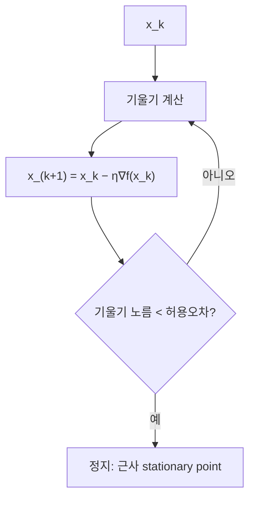

# 경사하강법

# 개요

경사하강법(gradient descent)은 미분가능한 목적함수를 기울기의 반대 방향으로 조금씩 이동하며 최소화하는 1차 반복법이다. 각 단계가 기울기 한 번 계산과 벡터 덧셈뿐이라 차원이 매우 큰 문제에서도 쓸 수 있고, 그 대가로 수렴 속도는 목적함수의 곡률 조건에 민감하다. 이론적으로 중요한 점은 조건을 명시하면 수렴률을 정확히 증명할 수 있다는 것이다. 기울기가 L-Lipschitz인 볼록 함수에서는 함수값 오차가 반복 횟수의 역수로, 여기에 강볼록성을 더하면 기하급수적으로 줄어든다. 확률적 변형인 SGD는 현대 기계학습 학습 알고리즘의 기본 골격이다.

# 직관

지형의 가장 낮은 곳을 찾는데 안개 때문에 발밑의 기울기만 알 수 있는 상황이다. 가장 급한 내리막 방향으로 일정 거리를 걷고 다시 측정한다. 걸음이 너무 작으면 느리고, 너무 크면 골짜기를 건너뛰어 튕겨 나간다. 안전한 걸음 크기는 "기울기가 얼마나 빨리 변하는가", 즉 곡률의 상한 L이 결정한다.

좁고 긴 골짜기(가늘고 긴 타원형 등위선)에서는 기울기가 골짜기 축이 아니라 벽을 향하므로 지그재그로 내려간다. 이 현상의 정량적 지표가 조건수 L/μ이며, 조건수가 클수록 수렴이 느리다.



# 정의

f를 n차원 실공간에서 정의된 미분가능 함수라 한다. 고정 학습률(step size) η에 대한 경사하강법은 다음 점화식이다.

$$
x_{k+1}=x_k-\eta\,\nabla f(x_k),\qquad k=0,1,2,\dots
$$

f의 기울기가 L-Lipschitz라는 것(L-smooth)은 다음을 뜻한다.

$$
\left\lVert \nabla f(x)-\nabla f(y)\right\rVert\le L\left\lVert x-y\right\rVert\quad(\forall x,y)
$$

f가 μ-강볼록(strongly convex, μ>0)이라는 것은 f에서 이차항을 뺀 함수가 여전히 볼록하다는 뜻이며, 다음 부등식과 동치다.

$$
f(y)\ \ge\ f(x)+\nabla f(x)^\top (y-x)+\frac{\mu}{2}\left\lVert y-x\right\rVert^2\quad(\forall x,y)
$$

두 번 미분가능하면 위 두 조건은 Hessian의 스펙트럼 조건과 같다. 여기서 조건수를 L/μ로 정의한다.

$$
\mu I\ \preceq\ \nabla^2 f(x)\ \preceq\ L I
$$

최솟값을 f\*, 최소점을 x\*로 쓴다.

# 성질

## 하강 보조정리

f가 L-smooth이면 Taylor 잔차 항을 L로 통제할 수 있다.

$$
f(y)\le f(x)+\nabla f(x)^\top(y-x)+\frac{L}{2}\left\lVert y-x\right\rVert^2
$$

y=x−η∇f(x)를 넣으면 한 걸음의 개선량이 나온다.

$$
f(x_{k+1})\le f(x_k)-\eta\Bigl(1-\frac{L\eta}{2}\Bigr)\left\lVert \nabla f(x_k)\right\rVert^2
$$

따라서 0<η<2/L이면 기울기가 0이 아닌 동안 함수값이 엄격히 줄어든다. η=1/L에서 계수는 1/(2L)이다.

$$
f(x_{k+1})\le f(x_k)-\frac{1}{2L}\left\lVert \nabla f(x_k)\right\rVert^2
$$

## 비볼록 함수: stationary point로의 수렴

f가 L-smooth이고 아래로 유계이며 η=1/L이면, 위 부등식을 k=0부터 K−1까지 더해 망원합으로 정리하면 다음을 얻는다.

$$
\min_{0\le k<K}\left\lVert \nabla f(x_k)\right\rVert\ \le\ \sqrt{\frac{2L\bigl(f(x_0)-f^\star\bigr)}{K}}
$$

즉 기울기 노름은 K의 −1/2승 속도로 줄어든다. 전역 최소를 보장하지는 않는다. 볼록성이 없으면 saddle point 근방이나 국소 최소에 머물 수 있다.

## 볼록 함수: O(1/k)

f가 볼록이고 L-smooth이며 최소점 x\*가 존재할 때 η=1/L이면 다음이 성립한다[^1].

$$
f(x_K)-f^\star\ \le\ \frac{L\left\lVert x_0-x^\star\right\rVert^2}{2K}
$$

증명 개요: 갱신식을 대입해 최소점까지의 거리 제곱을 전개하면 세 항이 나온다. 볼록성의 1차 부등식으로 교차항을 아래에서 막고, 하강 보조정리로 기울기 노름 항을 함수값 감소량으로 바꾸면 다음을 얻는다.

$$
\left\lVert x_{k+1}-x^\star\right\rVert^2\le \left\lVert x_k-x^\star\right\rVert^2-\frac{2}{L}\bigl(f(x_{k+1})-f^\star\bigr)
$$

k=0부터 K−1까지 더하면 f(x_k)−f\* (k=1,…,K)의 합이 초기 거리 제곱의 L/2배 이하다. 함수값이 단조감소하므로 K개의 항은 모두 f(x_K)−f\* 이상이고, 위 부등식이 따른다. ε-근사해에 필요한 반복 수는 ε의 역수 규모다.

## 강볼록 함수: 선형(기하급수) 수렴

f가 μ-강볼록이고 L-smooth이면 강볼록성에서 Polyak–Łojasiewicz 부등식이 따른다.

$$
\left\lVert \nabla f(x)\right\rVert^2\ \ge\ 2\mu\bigl(f(x)-f^\star\bigr)
$$

이를 η=1/L의 하강 보조정리에 대입하면 한 걸음마다 오차가 일정 비율로 줄어든다[^1][^2].

$$
f(x_{k+1})-f^\star\ \le\ \Bigl(1-\frac{\mu}{L}\Bigr)\bigl(f(x_k)-f^\star\bigr)
\ \Longrightarrow\
f(x_k)-f^\star\le\Bigl(1-\frac{\mu}{L}\Bigr)^{k}\bigl(f(x_0)-f^\star\bigr)
$$

ε-근사해에 필요한 반복 수는 조건수 곱하기 로그(1/ε) 규모다. 반복점 자체도 같은 비율로 수축하므로 [축약사상 고정점 정리](banach-fixed-point.md)의 상황과 같은 그림이 된다. 학습률을 η=2/(μ+L)로 잡으면 수축 계수가 (L−μ)/(L+μ)로 개선된다[^1].

## 한계와 개선

- 1차 방법의 정보 하한 때문에 강볼록·L-smooth 부류에서 어떤 1차 방법도 조건수의 제곱근보다 좋은 의존성을 가질 수 없다. Nesterov 가속법이 이 하한을 달성한다.
- η>2/L이면 이차함수에서도 발산한다. 실제로는 backtracking line search로 η를 적응적으로 정한다.
- 미분 불가능한 볼록 함수에서는 subgradient를 쓰며 수렴률이 K의 −1/2승으로 떨어진다. 제약이 있으면 projected gradient 또는 [Lagrange 쌍대성과 KKT 조건](lagrange-duality.md)을 이용한 방법으로 넘어간다.

## 확률적 경사하강

목적함수가 N개 항의 평균일 때, 매 단계 무작위로 고른 하나(또는 소량 batch)의 기울기를 쓴다.

$$
f(x)=\frac{1}{N}\sum_{i=1}^{N}f_i(x),\qquad x_{k+1}=x_k-\eta_k\nabla f_{i_k}(x_k)
$$

기울기 추정이 불편(unbiased)이므로 기댓값 방향은 옳지만 분산이 남는다. 고정 학습률에서는 최적점 주변의 잡음 구간(noise floor)까지만 내려가고, 학습률을 0으로 줄이면서 그 합은 발산하게 두면 수렴한다. 강볼록 문제에서 η_k가 k의 역수 규모일 때 기대 오차는 k의 역수로 줄어든다. 무작위 기울기의 평균이 참 기울기를 재현하는 근거는 [큰 수의 법칙](law-of-large-numbers.md)이다.

# 활용

## 계산 예제

이차함수에서는 수렴률을 손으로 확인할 수 있다.

$$
f(x)=\frac{1}{2}\bigl(x_1^2+\gamma x_2^2\bigr),\qquad \gamma>1
$$

여기서 μ=1, L=γ이고 η=1/γ이면 각 좌표가 독립적으로 갱신된다.

$$
x_1^{(k)}=\Bigl(1-\frac{1}{\gamma}\Bigr)^{k} x_1^{(0)},\qquad x_2^{(k)}=0\quad(k\ge 1)
$$

즉 곡률이 큰 좌표는 한 걸음에 끝나고 곡률이 작은 좌표가 속도를 결정하므로, 수축 계수가 1−1/γ=1−μ/L이 되어 위 정리와 일치한다.

## 코드

```python
import numpy as np

def gradient_descent(grad, x0, L, steps=1000):
    x = np.asarray(x0, dtype=float)
    eta = 1.0 / L                      # L-smooth 하에서 안전한 고정 학습률
    for _ in range(steps):
        g = grad(x)
        if np.linalg.norm(g) < 1e-12:
            break
        x = x - eta * g
    return x

# f(x) = 0.5 * (x0^2 + 10 * x1^2), mu = 1, L = 10
grad = lambda x: np.array([x[0], 10.0 * x[1]])
print(gradient_descent(grad, [1.0, 1.0], L=10.0, steps=200))
```

## 쓰임

선형회귀·로지스틱회귀의 학습, 신경망의 역전파 학습, [선형계획법](linear-programming.md)으로 다루기 어려운 대규모 볼록 문제의 1차 근사 해법, 행렬 분해와 임베딩 학습 등에 쓰인다. 목적함수가 [볼록](convexity.md)이면 찾은 점이 전역 최소임을 보장하고, 그렇지 않으면 초기값·학습률 일정(schedule)·정규화가 결과를 좌우한다. 최대가능도 추정처럼 확률모형의 목적함수를 최적화하는 문제에서도 기본 해법이다([최대가능도 추정](maximum-likelihood.md)).

[^1]: R. Tibshirani, Gradient Descent (Convex Optimization 10-725 강의노트), Carnegie Mellon University. https://www.stat.cmu.edu/~ryantibs/convexopt/lectures/grad-descent.pdf
[^2]: M. Schmidt, Rates of Convergence: Linear Convergence of Gradient Descent (CPSC 540 강의노트), UBC. https://www.cs.ubc.ca/~schmidtm/Courses/540-W19/L5.pdf

# 연관 문서

## 선수지식

- [미분](derivative.md)
- [볼록성](convexity.md)

## 더 알아보기

- [변분 오토인코더](variational-autoencoder.md)

#optimization
