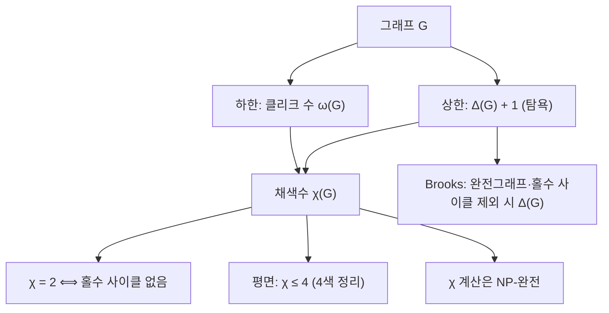

# 그래프 색칠

# 개요

그래프 색칠은 [그래프](graphs.md)의 정점(또는 간선)에 색을 배정하되 인접한 두 대상이 같은 색을 받지 않도록 하는 문제다. 필요한 색의 최소 개수를 채색수(chromatic number)라 부른다.

이 한 줄짜리 정의 뒤에 놀랄 만큼 많은 것이 숨어 있다. 채색수는 "충돌하는 자원을 몇 묶음으로 나눌 수 있는가"를 재는 양이므로 시간표 작성, 레지스터 할당, 주파수 배정 같은 실제 문제가 모두 색칠 문제로 번역된다. 동시에 채색수를 계산하는 것은 [NP-완전](np-completeness.md) 문제이고, 근사조차 어렵다. 이론적으로는 하한(클리크 수)과 상한(최대차수 + 1) 사이의 간격이 그래프 이론의 깊은 질문들을 낳았고, [평면 그래프](planar-graphs.md)에 대한 4색 정리는 조합론에서 가장 유명한 정리 중 하나다.

이 문서는 정점 색칠을 중심으로 하한·상한, 탐욕 알고리즘, Brooks 정리, 이분 그래프, 간선 색칠과 Vizing 정리, 채색 다항식, 그리고 계산 복잡도를 다룬다.

# 직관

색칠을 "분할"로 보는 것이 출발점이다. 정점을 `k`개의 색으로 칠한다는 것은 정점 집합을 `k`개의 독립집합(서로 인접하지 않은 정점들의 모임)으로 쪼갠다는 뜻이다. 따라서 채색수는 "정점 집합을 덮는 데 필요한 독립집합의 최소 개수"다.

여기서 두 가지 자연스러운 경계가 나온다.

- **아래로부터**: 서로 모두 인접한 정점 `r`개(클리크)가 있으면 그들은 전부 다른 색이어야 한다. 그러니 색은 최소 `r`개 필요하다.
- **위로부터**: 정점을 하나씩 순서대로 칠하는데, 각 정점이 이미 칠해진 이웃을 최대 `d`개 가진다면 금지된 색은 `d`개뿐이므로 `d + 1`개의 색이면 항상 빈칸이 남는다. 이것이 [비둘기집 원리](pigeonhole-principle.md)의 가장 단순한 사용이다.

이 두 경계는 일반적으로 멀리 떨어져 있다. 클리크가 전혀 없으면서도 채색수가 큰 그래프가 존재한다는 사실(Mycielski 구성, 그리고 [Ramsey 이론](ramsey-theory.md)적 구성)이 이 주제를 어렵게 만든다. 색칠은 "국소적 제약(간선 하나)"만 보고 "전역적 양(채색수)"을 알아내라는 요구이고, 국소와 전역 사이의 간격이 바로 난이도다.



# 정의

## 정점 색칠

그래프 `G = (V, E)`와 자연수 `k`에 대해, 사상

$$
c : V \to \{1, 2, \dots, k\}
$$

가 모든 간선 $uv \in E$ 에 대해 $c(u) \neq c(v)$ 를 만족하면 $c$ 를 $G$ 의 **적절한 $k$-색칠**(proper $k$-coloring)이라 한다. 이런 $c$ 가 존재하면 $G$ 는 $k$-색칠 가능하다고 한다.

**채색수**는

$$
\chi(G) = \min \{\, k \in \mathbb{N} : G \text{ 는 } k\text{-색칠 가능} \,\}
$$

이다. 색 클래스 $c^{-1}(i)$ 는 각각 독립집합이므로, 동치로

$$
\chi(G) = \min\{\, k : V \text{ 를 } k \text{ 개의 독립집합으로 분할할 수 있다} \,\}
$$

이다.

## 관련 불변량

- **클리크 수** $\omega(G)$: $G$ 가 포함하는 최대 완전부분그래프의 크기.
- **독립수** $\alpha(G)$: 최대 독립집합의 크기.
- **최대차수** $\Delta(G)$: 정점 차수의 최대값.
- **퇴화도**(degeneracy) $d(G)$: 모든 부분그래프가 차수 $d$ 이하인 정점을 하나 이상 가지게 되는 최소의 $d$.

## 간선 색칠

간선 집합 위의 사상 $c : E \to \{1, \dots, k\}$ 가 같은 정점을 공유하는 두 간선에 다른 색을 주면 적절한 간선 색칠이며, 최소 $k$ 를 **간선 채색수** $\chi'(G)$ 라 한다. 간선 색칠은 선 그래프(line graph) $L(G)$ 의 정점 색칠과 같다.

## 채색 다항식

$P(G, k)$ 를 $G$ 의 적절한 $k$-색칠의 개수로 정의한다. 이는 아래 성질 절에서 보듯 $k$ 에 대한 다항식이며, $\chi(G)$ 는 $P(G, k) > 0$ 이 되는 최소의 양의 정수다.

# 성질

## 기본 경계

모든 그래프에 대해

$$
\omega(G) \le \chi(G) \le \Delta(G) + 1
$$

가 성립한다. 왼쪽은 클리크의 정점들이 서로 다른 색을 요구하기 때문이고, 오른쪽은 아래의 탐욕 색칠이 증명한다.

또한 각 색 클래스가 독립집합이므로 크기가 $\alpha(G)$ 이하이고, 따라서

$$
\chi(G) \ge \frac{|V|}{\alpha(G)}
$$

이다. 이 부등식은 [Ramsey 이론](ramsey-theory.md)이나 [확률적 방법](probabilistic-method.md)에서 독립수 상한을 채색수 하한으로 바꿔 쓸 때 반복해서 등장한다.

## 탐욕 색칠과 퇴화도

정점을 임의의 순서 $v_1, \dots, v_n$ 으로 늘어놓고, 각 $v_i$ 에 대해 이미 칠해진 이웃들이 쓰지 않은 가장 작은 색을 준다. $v_i$ 가 금지하는 색은 많아야 $\Delta(G)$ 개이므로 $\Delta(G) + 1$ 개의 색이면 충분하다.

순서를 잘 고르면 더 나아진다. 매번 남은 그래프에서 최소차수 정점을 떼어내 얻은 순서(smallest-last ordering)를 쓰면

$$
\chi(G) \le d(G) + 1
$$

를 얻는다. 여기서 $d(G)$ 는 퇴화도다. 평면 그래프는 항상 차수 5 이하 정점을 가지므로 $d \le 5$ 이고, 즉 6색으로 칠할 수 있다는 사실이 즉시 따라온다([평면 그래프](planar-graphs.md)).

반대로 탐욕 색칠은 순서에 극도로 민감하다. 완전 이분 그래프에서도 나쁜 순서를 고르면 색을 임의로 많이 쓰게 만들 수 있다. 즉 탐욕은 상한 증명 도구이지 좋은 근사 알고리즘이 아니다.

## Brooks 정리

**정리 (Brooks, 1941).** 연결 그래프 `G`가 완전 그래프도 아니고 홀수 길이의 사이클도 아니라면

$$
\chi(G) \le \Delta(G)
$$

이다.

즉 상한 $\Delta + 1$ 이 실제로 필요한 경우는 완전 그래프 $K_{\Delta+1}$ 과 홀수 사이클 두 가지 극단뿐이다. 증명의 뼈대는 다음과 같다. $\Delta \le 2$ 인 경우는 직접 확인한다. $\Delta \ge 3$ 이면 두 가지를 보인다. 첫째, $G$ 가 2-연결이 아니면 절단점에서 쪼개어 귀납한다. 둘째, 2-연결인 경우 어떤 정점 $v$ 와 그 이웃 $u, w$ 를 $u$ 와 $w$ 가 서로 인접하지 않고 $G - u - w$ 가 연결되도록 고를 수 있다. 그러면 $u, w$ 를 먼저 같은 색으로 칠하고 나머지를 $v$ 로부터 멀어지는 순서의 역순으로 탐욕 색칠하면, 마지막에 처리되는 $v$ 의 이웃 중 두 개가 색을 공유하므로 $v$ 에 쓸 색이 남는다.

## 이분 그래프와 2-색칠

$\chi(G) \le 2$ 인 것과 $G$ 가 이분 그래프인 것, 그리고 $G$ 가 홀수 길이 사이클을 갖지 않는 것은 동치다.

증명 스케치: 2-색칠이 주어지면 두 색 클래스가 이분 분할이다. 이분 그래프에서 사이클은 두 클래스를 번갈아 지나므로 길이가 짝수다. 역으로 홀수 사이클이 없으면, 각 연결 성분에서 임의의 정점 $r$ 을 잡고 $r$ 로부터의 거리의 홀짝으로 색을 준다. 같은 색인 두 정점이 인접하면 홀수 사이클이 생기므로 모순이다. 이 판정은 너비 우선 탐색으로 선형 시간에 끝나며, [매칭과 Hall 정리](matchings.md)에서 이분 구조가 다시 중심 역할을 한다.

$k \ge 3$ 부터는 상황이 급변한다. 3-색칠 가능성 판정은 NP-완전이다.

## 간선 색칠과 Vizing 정리

같은 정점에 붙은 간선은 모두 다른 색을 받아야 하므로 $\chi'(G) \ge \Delta(G)$ 는 자명하다. 놀라운 것은 상한이다.

**정리 (Vizing, 1964; Gupta, 1966).** 단순 그래프 $G$ 에 대해

$$
\Delta(G) \le \chi'(G) \le \Delta(G) + 1
$$

이다.

따라서 모든 단순 그래프는 간선 채색수 기준으로 $\chi' = \Delta$ 인 class 1 또는 $\chi' = \Delta + 1$ 인 class 2 로 딱 두 종류다. 홀수 사이클과 Petersen 그래프는 class 2, 이분 그래프는 König의 간선 색칠 정리에 의해 항상 class 1 이다. 어느 class 인지 판정하는 것 자체는 $\Delta = 3$ 일 때조차 NP-완전이다.

## 4색 정리와 5색 정리

평면 그래프는 $\chi \le 4$ 이다(Appel–Haken, 1976[^1]; Robertson–Sanders–Seymour–Thomas의 재증명, 1997[^2]). 두 증명 모두 불가피 집합(unavoidable set)과 축약 가능 배치(reducible configuration)를 컴퓨터로 검사하는 구조이며, 사람 손으로 검증 가능한 증명은 아직 없다. Gonthier가 Coq로 형식 검증했다.

반면 5색 정리는 한 쪽짜리 증명이 있다. 자세한 스케치는 [평면 그래프](planar-graphs.md)에 둔다. 하한 쪽은 $K_4$ 가 평면이므로 4가 최적이다.

## 채색 다항식

`P(G, k)` 는 삭제-축약(deletion–contraction) 점화식

$$
P(G, k) = P(G - e, k) - P(G / e, k)
$$

를 만족한다. 우변 첫 항은 `e`의 양 끝 색이 같아도 되는 색칠 수, 둘째 항은 같은 색인 색칠 수를 세므로 차이가 `e`를 존중하는 색칠 수다. 간선 수에 대한 귀납으로 `P(G, k)` 가 `k`에 대해 차수 `|V|` 의 정수 계수 다항식이고 최고차항 계수가 1, 그 다음 계수가 `-|E|` 임을 얻는다.

동치로 [포함배제 원리](inclusion-exclusion.md)를 간선 부분집합에 적용하면

$$
P(G, k) = \sum_{S \subseteq E} (-1)^{|S|} k^{\,c(S)}
$$

를 얻는다. 여기서 `c(S)` 는 간선 집합 `S`만 남긴 그래프의 연결 성분 수다. 이 표현은 Whitney의 정리이며, 채색 다항식이 Tutte 다항식의 특수화이고 [matroid](matroids.md) 이론과 이어지는 통로다.

예: 완전 그래프는 `P(K_n, k) = k(k-1)⋯(k-n+1)`, 트리는 `P(T, k) = k(k-1)^{n-1}`, 길이 `n`의 사이클은

$$
P(C_n, k) = (k-1)^n + (-1)^n (k-1)
$$

이다.

## 계산 복잡도

$k \ge 3$ 고정에 대해 $k$-색칠 가능성 판정은 NP-완전이다(Karp의 21개 문제 목록에 포함[^3]). 따라서 $\chi(G)$ 계산은 [P 대 NP 문제](p-np.md)의 그림자 아래 놓여 있다. 근사 역시 어렵다. 임의의 $\varepsilon > 0$ 에 대해 $\chi(G)$ 를 $\lvert V \rvert^{1-\varepsilon}$ 배 이내로 근사하는 것도 NP-난해임이 알려져 있다. 3-색칠 가능한 그래프를 다항 시간에 몇 색으로 칠할 수 있는가는 지금도 열린 문제에 가깝고, 최선의 알고리즘이 쓰는 색 수는 $\lvert V \rvert$ 의 작은 거듭제곱 꼴이다.

실무에서는 정확 해를 포기하고 DSATUR 같은 휴리스틱, 정수계획법, SAT 솔버를 쓴다.

# 활용

## 자원 배정

색칠의 표준 응용은 "충돌 그래프"를 만드는 것이다. 시험 시간표에서 정점은 과목, 간선은 "같이 수강하는 학생이 있음"이고 색은 시험 시간대다. 컴파일러의 레지스터 할당에서 정점은 변수의 생존 구간, 간선은 생존 구간의 겹침, 색은 물리 레지스터다. 무선 주파수 배정에서 정점은 기지국, 간선은 간섭 가능성이다.

이 응용들이 공통으로 쓰는 사실은 두 가지다. 첫째, 상한 $\Delta + 1$ 은 탐욕으로 항상 달성되므로 "최악의 경우 자원이 몇 개 필요한가"에 즉답을 준다. 둘째, 클리크를 하나 찾으면 "이보다 적게는 불가능하다"는 증명서가 된다.

## 다른 조합론 문제로의 환원

- **스케줄링과 매칭**: 이분 그래프의 간선 색칠은 작업-기계 배정을 시간 단위로 쪼개는 문제이며, König 정리에 의해 $\Delta$ 개 시간대로 충분하다. 이 결과는 [매칭과 Hall 정리](matchings.md)의 완전 매칭 분해로 증명된다.
- **독립집합 세기**: `P(G, k)` 의 계수는 그래프의 구조적 정보를 담고 있고, [생성함수](generating-functions.md)의 관점에서 다루면 부분집합 합 공식이 자연스럽게 나온다.
- **Ramsey 하한**: "클리크도 독립집합도 작다"는 그래프의 존재는 [확률적 방법](probabilistic-method.md)으로 보이며, 그런 그래프는 자동으로 채색수가 큰데 클리크는 작은 예가 된다.

## 코드

퇴화도 순서 기반 탐욕 색칠과 완전 탐색 기반 채색수 계산을 함께 둔다.

```python
from itertools import product

def degeneracy_order(adj):
    """매번 최소차수 정점을 떼어낸 순서를 뒤집어 돌려준다."""
    deg = {v: len(ns) for v, ns in adj.items()}
    alive = set(adj)
    order = []
    while alive:
        v = min(alive, key=lambda u: deg[u])
        alive.remove(v)
        order.append(v)
        for u in adj[v]:
            if u in alive:
                deg[u] -= 1
    return order[::-1]

def greedy_coloring(adj, order=None):
    order = order or degeneracy_order(adj)
    color = {}
    for v in order:
        used = {color[u] for u in adj[v] if u in color}
        c = 0
        while c in used:
            c += 1
        color[v] = c
    return color

def chromatic_number(adj):
    """작은 그래프용 완전 탐색. 하한(탐욕 클리크)과 상한(탐욕) 사이만 시도한다."""
    vs = list(adj)
    upper = max(greedy_coloring(adj).values()) + 1
    for k in range(1, upper + 1):
        for assign in product(range(k), repeat=len(vs)):
            c = dict(zip(vs, assign))
            if all(c[u] != c[v] for u in vs for v in adj[u]):
                return k, c
    return upper, greedy_coloring(adj)

# Petersen 그래프: χ = 3, Δ = 3 이므로 Brooks 정리의 상한이 헐겁다.
outer = {i: {(i + 1) % 5, (i - 1) % 5, i + 5} for i in range(5)}
inner = {i + 5: {(i + 2) % 5 + 5, (i - 2) % 5 + 5, i} for i in range(5)}
petersen = {**outer, **inner}

print(max(greedy_coloring(petersen).values()) + 1)  # 탐욕 결과 (순서 의존)
print(chromatic_number(petersen)[0])                # 3

cycle5 = {i: {(i + 1) % 5, (i - 1) % 5} for i in range(5)}
print(chromatic_number(cycle5)[0])                  # 3 (홀수 사이클)
```

채색 다항식은 삭제-축약을 그대로 재귀로 옮기면 된다.

```python
def chromatic_polynomial(n, edges):
    """P(G, k) 의 계수를 낮은 차수부터 담은 리스트로 돌려준다."""
    if not edges:
        return [0] * n + [1]          # k^n
    e, rest = edges[0], edges[1:]
    a = chromatic_polynomial(n, rest)  # G - e
    u, v = e
    relabel = lambda w: (u if w == v else w)
    merged = sorted({(min(relabel(x), relabel(y)), max(relabel(x), relabel(y)))
                     for x, y in rest if relabel(x) != relabel(y)})
    b = chromatic_polynomial(n - 1, merged)  # G / e
    b = b + [0] * (len(a) - len(b))
    return [x - y for x, y in zip(a, b)]

# C_4: P(k) = (k-1)^4 + (k-1) = k^4 - 4k^3 + 6k^2 - 3k
print(chromatic_polynomial(4, [(0, 1), (1, 2), (2, 3), (0, 3)]))
```

## 이론적 위치

색칠은 "국소 제약에서 전역 분할을 얻는" 문제의 원형이다. 같은 형태가 [선형계획법](linear-programming.md)의 완화(분수 채색수), 준정부호 계획법(Lovász theta 함수, 완벽 그래프 이론), [확률적 방법](probabilistic-method.md)의 Lovász local lemma 기반 색칠 정리에서 반복된다. 특히 완벽 그래프(모든 유도 부분그래프에서 $\omega = \chi$ 인 그래프)의 이론은 $\omega \le \chi$ 라는 자명한 부등식이 언제 등호가 되는지를 묻는 질문이고, 강한 완벽 그래프 정리(2006)로 답이 나왔다. 색칠의 어려움은 대부분 $\omega$ 와 $\chi$ 사이의 간격에서 나온다는 관점이 여기서 가장 뚜렷하다.

[^1]: K. Appel, W. Haken, "Every planar map is four colorable", Bulletin of the American Mathematical Society 82 (1976), https://www.ams.org/journals/bull/1976-82-05/S0002-9904-1976-14122-5/
[^2]: N. Robertson, D. Sanders, P. Seymour, R. Thomas, "The Four-Colour Theorem", Journal of Combinatorial Theory Series B 70 (1997), https://doi.org/10.1006/jctb.1997.1750
[^3]: R. M. Karp, "Reducibility Among Combinatorial Problems", Complexity of Computer Computations (1972), https://doi.org/10.1007/978-1-4684-2001-2_9

# 연관 문서

## 선수지식

- [그래프](graphs.md)
- [비둘기집 원리](pigeonhole-principle.md)

## 더 알아보기

- [Lovász 세타 함수](lovasz-theta.md)

#graph_theory
