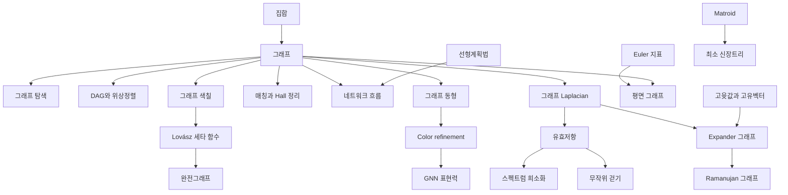

# 그래프 이론 개관

# 개요

그래프 이론은 정점과 간선만으로 이루어진 구조를 다룬다. 물음은 "연결 관계만 남겼을 때 무엇을 말할 수 있는가" 이고, 답은 세 방향에서 온다. 조합적 논증, 다항시간 알고리즘, 그리고 인접행렬의 스펙트럼이다.

그래프 이론의 갈래는 다섯 줄기다. 기본 구조와 평면성, 색칠과 매칭, 최적화 알고리즘, 동형 판정, 그리고 스펙트럼 그래프 이론이다. 그래프 알고리즘의 계산복잡도 쪽은 [NP-완전성](np-completeness.md)(nondeterministic polynomial time)에, 조합적 세기 쪽은 [조합론 개관](combinatorics-overview.md)에 있다.

시작은 [그래프](graphs.md)다. 거기서 [그래프 색칠](graph-coloring.md)과 [매칭](matchings.md)이 조합적 갈래로, [네트워크 흐름](network-flow.md)이 알고리즘 갈래로, [그래프 Laplacian](graph-laplacian.md)이 스펙트럼 갈래로 갈라진다.

# 지도

# 갈래

## 기본 구조

- [그래프](graphs.md): 정점과 간선, 차수, 경로와 연결성
- [그래프 탐색](graph-search.md): DFS(depth-first search)와 BFS(breadth-first search), 탐색 트리와 간선 분류, 강연결성분
- [DAG와 위상정렬](dag-topological.md): 방향 비순환 그래프와 선형 순서
- [평면 그래프](planar-graphs.md): Euler 공식과 Kuratowski 정리
- [교차수 부등식](crossing-number-inequality.md): 변이 많을 때 교차수의 세제곱 하한, 무작위 부분그래프 논증
- [그래프 마이너](graph-minors.md): 정렬 유사 순서와 유한 금지 마이너, 나무폭
- [Hamilton 순환](hamiltonian-cycles.md): Dirac 과 Ore 의 차수 조건, 닫힘, 판정의 NP-완전성

## 색칠과 매칭

- [그래프 색칠](graph-coloring.md): 채색수, 탐욕 상한, 4색 정리
- [Tutte 다항식](tutte-polynomial.md): 채색 다항식과 신장트리 개수를 함께 거두는 두 변수 불변량
- [매칭과 Hall 정리](matchings.md): 이분그래프의 완전매칭 조건
- [완전그래프와 강한 완전그래프 정리](perfect-graphs.md): 채색수와 클릭 수가 모든 유도부분그래프에서 같은 그래프

## 알고리즘과 최적화

- [최소 신장트리](minimum-spanning-tree.md): 탐욕 알고리즘이 최적이 되는 Matroid 구조
- [네트워크 흐름과 최대유량 최소절단 정리](network-flow.md): 흐름의 최댓값과 절단의 최솟값이 같다

## 동형과 구별

- [그래프 동형](graph-isomorphism.md): 라벨을 잊은 동일성과 그 판정 문제
- [Color refinement](color-refinement.md): 1차원 Weisfeiler–Leman 알고리즘과 그 한계
- [그래프 신경망의 표현력](gnn-expressivity.md): 메시지 전달 신경망의 구별력이 색 세분과 같다

## 스펙트럼 그래프 이론

- [그래프 Laplacian](graph-laplacian.md): 차수행렬과 인접행렬의 차, 고윳값과 연결성분
- [유효저항](effective-resistance.md): 그래프를 전기 회로로 읽는다
- [Expander 그래프](expander-graphs.md): 성김과 강한 연결성의 공존
- [Ramanujan 그래프의 명시적 구성](ramanujan-graphs.md): 스펙트럼 간극의 최적 경계를 달성하는 구성
- [스펙트럼 희소화](spectral-sparsification.md): 유효저항 표본추출로 간선 수를 줄인다

# 연관 문서

## 선수지식

- [집합](sets.md)

## 더 알아보기

- [그래프](graphs.md)
- [최소 신장트리](minimum-spanning-tree.md)
- [완전그래프와 강한 완전그래프 정리](perfect-graphs.md)

#graph_theory #combinatorics #algorithms #overview
