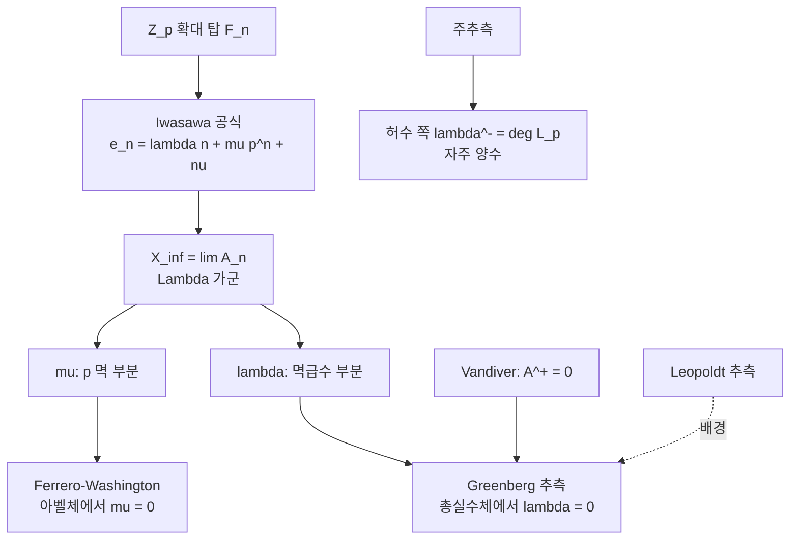

# Greenberg 추측과 총실수체의 Iwasawa 불변량

# 개요

수체 $F$ 위에 순환 $\mathbb Z_p$ 확대의 탑 $F=F_0\subset F_1\subset\cdots$ 을 쌓고 각 층의 류수의 $p$ 지수를 $p^{e_n}$ 이라 하면, 충분히 큰 $n$ 에서

$$
e_n=\lambda n+\mu p^{n}+\nu
$$

가 성립한다(Iwasawa). 세 정수 $\lambda,\mu,\nu$ 가 탑 전체의 산술을 요약한다. **Greenberg 추측은 $F$ 가 총실수체이면 $\lambda=\mu=0$ 이라고 말한다.** 곧 탑을 아무리 올라가도 류수의 $p$ 부분이 유계에 머문다는 주장이다.

허수 쪽과 대비하면 주장의 무게가 드러난다. [Iwasawa 주추측](iwasawa-main-conjecture.md)은 $\lambda^{-}$ 를 $p$ 진 $L$ 함수의 영점 개수로 계산해 주고, 그 값은 실제로 자주 양수다. 반면 실수 쪽에는 $\lambda^{+}$ 를 재는 해석적 대응물이 없고, 예측은 "아예 0" 이다. **한쪽은 공식이 있고 다른 쪽은 소멸 예측만 있다**는 이 비대칭이 [Vandiver 추측](vandiver-conjecture.md)에서 본 것과 정확히 같은 비대칭이다. 실제로 Vandiver 는 Greenberg 의 특수한 경우를 함의하며, Greenberg 쪽이 더 약하고 더 일반적인 진술이다.

$\mu=0$ 부분은 아벨체에 대해 증명되어 있다(Ferrero–Washington). 남은 것은 $\lambda=0$ 이고, 50 년째 열려 있다.

# 직관

## 탑을 올라가며 류군이 어떻게 자라는가

$X_\infty=\varprojlim A_n$ 은 Iwasawa 대수 $\Lambda=\mathbb Z_p[[T]]$ 위의 유한생성 비틀림 가군이고, 구조 정리로

$$
X_\infty\ \sim\ \bigoplus_i\Lambda/(p^{m_i})\ \oplus\ \bigoplus_j\Lambda/(f_j(T))
$$

로 분해된다. $\mu=\sum m_i$ 는 $p$ 로 나뉘는 부분의 크기, $\lambda=\sum\deg f_j$ 는 비틀림 멱급수 부분의 차수다. **$\lambda=\mu=0$ 이라는 것은 $X_\infty$ 가 유한가군이라는 뜻**이고, 탑의 류군이 어느 층부터 더 자라지 않는다는 말이다.

## 왜 실수 쪽만 다른가

허수 순환체에서 $A^{-}$ 는 Stickelberger 원소라는 소멸자를 갖고, 그 소멸자의 크기가 $L$ 값으로 주어진다. $L$ 값이 $p$ 로 나뉘는 일이 심심찮게 일어나므로 $A^{-}$ 는 실제로 비자명해지고 $\lambda^{-}>0$ 이 된다.

$A^{+}$ 쪽에는 그런 소멸자가 없다. 대신 주추측이 류군을 **단수와 순환체 단수의 지표**와 같다고 말해 주는데, 이 등식은 양쪽이 동시에 0 일 가능성을 배제하지 않는다. 단수군이 순환체 단수로 거의 다 채워져 있으리라는 기대가 곧 $\lambda^{+}=0$ 의 기대이고, 그것을 증명할 도구가 없다는 사정도 그대로다. **"만들 재료가 없으니 없을 것" 이라는 형태의 믿음**이다.

## Leopoldt 추측이 먼저 필요하다

$F$ 가 총실수체면 $\mathbb Z_p$ 확대가 몇 개나 있는가. 후보의 개수는 $1+\delta$ 이고 $\delta$ 는 $p$ 진 조절자의 소멸 차수다. Leopoldt 추측($\delta=0$)이 참이면 $\mathbb Z_p$ 확대는 순환 확대 하나뿐이고, 그때 Greenberg 추측의 진술이 애매함 없이 확정된다. **Greenberg 추측은 Leopoldt 추측을 배경으로 놓고 읽는 진술**이다.

# 정의

## 순환 $\mathbb Z_p$ 확대

$\mu_{p^{n}}$ 을 차례로 붙여 만든 $\mathbb Q_\infty=\bigcup\mathbb Q(\mu_{p^{n}})^{+}$ 는 $\mathbb Q$ 의 유일한 $\mathbb Z_p$ 확대다. 일반 수체 $F$ 에 대해 $F_\infty=F\mathbb Q_\infty$ 를 **순환 $\mathbb Z_p$ 확대**라 하고, $\Gamma=\operatorname{Gal}(F_\infty/F)\cong\mathbb Z_p$ 로 둔다.

## 불변량

$A_n$ 을 $F_n$ 의 류군의 $p$ 부분이라 하고 $X_\infty=\varprojlim A_n$ 이라 하면 $X_\infty$ 는 $\Lambda=\mathbb Z_p[[T]]$ 위의 유한생성 비틀림 가군이다. 그 특성 아이디얼

$$
\mathrm{char}_\Lambda(X_\infty)=\big(p^{\mu}f(T)\big),\qquad \lambda=\deg f
$$

에서 $\lambda,\mu$ 를 읽고, $\nu$ 는 남은 유한 보정이다. 이 $\lambda,\mu$ 로 $|A_n|=p^{\lambda n+\mu p^{n}+\nu}$ 가 큰 $n$ 에서 성립한다.

## Greenberg 추측

> **추측(Greenberg, 1976).** $F$ 가 총실수체이고 $p$ 가 임의의 소수면 $F$ 의 순환 $\mathbb Z_p$ 확대에 대해 $\lambda=\mu=0$ 이다. 동치로 $X_\infty$ 가 유한하다.

일반화 Greenberg 추측은 여러 $\mathbb Z_p$ 확대를 동시에 다루는 $\mathbb Z_p^{d}$ 확대 위에서 $X_\infty$ 가 **유사영(pseudo-null)** 이라고 주장하는 형태로 진술된다. 차원이 올라가면 "유한" 대신 "여차원 2 이상" 이 적절한 소멸 개념이 된다.

# 성질

## $\mu=0$ 은 아벨체에서 증명되어 있다

**정리(Ferrero–Washington, 1979).** $F/\mathbb Q$ 가 아벨 확대면 $\mu_p(F)=0$ 이다.

증명은 $p$ 진 $L$ 함수의 계수를 $p$ 진 전개로 쓰고, 그 숫자열이 정규수처럼 고르게 분포한다는 것을 보이는 방식이다. **해석적이기보다 조합적인 논증**이라는 점이 특이하고, 그래서 일반 수체로 확장되지 않는다. 일반 수체에서는 $\mu>0$ 인 $\mathbb Z_p$ 확대가 실제로 존재하지만(Iwasawa 의 예), 그 예는 순환 확대가 아니다.

## Vandiver 와의 관계

$F=\mathbb Q(\mu_p)^{+}$ 로 두면 Vandiver 추측 $A^{+}=0$ 은 곧 $X_\infty^{+}=0$ 을 주고, 따라서 $\lambda^{+}=\mu^{+}=0$ 이다.

$$
\text{Vandiver}\ \Longrightarrow\ \text{Greenberg}\ (\text{이 }F,p\text{ 에 대해})
$$

역은 성립하지 않는다. $\lambda^{+}=0$ 이면서 $A^{+}\ne0$ 인 것은 논리적으로 가능하다. 유한한 류군이 탑 위에서 자라지 않기만 하면 되기 때문이다. **Greenberg 가 더 약한 주장이고 더 넓은 체에 대해 말한다**는 점에서, 두 추측은 같은 현상의 국소판과 광역판에 해당한다.

## 실이차체에서의 수치

가장 많이 계산된 경우가 $F=\mathbb Q(\sqrt d)$, $p=3$ 이다. $\lambda=0$ 을 유한 단계의 계산으로 판정하는 기준(Fukuda–Komatsu 형태의 판정법)이 있어서, 어떤 층에서 류군의 크기가 안정되고 특정 아이디얼이 주 아이디얼이 되면 그 위로 더 자라지 않음이 확정된다.

| 상황 | 결과 |
| --- | --- |
| $p$ 가 $F$ 에서 비분해, $p\nmid h_F$ | $\lambda=\mu=\nu=0$ (고전적) |
| 실이차체, $p=3$, 대규모 탐색 | 반례 없음 |
| 순환체 $\mathbb Q(\mu_p)^{+}$, $p<2^{31}$ | Vandiver 성립 $\Rightarrow$ $\lambda^{+}=0$ |

첫 줄이 가장 자주 쓰이는 충분조건이다. **$p$ 가 분해되지 않으면 탑의 아래층에서 이미 모든 것이 결정된다**는 것이 요점이고, 어려운 경우는 $p$ 가 여러 소 아이디얼로 갈라지는 때다.

## 왜 증명이 안 되는가

$\lambda^{-}$ 는 $p$ 진 $L$ 함수라는 **해석적 대상의 영점을 세는 문제**로 번역되어, 적어도 무엇을 계산해야 하는지가 분명하다. $\lambda^{+}$ 에는 그런 번역이 없다. 주추측이 주는 것은 류군과 단수 지표의 **비**이고, 비가 1 이라는 정보만으로는 양쪽이 0 인지 알 수 없다.

[Euler 계](euler-systems.md)를 쓰려 해도 순환체 단수가 주는 Euler 계는 이미 주추측 증명에 소진되었다. $A^{+}$ 를 누를 새로운 대수적 원소가 필요한데 후보가 알려져 있지 않다. **도구가 부족한 것이 아니라 도구를 만들 재료가 보이지 않는다**는 쪽에 가깝다.

# 활용

## $K$ 이론으로의 번역

Quillen–Lichtenbaum 이후 $\mathbb Z$ 의 대수적 $K$ 군은 순환체의 에탈 코호몰로지로 계산되고, 짝수 지표 성분의 소멸이 $K_{4k}(\mathbb Z)=0$ 과 맞물린다. Greenberg 추측이 참이면 이 소멸이 탑 전체에서 안정적으로 유지된다. **정수환의 위상적 불변량이 실수체의 Iwasawa 불변량에 걸려 있다**는 이 연결이 추측에 대한 관심이 식지 않는 이유 중 하나다.

## 류수 계산의 조기 종료

탑 $F_n$ 의 류수를 실제로 계산할 때 $\lambda=\mu=0$ 이 확인되면 유한 단계에서 계산을 멈출 수 있다. 위의 판정법이 이런 계산의 표준 도구이고, 대규모 수치 검증은 전부 이 형태로 이루어진다. 반대로 $\lambda>0$ 인 총실수체가 하나라도 발견되면 추측이 즉시 무너지므로, **계산이 곧 반증 시도**이기도 하다.

## 비가환 Iwasawa 이론의 시험대

$\mathbb Z_p^{d}$ 확대나 비가환 $p$ 진 Lie 확대 위에서 Iwasawa 가군의 크기를 재는 이론이 발전하면서, 일반화 Greenberg 추측이 그 이론의 기본 시험 문제로 쓰인다. 소멸을 주장하는 명제는 새로운 대수적 틀이 실제로 힘을 갖는지 가장 빠르게 확인시켜 주기 때문이다. [Galois 표현](galois-representations.md)의 변형 이론과 Selmer 가군을 함께 보는 관점에서도 같은 질문이 반복해 제기된다.[^1]

[^1]: 원 논문은 R. Greenberg, *On the Iwasawa invariants of totally real number fields*, Amer. J. Math. 98 (1976). $\mu=0$ 은 B. Ferrero, L. Washington, Ann. of Math. 109 (1979). 전반적인 정리는 L. Washington, *Introduction to Cyclotomic Fields* (2판) 13 장과 R. Greenberg 의 개설 *Iwasawa theory — past and present* (2001)에 있다. 실이차체 수치와 판정법은 T. Fukuda, K. Komatsu 등의 일련의 계산 논문을 참고한다.

# 연관 문서

## 선수지식

- [Vandiver 추측과 순환체의 짝수 성분](vandiver-conjecture.md)

## 더 알아보기

- 아직 연결한 문서가 없다.

#number_theory #algebra
