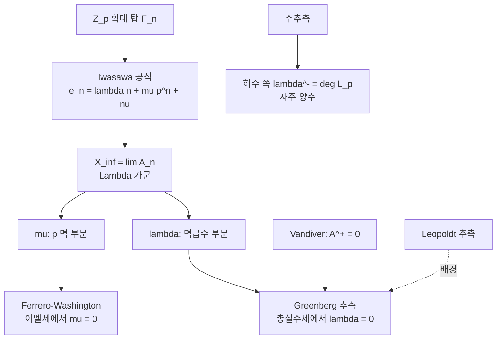

# Greenberg 추측과 총실수체의 Iwasawa 불변량

# 개요

수체 $F$ 위에 순환 $\mathbb Z_p$ 확대의 탑 $F=F_0\subset F_1\subset\cdots$ 을 쌓고 각 층의 류수의 $p$ 지수를 $p^{e_n}$ 이라 하면, 충분히 큰 $n$ 에서

$$
e_n=\lambda n+\mu p^{n}+\nu
$$

가 성립한다(Iwasawa). 세 정수 $\lambda,\mu,\nu$ 가 탑 전체의 산술을 요약한다. **Greenberg 추측**은 $F$ 가 총실수체이면 $\lambda=\mu=0$ 이라는 것, 곧 탑을 올라가도 류수의 $p$ 부분이 유계에 머문다는 주장이다.

[Iwasawa 주추측](iwasawa-main-conjecture.md)은 $\lambda^{-}$ 를 $p$ 진 $L$ 함수의 영점 개수로 계산하고 그 값이 자주 양수다. 실수 쪽에는 $\lambda^{+}$ 를 재는 해석적 대응물이 없고 예측은 소멸이다. 한쪽에 공식이 있고 다른 쪽에 소멸 예측만 있는 이 비대칭이 [Vandiver 추측](vandiver-conjecture.md)에도 나타난다. Vandiver 추측은 Greenberg 추측의 특수한 경우를 함의하고, Greenberg 쪽이 더 약하고 일반적이다.

$\mu=0$ 은 아벨체에 대해 증명되어 있고(Ferrero–Washington), $\lambda=0$ 은 증명되지 않았다[^1].

# 직관

## 탑에서의 류군의 성장

$X_\infty=\varprojlim A_n$ 은 Iwasawa 대수 $\Lambda=\mathbb Z_p[[T]]$ 위의 유한생성 비틀림 가군이고, 구조 정리로

$$
X_\infty\ \sim\ \bigoplus_i\Lambda/(p^{m_i})\ \oplus\ \bigoplus_j\Lambda/(f_j(T))
$$

로 분해된다. $\mu=\sum m_i$ 는 $p$ 로 나뉘는 부분의 크기이고 $\lambda=\sum\deg f_j$ 는 비틀림 멱급수 부분의 차수다. $\lambda=\mu=0$ 은 $X_\infty$ 가 유한가군이라는 뜻이고, 탑의 류군이 어느 층부터 자라지 않는다는 뜻이다.

## 실수 쪽과 허수 쪽의 차이

허수 순환체에서 $A^{-}$ 는 Stickelberger 원소라는 소멸자를 갖고, 그 소멸자의 크기가 $L$ 값으로 주어진다. $L$ 값이 $p$ 로 나뉘는 일이 심심찮게 일어나므로 $A^{-}$ 는 실제로 비자명해지고 $\lambda^{-}\gt 0$ 이 된다.

$A^{+}$ 쪽에는 그런 소멸자가 없다. 주추측은 류군을 단수와 순환체 단수의 지표와 같다고 하지만, 이 등식은 양쪽이 동시에 0 일 가능성을 배제하지 않는다. 단수군이 순환체 단수로 거의 채워져 있으리라는 기대가 $\lambda^{+}=0$ 의 근거이고, 이를 증명할 도구는 없다.

## Leopoldt 추측과의 관계

총실수체 $F$ 의 $\mathbb Z_p$ 확대 후보는 $1+\delta$ 개이고 $\delta$ 는 $p$ 진 조절자의 소멸 차수다. Leopoldt 추측 $\delta=0$ 이 참이면 $\mathbb Z_p$ 확대가 순환 확대 하나뿐이고 Greenberg 추측의 진술이 확정된다.

# 정의

## 순환 $\mathbb Z_p$ 확대

$\mu_{p^{n}}$ 을 차례로 붙여 만든 $\mathbb Q_\infty=\bigcup\mathbb Q(\mu_{p^{n}})^{+}$ 가 $\mathbb Q$ 의 유일한 $\mathbb Z_p$ 확대다. 일반 수체 $F$ 에 대해 $F_\infty=F\mathbb Q_\infty$ 를 **순환 $\mathbb Z_p$ 확대**라 하고, $\Gamma=\mathrm{Gal}(F_\infty/F)\cong\mathbb Z_p$ 로 둔다.

## 불변량

$A_n$ 을 $F_n$ 의 류군의 $p$ 부분이라 하고 $X_\infty=\varprojlim A_n$ 이라 하면 $X_\infty$ 는 $\Lambda=\mathbb Z_p[[T]]$ 위의 유한생성 비틀림 가군이다. 그 특성 [아이디얼](ideals-quotient-rings.md)

$$
\mathrm{char}\_\Lambda(X_\infty)=\big(p^{\mu}f(T)\big),\qquad \lambda=\deg f
$$

에서 $\lambda,\mu$ 를 읽고 $\nu$ 는 남은 유한 보정이다. 큰 $n$ 에서 $|A_n|=p^{\lambda n+\mu p^{n}+\nu}$ 가 성립한다.

## Greenberg 추측

> **추측(Greenberg, 1976).** $F$ 가 총실수체이고 $p$ 가 임의의 소수면 $F$ 의 순환 $\mathbb Z_p$ 확대에 대해 $\lambda=\mu=0$ 이다. 동치로 $X_\infty$ 가 유한하다.

일반화 Greenberg 추측은 $\mathbb Z_p^{d}$ 확대 위에서 $X_\infty$ 가 **유사영**(pseudo-null)이라고 주장한다. 차원이 올라가면 유한성 대신 여차원 2 이상이 소멸 조건이 된다.

# 성질

## 아벨체에서의 $\mu=0$

**정리(Ferrero–Washington, 1979).** $F/\mathbb Q$ 가 아벨 확대면 $\mu_p(F)=0$ 이다.

증명은 $p$ 진 $L$ 함수의 계수를 $p$ 진 전개로 쓰고 그 숫자열이 정규수처럼 고르게 분포함을 보이는 조합적 논증이라 일반 수체로 확장되지 않는다. 일반 수체에는 $\mu\gt 0$ 인 $\mathbb Z_p$ 확대가 존재하지만(Iwasawa 의 예) 그 예는 순환 확대가 아니다.

## Vandiver 와의 관계

$F=\mathbb Q(\mu_p)^{+}$ 로 두면 Vandiver 추측 $A^{+}=0$ 은 곧 $X_\infty^{+}=0$ 을 주고, 따라서 $\lambda^{+}=\mu^{+}=0$ 이다.

$$
\text{Vandiver}\ \Longrightarrow\ \text{Greenberg}\ (\text{이 }F,p\text{ 에 대해})
$$

역은 성립하지 않는다. 유한한 류군이 탑 위에서 자라지 않기만 하면 되므로 $\lambda^{+}=0$ 이면서 $A^{+}\ne0$ 일 수 있다. Greenberg 추측이 더 약한 주장이고 더 넓은 체를 다룬다.

## 실이차체에서의 수치

$F=\mathbb Q(\sqrt d)$ 와 $p=3$ 인 경우가 가장 많이 계산되었다. Fukuda–Komatsu 형태의 판정법은 어떤 층에서 류군의 크기가 안정되고 특정 아이디얼이 주 아이디얼이 되면 그 위로 자라지 않음을 유한 단계에서 확정한다.

| 상황 | 결과 |
| --- | --- |
| $p$ 가 $F$ 에서 비분해, $p\nmid h_F$ | $\lambda=\mu=\nu=0$ (고전적) |
| 실이차체이고 $p=3$ 인 대규모 탐색 | 반례 없음 |
| 순환체 $\mathbb Q(\mu_p)^{+}$ 에서 $p\lt 2^{31}$ | Vandiver 성립 $\Rightarrow$ $\lambda^{+}=0$ |

첫 줄이 가장 자주 쓰이는 충분조건이다. $p$ 가 분해되지 않으면 탑의 아래층에서 모든 것이 결정되고, 어려운 경우는 $p$ 가 여러 소 아이디얼로 갈라지는 때다.

## 증명의 장애

$\lambda^{-}$ 는 $p$ 진 $L$ 함수의 영점을 세는 문제로 번역된다. $\lambda^{+}$ 에는 그런 번역이 없다. 주추측이 주는 것은 류군과 단수 지표의 비이고, 비가 1 이라는 정보로는 양쪽이 0 인지 알 수 없다.

순환체 단수가 주는 [Euler 계](euler-systems.md)는 주추측 증명에 이미 쓰였고, 그 결론은 류군과 단수 지표의 비까지다.

# 활용

## $K$ 이론으로의 번역

Quillen–Lichtenbaum 이후 $\mathbb Z$ 의 대수적 $K$ 군은 순환체의 에탈 코호몰로지로 계산되고, 짝수 지표 성분의 소멸이 $K_{4k}(\mathbb Z)=0$ 과 맞물린다. Greenberg 추측이 참이면 이 소멸이 탑 전체에서 유지된다. 정수환의 위상적 불변량이 실수체의 Iwasawa 불변량과 이어진다.

## 류수 계산의 조기 종료

탑 $F_n$ 의 류수를 계산할 때 $\lambda=\mu=0$ 이 확인되면 유한 단계에서 계산을 멈춘다. 위의 판정법이 이런 계산의 표준 도구이고 대규모 수치 검증이 이 형태로 이루어진다. $\lambda\gt 0$ 인 총실수체가 하나라도 발견되면 추측이 무너지므로 계산이 반증 시도이기도 하다.

## 비가환 Iwasawa 이론의 시험대

$\mathbb Z_p^{d}$ 확대나 비가환 $p$ 진 Lie 확대 위에서 Iwasawa 가군의 크기를 재는 이론에서 일반화 Greenberg 추측이 시험 문제로 쓰인다. [Galois 표현](galois-representations.md)의 변형 이론과 Selmer 가군을 함께 보는 관점에서도 같은 질문이 제기된다.[^1]

[^1]: 원 논문은 R. Greenberg, *On the Iwasawa invariants of totally real number fields*, Amer. J. Math. 98 (1976). $\mu=0$ 은 B. Ferrero, L. Washington, Ann. of Math. 109 (1979). 전반적인 정리는 L. Washington, *Introduction to Cyclotomic Fields* (2판) 13 장과 R. Greenberg 의 개설 *Iwasawa theory — past and present* (2001)에 있다. 실이차체 수치와 판정법은 T. Fukuda, K. Komatsu 등의 일련의 계산 논문을 참고한다.

# 연관 문서

## 선수지식

- [Vandiver 추측과 순환체의 짝수 성분](vandiver-conjecture.md)

## 더 알아보기

아직 연결한 문서가 없다.

#number_theory #algebra
