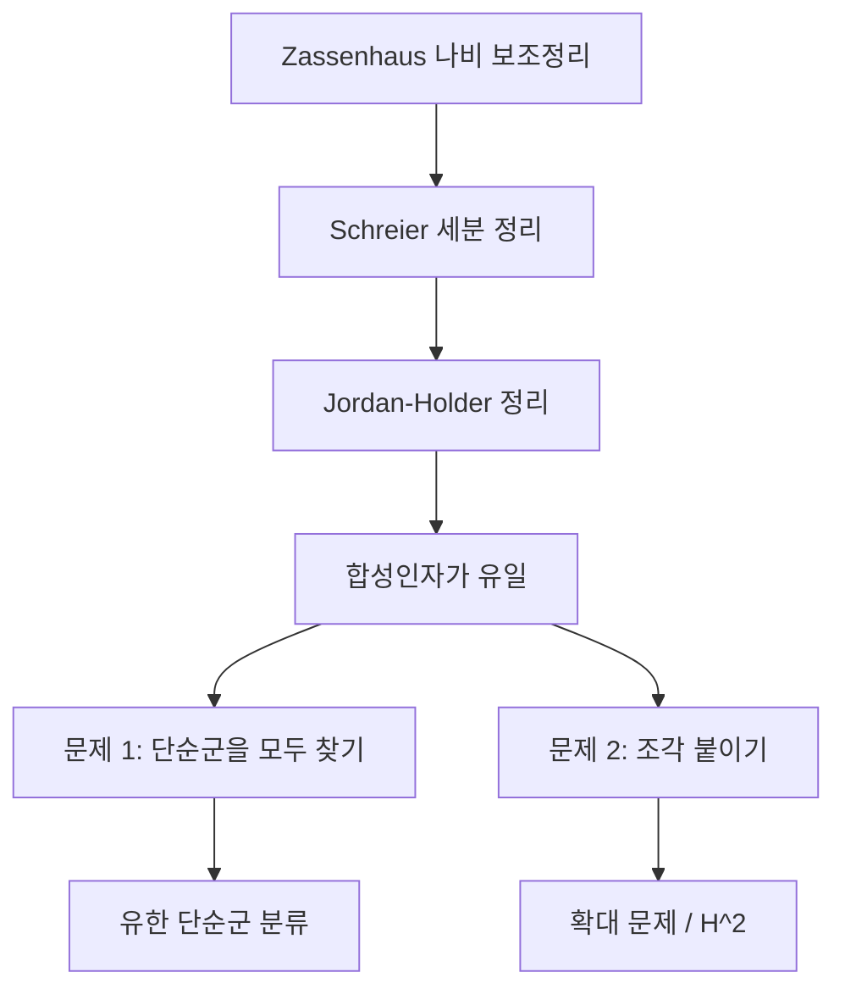

# 군 확대와 Jordan–Hölder 정리

# 개요

[유한 단순군 분류](finite-simple-groups.md)와 **확대 문제**가 유한군론의 두 축이다.

Jordan–Hölder 정리는 유한군 $G$ 의 합성인자가 유일하게 정해진다고 진술한다. 역은 성립하지 않고, 합성인자가 $\mathbb Z/2,\mathbb Z/2$ 인 군은 둘이다.

$$
\mathbb Z/4\qquad\text{와}\qquad \mathbb Z/2\times\mathbb Z/2
$$

조각은 같고 붙이는 방식이 다르므로, 어떤 조각이 있는가와 조각을 어떻게 붙이는가가 별개의 문제다.

두 번째 문제를 정식화한 것이 **확대**다. 정규부분군 $N$ 과 몫 $Q$ 에 대해 짧은 완전열

$$
1\to N\to G\to Q\to1
$$

을 만드는 $G$ 를 모두 찾는다. $N$ 이 가환이면 확대의 동치류가 코호몰로지군 $H^2(Q,N)$ 의 원소와 일대일 대응하고, 군을 짓는 조합 문제가 호몰로지 대수의 계산이 된다.

# 직관

## 코사이클로서의 결합법칙 오차

확대 $1\to A\to G\to Q\to1$ 에서 $A$ 가 가환이라 하자. 각 $q\in Q$ 마다 대표원 $s(q)\in G$ 를 고르면 $s$ 는 일반적으로 준동형이 아니고, 어긋난 만큼이 $A$ 안에 남는다.

$$
s(q_1)s(q_2)=f(q_1,q_2)\thinspace s(q_1q_2),\qquad f(q_1,q_2)\in A
$$

이 $f$ 가 **인자집합** 또는 2-코사이클이다. $G$ 의 결합법칙을 세 원소에 적용하면 $f$ 의 조건이 나온다.

$$
f(q_1,q_2)+f(q_1q_2,q_3)=q_1\negthinspace\cdot\negthinspace f(q_2,q_3)+f(q_1,q_2q_3)
$$

대표원을 다르게 고르면 $f$ 가 2-코바운더리만큼 바뀐다. 따라서

$$
\lbrace\text{확대의 동치류}\rbrace\ \longleftrightarrow\ H^2(Q,A)=Z^2/B^2
$$

$H^2$ 의 영원소가 **분할 확대**, 곧 반직접곱 $G=A\rtimes Q$ 다. 코호몰로지가 절단이 준동형이 되지 못한 정도를 재며, [호몰로지](homology.md)의 사슬복합체와 같은 역할을 한다.

## 같은 조각, 다른 군

$\mathbb Z/4$ 에서 $A=\lbrace 0,2\rbrace\cong\mathbb Z/2$ 를 잡으면 몫이 $\mathbb Z/2$ 다. 대표원으로 $s(0)=0$ 과 $s(1)=1$ 을 고르면

$$
s(1)+s(1)=2=f(1,1)+s(0)
$$

이라 $f(1,1)=2\ne0$ 이다. 어떤 대표원을 골라도 $f(1,1)$ 을 0 으로 만들 수 없으므로 $\mathbb Z/4$ 는 분할되지 않는다. $\mathbb Z/2\times\mathbb Z/2$ 에는 $f\equiv0$ 인 대표원이 있다.

$H^2(\mathbb Z/2,\mathbb Z/2)$ 의 원소가 두 개이고, 그 둘이 정확히 이 두 군이다.

## 세분을 통한 Jordan–Hölder 정리

합성열의 유일성은 Zassenhaus 의 **나비 보조정리**에서 나온다. 두 부분군 쌍 $(A\triangleleft A^\ast)$ 와 $(B\triangleleft B^\ast)$ 에 대해

$$
\frac{A(A^*\cap B^*)}{A(A^*\cap B)}\ \cong\ \frac{B(A^*\cap B^*)}{B(A\cap B^*)}
$$

가 성립한다. 여기서 임의의 두 부분정규열이 동형인 세분을 갖는다는 Schreier 세분 정리가 나오고, 합성열은 더 세분할 수 없으므로 두 합성열이 동형이다.

# 정의

## 합성열과 확대

부분정규열 $1=G_0\triangleleft G_1\triangleleft\cdots\triangleleft G_k=G$ 에서 모든 몫 $G_{i+1}/G_i$ 가 단순이면 **합성열**이고, 그 몫들을 **합성인자**라 한다.

군 $N,Q$ 에 대한 **확대**는 짧은 완전열 $1\to N\xrightarrow{\iota}G\xrightarrow{\pi}Q\to1$ 이다. 두 확대가 **동치**라는 것은 $N$ 과 $Q$ 위에서 항등인 동형 $G\to G'$ 가 있다는 뜻이다.

- $\pi$ 에 대한 준동형 절단 $s:Q\to G$ 가 있으면 **분할 확대**이고 $G\cong N\rtimes Q$ 다.
- $\iota(N)\subset Z(G)$ 이면 **중심확대**다. 이때 $N$ 은 자동으로 가환이고 $Q$ 의 작용이 자명하다.

## 군 코호몰로지의 낮은 차수

$Q$ 가군 $A$ (곧 $Q$ 가 작용하는 가환군)에 대해

$$
C^n(Q,A)=\lbrace f:Q^n\to A\rbrace,\qquad
(\delta f)(q_1,\dots,q_{n+1})=q_1\negthinspace\cdot\negthinspace f(q_2,\dots)+\sum(-1)^if(\dots)+(-1)^{n+1}f(\dots)
$$

로 사슬복합체를 만들고 $H^n(Q,A)=\ker\delta^n/\operatorname{im}\delta^{n-1}$ 로 둔다. 낮은 차수의 뜻이 구체적이다.

| 차수 | 뜻 |
|---|---|
| $H^0(Q,A)$ | $A^Q$ 곧 불변원소 |
| $H^1(Q,A)$ | 꼬인 준동형 / 주 꼬인 준동형. 분할 확대에서 보충군의 켤레류 |
| $H^2(Q,A)$ | $A$ 에 의한 $Q$ 의 확대의 동치류 |
| $H^3(Q,A)$ | 비가환 핵을 갖는 확대의 장애 |

# 성질

## 확대 분류 정리

> $Q$ 가군 $A$ 에 대해, $A$ 를 핵으로 갖고 $Q$ 를 몫으로 갖는 확대의 동치류 집합과 $H^2(Q,A)$ 사이에 자연스러운 전단사가 있다. 영원소가 반직접곱에 대응한다.

$A$ 가 비가환이면 $Q$ 가 $A$ 가 아니라 $\operatorname{Out}(A)$ 에 작용하고, 확대의 존재가 $H^3$ 의 장애로 통제된다.

## Schur–Zassenhaus 정리

> $|N|$ 과 $|G/N|$ 이 서로소이면 확대 $1\to N\to G\to Q\to1$ 은 분할되고, 모든 보충군이 서로 켤레다.

위수가 서로소인 부분은 붙이는 방법이 하나다. $N$ 이 가환이면 $H^2(Q,N)$ 이 $|Q|$ 와 $|N|$ 양쪽으로 죽으므로 서로소일 때 $0$ 이 된다. 비가환인 경우의 증명은 Feit–Thompson 정리를 쓴다.

확대 문제가 어려운 곳은 $|N|$ 과 $|Q|$ 가 소인수를 공유하는 경우, 특히 $p$ 군이다. 위수 $2^n$ 인 군의 개수가 폭발하는 것도 여기서다.

## Schur 곱셈자와 완전 중심확대

$Q$ 가 완전군, 곧 $Q=[Q,Q]$ 이면 가장 큰 중심확대가 유일하게 존재한다. 그 핵 $H_2(Q,\mathbb Z)$ 가 **Schur 곱셈자**이고 대응하는 확대 $\tilde Q$ 가 **보편 중심확대**다.

$$
1\to H_2(Q,\mathbb Z)\to\tilde Q\to Q\to1
$$

$n\ge8$ 인 $A_n$ 의 Schur 곱셈자는 $\mathbb Z/2$ 이고 그 이중덮개가 $2.A_n$ 이다. 산재군에도 같은 표기를 쓰며 $2.\mathrm{Co}\_1$ , $6.\mathrm{Suz}$ , $3.\mathrm{Fi}\_{24}'$ 에서 앞의 숫자가 Schur 곱셈자의 위수다.

[괴물군](monstrous-moonshine.md)의 Schur 곱셈자는 자명하고 $\mathbb M$ 자신이 보편 중심확대다. 아기 괴물의 이중덮개 $2.\mathrm{B}$ 가 $\mathbb M$ 의 중심화군으로 나타나므로 중심확대가 산재군을 서로 잇는다.

# 활용

## 분류의 두 번째 단계

유한군을 전부 나열하려면 단순군 목록 위에 확대를 반복해 쌓아야 한다. 위수가 작은 경우는 계산 대수 시스템이 데이터베이스로 갖고 있고, 위수 $2^{10}=1024$ 인 군만 49487365422 개다. 대부분이 $p$ 군이고 확대 문제가 여기서 커진다.

연구는 모든 군의 나열 대신 주어진 성질을 만족하는 군의 구조 정리를 목표로 한다.

## 사영표현과 중심확대

양자역학에서 대칭군 $Q$ 는 Hilbert 공간의 사영공간에 작용하므로 표현이 위상 인자만큼 어긋날 수 있다.

$$
\rho(q_1)\rho(q_2)=c(q_1,q_2)\thinspace\rho(q_1q_2),\qquad |c|=1
$$

$c$ 가 $H^2(Q,\mathrm U(1))$ 의 2-코사이클이다. 사영표현은 중심확대의 표현과 같고, $\mathrm{SO}(3)$ 의 사영표현이 [Lie 군](lie-groups.md) $\mathrm{SU}(2)$ 의 표현이 되며 반정수 스핀이 $H^2$ 의 비자명 원소에서 나온다.

[Lie 대수](lie-algebras.md)의 Virasoro 대수는 원 위의 벡터장 대수의 중심확대이고 중심전하 $c$ 가 그 확대를 지정한다. Lie 대수 코호몰로지 $H^2(\mathfrak g,\mathbb C)$ 가 1 차원이라 확대가 한 매개변수 족을 이룬다.

## Galois 이론의 매장 문제

[Galois 이론](galois-theory.md)에서 군 $Q$ 를 Galois 군으로 갖는 확대를 $G$ 를 Galois 군으로 갖는 더 큰 확대 안에 넣을 수 있는지를 묻는 것이 매장 문제다. 장애가 Galois 코호몰로지의 원소로 표현되고, 역 Galois 문제의 접근법 가운데 하나다.

# 연관 문서

## 선수지식

- [유한 단순군 분류](finite-simple-groups.md)

## 더 알아보기

- [Schur 곱셈자와 보편 중심확대](schur-multipliers.md)
- [Galois 표현의 변형과 보편 변형환](deformation-rings.md)

#group_theory #algebra
