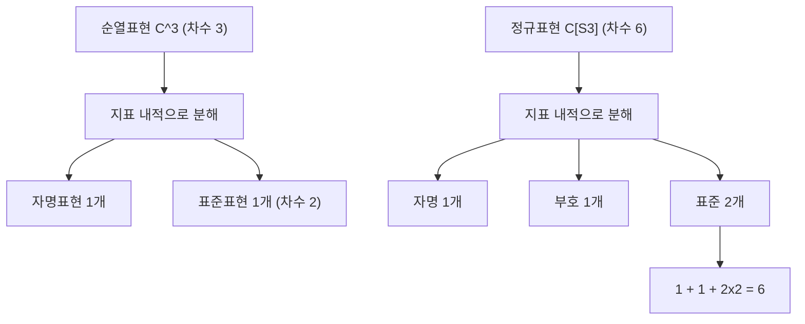

# 군의 표현과 지표

# 개요

표현론은 추상적인 [군](groups.md)을 행렬의 군으로 실현해 선형대수로 분석하는 이론이다. [군 작용](group-actions.md)이 집합 위의 대칭이라면, 표현은 벡터 공간 위의 선형 대칭이며, 그 덕분에 [고윳값](eigenvalues.md)과 대각화 같은 도구를 그대로 쓸 수 있다.

유한군을 표수 `0` 인 체 위에서 볼 때 이론은 특히 깔끔하다. 모든 표현이 기약표현의 직합으로 쪼개지고(Maschke), 기약표현 사이의 사상은 거의 없으며(Schur), 각 표현은 대각합만 기록한 함수인 지표로 완전히 결정된다. 결과적으로 유한군의 표현론 전체가 유한 크기의 표 하나, 즉 지표표로 압축된다.

# 직관

## 행렬로 옮겨 놓기

군 원소를 가역행렬로 보내되 곱을 곱으로 보내면, 군의 관계식이 행렬 항등식이 된다. `S_3` 를 정삼각형의 대칭으로 보면 각 원소가 평면의 직교행렬이 되고, 세 꼭짓점을 바꾸는 조작이 회전과 반사로 번역된다. 추상적인 곱셈표보다 이쪽이 계산 가능하다.

## 쪼개기와 세기

표현을 이해한다는 것은 더 이상 쪼갤 수 없는 조각, 즉 기약표현으로 분해하는 일이다. 두 가지 사실이 이 분해를 실용적으로 만든다.

- 유한군을 복소수 위에서 다루면 분해가 항상 가능하고, 조각들의 중복도가 유일하게 정해진다.
- 중복도는 지표의 내적이라는 유한 합으로 계산된다. 행렬을 직접 만지지 않아도 된다.

그래서 실제 계산은 "지표를 적고 내적을 재는" 산술 작업으로 끝난다.

## 대각합만 남긴다

표현의 기저를 바꾸면 행렬은 바뀌지만 대각합은 바뀌지 않는다. 또 켤레인 원소는 같은 대각합을 준다. 즉 지표는 켤레류 위의 함수이고, 정보 손실이 커 보이지만 실제로는 표현의 동형류를 완전히 결정한다. 이 놀라운 압축이 표현론을 유한한 표의 이론으로 만든다.

# 정의

## 표현

체 `k` 위 벡터 공간 `V` 와 군 준동형

$$
\rho : G \to GL(V)
$$

의 쌍을 `G` 의 표현이라 한다. `dim V` 를 표현의 차수라 한다. 아래에서 `G` 는 유한군, `k = C` 로 둔다.

동치인 서술은 `V` 가 군환 `k[G]` 위의 [가군](modules.md)이라는 것이다. 표현론의 정리들은 모두 군환 위 가군론의 정리로 번역된다.

기본 예는 다음과 같다.

- 자명표현: `V = k`, 모든 `g` 가 항등사상.
- 순열표현: `G` 가 유한집합 `X` 에 작용할 때 `V = k^X` 에 좌표 치환으로 작용.
- 정규표현: `X = G` 에 왼쪽 곱으로 작용시킨 순열표현. 차수는 `|G|` 다.
- 1차원 표현: 준동형 `G -> k^×`. 아벨군에서는 이것이 전부다.

## 부분표현과 기약표현

부분공간 `W ⊆ V` 가 모든 `g` 에 대해 `ρ(g)W ⊆ W` 를 만족하면 부분표현이다. `V ≠ 0` 이고 자명한 부분표현 `0`, `V` 밖에 없으면 `V` 를 기약(irreducible)이라 한다.

두 표현 `(ρ, V)`, `(σ, W)` 사이의 얽힘사상(intertwiner)은

$$
f \circ \rho(g) = \sigma(g) \circ f \quad (\forall g \in G)
$$

를 만족하는 선형사상 `f : V -> W` 다. 그 전체를 `Hom_G(V, W)` 로 쓴다.

## 지표

표현 `(ρ, V)` 의 지표는

$$
\chi_V(g) = \operatorname{tr} \rho(g)
$$

로 정의되는 함수 `χ_V : G -> C` 다. 다음이 즉시 따라온다.

- `χ_V(1) = dim V`.
- `χ_V(hgh^{-1}) = χ_V(g)`. 즉 지표는 켤레류 함수(class function)다.
- `χ_{V ⊕ W} = χ_V + χ_W`, `χ_{V ⊗ W} = χ_V · χ_W`. 두 번째는 [텐서곱](tensor-products.md)의 성질이다.
- `ρ(g)` 는 `g^{|G|} = 1` 때문에 대각화 가능하고 고윳값이 1의 거듭제곱근이므로 $χ_V(g^{-1}) = \overline{χ_V(g)}$.

류함수 공간에 내적을 준다.

$$
\langle \chi, \psi \rangle = \frac{1}{|G|} \sum_{g \in G} \chi(g) \overline{\psi(g)}
$$

# 성질

## Maschke 정리

**정리.** `G` 가 유한군이고 `char k` 가 `|G|` 를 나누지 않으면, `G` 의 모든 유한차원 표현은 기약표현의 직합이다.[^2]

*증명 스케치.* 부분표현 `W ⊆ V` 를 잡고 임의의 사영 `π : V -> W` 를 고른 뒤 평균을 낸다.

$$
\pi_0 = \frac{1}{|G|} \sum_{g \in G} \rho(g)\, \pi\, \rho(g)^{-1}
$$

`π_0` 은 여전히 `W` 위에서 항등이고 상이 `W` 이며, 구성상 모든 `ρ(h)` 와 교환한다. 따라서 `ker π_0` 이 부분표현이 되어 `V = W ⊕ ker π_0` 이다. 차원에 대한 귀납으로 완전 분해를 얻는다. ∎

`1/|G|` 를 쓸 수 없는 경우, 즉 `char k` 가 `|G|` 를 나누는 modular 상황에서는 정리가 실패한다. `Z/p` 의 `F_p` 위 2차원 표현 중 분해되지 않는 것이 있다.

## Schur 보조정리

**보조정리.** `V`, `W` 가 기약표현이면

$$
\operatorname{Hom}_G(V, W) = \begin{cases} 0 & (V \not\cong W) \\ \mathbb{C}\cdot \mathrm{id} & (V \cong W) \end{cases}
$$

이다.

*증명 스케치.* `f ≠ 0` 이면 `ker f` 와 `im f` 가 부분표현이므로 기약성에 의해 `ker f = 0`, `im f = W`, 즉 `f` 는 동형이다. `V = W` 인 경우 `C` 가 대수적으로 닫혀 있으므로 `f` 는 고윳값 `λ` 를 가지고, `f - λ·id` 역시 얽힘사상이면서 가역이 아니므로 `0` 이다. ∎

따라서 기약표현 위에서 `G` 와 교환하는 연산자는 스칼라뿐이다. 이 사실이 아래 직교관계와 물리에서의 선택 규칙을 동시에 낳는다.

## 직교관계

**정리 (제1 직교관계).** 기약표현의 지표들은 류함수 공간의 정규직교 기저를 이룬다.

$$
\langle \chi_i, \chi_j \rangle = \delta_{ij}
$$

*증명 스케치.* `Hom(V, W)` 에 `g · f = σ(g) f ρ(g)^{-1}` 로 표현 구조를 주면 그 지표는 $χ_W \overline{χ_V}$ 이고, 불변원소의 공간은 `Hom_G(V, W)` 다. 한편 평균 연산자

$$
P = \frac{1}{|G|}\sum_{g} \rho(g)
$$

는 불변부분공간 위로의 사영이므로 `tr P` 가 불변부분공간의 차원과 같다. 두 계산을 결합하면 `⟨χ_W, χ_V⟩ = dim Hom_G(V, W)` 이고, Schur 보조정리가 우변을 `0` 또는 `1` 로 만든다. ∎

따름정리가 줄줄이 따라온다.

- 표현 `V` 의 기약 분해 `V ≅ ⊕ V_i^{⊕ m_i}` 에서 중복도는 `m_i = ⟨χ_V, χ_i⟩` 다.
- `V` 가 기약일 필요충분조건은 `⟨χ_V, χ_V⟩ = 1` 이다.
- 지표가 같으면 표현이 동형이다.
- 기약표현의 개수는 켤레류의 개수와 같다. 류함수 공간의 차원이 켤레류 수이기 때문이다.

**제2 직교관계.** 지표표의 열에 대해서도 직교성이 성립한다. 켤레류 대표 `g`, `h` 에 대해

$$
\sum_{i} \chi_i(g) \overline{\chi_i(h)} = \begin{cases} |C_G(g)| & (g \sim h) \\ 0 & (\text{그 외}) \end{cases}
$$

## 정규표현의 분해

정규표현의 지표는 `χ_{reg}(1) = |G|` 이고 `g ≠ 1` 에서 `0` 이다. 따라서

$$
\langle \chi_{\mathrm{reg}}, \chi_i \rangle = \frac{1}{|G|}\, |G| \cdot \overline{\chi_i(1)} = \dim V_i
$$

이고, 정규표현은 각 기약표현을 그 차수만큼 포함한다.

$$
\mathbb{C}[G] \;\cong\; \bigoplus_i V_i^{\oplus \dim V_i}, \qquad \sum_i (\dim V_i)^2 = |G|
$$

이 차수 공식은 기약표현의 차수를 좁히는 강력한 제약이다. 각 차수는 `|G|` 를 나눈다는 정리까지 더하면 후보가 거의 남지 않는다.

## 지표표 예: S3

`S_3` 의 켤레류는 항등원, 호환 3개, 3-순환 2개로 세 개다. 따라서 기약표현도 세 개이고, 차수 공식 `1 + 1 + 4 = 6` 이 유일한 해를 준다.

| 기약표현 | `e` (1개) | 호환 (3개) | 3-순환 (2개) |
| --- | --- | --- | --- |
| 자명 `1` | 1 | 1 | 1 |
| 부호 `sgn` | 1 | -1 | 1 |
| 표준 `V` (2차) | 2 | 0 | -1 |



# 활용

## 분해 계산

지표만 있으면 분해는 산술이다. 다음은 `S_3` 의 순열표현과 정규표현을 분해한다.

```python
from fractions import Fraction

sizes = {"e": 1, "t": 3, "c": 2}          # 켤레류 크기: 항등, 호환, 3-순환
irr = {"triv": {"e": 1, "t": 1, "c": 1},
       "sign": {"e": 1, "t": -1, "c": 1},
       "std":  {"e": 2, "t": 0, "c": -1}}
order = sum(sizes.values())

def ip(a, b):                              # 지표 내적 (실수 지표라 켤레는 생략)
    return Fraction(sum(sizes[k] * a[k] * b[k] for k in sizes), order)

perm = {"e": 3, "t": 1, "c": 0}            # 3점 위의 순열표현
reg = {"e": 6, "t": 0, "c": 0}             # 정규표현

print({n: ip(perm, chi) for n, chi in irr.items()})
# {'triv': 1, 'sign': 0, 'std': 1}  ->  C^3 = 자명 (+) 표준

print({n: ip(reg, chi) for n, chi in irr.items()})
# {'triv': 1, 'sign': 1, 'std': 2}  ->  차수 공식 1 + 1 + 2*2 = 6

print(ip(irr["std"], irr["std"]))          # 1 이므로 표준표현은 기약
```

순열표현이 항상 자명표현을 정확히 한 번 포함한다는 것도 같은 계산에서 나온다. 순열표현의 지표가 고정점 개수이므로

$$
\langle \chi_X, 1 \rangle = \frac{1}{|G|}\sum_{g} |X^g|
$$

이고, 우변은 궤도의 개수다. 즉 Burnside 세기 보조정리가 지표의 언어로 다시 쓰인 것이다.

## 대칭성이 있는 문제

- 분자의 진동 모드는 대칭군의 표현이고, 기약 성분으로 분해하면 어떤 모드가 적외선이나 Raman에서 관측되는지가 결정된다. 선택 규칙은 Schur 보조정리의 직접 귀결이다.
- 결정의 대칭군 표현이 에너지 준위의 겹침(degeneracy)을 설명한다. 대칭 연산과 교환하는 Hamiltonian은 각 기약 성분 위에서 스칼라로 작용하기 때문이다.
- 그래프의 자기동형군이 큰 경우 인접행렬을 기약 성분별로 블록화할 수 있어 [그래프 Laplacian](graph-laplacian.md)의 스펙트럼 계산이 쉬워진다. 대칭행렬의 블록 대각화는 [스펙트럼 정리](spectral-theorem.md)와 같은 그림이다.

## 군 위의 Fourier 해석

`G` 가 유한 아벨군이면 모든 기약표현이 1차원이고, 지표들은 군 준동형 `G -> C^×` 다. 이들이 `C[G]` 의 정규직교 기저를 이루므로 임의의 함수가

$$
f(g) = \sum_{\chi} \hat{f}(\chi)\, \chi(g), \qquad \hat{f}(\chi) = \frac{1}{|G|}\sum_{g} f(g) \overline{\chi(g)}
$$

로 전개된다. `G = Z/n` 인 경우 지표가 $χ_k(j) = e^{2\pi i jk/n}$ 이고 위 식이 정확히 [이산 Fourier 변환](fourier.md)이다. 즉 DFT는 순환군의 표현론이고, 비아벨군으로 확장하면 행렬 값을 갖는 Fourier 변환이 된다.[^1]

## 군론 자체로의 되먹임

지표는 군의 구조를 캐는 도구이기도 하다.

- 기약표현의 차수는 `|G|` 를 나눈다. 이 사실과 [Sylow 정리](sylow-theorems.md)의 세기를 결합하면 작은 위수 군의 단순성 판정이 강해진다.
- Burnside의 `p^a q^b` 정리, 즉 두 소수만으로 이루어진 위수의 군은 가해군이라는 결과는 지표 이론 없이는 알려진 증명이 길다.
- 정규부분군은 지표표에서 읽힌다. 기약 지표 하나를 고정하고 `χ(g)` 가 `χ(1)` 과 같아지는 원소들을 모으면 그 표현의 핵이 되고, 이런 핵들의 교집합으로 모든 정규부분군을 얻는다. 따라서 지표표만 보고 단순군 여부를 판정할 수 있다.

[^1]: Wikipedia, Character theory, https://en.wikipedia.org/wiki/Character_theory
[^2]: Wikipedia, Maschke's theorem, https://en.wikipedia.org/wiki/Maschke%27s_theorem

# 연관 문서

## 선수지식

- [군 작용](group-actions.md)
- [고윳값과 고유벡터](eigenvalues.md)

## 더 알아보기

- [Dirichlet 지표와 L 함수](dirichlet-l-functions.md)
- [Langlands 강령](langlands-program.md)
- [유한 단순군 분류](finite-simple-groups.md)
- [구면조화함수와 SO(3) 의 표현](spherical-harmonics.md)
- [Schur–Weyl 쌍대성](schur-weyl-duality.md)

#group_theory #linear_algebra
