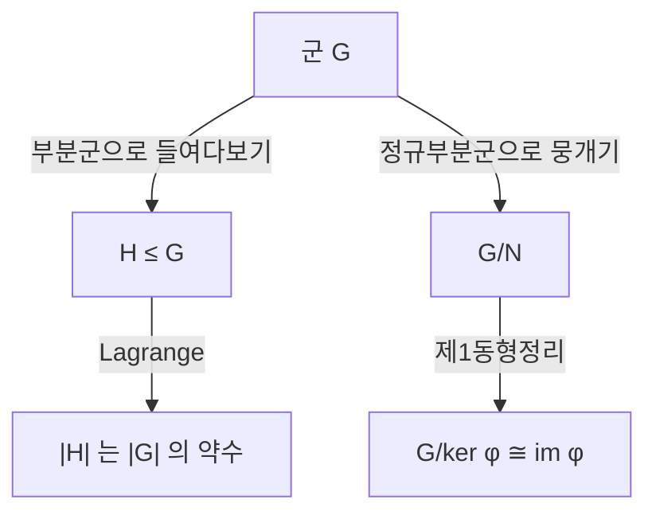

# 군

# 개요

군은 합성할 수 있고 항상 되돌릴 수 있는 연산을 추상화한 구조다. 공리는 결합법칙, 항등원, 역원 세 줄뿐이지만, 이 세 줄이 정수의 덧셈, 도형의 대칭, 나머지 연산, 방정식의 근을 섞는 방법, 공간의 구멍을 세는 방법을 같은 언어로 묶는다.

군을 읽는 가장 좋은 방법은 "가역적인 변환의 모음" 이다. 원소를 정적인 대상이 아니라 무언가에 작용하는 변환으로 보면 공리가 저절로 이해된다. 변환은 이어 붙일 수 있고(결합법칙), 아무것도 하지 않는 변환이 있으며(항등원), 모든 변환은 되돌릴 수 있다(역원). 그래서 [함수](functions.md), 그중에서도 전단사 함수의 합성이 이 문서의 배경이 된다. 공리에서 성질을 뽑아내는 논증은 [명제와 증명](proofs.md)의 기본 형태를 그대로 쓴다.

# 직관

## 정사각형을 제자리로 돌려놓는 방법

정사각형을 집어 들었다가 원래 자리에 정확히 겹치도록 내려놓는 방법은 몇 가지인가. 0°, 90°, 180°, 270° 회전 네 가지와, 네 개의 축(가로, 세로, 대각선 둘)에 대한 반사 네 가지를 합쳐 여덟 가지다. 이 여덟 개의 모음이 군이다.

- 두 방법을 이어서 하면 다시 여덟 가지 중 하나다. 연산이 닫혀 있다.
- 아무것도 하지 않는 방법이 항등원이다.
- 모든 방법은 되돌릴 수 있다. 90° 회전의 역은 270° 회전이다.
- 회전한 뒤 반사하는 것과 반사한 뒤 회전하는 것은 대개 다르다. 교환법칙은 공리가 아니다.

이 군을 $D_4$ 라 쓴다. "대칭이 많다" 는 느낌을 정확히 세는 도구가 군이고, 원소 개수가 그 대칭의 양이다.

## 구조를 보는 두 가지 눈

군을 이해하는 일은 대개 두 가지 질문으로 환원된다. 안에 무엇이 들어 있는가(부분군), 그리고 무엇을 뭉갤 수 있는가(몫군). 부분군은 전체 구조 안의 작은 구조이고, 몫군은 어떤 차이를 무시하기로 했을 때 남는 구조다. 이 둘이 맞물려 큰 군을 작은 조각으로 분해한다.

# 정의

## 공리

집합 $G$ 와 이항연산 $G \times G \to G$ 가 주어졌다고 하자. 연산은 곱으로 표기한다. 임의의 $a, b, c \in G$ 에 대해 다음이 성립하면 $G$ 는 군이다.

$$
\begin{aligned}
(ab)c&=a(bc)\cr
ea&=ae=a\cr
a^{-1}a&=aa^{-1}=e
\end{aligned}
$$

모든 $a,b$ 에 대해 $ab=ba$ 까지 성립하면 가환군(아벨군)이라 한다. 원소의 개수 $|G|$ 를 군의 위수라 하고, $a^n=e$ 가 되는 최소의 양의 정수 $n$ 을 원소 $a$ 의 위수라 한다.

정수 전체와 덧셈은 가환군이다. 항등원은 0 이고 $a$ 의 역원은 $-a$ 다. 자연수 전체와 덧셈은 역원이 없어 군이 아니고, 0 을 포함한 정수 전체와 곱셈도 0 의 역원이 없어 군이 아니다.

## 부분군

부분집합 $H \subseteq G$ 가 같은 연산으로 다시 군이면 부분군이라 하고 $H \le G$ 로 쓴다. 비어 있지 않은 $H$ 에 대해 다음 한 줄이 부분군 판정의 전부다.

$$
a,b\in H\ \Rightarrow\ ab^{-1}\in H
$$

$a=b$ 로 두면 항등원이, $a=e$ 로 두면 역원이, 그다음 둘을 합치면 닫힘성이 따라 나온다.

## 준동형과 동형

두 군 사이의 함수 $\varphi : G \to H$ 가 $\varphi(ab) = \varphi(a)\varphi(b)$ 를 만족하면 준동형이다. 연산을 보존하므로 항등원과 역원도 자동으로 보존한다. 준동형의 핵과 상은 다음과 같다.

$$
\ker\varphi=\lbrace a\in G\mid\varphi(a)=e_H\rbrace,\qquad \mathrm{im}\varphi=\lbrace\varphi(a)\mid a\in G\rbrace
$$

전단사인 준동형이 동형이고, 동형인 두 군은 이름표만 다른 같은 군이다. "같은 군인가" 를 묻는 일은 [그래프 동형](graph-isomorphism.md)에서 두 그래프가 같은지 묻는 일과 같은 종류의 문제다.

## 잉여류와 몫군

$H \le G$ 와 $a \in G$ 에 대해 $aH = \lbrace ah : h \in H \rbrace$ 를 왼쪽 잉여류라 한다. 잉여류들은 $G$ 를 빈틈없이 겹치지 않게 덮으며, 이것이 $a \sim b \iff a^{-1}b \in H$ 라는 동치관계의 동치류다.

잉여류들 위에 $(aH)(bH)=abH$ 로 곱을 정의하려면 대표원 선택과 무관해야 하고, 그 조건이 정규성이다.

$$
gNg^{-1}=N\quad(\forall g\in G)
$$

이때 $N$ 을 정규부분군이라 하고, 잉여류들이 이루는 군을 몫군 $G/N$ 이라 한다. 동치류를 만드는 것만으로는 부족하고 곱이 잘 정의되어야 한다는 이 지점이 군론에서 처음 만나는 미묘한 대목이다.

# 성질

## 공리에서 바로 나오는 것들

항등원과 각 역원은 유일하다. 항등원이 $e$ 와 $f$ 둘이라면 $ef$ 는 한쪽 정의로 $f$ 이고 다른 쪽 정의로 $e$ 이므로 둘이 같다. 역원도 같은 방식으로 유일하다.

소거가 가능하다. 양변 왼쪽에 역원을 곱하면 된다.

$$
ab=ac\ \Rightarrow\ a^{-1}(ab)=a^{-1}(ac)\ \Rightarrow\ b=c
$$

합성의 역원에서는 순서가 뒤집힌다. 옷을 입은 순서의 반대로 벗는 것과 같다.

$$
(ab)^{-1}=b^{-1}a^{-1}
$$

소거 가능성은 곱셈표의 각 행과 열에 모든 원소가 정확히 한 번씩 나타난다는 뜻이기도 하다. 유한군의 곱셈표는 라틴 방진이다.

## Lagrange 정리

$G$ 가 유한군이고 $H \le G$ 이면 모든 잉여류의 크기가 $|H|$ 로 같고 서로 겹치지 않으므로 다음이 성립한다.

$$
|G|=[G:H]\cdot|H|
$$

따라서 부분군의 위수는 전체 위수의 약수다. 한 원소가 생성하는 순환부분군에 적용하면 원소의 위수도 $|G|$ 의 약수이고, $a^{|G|}=e$ 가 따라 나온다. 이 따름정리가 [Fermat 소정리와 Euler 정리](fermat-euler-theorem.md)이며, 위수가 소수인 군은 진부분군이 없어 순환군일 수밖에 없다는 결론도 여기서 나온다. 역은 성립하지 않는다. 약수마다 부분군이 있어야 하는 것은 아니고, 있는지를 부분적으로 보장하는 것이 Sylow 정리다.

## 제1동형정리

준동형 $\varphi : G \to H$ 의 핵은 항상 정규부분군이고, 상은 $H$ 의 부분군이며, 다음 동형이 성립한다.

$$
G/\ker\varphi\ \cong\ \mathrm{im}\varphi
$$

"정보를 잃는 사상" 과 "잃은 정보를 뭉갠 몫" 이 같은 것을 본다는 뜻이다. 정규부분군과 준동형의 핵이 정확히 같은 개념이라는 사실도 함께 따라온다. 같은 정리가 [환](rings.md)과 [가군](modules.md)에서 그대로 반복되므로, 이 형태를 한 번 익혀 두면 대수 전체에서 재사용된다.

## 순환군과 생성

한 원소가 전체를 생성하는 군을 순환군이라 한다. 무한 순환군은 정수의 덧셈군과, 위수 $n$ 인 순환군은 $\mathbb Z/n\mathbb Z$ 와 동형이다. 순환군은 모두 가환이지만 역은 거짓이고, $D_4$ 는 가환도 순환도 아니다. 유한생성 가환군은 순환군들의 직접곱으로 유일하게 분해된다.

## Cayley 정리

모든 군 $G$ 는 자기 자신 위의 치환군의 부분군과 동형이다. $a \in G$ 를 "왼쪽에서 $a$ 를 곱하는 함수" 로 보내면 이 함수는 소거 가능성 때문에 전단사이고, 대응은 단사 준동형이 된다. 추상적인 공리로 정의한 군이 결국 "무언가를 섞는 방법들" 이라는 처음의 직관과 정확히 일치한다는 뜻이다. 이 관점을 일반화한 것이 [군 작용](group-actions.md)이다.

# 활용

## 대칭과 불변량

결정 구조, 분자의 대칭, 물리 법칙의 불변성은 모두 군으로 기술된다. 무언가가 변환 아래 보존된다는 진술은 "그 변환들의 군이 작용한다" 는 진술이고, 보존량을 찾는 일은 군의 불변량을 찾는 일이 된다. 위상수학에서는 공간의 구멍을 [기본군](fundamental-group.md)과 [호몰로지](homology.md) 군으로 세고, 서로 동형이 아닌 군이 나오면 두 공간이 다르다는 결론을 얻는다.

## 산술과 암호

정수의 나머지 연산은 덧셈에 대해 순환군 $\mathbb{Z}/n\mathbb{Z}$ 를, 가역인 나머지들은 곱셈에 대해 군 $(\mathbb{Z}/n\mathbb{Z})^\times$ 를 이룬다. 위수가 $\varphi(n)$ 이라는 사실과 Lagrange 정리에서 Euler 정리가 나오고, 이것이 RSA 의 복호화가 왜 원래 메시지를 돌려주는지를 설명한다. 유한체의 곱셈군이 순환군이라는 사실은 이산로그 기반 암호의 바탕이 된다.

## 방정식과 분류

다항식의 근을 섞는 대칭을 군으로 보면 5 차 이상 일반 방정식이 근호로 풀리지 않는 이유가 그 군의 구조에서 나온다. 같은 공리를 만족하는 서로 다른 대상에 하나의 증명을 적용할 수 있다는 점, 그리고 "이 구조를 가진 것이 전부 무엇인가" 라는 분류 질문을 던질 수 있다는 점이 군론이 주는 두 가지 힘이다.[^1]

[^1]: Thomas W. Judson, *Abstract Algebra: Theory and Applications*, Chapter 3 (군의 정의와 예시), Chapter 6 (잉여류와 Lagrange 정리), Chapter 10-11 (정규부분군과 동형정리). https://judsonbooks.org/aata-files/aata-20240706.pdf

# 연관 문서

## 선수지식

- [함수](functions.md)
- [추상대수 개관](abstract-algebra-overview.md)

## 더 알아보기

### 대수 구조

- [군 작용](group-actions.md)
- [환](rings.md)
- [범주](category.md)
- [수학적 구조주의](mathematical-structuralism.md)

### 정수론

- [Fermat 소정리와 Euler 정리](fermat-euler-theorem.md)
- [이산로그와 Diffie–Hellman](discrete-logarithm.md)

### 위상과 그래프

- [기본군](fundamental-group.md)
- [단체 호몰로지](homology.md)
- [그래프 동형](graph-isomorphism.md)

#group_theory #algebra #number_theory #cryptography
