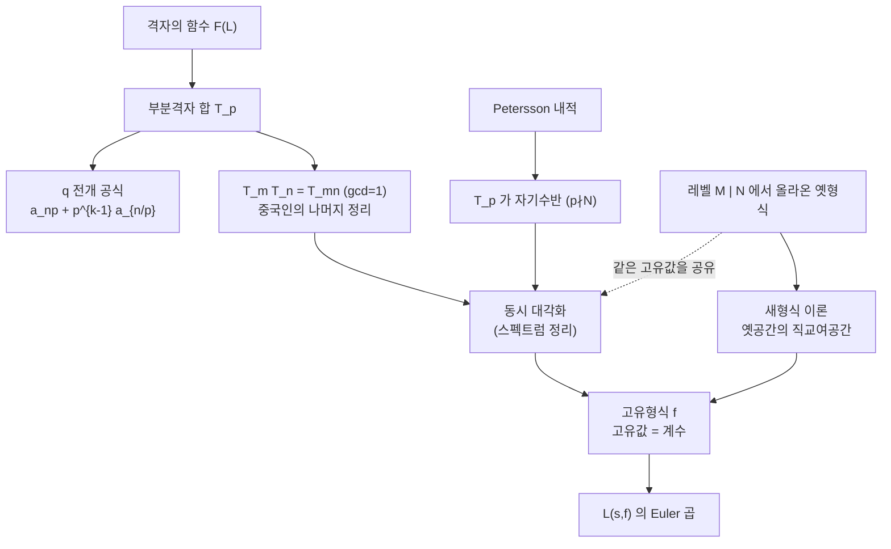

# Hecke 작용소와 새형식

# 개요

[모듈러 형식](modular-forms.md) 문서에서 `q` 전개로 적은 `(T_pf)_n=a_{np}+p^{k-1}a_{n/p}` 가 Hecke 작용소였다. 이 식은 결과일 뿐이고, 왜 이런 연산자를 봐야 하는지도 왜 계수가 곱셈적이 되는지도 식만 봐서는 알 수 없다. 원래 정의는 격자에 있다. 모듈러 형식을 격자의 함수로 보면 `T_p` 는 **지표 `p` 의 부분격자 전체에 걸친 합**이고, 곱셈성은 부분격자를 세는 일이 소수마다 독립이라는 사실에서 나온다.

연산자가 갖춰지면 선형대수가 일을 한다. `T_n` 들은 서로 교환하고 Petersson 내적에 대해 자기수반이므로 [스펙트럼 정리](spectral-theorem.md)가 동시 고유기저를 준다. 고유형식 하나가 `L` 함수 하나를 낳고, 그 `L` 함수가 Euler 곱을 갖는다.

$$
S_k(\Gamma_0(N))=\bigoplus_{f}\mathbb C f\ \ (\text{고유형식}),\qquad
L(s,f)=\prod_p\big(1-a_pp^{-s}+\chi(p)p^{k-1-2s}\big)^{-1}
$$

그런데 레벨 `N>1` 에서 이 그림이 한 번 깨진다. 낮은 레벨의 형식이 여러 방식으로 올라와 만드는 **옛형식**들이 `T_n` 의 같은 고유값을 공유해, 고유값만으로는 형식을 구별할 수 없게 된다. Atkin 과 Lehner 의 새형식 이론이 이 겹침을 정확히 걷어낸다[^1]. 걷어내고 남은 **새형식**에서 비로소 고유값이 형식을 유일하게 결정하고, 모듈러성 정리와 Langlands 대응이 말하는 일대일 대응이 성립한다.

# 직관

## 격자의 부분격자를 센다

무게 `k` 의 모듈러 형식은 격자의 함수 `F(L)` 로 다시 쓸 수 있다. 동차성 `F(\lambda L)=\lambda^{-k}F(L)` 을 요구하고 `L=\mathbb Z+\mathbb Z\tau` 에서 `f(\tau)=F(L)` 로 두면 변환 규칙이 정확히 복원된다.

이 서술에서 자연스러운 연산자가 하나 있다. 격자 `L` 에서 한 걸음 내려간 격자들을 모두 모아 평균을 내는 것이다.

$$
(T_pF)(L)=p^{k-1}\sum_{[L:L']=p}F(L')
$$

지표 `p` 의 부분격자는 `p+1` 개다. `L/pL\cong(\mathbb Z/p)^2` 의 지표 `p` 부분군, 곧 `\mathbb F_p^2` 의 직선 개수이기 때문이다. 이 `p+1` 개를 좌표로 적으면 `\langle e_1,pe_2\rangle` 과 `\langle e_1+je_2,pe_2\rangle` 꼴이고, `q` 전개로 옮기면 `a_{np}+p^{k-1}a_{n/p}` 가 나온다. 두 항은 "지표 `p` 부분격자 `p` 개" 와 "나머지 하나" 가 아니라, 서로 다른 두 종류의 부분격자에서 온 기여다.

곱셈성도 이 그림에서 보인다. 지표 `mn` (`\gcd(m,n)=1`) 의 부분격자는 지표 `m` 인 것과 지표 `n` 인 것으로 유일하게 쪼개진다. 중국인의 나머지 정리다. 그래서 `T_mT_n=T_{mn}` 이고, `\gcd` 이 1 이 아니면 겹침이 생겨 관계식이 하나 더 붙는다.

$$
T_pT_{p^r}=T_{p^{r+1}}+p^{k-1}T_{p^{r-1}}
$$

계수의 곱셈성이라는 산술적 사실이, 사실은 부분격자를 세는 조합적 사실이었다.

## 왜 동시 대각화가 되는가

`T_n` 들이 유한차원 공간 `S_k` 에 작용하는 가환 연산자족이라는 것만으로는 대각화를 보장하지 못한다. 필요한 것은 내적과 자기수반성이다. Petersson 내적

$$
\langle f,g\rangle=\int_{\Gamma\backslash\mathbb H}f(\tau)\overline{g(\tau)}\,y^k\,\frac{dx\,dy}{y^2}
$$

이 그 역할을 한다. 측도 `dx\,dy/y^2` 가 `\mathrm{SL}_2(\mathbb R)` 불변이고 `f\bar gy^k` 가 `\Gamma` 불변이라 적분이 잘 정의되며, 첨점형식의 급감 덕분에 수렴한다. 이 내적에 대해 `p\nmid N` 인 `T_p` 가 자기수반이다.

가환하는 자기수반 연산자족은 동시에 대각화된다. 스펙트럼 정리의 표준적 따름정리이며, 고유형식의 기저가 존재하는 이유가 이것뿐이다.



## 옛형식이 일으키는 겹침

`M\mid N` 이고 `d\mid(N/M)` 이면 레벨 `M` 의 형식 `f(\tau)` 에서 `f(d\tau)` 를 만들 수 있고, 이것이 레벨 `N` 의 형식이 된다. 새로운 정보는 없는데 공간의 차원은 늘어난다.

문제는 `T_n` 이 `\gcd(n,N)=1` 일 때 `f(\tau)` 와 `f(d\tau)` 를 구별하지 못한다는 것이다. 둘 다 같은 고유값 `a_n` 을 갖는다. 그러면 고유공간이 1 차원이 아니게 되고, "고유값을 알면 형식을 안다" 는 원리가 무너진다. `p\mid N` 인 자리의 작용소 `U_p` 는 이 부분공간에서 자기수반이 아니라서 상황을 구제하지 못한다.

Atkin–Lehner 의 해법은 단순하다. 옛형식들이 만드는 부분공간의 Petersson 직교여공간을 새형식 공간으로 정의한다. 그 안에서는 `\gcd(n,N)=1` 인 `T_n` 의 고유값만으로 형식이 유일하게 결정되고(다중도 1), 게다가 `p\mid N` 인 `U_p` 까지 포함한 모든 작용소의 고유형식이 된다.

# 정의

## 이중 잉여류로서의 Hecke 작용소

`\Gamma=\Gamma_0(N)` 과 `\alpha\in\mathrm{GL}_2^+(\mathbb Q)` 에 대해 이중 잉여류 `\Gamma\alpha\Gamma` 를 우잉여류로 쪼갠다.

$$
\Gamma\alpha\Gamma=\coprod_{i}\Gamma\alpha_i,\qquad
[\Gamma\alpha\Gamma]f=\det(\alpha)^{k-1}\sum_if\big|_k\alpha_i
$$

여기서 `(f|_k\gamma)(\tau)=\det(\gamma)^{k/2}(c\tau+d)^{-k}f(\gamma\tau)` 로 정규화한다. `\alpha=\begin{pmatrix}1&0\\0&p\end{pmatrix}` 로 두면 `T_p` 를 얻는다. 잉여류 대표는 `p\nmid N` 일 때 `p+1` 개다.

$$
T_pf=p^{k-1}\sum_{j=0}^{p-1}f\Big|_k\begin{pmatrix}1&j\\0&p\end{pmatrix}+f\Big|_k\begin{pmatrix}p&0\\0&1\end{pmatrix}
$$

`p\mid N` 이면 마지막 항이 빠져 대표가 `p` 개뿐이다. 이 경우의 작용소를 `U_p` 라 쓰고 `T_p` 와 구별한다. `q` 전개에서는 `(U_pf)_n=a_{np}` 로 둘째 항이 없다.

이 정의가 아델판으로 바로 번역된다는 점이 중요하다. 레벨 `\Gamma_0(N)` 이 유한 자리의 콤팩트 열린 부분군 `K_0(N)` 이 되고, `T_p` 가 이중 잉여류 `K_0(N)\,\mathrm{diag}(1,p)\,K_0(N)` 이 된다. 고전적 서술에서 다소 임의로 보이던 `p+1` 개의 행렬이 군론적 필연이 된다.

## 관계식과 Hecke 대수

`q` 전개로 쓴 `T_n` 의 정의는 다음과 같다.

$$
(T_nf)_m=\sum_{d\mid\gcd(n,m)}\chi(d)\,d^{k-1}a_{mn/d^2}
$$

`T_n` 들이 생성하는 `\mathbb Z` 대수를 **Hecke 대수** `\mathbb T` 라 한다. 형식 Dirichlet 급수로 관계식을 한 줄에 담을 수 있다.

$$
\sum_{n\ge1}T_nn^{-s}=\prod_p\Big(1-T_pp^{-s}+\chi(p)p^{k-1-2s}\Big)^{-1}
$$

`\mathbb T` 는 가환이고 `S_k(\Gamma_0(N))` 위에 충실히 작용하므로 유한 계수의 `\mathbb Z` 가군이다. 고유형식은 환 준동형 `\mathbb T\to\mathbb C` 와 같고, 그 상이 유한 차수의 대수적 정수환에 들어간다. 곧 **고유값은 대수적 정수**다.

## 옛형식과 새형식

`M\mid N`, `M<N` 인 각 `M` 과 `d\mid(N/M)` 에 대해 사상 `f(\tau)\mapsto f(d\tau)` 를 생각한다. 이들의 상이 생성하는 부분공간이 **옛부분공간** `S_k^{\mathrm{old}}(N)` 이다.

$$
S_k^{\mathrm{new}}(\Gamma_0(N))=\big(S_k^{\mathrm{old}}(\Gamma_0(N))\big)^{\perp}\quad(\text{Petersson 내적})
$$

새부분공간의 정규화된 고유형식(`a_1=1`)을 **새형식**이라 한다.

# 성질

## Atkin–Lehner 정리

> 1. `S_k^{\mathrm{old}}` 과 `S_k^{\mathrm{new}}` 은 모든 `T_n` `(\gcd(n,N)=1)` 에 대해 불변이다.
> 2. **다중도 1.** 새형식 `f,g` 가 거의 모든 `p` 에서 `a_p(f)=a_p(g)` 를 만족하면 `f=g` 다. 레벨까지 같아진다.
> 3. 새형식은 모든 `n` 에 대한 `T_n` 과 `U_p` 의 고유형식이고, `p\|N` 이면 `a_p=\pm p^{k/2-1}`, `p^2\mid N` 이면 `a_p=0` 이다.
> 4. `S_k(\Gamma_0(N))=\bigoplus_{M\mid N}\bigoplus_{d\mid N/M}\{f(d\tau):f\in S_k^{\mathrm{new}}(\Gamma_0(M))\}` 로 완전히 분해된다.

둘째 줄이 이 이론의 핵심이다. 유한 개의 소수에서 고유값을 몰라도 형식이 결정된다는 강한 주장이며, [Langlands 강령](langlands-program.md)의 강한 다중도 1 정리가 이것의 일반화다. `L` 함수 하나가 자기동형 표현 하나에 대응한다는 전제가 여기에 기대고 있다.

## 고유값의 크기

고유형식의 계수는 아무렇게나 크지 않다.

$$
|a_p|\le 2p^{(k-1)/2}\qquad(\text{Deligne, }p\nmid N)
$$

**Ramanujan–Petersson 추측**이라 불리던 이 부등식은 Deligne 이 Weil 추측에서 끌어냈다. `a_p` 가 어떤 `\ell` 진 Galois 표현의 Frobenius 자취이고, 그 표현의 고윳값이 절댓값 `p^{(k-1)/2}` 를 갖는다는 것이 Weil 추측의 Riemann 가설 부분이다. 순수한 해석적 부등식이 대수기하의 깊은 정리에서 나온다.

무게 `k=2` 에서는 `|a_p|\le2\sqrt p` 가 되고, 이것이 타원곡선의 Hasse 경계와 같은 식이다. 우연이 아니라 같은 정리다.

## Eichler–Shimura 관계

Hecke 작용소는 모듈러 곡선 `X_0(N)` 위의 **대응**으로 실현된다. `X_0(Np)` 에서 두 개의 사영 `\alpha,\beta\colon X_0(Np)\to X_0(N)` 을 잡고 `T_p=\beta_*\alpha^*` 로 두는 것이다. 이 대응이 Jacobian `J_0(N)` 의 자기준동형을 유도하고, 표수 `p` 로 환원하면 Frobenius 와 연결된다.

$$
T_p\equiv\mathrm{Frob}_p+p\langle p\rangle\mathrm{Frob}_p^{\vee}\pmod p
$$

이 합동식이 다리다. 고유형식 `f` 마다 `\ell` 진 Galois 표현 `\rho_{f,\ell}\colon\mathrm{Gal}(\bar{\mathbb Q}/\mathbb Q)\to\mathrm{GL}_2(\bar{\mathbb Q}_\ell)` 이 있어

$$
\mathrm{tr}\,\rho_{f,\ell}(\mathrm{Frob}_p)=a_p,\qquad \det\rho_{f,\ell}(\mathrm{Frob}_p)=\chi(p)p^{k-1}
$$

를 만족한다. 해석적으로 정의된 `a_p` 가 산술적 의미를 얻는 지점이고, [Galois 표현](galois-representations.md)과 모듈러 형식을 잇는 통로다. 모듈러성 정리는 이 통로를 거꾸로 건너는 진술이다.

# 활용

## 레벨 11 새형식으로 확인한다

`S_2(\Gamma_0(11))` 은 1 차원이고 그 생성원이 `f=\eta(\tau)^2\eta(11\tau)^2=q\prod_{n\ge1}(1-q^n)^2(1-q^{11n})^2` 다. 이 한 형식에서 위의 성질이 거의 전부 확인된다. 곱셈성, Hecke 관계식, `p\|N` 에서의 `|a_p|=p^{k/2-1}=1`, Deligne 경계, 그리고 `X_0(11)` 이 타원곡선 `E:y^2+y=x^3-x^2` 이라는 사실에서 오는 `a_p=p+1-\#E(\mathbb F_p)` 다.

이어서 레벨 22 로 올려 옛형식의 겹침을 본다. `f(\tau)` 와 `f(2\tau)` 가 `\gcd(n,22)=1` 인 모든 `T_n` 에 대해 같은 고유값을 갖는 2 차원 고유공간을 이룬다는 것이 확인 대상이다.

```python
N = 200

def mul(a, b, N):
    c = [0] * N
    for i, x in enumerate(a):
        if x:
            for j, y in enumerate(b):
                if y and i + j < N:
                    c[i + j] += x * y
    return c

def prod_1mq(step, power, N):     # ∏_{n≥1} (1 - q^{step·n})^power
    c = [0] * N; c[0] = 1
    for n in range(1, N):
        if step * n >= N: break
        f = [0] * N; f[0] = 1; f[step * n] = -1
        for _ in range(power):
            c = mul(c, f, N)
    return c

# f = q ∏ (1-q^n)^2 (1-q^{11n})^2,  무게 2 레벨 11 새형식
base = mul(prod_1mq(1, 2, N), prod_1mq(11, 2, N), N)
a = [0] * (N + 1)
for i in range(N - 1):
    a[i + 1] = base[i]            # q 를 곱한 이동

from math import gcd, isqrt
def is_prime(n):
    return n > 1 and all(n % d for d in range(2, isqrt(n) + 1))

print("a_1..a_20 =", a[1:21])
print("곱셈적 a_mn = a_m a_n (gcd=1):",
      all(a[m * n] == a[m] * a[n] for m in range(1, 13) for n in range(1, 13)
          if gcd(m, n) == 1 and m * n <= N))
print("a_p2 = a_p^2 - p (p∤11)   :",
      all(a[p * p] == a[p] ** 2 - p for p in range(2, 9) if is_prime(p) and p * p <= N))
print("a_11 = ", a[11], " (|a_11| = 1)")
print("Deligne |a_p| ≤ 2√p      :",
      all(abs(a[p]) <= 2 * p ** 0.5 for p in range(2, N) if is_prime(p) and p != 11))

# X_0(11) 은 타원곡선 E : y^2 + y = x^3 - x^2
def count_points(p):
    n = 1                                     # 무한원점
    for x in range(p):
        for y in range(p):
            if (y * y + y - x ** 3 + x * x) % p == 0:
                n += 1
    return n

rows = [(p, a[p], p + 1 - count_points(p)) for p in range(2, 40) if is_prime(p) and p != 11]
print(" p | a_p | p+1-#E(F_p)")
for p, ap, ep in rows:
    print(f"{p:3d} | {ap:3d} | {ep:3d}")
print("모든 p<40 에서 일치 :", all(ap == ep for _, ap, ep in rows))

# 레벨 22 의 옛공간 : f(τ) 와 f(2τ) 가 T_n (gcd(n,22)=1) 의 같은 고유값을 갖는다
def V(p, g):                                  # g(pτ)
    h = [0] * (N + 1)
    for n in range(1, N + 1):
        if p * n <= N:
            h[p * n] = g[n]
    return h

def T(n, g, k=2):                             # 소수 n 에서의 Hecke 작용소
    h = [0] * (N + 1)
    for m in range(1, N + 1):
        v = g[m * n] if m * n <= N else 0
        if m % n == 0:
            v += n ** (k - 1) * g[m // n]
        h[m] = v
    return h

g = V(2, a)
lim = 25                                      # 잘림의 영향이 없는 구간에서만 비교
for n in (3, 5, 7):
    ok_f = T(n, a)[1:lim] == [a[n] * x for x in a[1:lim]]
    ok_g = T(n, g)[1:lim] == [a[n] * x for x in g[1:lim]]
    print(f"T_{n} 가 f 와 f(2τ) 에서 모두 a_{n}={a[n]} 배 :", ok_f and ok_g)

U2f = [a[2 * m] if 2 * m <= N else 0 for m in range(0, N + 1)]
print("U_2 f = a_2·f - 2·f(2τ) :", U2f[1:lim] == [a[2] * a[m] - 2 * g[m] for m in range(1, lim)])
print(f"U_2 의 특성다항식 : X^2 - ({a[2]})X + 2  →  판별식 {a[2]**2 - 8}")

# a_1..a_20 = [1, -2, -1, 2, 1, 2, -2, 0, -2, -2, 1, -2, 4, 4, -1, -4, -2, 4, 0, 2]
# 곱셈적 a_mn = a_m a_n (gcd=1): True
# a_p2 = a_p^2 - p (p∤11)   : True
# a_11 =  1  (|a_11| = 1)
# Deligne |a_p| ≤ 2√p      : True
#  p | a_p | p+1-#E(F_p)
#   2 |  -2 |  -2
#   3 |  -1 |  -1
#   5 |   1 |   1
#   7 |  -2 |  -2
#  13 |   4 |   4
#  17 |  -2 |  -2
#  19 |   0 |   0
#  23 |  -1 |  -1
#  29 |   0 |   0
#  31 |   7 |   7
#  37 |   3 |   3
# 모든 p<40 에서 일치 : True
# T_3 가 f 와 f(2τ) 에서 모두 a_3=-1 배 : True
# T_5 가 f 와 f(2τ) 에서 모두 a_5=1 배 : True
# T_7 가 f 와 f(2τ) 에서 모두 a_7=-2 배 : True
# U_2 f = a_2·f - 2·f(2τ) : True
# U_2 의 특성다항식 : X^2 - (-2)X + 2  →  판별식 -4
```

마지막 세 줄이 옛형식 문제의 실물이다. `T_3,T_5,T_7` 은 `f(\tau)` 와 `f(2\tau)` 가 생성하는 2 차원 공간 위에서 스칼라로 작용하므로, 이 작용소들을 아무리 동시 대각화해도 두 형식을 분리하지 못한다. 분리하려면 `\gcd(n,22)>1` 인 자리의 작용소가 필요한데, `U_2` 의 특성다항식 `X^2+2X+2` 는 판별식이 `-4` 라 고유값이 `-1\pm i` 다. 레벨 11 에서는 유리수였던 고유값이 레벨 22 로 올라가면서 허수가 된다.

`a_{11}=1` 도 정리와 맞는다. `11\,\|\,11` 이므로 `a_{11}=\pm11^{k/2-1}=\pm1` 이어야 하고 실제로 `+1` 이다. 그리고 `a_p=p+1-\#E(\mathbb F_p)` 가 모든 `p<40` 에서 성립한다. 무게 2 새형식의 계수가 곡선의 점 개수라는 모듈러성 정리의 내용이 레벨 11 에서 눈으로 확인된다.

## 어디에 쓰이는가

- **모듈러성 정리와 Fermat.** 타원곡선의 `a_p` 수열이 어떤 새형식에서 오는지를 묻는 것이 모듈러성이다. 다중도 1 덕분에 그 새형식은 있다면 하나뿐이고, 레벨은 도체로 결정된다. Ribet 의 레벨 낮추기 정리가 "가상의 Frey 곡선은 레벨 2 의 새형식에서 와야 하는데 `S_2(\Gamma_0(2))=0` 이다" 는 모순을 만들어 Fermat 마지막 정리를 끝냈다.
- **Galois 표현의 변형.** Hecke 대수 `\mathbb T` 가 변형환 `R` 과 동형이라는 `R=\mathbb T` 정리가 Wiles 의 증명 구조다. Hecke 대수가 유한 `\mathbb Z` 가군이라는 대수적 성질이 그 논증의 출발점이다.
- **계산 정수론.** 모듈러 기호로 `\mathbb T` 의 행렬 표현을 얻어 새형식을 유한 계산으로 열거한다. LMFDB 의 새형식 표가 이 방법으로 만들어진다.
- **자기동형 표현.** 이중 잉여류 정의가 아델화되면 `T_p` 는 국소 Hecke 대수의 원소이고, 고유값은 [Satake 매개변수](satake-isomorphism.md)가 된다. [아델](adeles.md) 위의 서술에서 Hecke 작용소가 군론적으로 해명되며, `\mathrm{GL}_n` 으로 올라가는 길이 여기서 열린다.

[^1]: A. O. L. Atkin, J. Lehner, *Hecke Operators on `\Gamma_0(m)`*, Mathematische Annalen 185 (1970), 134–160. 옛부분공간의 정의와 직교여공간의 다중도 1 은 Theorem 5, `p\mid N` 에서의 `a_p` 값은 Theorem 3 이다. 본문의 계수 계산과 검증은 직접 한 것이다.

# 연관 문서

## 선수지식

- [모듈러 형식](modular-forms.md)
- [스펙트럼 정리](spectral-theorem.md)

## 더 알아보기

- [Maass 형식과 Laplace 스펙트럼](maass-forms.md)
- [Satake 동형과 비분기 Hecke 대수](satake-isomorphism.md)
- [모듈러 기호](modular-symbols.md)

#number_theory #complex_analysis #linear_algebra
