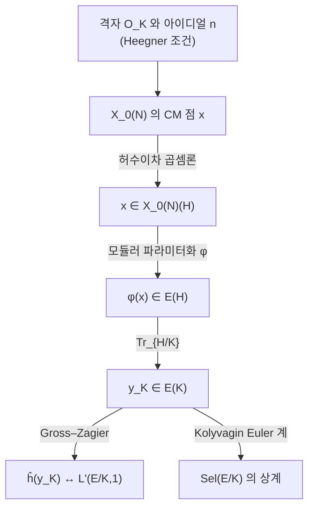

# Heegner 점과 Gross–Zagier 공식

# 개요

[Birch–Swinnerton-Dyer 추측](birch-swinnerton-dyer.md)에서 해석적 순위 $\le1$ 인 경우의 해결은 점 하나에 걸려 있다. 타원곡선 $E/\mathbb Q$ 의 도체가 $N$ 일 때 [모듈러 곡선](modular-curves.md) $X_0(N)$ 위에는 허수이차 곱셈을 가진 특수한 점들이 있고, 모듈러 파라미터화

$$
\varphi\colon X_0(N)\longrightarrow E
$$

로 옮긴 뒤 자취를 취하면 $E$ 의 대수적 점 $y_K\in E(K)$ 가 만들어진다. 이것이 **Heegner 점**이다.

Gross 와 Zagier 는 1986 년에 이 점의 정준 높이가 $L$ 함수의 미분과 같음을 증명했다.[^1]

$$
L'(E/K,1)=\frac{32\pi^2\thinspace\langle f,f\rangle}{u^2\sqrt{|D|}}\thickspace\hat h(y_K)
$$

좌변은 해석, 우변은 기하다. $L'(E/K,1)\ne0$ 이면 $\hat h(y_K)\ne0$ 이므로 $y_K$ 가 무한위수이고 $\mathrm{rank}\thinspace E(K)\ge1$ 이다.

Kolyvagin 은 반대 부등식을 얻었다. $y_K$ 가 무한위수이면 그것에서 Euler 계를 만들어 [Selmer 군](selmer-groups.md)을 누를 수 있고, 순위가 정확히 $1$ 이며 $\text{Ш}$ 가 유한하다. 두 정리를 합친 것이 해석적 순위 $\le1$ 인 경우의 BSD(Birch–Swinnerton-Dyer) 추측이다.

# 직관

## Heegner 조건

$X_0(N)$ 의 점은 순환 $N$ 등원사상 $E_1\to E_2$ 다. Heegner 의 착상은 이 자료를 허수이차체에서 통째로 만들어 내는 것이다.

허수이차체 $K=\mathbb Q(\sqrt D)$ ($D\lt 0$ 기본판별식)의 정수환 $\mathcal O_K$ 는 $\mathbb C$ 안의 [격자](lattices.md)이므로 타원곡선 $\mathbb C/\mathcal O_K$ 를 준다. 지표 $N$ 의 [아이디얼](ideals-quotient-rings.md) $\mathfrak n\subset\mathcal O_K$ 로

$$
\mathbb C/\mathcal O_K\thickspace\longrightarrow\thickspace\mathbb C/\mathfrak n^{-1}
$$

를 만들면 핵이 $\mathfrak n^{-1}/\mathcal O_K\cong\mathcal O_K/\mathfrak n$ 이다. 이 몫이 순환군 $\mathbb Z/N$ 이 되는 조건이 **Heegner 조건**이다.

> $N$ 을 나누는 모든 소수가 $K$ 에서 분열한다. 동치로, $D$ 가 $\bmod\thinspace 4N$ 제곱이다.

조건을 만족하는 $D$ 는 다음으로 찾는다.

```javascript
// N 에 대한 Heegner 판별식: D<0 기본판별식이면서 D 가 mod 4N 제곱
const isFundamental = (D) => {
  if (D >= 0) return false;
  const r = ((D % 4) + 4) % 4;
  if (r === 1) {                                    // D ≡ 1 (mod 4), 제곱인수 없음
    for (let f = 3; f * f <= -D; f += 2) if (D % (f * f) === 0) return false;
    return true;
  }
  if (r === 0) {                                    // D = 4m, m ≡ 2,3 (mod 4)
    const m = D / 4, s = ((m % 4) + 4) % 4;
    if (s !== 2 && s !== 3) return false;
    for (let f = 2; f * f <= -m; f++) if (m % (f * f) === 0) return false;
    return true;
  }
  return false;
};

const isSquareMod = (D, M) => {
  const r = ((D % M) + M) % M;
  for (let x = 0; x < M; x++) if ((x * x) % M === r) return true;
  return false;
};

const heegnerDiscs = (N, howMany) => {
  const out = [];
  for (let D = -1; D > -200 && out.length < howMany; D--)
    if (isFundamental(D) && isSquareMod(D, 4 * N)) out.push(D);
  return out;
};
```

| $N$ | 절댓값이 작은 Heegner 판별식 |
| --- | --- |
| $11$ | $-7,\ -8,\ -11,\ -19,\ -24,\ -35$ |
| $37$ | $-3,\ -4,\ -7,\ -11,\ -40,\ -47$ |
| $389$ | $-4,\ -7,\ -11,\ -19,\ -20,\ -24$ |

$N=11$ 에서 $D=-7$ 이 나온다. $-7\equiv 37\pmod{44}$ 이고 $9^2\equiv37$ 이며, $11$ 은 $\mathbb Q(\sqrt{-7})$ 에서 분열한다.

## 복소 곱셈과 힐베르트 유체

위 구성은 복소해석적인데 나온 점은 대수적수 체 위에서 정의된다. 근거는 [복소 곱셈론](complex-multiplication.md)이다. $\mathbb C/\mathfrak a$ 의 $j$ 불변량은 대수적 정수이고 $K$ 의 **힐베르트 유체** $H$ , 곧 최대 비분기 아벨확대를 생성한다.

$$
H=K\bigl(j(\mathcal O_K)\bigr),\qquad \mathrm{Gal}(H/K)\cong \mathrm{Cl}(K)
$$

Shimura 상호법칙이 Galois 작용을 유군의 작용으로 번역한다. 아이디얼류 $[\mathfrak a]$ 에 대응하는 $\sigma_{\mathfrak a}\in\mathrm{Gal}(H/K)$ 가 $x_{\mathcal O_K}$ 를 $x_{\mathfrak a^{-1}}$ 로 보낸다. Galois 작용이 격자의 곱셈으로 보이는 이 명시성이 Euler 계 구성에 쓰인다.

## 자취

$x\in X_0(N)(H)$ 를 $\varphi$ 로 옮기면 $\varphi(x)\in E(H)$ 다. 자취를 취해 $K$ 로 내린다.

$$
y_K=\mathrm{Tr}\_{H/K}\bigl(\varphi(x)\bigr)=\sum_{\sigma\in\mathrm{Gal}(H/K)}\varphi(x)^{\sigma}\thickspace\in\thickspace E(K)
$$

$E$ 의 군 구조가 있으므로 합이 정의된다.



## 함수방정식의 부호

$K$ 위에서 $L$ 함수가 쪼개진다.

$$
L(E/K,s)=L(E,s)\cdot L(E^{D},s)
$$

$E^{D}$ 는 $D$ 에 의한 이차 꼬임이다. Heegner 조건 아래에서 함수방정식의 부호가 $\varepsilon(E/K)=-1$ 로 강제되어 $L(E/K,1)=0$ 이 자동이다. 첫 정보는 미분 $L'(E/K,1)$ 에서 나오고, 부호 $-1$ 은 BSD 관점에서 순위가 홀수라는 예측이므로 이 구성은 순위 1 을 겨냥한 장치다.

## 순위 2 의 한계

Heegner 점은 $K$ 하나마다 하나 나온다. $K$ 를 바꾸면 다른 점이 나오지만 $E(\mathbb Q)$ 에 내리면 서로 독립인 두 점을 주지 못한다. 공식의 우변이 높이 하나인 이상 좌변의 소실 차수도 $1$ 까지만 읽히고, $L''(E,1)$ 을 재는 대상은 이 구성 안에 없다.

# 정의

## Heegner 점

$E/\mathbb Q$ 의 도체를 $N$ 이라 하고 $K=\mathbb Q(\sqrt D)$ 를 Heegner 조건을 만족하는 허수이차체라 하자. $\mathcal O_K/\mathfrak n\cong\mathbb Z/N$ 인 아이디얼 $\mathfrak n$ 을 고정하면 각 아이디얼류 $[\mathfrak a]\in\mathrm{Cl}(K)$ 에 대해

$$
x_{\mathfrak a}=\bigl(\mathbb C/\mathfrak a\thickspace\longrightarrow\thickspace\mathbb C/\mathfrak a\mathfrak n^{-1}\bigr)\thickspace\in\thickspace X_0(N)(H)
$$

가 정의된다. 유수만큼의 점이 나오고 $\mathrm{Gal}(H/K)$ 가 이들을 단순추이적으로 섞는다.

## 모듈러 파라미터화

모듈러성 정리에 의해 무게 $2$ 준위 $N$ 의 첨점 고유형식 $f$ 가 있어 $E$ 가 $J_0(N)$ 의 몫이 되고, $X_0(N)\hookrightarrow J_0(N)\twoheadrightarrow E$ 의 합성이 $\mathbb Q$ 위에서 정의된 사상

$$
\varphi\colon X_0(N)\to E,\qquad \varphi(\infty)=O
$$

를 준다. $\varphi$ 는 첨점 $\infty$ 를 영점으로 보내도록 정규화하고, 그 차수 $\deg\varphi$ 가 모듈러 차수다.

## Gross–Zagier 공식

$y_K=\mathrm{Tr}\_{H/K}\varphi(x_{\mathcal O_K})$ , $\hat h$ 를 $E/K$ 위의 Néron–Tate 정준 높이, $u=|\mathcal O_K^\times|/2$ , $\langle f,f\rangle$ 을 Petersson 노름이라 하면

$$
L'(E/K,1)=\frac{32\pi^2\thinspace\langle f,f\rangle}{u^2\sqrt{|D|}}\thickspace\hat h(y_K)
$$

이다. 우변의 상수가 양수이므로

$$
L'(E/K,1)\ne0\iff \hat h(y_K)\ne0\iff y_K\ \text{가 무한위수}
$$

가 성립한다. 양변이 $\varphi$ 의 선택에 의존하지 않도록 정규화가 잡혀 있다.

## Kolyvagin 의 Euler 계

$n$ 이 적당한 소수들의 곱일 때 순서환 $\mathcal O_n=\mathbb Z+n\mathcal O_K$ 에 대응하는 링 유체 $K_n$ 위에서 Heegner 점 $y_n\in E(K_n)$ 이 정의되고, 자취 정합성

$$
\mathrm{Tr}\_{K_{n\ell}/K_n}(y_{n\ell})=a_\ell\thinspace y_n
$$

을 만족한다. $a_\ell$ 은 $f$ 의 $\ell$ 번째 Hecke 고유값이다. 이 정합성에서 유도류 $\kappa_n\in H^1(K,E[p])$ 를 만들면 각 $\kappa_n$ 이 국소 조건을 하나씩 강제해 Selmer 군의 크기를 위에서 누른다. Euler 계는 정합적인 대수류의 열로 Selmer 군을 조이는 장치다.

# 성질

## 순위 $\le1$ 의 BSD

$E/\mathbb Q$ 의 해석적 순위를 $r_{\mathrm{an}}=\mathrm{ord}\_{s=1}L(E,s)$ 라 하면 두 정리의 결론은 다음과 같다.

| 가정 | 결론 |
|---|---|
| $r_{\mathrm{an}}=0$ | $\mathrm{rank}\thinspace E(\mathbb Q)=0$ 이고 $\text{Ш}(E/\mathbb Q)$ 유한 |
| $r_{\mathrm{an}}=1$ | $\mathrm{rank}\thinspace E(\mathbb Q)=1$ 이고 $\text{Ш}(E/\mathbb Q)$ 유한 |
| $r_{\mathrm{an}}\ge2$ | 두 정리가 결론을 주지 않음 |

$r_{\mathrm{an}}=0$ 인 경우도 같은 장치로 처리된다. 꼬임 $E^{D}$ 쪽이 순위 $1$ 을 갖는 $K$ 를 골라 $E$ 쪽 Heegner 점이 비틀림임을 보이면 Kolyvagin 논법이 $E(\mathbb Q)$ 를 유한으로 만든다. 그런 $K$ 의 존재는 Waldspurger 계열의 비소실 정리(Bump–Friedberg–Hoffstein, Murty–Murty)가 보장한다.

## 두 국소 분해

Gross–Zagier 증명은 같은 양을 두 방식으로 국소 항의 합으로 쓰고 항끼리 맞춘다.

- **기하 쪽.** 정준 높이가 Néron 국소 높이의 합 $\hat h(y_K)=\sum_v \lambda_v$ 로 분해된다. 각 $\lambda_v$ 는 $v$ 자리에서 두 CM(complex multiplication) 점의 교차수이고, 유한 자리에서는 준동형사상 개수를 세는 문제로, 무한 자리에서는 상반평면의 Green 함수 적분으로 바뀐다.
- **해석 쪽.** $L(E/K,s)$ 가 $f$ 와 $K$ 에 붙는 theta 급수의 [Rankin–Selberg 적분](rankin-selberg.md)으로 표현된다. $s=1$ 에서 미분하면 [Eisenstein 급수](eisenstein-series.md)의 Fourier 계수가 나오고 그 계수들이 국소 항의 합으로 쪼개진다.

두 분해의 항이 자리마다 일치한다는 것이 정리의 내용이다. 양쪽 모두 $K$ 의 아이디얼을 세되 한쪽은 격자의 교차로, 다른 쪽은 이차형식의 표현수로 센다.

## 생성원 계산

공식은 순위 $1$ 인 $E$ 의 생성원을 구하는 알고리즘을 준다. 좌표의 높이가 커지면 막히는 점 탐색과 달리 Heegner 점 방법은 그 높이에 거의 영향을 받지 않는다.

1. Heegner 조건과 유수가 작다는 조건을 만족하는 $D$ 를 고른다.
2. $f$ 의 $q$ 전개로 $\varphi$ 를 복소해석적으로 계산한다. $x_{\mathfrak a}$ 는 상반평면의 이차무리점이므로 $\varphi(x_{\mathfrak a})=\sum_{n\ge1}\frac{a_n}{n}q^n$ 를 수치적으로 더한다.
3. 자취를 취해 $y_K$ 의 복소 근사를 얻고, $E$ 의 주기격자로 되돌려 좌표의 유리수 복원을 시도한다.
4. 얻은 점이 $E$ 위에 있는지 정확산술로 확인한다.

Elkies 는 이 방법으로 좌표 분자의 자릿수가 수천에 이르는 생성원을 찾았다.

## 비틀림이 되는 경우

$D$ 를 잘못 고르면 $y_K$ 가 비틀림 점이 되어 정보를 주지 않는다. 곡선 $389a$ 는 순위 $2$ 라 어떤 $K$ 에서도 $L'(E/K,1)=0$ 이고 공식이 $\hat h(y_K)=0$ 을 준다. 순위 $\ge2$ 에서 방법이 막힌다는 사실이 공식 자체에 적혀 있다.

## 일반화

- **Gross–Zagier–Zhang.** Zhang 이 공식을 총실체 위의 Shimura 곡선으로 확장했고, Yuan–Zhang–Zhang 이 자기동형 표현의 언어로 일반화했다. 그 형태에서 공식은 Waldspurger 공식의 미분판이다.
- **$p$ 진 Gross–Zagier.** Perrin-Riou 가 $p$ 진 $L$ 함수의 미분과 $p$ 진 높이를 잇는 판본을 얻었다. Iwasawa 주추측과 결합해 $\text{Ш}$ 의 $p$ 부분을 재는 데 쓰인다.
- **Stark–Heegner 점.** Darmon 이 실이차체에서 유사한 점을 $p$ 진 상반평면 위의 적분으로 정의하는 구성을 제안했고, 그 점이 대수적이라는 것은 추측으로 남겼다[^2].

# 활용

## 합동수 문제

$n$ 이 합동수, 곧 세 변이 유리수이고 넓이가 $n$ 인 직각삼각형이 있는 수인 것은 $y^2=x^3-n^2x$ 의 순위가 양수인 것과 같다. 해석적 순위 $\le1$ 인 경우가 해결되어 있으므로 $L$ 함수의 소실 차수 계산이 판정이 된다. 그 계산을 유한한 조건으로 바꾼 것이 Tunnell 정리이고, 최종 진술은 BSD 전체를 기다린다.

## $\text{Ш}$ 의 위수 계산

Kolyvagin 논법은 명시적 상계를 준다. Heegner 점의 $p$ 로 나누어떨어짐 정도(Kolyvagin 지표)가 $\text{Ш}$ 의 $p$ 부분 위수를 제어한다.

$$
\mathrm{ord}\_p\bigl|\text{Ш}(E/K)\bigr|\thickspace\le\thickspace 2\thinspace\mathrm{ord}\_p\bigl[E(K):\mathbb Z y_K\bigr]
$$

역방향 부등식이 Iwasawa 이론에서 나오면 등호가 되고, 그것이 순위 $1$ 에서의 강한 BSD 다.

## 대수적 순환류의 모형

Heegner 점은 특수값을 대수적 순환류로 실현하는 도식의 예다. $L$ 함수의 소실 차수만큼의 대수적 순환류가 있어야 한다는 Beilinson–Bloch 류의 예측이 차수 $1$ 에 대해 증명된 경우이며, 이후의 Euler 계 이론과 $p$ 진 $L$ 함수의 미분 공식, 자기동형 주기 공식이 이 그림을 따른다.

[^1]: B. Gross, D. Zagier, *Heegner points and derivatives of L-series*, Invent. Math. **84** (1986), 225–320. Kolyvagin 은 *Finiteness of* $E(\mathbb Q)$ *and* $\text{Ш}(E,\mathbb Q)$ *for a subclass of Weil curves*, Izv. Akad. Nauk SSSR **52** (1988). 해설로는 H. Darmon, *Rational Points on Modular Elliptic Curves* (CBMS 101) 와 Gross 의 *Kolyvagin's work on modular elliptic curves* 가 있다.
[^2]: H. Darmon, *Integration on* $\mathcal H\_p\times\mathcal H$ *and arithmetic applications*, Ann. of Math. **154** (2001), 589–639. Stark–Heegner 점을 구성하고 그 대수성을 추측으로 제시한다.

# 연관 문서

## 선수지식

- [Birch–Swinnerton-Dyer 추측](birch-swinnerton-dyer.md)
- [모듈러 곡선](modular-curves.md)
- [복소 곱셈](complex-multiplication.md)

## 더 알아보기

- [Euler 계와 Kolyvagin 유도류](euler-systems.md)
- [Waldspurger 정리와 토릭 주기](waldspurger-formula.md)

#number_theory #theorem #complex_analysis
