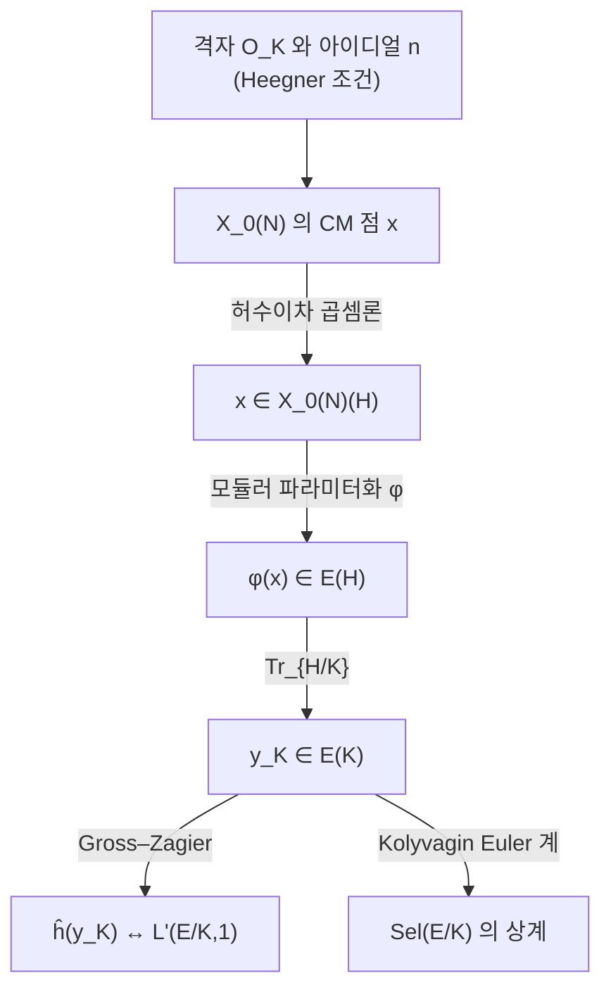

# Heegner 점과 Gross–Zagier 공식

# 개요

[Birch–Swinnerton-Dyer 추측](birch-swinnerton-dyer.md)에서 해석적 순위 `\le1` 인 경우가 해결되어 있다고 했다. 그 해결 전체가 **점 하나**에 걸려 있다. 타원곡선 `E/\mathbb Q` 의 도체가 `N` 일 때 [모듈러 곡선](modular-curves.md) `X_0(N)` 위에 허수이차 곱셈을 가진 특수한 점들이 있고, 모듈러 파라미터화

$$
\varphi\colon X_0(N)\longrightarrow E
$$

로 그것을 옮긴 뒤 자취를 취하면 `E` 의 대수적 점 `y_K\in E(K)` 가 하나 만들어진다. 이것이 **Heegner 점**이다.

Gross 와 Zagier 는 1986 년에 이 점의 정준 높이가 `L` 함수의 미분과 같음을 증명했다.[^1]

$$
L'(E/K,1)=\frac{32\pi^2\,\langle f,f\rangle}{u^2\sqrt{|D|}}\;\hat h(y_K)
$$

좌변은 해석, 우변은 기하다. 등식의 힘은 즉시 드러난다. `L'(E/K,1)\ne0` 이면 `\hat h(y_K)\ne0` 이므로 `y_K` 가 무한위수이고, 곧 `\mathrm{rank}\,E(K)\ge1` 이다. 해석적 정보에서 **실제 유리점**이 나온 것이다.

Kolyvagin 은 이어서 반대 부등식을 얻었다. `y_K` 가 무한위수이면 그것을 씨앗으로 Euler 계를 만들어 [Selmer 군](selmer-groups.md)을 누를 수 있고, 그 결과 순위가 정확히 `1` 이며 `Ш` 가 유한하다. 두 정리를 합치면 해석적 순위 `\le1` 인 경우의 BSD 다.

# 직관

## 격자 하나에서 점 하나

`X_0(N)` 의 점은 순환 `N` 등원사상 `E_1\to E_2` 다. 이 자료를 **허수이차체에서 통째로 만들어 내는** 것이 Heegner 의 착상이다.

허수이차체 `K=\mathbb Q(\sqrt D)`(`D<0` 기본판별식)를 잡고 정수환 `\mathcal O_K` 를 본다. `\mathcal O_K` 자체가 `\mathbb C` 안의 격자이므로 타원곡선 `\mathbb C/\mathcal O_K` 를 준다. 여기에 지표 `N` 의 아이디얼 `\mathfrak n\subset\mathcal O_K` 로

$$
\mathbb C/\mathcal O_K\;\longrightarrow\;\mathbb C/\mathfrak n^{-1}
$$

를 만들면 핵이 `\mathfrak n^{-1}/\mathcal O_K\cong\mathcal O_K/\mathfrak n` 이다. 이 몫이 순환군 `\mathbb Z/N` 이 되려면 `\mathcal O_K/\mathfrak n\cong\mathbb Z/N` 이어야 하고, 그 조건이 바로 **Heegner 조건**이다.

> `N` 을 나누는 모든 소수가 `K` 에서 분열한다. 동치로, `D` 가 `\bmod\,4N` 제곱이다.

조건을 만족하는 `D` 는 계산으로 바로 찾는다.

```javascript
// N 에 대한 Heegner 판별식: D<0 기본판별식이면서 D 가 mod 4N 제곱
const isFundamental = (D) => {
  if (D >= 0) return false;
  const r = ((D % 4) + 4) % 4;
  if (r === 1) {                                    // D ≡ 1 (mod 4), 제곱인수 없음
    for (let f = 3; f * f <= -D; f += 2) if (D % (f * f) === 0) return false;
    return true;
  }
  if (r === 0) {                                    // D = 4m, m ≡ 2,3 (mod 4)
    const m = D / 4, s = ((m % 4) + 4) % 4;
    if (s !== 2 && s !== 3) return false;
    for (let f = 2; f * f <= -m; f++) if (m % (f * f) === 0) return false;
    return true;
  }
  return false;
};

const isSquareMod = (D, M) => {
  const r = ((D % M) + M) % M;
  for (let x = 0; x < M; x++) if ((x * x) % M === r) return true;
  return false;
};

for (const N of [11, 37, 389]) {
  const out = [];
  for (let D = -1; D > -200 && out.length < 6; D--)
    if (isFundamental(D) && isSquareMod(D, 4 * N)) out.push(D);
  console.log(`N=${N}:`, out.join(', '));
}
// N=11:  -7, -8, -11, -19, -24, -35
// N=37:  -3, -4, -7, -11, -40, -47
// N=389: -4, -7, -11, -19, -20, -24
```

`N=11` 에서 `D=-7` 이 나온다. `-7\equiv 37\pmod{44}` 이고 `9^2=81\equiv37` 이니 조건이 맞고, 실제로 `11` 은 `\mathbb Q(\sqrt{-7})` 에서 분열한다.

## 복소해석으로 만든 점이 왜 대수적인가

위 구성은 순전히 복소해석적이다. 격자를 잡고 몫을 취했을 뿐이다. 그런데 나온 점은 대수적수 체 위에서 정의된다. 이유는 [복소 곱셈론](complex-multiplication.md)이다. `\mathbb C/\mathfrak a` 의 `j` 불변량은 대수적 정수이고, 더 정확히는 `K` 의 **힐베르트 유체** `H`(최대 비분기 아벨확대) 를 생성한다.

$$
H=K\bigl(j(\mathcal O_K)\bigr),\qquad \mathrm{Gal}(H/K)\cong \mathrm{Cl}(K)
$$

Shimura 상호법칙이 Galois 작용을 유군의 작용으로 번역한다. 아이디얼류 `[\mathfrak a]` 에 대응하는 `\sigma_{\mathfrak a}\in\mathrm{Gal}(H/K)` 가 Heegner 점 `x_{\mathcal O_K}` 를 `x_{\mathfrak a^{-1}}` 로 보낸다. **Galois 군의 작용이 격자의 곱셈으로 보이는** 것이다. 이 명시성이 뒤에 Euler 계를 만들 때 결정적으로 쓰인다.

## 내려서 `K` 유리점으로

`x\in X_0(N)(H)` 를 `\varphi` 로 옮기면 `\varphi(x)\in E(H)` 다. 아직 `H` 위의 점이라 다루기 불편하니 자취를 취해 내린다.

$$
y_K=\mathrm{Tr}_{H/K}\bigl(\varphi(x)\bigr)=\sum_{\sigma\in\mathrm{Gal}(H/K)}\varphi(x)^{\sigma}\;\in\;E(K)
$$

`E` 의 군 구조가 있으므로 합이 말이 된다. 이 한 줄이 "특수점의 대수적 성질" 을 "`E(K)` 의 원소" 로 바꾼다.



## 왜 `L` 의 값이 아니라 미분인가

`K` 위에서 보면 `L` 함수가 쪼개진다.

$$
L(E/K,s)=L(E,s)\cdot L(E^{D},s)
$$

`E^{D}` 는 `D` 에 의한 이차 꼬임이다. Heegner 조건 아래에서 함수방정식의 부호가 `\varepsilon(E/K)=-1` 로 강제되고, 따라서

$$
L(E/K,1)=0
$$

이 자동이다. 값이 항상 `0` 이니 정보가 없고, 첫 정보는 미분 `L'(E/K,1)` 에서 나온다. Gross–Zagier 공식이 하필 미분을 다루는 이유가 이것이다. 부호가 `-1` 이라는 것은 BSD 관점에서 "순위가 홀수" 라는 예측이므로, 이 구성은 애초에 **순위 1 을 겨냥한 장치**다.

## 왜 순위 2 에서 멈추는가

Heegner 점은 `K` 를 하나 고를 때마다 하나 나온다. `K` 를 바꾸면 다른 점이 나오지만 그것은 `E(K')` 의 점이고, `E(\mathbb Q)` 에 내리면 서로 독립인 두 점을 주지 못한다. 공식의 우변이 높이 **하나**인 이상 좌변의 소실 차수도 `1` 까지밖에 못 읽는다. `L''(E,1)` 을 재는 대상은 이 구성 안에 없다.

# 정의

## Heegner 점

`E/\mathbb Q` 의 도체를 `N`, `K=\mathbb Q(\sqrt D)` 를 Heegner 조건을 만족하는 허수이차체라 하자. `\mathcal O_K/\mathfrak n\cong\mathbb Z/N` 인 아이디얼 `\mathfrak n` 을 하나 고정하면, 각 아이디얼류 `[\mathfrak a]\in\mathrm{Cl}(K)` 에 대해

$$
x_{\mathfrak a}=\bigl(\mathbb C/\mathfrak a\;\longrightarrow\;\mathbb C/\mathfrak a\mathfrak n^{-1}\bigr)\;\in\;X_0(N)(H)
$$

가 정의된다. 유수만큼의 점이 나오고 `\mathrm{Gal}(H/K)` 가 이들을 단순추이적으로 섞는다.

## 모듈러 파라미터화

모듈러성 정리에 의해 무게 `2` 준위 `N` 의 첨점 고유형식 `f` 가 있어 `E` 가 `J_0(N)` 의 몫이 되고, `X_0(N)\hookrightarrow J_0(N)\twoheadrightarrow E` 의 합성이 `\mathbb Q` 위에서 정의된 사상

$$
\varphi\colon X_0(N)\to E,\qquad \varphi(\infty)=O
$$

를 준다. `\varphi` 는 첨점 `\infty` 를 영점으로 보내도록 정규화하며, 그 차수 `\deg\varphi` 를 모듈러 차수라 부른다.

## Gross–Zagier 공식

`y_K=\mathrm{Tr}_{H/K}\varphi(x_{\mathcal O_K})` 라 두고 `\hat h` 를 `E/K` 위의 Néron–Tate 정준 높이, `u=|\mathcal O_K^\times|/2`, `\langle f,f\rangle` 을 Petersson 노름이라 하자. 그러면

$$
L'(E/K,1)=\frac{32\pi^2\,\langle f,f\rangle}{u^2\sqrt{|D|}}\;\hat h(y_K)
$$

특히 우변의 상수는 양수이므로

$$
L'(E/K,1)\ne0\iff \hat h(y_K)\ne0\iff y_K\ \text{가 무한위수}
$$

가 성립한다. 등식의 양변이 `\varphi` 의 선택(모듈러 차수)에 의존하지 않도록 정규화가 잡혀 있다.

## Kolyvagin 의 Euler 계

`y_K` 하나가 아니라 그 **족**이 필요하다. `n` 이 적당한 소수들의 곱일 때 순서환 `\mathcal O_n=\mathbb Z+n\mathcal O_K` 에 대응하는 링 유체 `K_n` 위에서 Heegner 점 `y_n\in E(K_n)` 이 정의되고, 이들이 자취 정합성

$$
\mathrm{Tr}_{K_{n\ell}/K_n}(y_{n\ell})=a_\ell\,y_n
$$

을 만족한다. `a_\ell` 은 `f` 의 `\ell` 번째 Hecke 고유값이다. 이 정합성에서 유도류 `\kappa_n\in H^1(K,E[p])` 를 만들고, 각 `\kappa_n` 이 국소 조건을 하나씩 강제해 Selmer 군의 크기를 위에서 누른다. Euler 계란 이렇게 **정합적인 대수류의 열로 Selmer 군을 조이는 장치**다.

# 성질

## 결론: 순위 `\le1` 인 BSD

두 정리를 합치면 다음을 얻는다. `E/\mathbb Q` 의 해석적 순위를 `r_{\mathrm{an}}=\mathrm{ord}_{s=1}L(E,s)` 라 할 때

| 가정 | 결론 |
|---|---|
| `r_{\mathrm{an}}=0` | `\mathrm{rank}\,E(\mathbb Q)=0` 이고 `Ш(E/\mathbb Q)` 유한 |
| `r_{\mathrm{an}}=1` | `\mathrm{rank}\,E(\mathbb Q)=1` 이고 `Ш(E/\mathbb Q)` 유한 |
| `r_{\mathrm{an}}\ge2` | 아무것도 증명되지 않음 |

`r_{\mathrm{an}}=0` 인 경우도 같은 장치로 처리된다. 적당한 `K` 를 골라 꼬임 `E^{D}` 쪽이 순위 `1` 을 갖게 하고, `E` 쪽에서는 Heegner 점이 비틀림이 됨을 보이면 Kolyvagin 논법이 `E(\mathbb Q)` 를 유한으로 만든다. 그런 `K` 가 존재한다는 것은 Waldspurger 계열의 비소실 정리(Bump–Friedberg–Hoffstein, Murty–Murty)가 보장한다.

## 증명이 왜 작동하는가: 두 개의 국소 분해

Gross–Zagier 증명의 골자는 같은 양을 두 방식으로 국소 항의 합으로 쓰고 항끼리 맞추는 것이다.

- **기하 쪽.** 정준 높이는 Néron 국소 높이의 합 `\hat h(y_K)=\sum_v \lambda_v` 로 분해된다. 각 `\lambda_v` 는 `v` 자리에서 두 CM 점의 교차수로 계산되고, 유한 자리에서는 준동형사상 개수를 세는 문제로, 무한 자리에서는 상반평면의 Green 함수 적분으로 바뀐다.
- **해석 쪽.** `L(E/K,s)` 는 `f` 와 `K` 에 붙는 theta 급수의 Rankin–Selberg 적분으로 표현된다. `s=1` 에서 미분하면 Eisenstein 급수의 Fourier 계수가 나오고, 그 계수들이 다시 국소 항의 합으로 쪼개진다.

두 분해의 항이 자리마다 일치한다는 것이 정리의 내용이다. 우연처럼 보이지만 우연이 아니다. 양쪽 모두 `K` 의 아이디얼을 세고 있고, 한쪽은 격자의 교차로, 다른 쪽은 이차형식의 표현수로 셀 뿐이다.

## 실제로 점을 찾는 방법이 된다

공식은 존재 증명에 그치지 않고 **생성원을 계산하는 알고리즘**을 준다. 순위 `1` 인 `E` 의 생성원을 찾고 싶을 때 순진한 점 탐색은 좌표의 높이가 커지면 곧바로 막히는데, Heegner 점 방법은 그 높이에 거의 영향을 받지 않는다.

1. Heegner 조건과 유수가 작다는 조건을 만족하는 `D` 를 고른다.
2. `f` 의 `q` 전개로 `\varphi` 를 복소해석적으로 계산한다. `x_{\mathfrak a}` 는 상반평면의 이차무리점이므로 `\varphi(x_{\mathfrak a})=\sum_{n\ge1}\frac{a_n}{n}q^n` 를 수치적으로 더한다.
3. 자취를 취해 `y_K` 의 복소 근사를 얻고, `E` 의 주기격자로 되돌려 좌표의 유리수 복원을 시도한다.
4. 얻은 점이 실제로 `E` 위에 있는지 정확산술로 검증한다.

Elkies 는 이 방법으로 좌표 분자의 자릿수가 수천에 이르는 생성원을 찾아냈다. 수치 해석이 대수적 답을 뱉고, 그 답이 사후에 엄밀히 검증되는 구조다.

## 비틀림이 되는 경우

`D` 를 잘못 고르면 `y_K` 가 비틀림 점이 되어 아무 정보도 주지 않는다. 위 코드의 `N=389` 가 그 예다. `389a` 는 순위 `2` 라 어떤 `K` 를 골라도 `L'(E/K,1)=0` 이고 Gross–Zagier 공식이 `\hat h(y_K)=0` 을 준다. 순위 `\ge2` 에서 방법이 막힌다는 사실이 공식 자체에 이미 적혀 있는 셈이다.

## 일반화

- **Gross–Zagier–Zhang.** Zhang 이 전공식을 총실체 위의 Shimura 곡선으로 확장했고, Yuan–Zhang–Zhang 이 자기동형 표현의 언어로 완전히 일반화했다. 그 형태에서 공식은 Waldspurger 공식의 미분판으로 보인다.
- **`p` 진 Gross–Zagier.** Perrin-Riou 가 `p` 진 `L` 함수의 미분과 `p` 진 높이를 잇는 판본을 얻었다. Iwasawa 주추측과 결합해 `Ш` 의 `p` 부분을 정밀하게 재는 데 쓰인다.
- **Stark–Heegner 점.** Darmon 은 실이차체에서 유사한 점을 정의하는 추측적 구성을 제안했다. `p` 진 상반평면 위의 적분으로 정의되며, 대수적임이 아직 증명되지 않았다.

# 활용

## 합동수 문제

`n` 이 합동수(직각삼각형 세 변이 유리수이고 넓이가 `n`)인 것은 `y^2=x^3-n^2x` 의 순위가 양수인 것과 같다. 해석적 순위 `\le1` 인 경우가 해결되어 있으므로, `L` 함수의 소실 차수를 계산하면 판정이 끝난다. 그 계산을 유한한 조건으로 바꾼 것이 Tunnell 정리이며, 이 방향의 최종 진술은 BSD 전체를 기다린다.

## `Ш` 의 위수 계산

Kolyvagin 논법은 유한성만 주는 것이 아니라 명시적 상계를 준다. Heegner 점의 `p` 로 나누어떨어짐 정도(Kolyvagin 지표)가 `Ш` 의 `p` 부분 위수를 제어한다.

$$
\mathrm{ord}_p\bigl|Ш(E/K)\bigr|\;\le\;2\,\mathrm{ord}_p\bigl[E(K):\mathbb Z y_K\bigr]
$$

역방향 부등식이 Iwasawa 이론에서 나오면 등호가 되고, 그것이 순위 `1` 에서의 강한 BSD 다. `Ш` 의 위수를 손으로 세는 대신 **점 하나가 얼마나 나누어떨어지는지** 재는 것으로 문제가 바뀐다.

## 왜 이 구성이 표준적 예가 되었나

Heegner 점은 "특수값을 대수적 순환류로 실현한다" 는 도식의 가장 완전한 예다. `L` 함수의 소실 차수만큼의 대수적 순환류가 있어야 한다는 Beilinson–Bloch 류의 예측이 여기서는 차수 `1` 에 대해 실제로 증명되어 있다. 이후의 Euler 계 이론, `p` 진 `L` 함수의 미분 공식, 자기동형 주기 공식들이 모두 이 그림을 원형으로 삼는다.

[^1]: B. Gross, D. Zagier, *Heegner points and derivatives of L-series*, Invent. Math. **84** (1986), 225–320. Kolyvagin 은 *Finiteness of* `E(\mathbb Q)` *and* `Ш(E,\mathbb Q)` *for a subclass of Weil curves*, Izv. Akad. Nauk SSSR **52** (1988). 해설로는 H. Darmon, *Rational Points on Modular Elliptic Curves* (CBMS 101) 와 Gross 의 *Kolyvagin's work on modular elliptic curves* 를 보라. 본문의 판별식 계산은 직접 한 것이다.

# 연관 문서

## 선수지식

- [Birch–Swinnerton-Dyer 추측](birch-swinnerton-dyer.md)
- [모듈러 곡선 X_0(N)](modular-curves.md)
- [복소 곱셈과 허수이차체의 유체론](complex-multiplication.md)

## 더 알아보기

아직 연결한 문서가 없다.

#number_theory #theorem #complex_analysis
