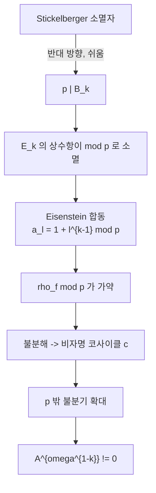

# Herbrand–Ribet 정리와 Eisenstein 합동

# 개요

[Stickelberger](stickelberger.md) 문서에서 본 소멸 정리는 한 방향만 준다. `p` 가 Bernoulli 수 `B_k` 를 나누지 않으면 순환체 류군의 $\omega^{1-k}$ 성분이 0 이다. 이것이 Herbrand 의 정리이며, 소멸자가 단원이라는 말이므로 증명은 한 줄이다.

반대 방향은 전혀 다르다.

$$
p\mid B_k\ \Longrightarrow\ A^{(\omega^{1-k})}\ne0
$$

여기서 요구되는 것은 **군의 원소를 실제로 만들어 내는 일**이다. 소멸자는 아무리 모아도 비자명한 원소를 생산하지 못한다. Ribet 은 1976 년에 그 원소를 모듈러 형식에서 가져왔다.

착상은 이렇다. 무게 `k` 의 Eisenstein 급수 `E_k` 의 상수항은 `-B_k/2k` 다. $p\mid B_k$ 이면 그 상수항이 `p` 를 법으로 사라지고, `E_k` 가 첨점형식처럼 보이기 시작한다. 실제로 `E_k` 와 합동인 첨점형식 `f` 가 존재하고, `f` 에 붙는 [Galois 표현](galois-representations.md) $\rho_f$ 를 $\bmod p$ 로 줄이면

$$
\bar\rho_f\sim\begin{pmatrix}1&*\\0&\omega^{k-1}\end{pmatrix}
$$

꼴의 **가약이지만 불분해**인 표현이 된다. `*` 가 0 이 아니라는 것이 핵심이고, 그 `*` 가 정의하는 확대가 바로 류군의 비자명한 원소다. 해석적 조건($p\mid B_k$)이 기하적 대상(모듈러 형식)을 거쳐 산술적 원소(이데알류)로 번역된다.

이 논법은 한 번 쓰고 버려진 기교가 아니다. Mazur–Wiles 의 [Iwasawa 주추측](iwasawa-main-conjecture.md) 증명이 이것을 탑 전체로 밀어 올린 것이고, Skinner–Urban 의 타원곡선 주추측도 같은 뼈대를 쓴다. **"군이 크다" 를 증명하려면 합동으로 표현을 만들어라**가 이 계열의 표어다.

# 직관

## 소멸자는 원소를 만들지 못한다

$\theta$ 가 류군을 죽인다는 사실은 "류군이 $\theta$ 의 핵 안에 있다" 는 상한이다. $\theta$ 의 성분이 0 이 되어도 그것은 상한이 무의미해졌다는 뜻일 뿐, 군이 커졌다는 증거가 아니다. 논리의 방향이 반대라서 같은 도구로는 건널 수 없다.

군이 크다는 것을 보이는 유일한 방법은 원소를 손에 쥐는 것이다. 류군의 원소는 불분기 아벨 확대에 대응하므로, 결국 **$\mathbb Q(\mu_p)$ 위의 불분기 확대를 하나 만들어야 한다.** 추상적으로 존재를 논하기 어려우니 어딘가에서 가져와야 하고, 모듈러 형식이 그 공급처다.

## 상수항이 사라지면 첨점형식이 된다

무게 `k` 의 Eisenstein 급수를 정규화하면

$$
E_k=-\frac{B_k}{2k}+\sum_{n\ge1}\sigma_{k-1}(n)\,q^{n}
$$

이다. $p\mid B_k$ 이면 상수항이 `p` 를 법으로 0 이므로, $E_k\bmod p$ 는 `q` 로 시작하는 급수, 곧 첨점형식의 `q` 전개처럼 보인다. 무게 `k` 의 [모듈러 형식](modular-forms.md) 공간에서 Eisenstein 부분과 첨점 부분이 $\mathbb Q$ 위에서는 갈라지지만 $\mathbb Z_p$ 위에서는 `B_k` 가 분모에 들어 있어 갈라지지 않는다. **분모의 `p` 가 두 부분을 붙여 놓는다.**

따라서 어떤 고유첨점형식 $f=\sum a_nq^{n}$ 과 소 아이디얼 $\mathfrak p\mid p$ 가 있어

$$
a_\ell\equiv1+\ell^{k-1}\pmod{\mathfrak p}\qquad(\ell\ne p\ \text{소수})
$$

가 성립한다. 이것이 **Eisenstein 합동**이다. 우변은 `E_k` 의 Hecke 고유값이다.

## 합동이 표현을 가약으로 만든다

`f` 에 붙는 2 차원 `p` 진 Galois 표현 $\rho_f$ 는

$$
\mathrm{tr}\,\rho_f(\mathrm{Fr}_\ell)=a_\ell,\qquad \det\rho_f(\mathrm{Fr}_\ell)=\ell^{k-1}
$$

를 만족한다. $\bmod\mathfrak p$ 로 줄이면 자취가 $1+\ell^{k-1}$ 이고 행렬식이 $\ell^{k-1}$ 이므로, Brauer–Nesbitt 로 반단순화가 $1\oplus\omega^{k-1}$ 이다. 곧 $\bar\rho_f$ 는 **가약**이다.

그러나 $\bar\rho_f$ 자체가 분해되지는 않는다. 분해된다면 `f` 가 Eisenstein 급수가 되어야 하는데 `f` 는 첨점형식이다. 그러므로 적당한 기저에서

$$
\bar\rho_f=\begin{pmatrix}1&*\\0&\omega^{k-1}\end{pmatrix},\qquad *\ne0
$$

이고, `*` 는 코사이클 $c\in H^1\big(G_{\mathbb Q},\mathbb F_p(\omega^{k-1})\big)$ 를 정의한다. **비자명한 코호몰로지 류가 생산되었다.** 소멸자 이론에는 없던 "만들어 내는" 단계가 여기서 일어난다.

## 왜 불분기인가

이제 `c` 가 정의하는 확대가 `p` 밖에서 불분기임을 보여야 류군의 원소가 된다.

- $\ell\ne p$ 에서는 `f` 가 레벨 1 이라 $\rho_f$ 가 비분기이고, 따라서 `c` 도 비분기다.
- $\ell=p$ 가 어려운 자리다. $\rho_f$ 는 `p` 에서 결정군에 대해 $\begin{pmatrix}\omega^{k-1}&*\\0&1\end{pmatrix}$ 꼴로 순종이며, 여기서 위첨자와 아래첨자의 순서가 대역 쪽과 뒤바뀐다. 두 삼각화를 비교하면 `c` 의 `p` 자리 제한이 소멸함이 나온다.

결과적으로 `c` 는 $\mathbb Q(\mu_p)$ 의 `p` 밖 불분기 확대를 준다. Galois 작용의 고유성분을 추적하면 그 확대의 류가 정확히 $A^{(\omega^{1-k})}$ 에 놓인다.

# 정의

## 지표 성분

`A` 를 $\mathbb Q(\mu_p)$ 의 이데알류군의 `p` 부분, $\Delta=\mathrm{Gal}(\mathbb Q(\mu_p)/\mathbb Q)\cong(\mathbb Z/p)^{\times}$ 라 하자. $\#\Delta=p-1$ 이 `p` 와 서로소이므로 군환 $\mathbb Z_p[\Delta]$ 의 멱등원으로

$$
A=\bigoplus_{i=0}^{p-2}A^{(\omega^{i})},
\qquad
\varepsilon_i=\frac1{p-1}\sum_{\delta\in\Delta}\omega^{i}(\delta)\,\delta^{-1}
$$

로 완전히 쪼개진다. $\omega$ 는 Teichmüller 지표다. 각 성분을 따로 묻는 것이 이 이론의 기본 문법이다.

## Eisenstein 급수와 상수항

무게 $k\ge4$ 가 짝수일 때 레벨 1 의 정규화된 Eisenstein 급수는

$$
E_k=-\frac{B_k}{2k}+\sum_{n\ge1}\sigma_{k-1}(n)q^{n},
\qquad
T_\ell E_k=(1+\ell^{k-1})E_k
$$

다. 첨점형식이 아닌 유일한 Hecke 고유형식이며, 그 고유값이 위 합동의 우변이다.

## Eisenstein 합동

**정리.** `p` 가 홀소수, `k` 가 짝수, $2\le k\le p-3$ 이고 $p\mid B_k$ 라 하자. 그러면 레벨 1, 무게 `k` 의 고유첨점형식 `f` 와 그 계수체의 `p` 위 소 아이디얼 $\mathfrak p$ 가 존재해

$$
a_\ell(f)\equiv1+\ell^{k-1}\pmod{\mathfrak p}\qquad(\forall\ell\ne p)
$$

이다.

무게 `k` 의 형식 공간에서 Eisenstein 부분을 상수항 1 로 정규화하면 계수에 `B_k` 가 분모로 들어간다. $p\mid B_k$ 는 그 정규화가 $\mathbb Z_p$ 위에서 불가능하다는 뜻이고, Hecke 대수의 Eisenstein 아이디얼이 극대 아이디얼에 포함된다는 말과 같다. **합동의 존재는 Hecke 대수의 국소 구조에 대한 진술이다.**

## Herbrand–Ribet 정리

**정리.** `p` 가 홀소수, `k` 가 짝수, $2\le k\le p-3$ 일 때

$$
p\mid B_k\quad\Longleftrightarrow\quad A^{(\omega^{1-k})}\ne0
$$

$\Leftarrow$ 가 Herbrand(1932), $\Rightarrow$ 가 Ribet(1976)이다.

# 성질

## 두 방향의 비대칭

| 방향 | 도구 | 난이도 |
|---|---|---|
| $p\nmid B_k\Rightarrow A^{(\omega^{1-k})}=0$ | Stickelberger 소멸자 | 쉬움 |
| $p\mid B_k\Rightarrow A^{(\omega^{1-k})}\ne0$ | Eisenstein 합동 + Galois 표현 | 어려움 |

이 비대칭은 산술 기하 전반에서 반복된다. 상한은 소멸자나 [Euler 계](euler-systems.md)로, 하한은 합동으로 얻는다. [Iwasawa 주추측](iwasawa-main-conjecture.md)의 두 나눔이 각각 이 두 기술에 대응하고, 타원곡선 쪽에서도 Kato 의 Euler 계와 Skinner–Urban 의 Eisenstein 합동이 같은 역할 분담을 한다.

## 왜 $\omega^{1-k}$ 인가

`*` 가 사는 곳이 $H^1(G,\mathbb F_p(\omega^{k-1}))$ 이므로, 대응하는 확대에서 $\Delta$ 가 $\omega^{k-1}$ 로 작용한다. Kummer 이론으로 류군 쪽으로 옮기면 지표가 $\omega/\omega^{k-1}=\omega^{2-k}$ 가 아니라 쌍대를 거쳐 $\omega^{1-k}$ 가 된다. 지표의 어긋남은 Kummer 쌍대성에서 $\mu_p$ 한 겹이 끼어드는 데서 나온다.

`k` 가 짝수이므로 `1-k` 는 홀수다. 즉 이 정리는 류군의 **홀수 성분**만 다룬다. Stickelberger 원소도 홀수 성분만 보았으니 두 방향이 같은 자리에서 만난다. 짝수 성분이 0 이라는 주장이 Vandiver 추측이고, 여전히 열려 있다.

## 무게의 범위

$2\le k\le p-3$ 이라는 제한은 본질적이다. `k=p-1` 이면 $\omega^{k-1}$ 이 자명해져 표현이 $\begin{pmatrix}1&*\\0&1\end{pmatrix}$ 가 되고 위 논법이 무너진다. 실제로 von Staudt–Clausen 에 의해 $(p-1)\mid k$ 이면 `B_k` 의 분모가 `p` 를 포함하므로 "$p\mid B_k$" 자체가 다른 의미가 된다. [Bernoulli 수](bernoulli-numbers.md)의 `p` 진 성질이 정리의 가정에 정확히 반영되어 있다.

## Mazur–Wiles 로 가는 길

Ribet 의 논법은 원소 하나를 만든다. 주추측은 성분의 **크기**까지 요구하므로 한 개로는 모자란다. Mazur–Wiles 는 다음을 바꾼다.

- 레벨 1 대신 레벨 `Np^{r}` 의 모듈러 곡선을 쓰고, 탑을 따라 올린다.
- 코사이클 하나 대신 모듈러 곡선의 Jacobian 안의 Eisenstein 아이디얼로 잘라낸 부분을 통째로 쓴다.
- 그 결과 $\#A^{(\chi)}\ge$ `L_p` 가 예측하는 크기를 얻고, 반대 부등식은 해석적 유수 공식이 준다.

곧 "원소 하나" 에서 "충분히 많은 원소" 로 올라가는 것이 Mazur–Wiles 의 기술적 내용이다. Rubin 의 [Euler 계](euler-systems.md) 증명은 반대쪽에서 같은 결론에 도달한다.

# 활용

## 정칙소수의 구조

`p` 가 비정칙일 때 어느 성분이 비자명한지가 Herbrand–Ribet 으로 즉시 결정된다. 예컨대 `p=37` 은 `B_{32}` 의 분자를 나누므로 $A^{(\omega^{-31})}\ne0$ 이고, 실제로 `A` 가 위수 37 의 순환군이다. 이런 표를 만드는 것이 순환체 계산의 기본 작업이며, Bernoulli 수만 계산하면 되므로 류군을 직접 다루는 것보다 훨씬 빠르다.

## 합동을 통한 표현의 구성

"고유형식이 Eisenstein 급수와 합동이면 그 표현이 가약" 이라는 원리는 Serre 추측과 변형 이론 전반에서 쓰인다. [변형환](deformation-rings.md)의 언어로 말하면 Eisenstein 극대 아이디얼에서의 Hecke 대수의 국소 구조를 묻는 문제이고, Mazur 의 Eisenstein 아이디얼 연구가 그 출발점이다. 거기서 나온 $\mathbb Q$ 위 타원곡선의 비틀림점 분류(Mazur 의 정리)가 같은 기술의 산물이다.

## 현대적 일반화

Skinner–Urban 은 $\mathrm{GL}_2$ 의 Eisenstein 급수를 $\mathrm{GSp}_4$ 로 올려 타원곡선 주추측의 한쪽 부등식을 얻었다. 구조는 Ribet 과 같다. 합동으로 가약 표현을 만들고, 불분해성에서 Selmer 군의 원소를 뽑아내며, 그 개수를 `L` 함수가 예측하는 만큼 확보한다. **Eisenstein 합동은 Selmer 군에 원소를 공급하는 표준 기계**이고, Euler 계가 원소를 제거하는 표준 기계다. 두 기계가 만나는 곳에서 주추측이 증명된다.

[^1]: K. Ribet, *A modular construction of unramified* `p`*-extensions of* $\mathbb Q(\mu_p)$, Invent. Math. **34** (1976), 151–162. 해설은 L. Washington, *Introduction to Cyclotomic Fields* (2판) 15 장과 B. Mazur, *Modular curves and the Eisenstein ideal*, Publ. IHES **47** (1977). Mazur–Wiles 는 Invent. Math. **76** (1984), Skinner–Urban 은 Invent. Math. **195** (2014).

# 연관 문서

## 선수지식

- [Stickelberger 원소와 Gauss 합](stickelberger.md)
- [Galois 표현과 에탈 코호몰로지](galois-representations.md)

## 더 알아보기

- [Eisenstein 아이디얼과 Mazur 의 비틀림점 정리](eisenstein-ideal.md)
- [Vandiver 추측과 순환체의 짝수 성분](vandiver-conjecture.md)

#number_theory #theorem #complex_analysis
