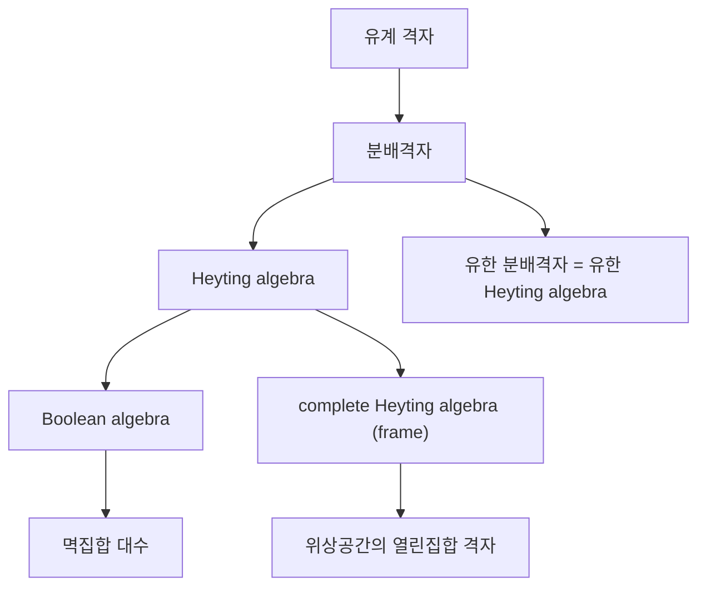
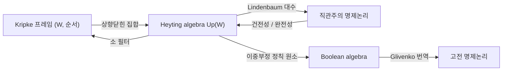

# Heyting algebra

# 개요

Heyting algebra 는 유계 격자에 "함의" 연산을 하나 더 붙인 대수 구조다. 함의는 임의로 주어지는 것이 아니라 만남(meet) 연산의 오른쪽 수반(adjoint)으로 유일하게 결정되며, 이 조건 하나가 직관주의 명제논리의 모든 정리를 대수적으로 재현한다.

Boolean algebra 가 고전 명제논리의 대수적 뼈대인 것처럼, Heyting algebra 는 [직관주의 논리](intuitionism.md)의 대수적 뼈대다. 차이는 단 하나, 배중률에 해당하는 항등식이 성립하지 않아도 된다는 점이다. 그럼에도 분배법칙, de Morgan 법칙의 절반, 이중부정 도입 같은 성질은 그대로 남는다.

중요한 예가 둘 있다. 위상공간의 열린집합 전체가 이루는 격자와, [Kripke 프레임](kripke-semantics.md)의 상향닫힌 집합 전체가 이루는 격자다. 두 예 모두 "여집합이 구조를 벗어난다"는 같은 현상 때문에 배중률을 잃는다.

# 직관

고전논리에서 함의는 정의로 환원된다. 다음 등식이 그것이다.

$$
a \to b \;=\; \neg a \vee b
$$

이 환원은 부정이 잘 행동할 때만 쓸 수 있다. 부정을 가정할 수 없다면 함의를 따로 특징지어야 한다.

특징짓는 방법은 "가장 큰 것"으로 정의하는 것이다. $a \to b$ 는 "$a$ 와 만나도 $b$ 를 넘지 않는 원소들 중 최대 원소"다. 즉 $a$ 로부터 $b$ 를 끌어내기에 충분한 정보를 가장 느슨하게 모은 것이다. 이를 상대 의사보수(relative pseudo-complement)라 한다.

부정은 여기서 파생된다. $\neg a$ 는 $a \to 0$ 이고, 즉 $a$ 와 만나면 바닥이 되는 최대 원소다. 이것이 "여집합"과 다를 수 있다는 데 모든 차이가 있다.

실직선의 열린집합만 생각해 보자. $A$ 를 0을 제외한 실직선이라 하면 여집합은 한 점이고, 그 안에 들어가는 가장 큰 열린집합은 공집합이다. 따라서 $\neg A$ 는 공집합이고 $A \vee \neg A$ 는 전체가 아니다. 배중률이 깨지는 이유는 신비롭지 않다. 여집합을 취하면 열린집합 밖으로 나가므로 안쪽으로 잘라 들여야 하고, 그 과정에서 경계가 버려진다.

[Kripke 의미론](kripke-semantics.md)에서도 같은 일이 일어난다. 명제는 "한 번 참이면 이후에도 참"인 상향닫힌 집합으로 해석된다. 상향닫힌 집합의 여집합은 하향닫힌 집합이므로 다시 명제가 되지 못하고, 상향닫힌 부분만 남긴 것이 부정이 된다.



# 정의

## 상대 의사보수

$(H, \wedge, \vee, 0, 1)$ 이 최소원 $0$ 과 최대원 $1$ 을 가지는 격자라 하자. 원소 $a$ 와 $b$ 에 대해 다음 조건을 만족하는 원소 $c$ 가 있으면, $c$ 를 $b$ 에 대한 $a$ 의 상대 의사보수라 하고 $a \to b$ 로 쓴다.

$$
\forall x \in H:\quad x \wedge a \le b \iff x \le c
$$

이 조건은 $c$ 를 유일하게 결정한다. 두 원소가 같은 조건을 만족하면 서로를 넘지 않기 때문이다. 동치로, $a \to b$ 는 집합

$$
\{\, x \in H : x \wedge a \le b \,\}
$$

의 최대원이다.

## Heyting algebra

**정의.** Heyting algebra 는 유계 격자 $H$ 이며 모든 $a$ 와 $b$ 에 대해 상대 의사보수 $a \to b$ 가 존재하는 것이다. 부정은 다음으로 정의한다.

$$
\neg a \;:=\; a \to 0
$$

수반 조건은 [부분순서](partial-orders.md)의 언어로 보면 Galois 연결이다. 각 $a$ 마다 단조사상 $(-) \wedge a$ 가 좌수반이고 $a \to (-)$ 가 우수반이다. [범주](category.md)의 관점에서는 $H$ 를 얇은 범주로 보았을 때 $(-) \wedge a$ 가 좌수반 [functor](functors.md) 라는 진술과 같다.

## 동치인 공리적 정의

수반 조건 대신 다음 항등식들로 정의해도 같다. 이 형태는 방정식으로만 쓰여 있으므로 Heyting algebra 들의 모임이 variety(항등식으로 정의되는 대수 종족)임을 보여 준다.

$$
a \to a = 1, \qquad a \wedge (a \to b) = a \wedge b
$$

$$
b \wedge (a \to b) = b, \qquad a \to (b \wedge c) = (a \to b) \wedge (a \to c)
$$

## complete Heyting algebra

임의의 부분집합이 상한을 가지는 Heyting algebra 를 complete Heyting algebra 또는 frame 이라 한다. 완비 격자에서 Heyting 구조가 존재할 필요충분조건은 무한 분배법칙이다.

$$
a \wedge \bigvee_{i \in I} b_i \;=\; \bigvee_{i \in I} (a \wedge b_i)
$$

성립하면 $a \to b$ 를 위의 집합의 상한으로 정의하면 된다.

## 표준 예

**열린집합 격자.** [위상공간](topology.md) $X$ 의 열린집합 전체 $O(X)$ 는 포함관계로 complete Heyting algebra 다. 연산은 다음과 같다. 여기서 $\operatorname{int}$ 는 내부이고 $\setminus$ 는 차집합이다.

$$
U \to V = \operatorname{int}\big((X \setminus U) \cup V\big), \qquad \neg U = \operatorname{int}(X \setminus U)
$$

**상향닫힌 집합 격자.** 부분순서 집합 $(W, \le)$ 에 대해 상향닫힌 집합 전체 $\mathrm{Up}(W)$ 는 교집합과 합집합으로 complete Heyting algebra 다. 함의는 다음과 같다.

$$
U \to V = \{\, w \in W : \forall v \ge w,\; v \in U \Rightarrow v \in V \,\}
$$

이것이 [Kripke 의미론](kripke-semantics.md)의 강제 조건을 그대로 대수화한 것이다.

**Lindenbaum–Tarski 대수.** 직관주의 명제논리의 논리식들을 "상호 도출 가능"으로 나눈 몫은 Heyting algebra 이며, 이때 $[\varphi] \le [\psi]$ 는 $\varphi \vdash \psi$ 를 뜻한다. 이 구성은 [동치관계](relations.md)로 나누는 전형적인 방식이다.

# 성질

## 분배성은 공짜로 따라온다

**정리.** 모든 Heyting algebra 는 분배격자다.

*증명 스케치.* $(-) \wedge a$ 가 좌수반이므로 존재하는 모든 상한을 보존한다. 특히 이항 상한을 보존하므로 $a \wedge (b \vee c) = (a \wedge b) \vee (a \wedge c)$ 다. 수반 하나에서 분배법칙이 따라 나온다는 점이 Heyting 구조가 강한 이유다.

## 부정의 비대칭

다음이 항상 성립한다.

$$
a \le \neg\neg a, \qquad \neg\neg\neg a = \neg a, \qquad \neg(a \vee b) = \neg a \wedge \neg b
$$

반면 $\neg\neg a \le a$ 와 $\neg(a \wedge b) = \neg a \vee \neg b$ 와 $a \vee \neg a = 1$ 은 일반적으로 성립하지 않는다. 세 번째 것이 배중률이다.

## Boolean 이 되는 조건

**정리.** Heyting algebra $H$ 에 대해 다음은 동치다.

1. 모든 $a$ 에 대해 $a \vee \neg a = 1$ 이다.
2. 모든 $a$ 에 대해 $\neg\neg a = a$ 다.
3. $H$ 는 [Boolean algebra](boolean-algebras.md) 이며 $a \to b = \neg a \vee b$ 다.

*증명 스케치.* 1에서 2로는 $a \vee \neg a = 1$ 의 양변에 $\neg\neg a$ 를 만나게 하고 $\neg a \wedge \neg\neg a = 0$ 을 쓴다. 2에서 3으로는 $\neg$ 가 대합(involution)이 되어 de Morgan 법칙이 양방향 모두 회복되고, 의사보수가 보수가 된다. 3에서 1은 자명하다.

## 정칙 원소와 Glivenko 정리

$\neg\neg a = a$ 인 원소를 정칙(regular)이라 한다. 정칙 원소 전체는 $H$ 의 부분격자는 아니지만, 만남과 $\neg$ 를 그대로 쓰고 이음을 $a \sqcup b := \neg(\neg a \wedge \neg b)$ 로 정의하면 Boolean algebra 가 된다. 사상 $a \mapsto \neg\neg a$ 는 Heyting algebra 에서 이 Boolean algebra 로 가는 전사 준동형이다.

논리 쪽 대응물이 Glivenko 정리다. 명제논리식 $\varphi$ 에 대해 고전논리에서 $\varphi$ 가 증명 가능한 것과 직관주의논리에서 $\neg\neg\varphi$ 가 증명 가능한 것은 동치다. 고전논리는 직관주의논리 안에 이중부정을 통해 충실하게 들어앉는다.

## 건전성과 완전성

**정리.** 직관주의 명제논리(IPC)에 대해 다음이 성립한다.

$$
\mathrm{IPC} \vdash \varphi \iff v(\varphi) = 1 \ \text{for every Heyting algebra } H \text{ and valuation } v
$$

*증명 스케치.* 건전성은 공리마다 수반 조건으로 확인하면 된다. 완전성은 Lindenbaum–Tarski 대수를 반례 모형으로 쓴다. $\varphi$ 가 증명 불가능하면 몫 대수에서 $[\varphi] \neq 1$ 이므로 그 대수 자체가 반례다.

여기에 유한 모형 성질을 더할 수 있다. IPC 에서 증명 불가능한 식은 어떤 유한 Heyting algebra 에서 값이 1이 아니게 되고, 따라서 IPC 는 결정 가능하다. Boolean 경우와 달리 크기 상한이 상수가 아니라 식의 크기에 의존한다는 점이 다르다.

## 유한 Heyting algebra 와 Kripke 프레임

**정리(Birkhoff 표현).** 유한 분배격자는 그 join-기약 원소들의 부분순서 집합의 하향닫힌 집합 격자와 동형이다.

유한 격자에서는 무한 분배법칙이 유한 분배법칙과 같으므로 다음이 나온다.

**따름정리.** 유한 Heyting algebra 와 유한 분배격자는 같은 것이다. Heyting 구조는 존재한다면 유일하므로, 유한 분배격자에는 함의를 붙일 방법이 정확히 하나 있다.

이 대응 덕분에 유한 Kripke 프레임과 유한 Heyting algebra 는 서로 번역된다. 프레임의 상향닫힌 집합 격자를 취하면 대수가 되고, 대수의 소 필터들을 포함관계로 세우면 프레임이 된다. 무한 경우에는 Esakia 쌍대성이 여기에 위상을 더해 정확한 대응을 만든다.



## 계산 예

두 세계 $w_0<w_1$ 로 된 프레임에서 상향닫힌 집합 격자를 만들고 함의와 부정을 계산한다. 배중률이 깨지는 최소 예다.

```python
from itertools import chain, combinations

W = [0, 1]                      # w0 < w1
leq = {(0, 0), (0, 1), (1, 1)}  # 반사적, 추이적 순서

def up_closed(S):
    return all((w, v) not in leq or v in S for w in S for v in W)

def powerset(xs):
    return chain.from_iterable(combinations(xs, k) for k in range(len(xs) + 1))

H = [frozenset(S) for S in powerset(W) if up_closed(set(S))]

def implies(A, B):
    return frozenset(w for w in W
                     if all(v not in A or v in B for v in W if (w, v) in leq))

def neg(A):
    return implies(A, frozenset())

top = frozenset(W)
show = lambda A: "{" + ",".join(f"w{w}" for w in sorted(A)) + "}"

for A in H:
    print(show(A), "neg:", show(neg(A)), "excluded middle:", A | neg(A) == top)
```

원소는 공집합과 $\lbrace w_1\rbrace$ 과 $\lbrace w_0, w_1\rbrace$ 세 개다. $A = \lbrace w_1\rbrace$ 에서 $\neg A$ 는 공집합이므로 $A \vee \neg A$ 는 전체가 아니고, $\neg\neg A$ 는 전체이므로 이중부정 제거도 실패한다. 세 원소 사슬은 배중률을 만족하지 않는 가장 작은 Heyting algebra 이며, 이를 Gödel 의 3치 대수라고도 부른다.

# 활용

## 직관주의 수학의 의미론

Heyting algebra 는 [직관주의](intuitionism.md)의 논리를 대수로 고정시킨다. 증명을 구성으로 읽는 관점에서 볼 때, $a \to b$ 가 "최대"로 정의된다는 것은 함의가 자료가 아니라 변환 가능성의 한계로 규정된다는 뜻이다. Tarski 의 위상적 해석은 열린집합 격자만으로 IPC 가 완전함을 보이며, 실직선 하나만으로도 반례를 모두 만들 수 있다[^1].

## 중간논리

IPC 와 고전논리 사이에 놓이는 논리들을 중간논리라 한다. 각 중간논리는 Heyting algebra 의 어떤 부분 종족에 대응한다. 예를 들어 $(a \to b) \vee (b \to a) = 1$ 을 더하면 선형 순서에 가까운 대수만 남고 Gödel–Dummett 논리가, $\neg a \vee \neg\neg a = 1$ 을 더하면 de Morgan 법칙이 회복된 논리가 나온다. 대수 쪽 종족의 격자 구조가 논리 쪽 확장의 격자 구조와 같으므로, 논리학의 질문이 보편대수의 질문으로 옮겨진다.

## 위상수학과 locale

frame 은 점 없이 공간을 다루는 locale 이론의 기본 대상이다. 공간에서 열린집합 격자를 얻는 대응이 [functor](functors.md) 이고, 그 반대 방향이 점을 복원하려는 시도다. 선택공리에 의존하지 않고 compactness 등을 다룰 수 있다는 점이 장점인데, 이 때문에 [선택공리](axiom-of-choice.md) 사용을 추적하는 구성적 수학에서 많이 쓰인다.

## 타입 이론과 프로그램

Curry–Howard 대응에서 직관주의 함의는 함수 타입에 대응한다. [람다 대수](lambda-calculus.md)의 단순 타입 체계에서 타입이 붙는 항이 존재하는 것과 그 타입에 해당하는 명제가 IPC 에서 증명 가능한 것이 같다. Heyting algebra 는 이 대응의 "증명을 잊은" 그림자, 즉 증명 대상들의 범주를 얇게 만든 것이다. topos 에서는 부분대상 분류자가 내부 Heyting algebra 가 되어, 임의의 topos 안의 수학이 자동으로 직관주의 논리를 따르게 만든다.

## 다른 기초론과의 위치

Heyting algebra 는 배중률을 부정하는 것이 아니라 가정하지 않는 체계를 다룬다는 점을 분명히 보여 준다. 이는 [형식주의와 Hilbert 프로그램](formalism-hilbert-program.md)이 요구한 무모순성 증명과도, [Gödel 불완전성 정리](godel-incompleteness.md)가 드러낸 한계와도 다른 층위의 문제다. 배중률의 지위는 증명 가능성이 아니라 의미론의 선택 문제이며, Heyting algebra 는 그 선택지를 격자 하나로 요약한다[^2].

[^1]: Stanford Encyclopedia of Philosophy, "Intuitionistic Logic", https://plato.stanford.edu/entries/logic-intuitionistic/
[^2]: Stanford Encyclopedia of Philosophy, "The Mathematics of Boolean Algebra", https://plato.stanford.edu/entries/boolalg-math/

# 연관 문서

## 선수지식

- [직관주의 논리의 Kripke 의미론](kripke-semantics.md)
- [부분순서](partial-orders.md)

## 더 알아보기

아직 연결한 문서가 없다.

#order_theory #logic
