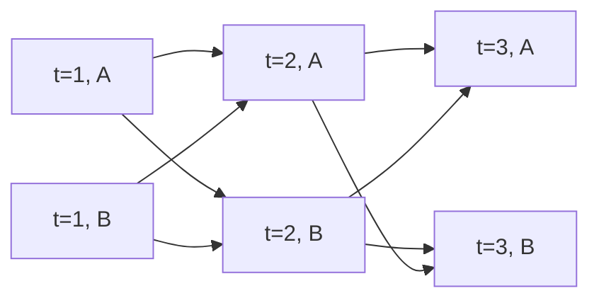

# 은닉 Markov 모형

# 개요

은닉 Markov 모형은 보이지 않는 상태열이 [Markov 연쇄](markov-chains.md)를 이루고 각 시점의 관측이 그 시점의 상태에만 의존하는 확률모형이다. 관측열만 주어졌을 때 그 관측열의 확률, 각 시점의 상태 분포, 가장 그럴듯한 상태열을 묻는다.

세 질문의 답은 모두 시간 축을 따라 표를 채우는 재귀로 나온다. 상태열을 전부 열거하면 항의 수가 길이에 대해 지수로 늘지만, 앞부분이 같은 항을 묶으면 시점마다 상태 수만큼의 값만 들고 가면 된다. 이 재귀가 [동적 계획법](dynamic-programming.md)이다.

# 직관

동전이 둘 있다. $A$ 는 앞면이 나올 확률이 $0.9$ 이고 $B$ 는 $0.5$ 다. 던지는 사람은 매 회 확률 $0.8$ 로 같은 동전을 다시 쓰고 확률 $0.2$ 로 바꾸며, 처음에는 둘 중 하나를 반반으로 고른다. 관측자는 앞뒤만 보고 어느 동전인지는 보지 못한다. 앞면이 두 번 연속 나올 확률은 얼마인가.

어느 동전을 썼는지 보이면 확률은 곱으로 나온다. $A$ 를 두 번 쓴 경우는 $0.5\times 0.9\times 0.8\times 0.9=0.324$ 이고, 같은 식으로 $A$ 뒤에 $B$ 가 $0.045$ , $B$ 뒤에 $A$ 가 $0.045$ , $B$ 를 두 번 쓴 경우가 $0.1$ 이다. 동전열은 보이지 않으므로 네 경우를 모두 더해 $0.514$ 를 얻는다.

두 번이 아니라 백 번이면 더할 항이 $2^{100}$ 개여서 이 방법으로는 값이 나오지 않는다. 그런데 네 항을 보면 앞의 두 인수 $0.5\times 0.9$ 와 $0.5\times 0.5$ 가 둘째 동전과 무관하게 되풀이된다. 이 공통 인수를 묶어 $0.45$ 와 $0.25$ 를 적어 두고 한 시점만 나아가면, 둘째 회에 $A$ 인 경우가 $(0.45\times 0.8+0.25\times 0.2)\times 0.9=0.369$ 이고 $B$ 인 경우가 $(0.45\times 0.2+0.25\times 0.8)\times 0.5=0.145$ 다. 두 값을 더하면 $0.514$ 로 같다.

묶고 나면 한 시점을 나아갈 때 하는 일은 동전 두 개에 대한 값 두 개를 다음 두 개로 바꾸는 것뿐이다. 백 번을 던져도 값 두 개를 백 번 갱신하면 되므로 길이에 비례하는 계산으로 끝난다. 시점 $t$ 까지의 관측과 그 시점의 상태를 함께 담은 이 값을 전향 변수라 하고, 갱신 절차를 전향 알고리즘이라 한다.

# 정의

## 모형

은닉 Markov 모형은 상태열 $s\_{1:T}$ 와 관측열 $o\_{1:T}$ 의 결합분포가 다음 꼴인 확률모형이다.

$$
P(s\_{1:T},o\_{1:T})=\pi\_{s\_1}b\_{s\_1}(o\_1)\prod\_{t=2}^{T}a\_{s\_{t-1}s\_t}b\_{s\_t}(o\_t)
$$

$s\_t$ 는 유한집합 $S$ 의 원소이고 $o\_t$ 는 관측 공간의 원소다. $\pi\_i=P(s\_1=i)$ 는 초기분포, $a\_{ij}=P(s\_{t+1}=j\mid s\_t=i)$ 는 전이확률, $b\_i$ 는 상태 $i$ 에서의 방출분포다. 전이확률은 $t$ 에 의존하지 않는다. 상태 수를 $N=\lvert S\rvert$ 로 쓴다.

이 결합분포는 조건부 독립 가정 둘과 같다.

$$
P(s\_t\mid s\_{1:t-1})=P(s\_t\mid s\_{t-1}),\qquad P(o\_t\mid s\_{1:T},o\_{1:t-1})=P(o\_t\mid s\_t)
$$

앞 식은 상태열이 Markov 연쇄라는 뜻이고, 뒤 식은 관측이 같은 시점의 상태만 보고 나온다는 뜻이다. 관측열 자체는 Markov 연쇄가 아니다.

## 전향 변수와 후향 변수

$$
\alpha\_t(i)=P(o\_{1:t},s\_t=i),\qquad \beta\_t(i)=P(o\_{t+1:T}\mid s\_t=i)
$$

$\beta\_T(i)=1$ 로 둔다. 둘의 곱 $\alpha\_t(i)\beta\_t(i)$ 는 $P(o\_{1:T},s\_t=i)$ 다.

## 세 가지 문제

- 평가. 매개변수 $(\pi,A,B)$ 가 주어졌을 때 $P(o\_{1:T})$ 를 구한다.
- 복호. $P(s\_{1:T}\mid o\_{1:T})$ 를 최대로 하는 상태열 $\mathop{\mathrm{argmax}}\_{s\_{1:T}}P(s\_{1:T}\mid o\_{1:T})$ 를 구한다.
- 학습. 관측열만 보고 $(\pi,A,B)$ 를 추정한다.

# 성질

## 전향 알고리즘

$\alpha\_t$ 는 다음 재귀를 따르고, $P(o\_{1:T})=\sum\_i\alpha\_T(i)$ 다.

$$
\alpha\_1(i)=\pi\_i b\_i(o\_1),\qquad \alpha\_{t+1}(j)=b\_j(o\_{t+1})\sum\_{i\in S}\alpha\_t(i)a\_{ij}
$$

증명의 요지는 $\alpha\_{t+1}(j)$ 를 $s\_t$ 에 대해 쪼개는 것이다. $P(o\_{1:t+1},s\_t=i,s\_{t+1}=j)$ 에서 $o\_{t+1}$ 은 $s\_{t+1}=j$ 에만, $s\_{t+1}=j$ 는 $s\_t=i$ 에만 의존하므로 이 값이 $\alpha\_t(i)a\_{ij}b\_j(o\_{t+1})$ 로 갈라지고, $i$ 에 대해 더하면 재귀식이 된다.

한 시점을 나아가는 데 곱셈이 $N^2$ 번 들어가므로 전체 비용은 $O(N^2T)$ 다. 상태열을 열거하는 방법의 $O(TN^T)$ 와 비교된다.

## 후향 알고리즘과 사후 주변분포

$\beta\_t$ 는 시간을 거꾸로 가는 같은 꼴의 재귀를 따른다.

$$
\beta\_t(i)=\sum\_{j\in S}a\_{ij}b\_j(o\_{t+1})\beta\_{t+1}(j)
$$

두 변수를 함께 쓰면 시점 $t$ 의 상태에 대한 사후분포가 나온다.

$$
\gamma\_t(i)=P(s\_t=i\mid o\_{1:T})=\frac{\alpha\_t(i)\beta\_t(i)}{\sum\_{j\in S}\alpha\_t(j)\beta\_t(j)}
$$

$\gamma\_t$ 는 관측열 전체를 조건으로 준 분포이고, $\alpha\_t$ 만 정규화한 것은 $t$ 까지의 관측만 조건으로 준 분포다. 앞을 평활, 뒤를 여과라 한다.

## Viterbi 알고리즘

전향 재귀의 합을 최댓값으로 바꾸면 최대 사후 상태열이 나온다. $\delta\_t(i)=\max\_{s\_{1:t-1}}P(s\_{1:t-1},s\_t=i,o\_{1:t})$ 로 두면 다음이 성립한다.

$$
\delta\_1(i)=\pi\_i b\_i(o\_1),\qquad \delta\_{t+1}(j)=b\_j(o\_{t+1})\max\_{i\in S}\delta\_t(i)a\_{ij}
$$

증명의 요지는 최적성 원리다. $s\_{t+1}=j$ 로 끝나는 최적 앞부분에서 $s\_t=i$ 라면, 그 앞부분의 $t$ 까지는 $s\_t=i$ 로 끝나는 최적 앞부분이어야 한다. 아니라면 그 부분만 바꿔 더 큰 값을 얻는다. 최댓값을 준 $i$ 를 시점마다 기록해 두고 $\delta\_T$ 의 최대점에서 거꾸로 따라가면 상태열이 복원된다.

$\gamma\_t$ 를 시점마다 최대로 하는 상태를 모은 열은 Viterbi 열과 다를 수 있다. 전이확률이 $0$ 인 자리를 지나는 열이 그렇게 나오기도 한다.

## 격자 위의 최장경로

시점과 상태를 정점으로, 전이를 간선으로 놓으면 복호는 비순환 유향 그래프의 최장경로 문제다. 간선 $(t,i)\to(t+1,j)$ 에 가중치 $\log a\_{ij}+\log b\_j(o\_{t+1})$ 을 주면 경로의 가중치 합이 결합확률의 로그이고, Viterbi 재귀는 이 그래프를 시점 순으로 훑는 [최단경로](shortest-paths.md) 계산과 같다.

## 수치 안정성

$\alpha\_t(i)$ 는 확률의 곱이라 $t$ 가 커지면 지수로 작아지고 부동소수점에서 $0$ 이 된다. 시점마다 $\sum\_i\alpha\_t(i)$ 로 나누어 정규화하고 그 인수들의 로그를 따로 더하면 $\log P(o\_{1:T})$ 가 나온다. Viterbi 쪽은 로그를 취하면 곱이 합이 되어 덧셈과 최댓값만 남는다.

## Baum–Welch 알고리즘

학습은 기대 빈도를 세고 다시 정규화하는 반복으로 한다. $\gamma\_t(i)$ 와 전이의 사후확률 $\xi\_t(i,j)=P(s\_t=i,s\_{t+1}=j\mid o\_{1:T})$ 를 전향 후향 변수로 계산한 뒤 다음으로 갱신한다.

$$
\hat a\_{ij}=\frac{\sum\_{t=1}^{T-1}\xi\_t(i,j)}{\sum\_{t=1}^{T-1}\gamma\_t(i)},\qquad \hat\pi\_i=\gamma\_1(i)
$$

이 갱신은 [기댓값 최대화 알고리즘](em-algorithm.md)을 은닉 Markov 모형에 적용한 것이고, 한 번 돌 때마다 $P(o\_{1:T})$ 가 줄지 않는다. 수렴하는 곳은 우도의 정류점이며 전역 최대점이라는 보장은 없다[^1].

## 상태 라벨의 치환

상태에 붙인 이름을 치환하고 $\pi$ , $A$ , $B$ 의 행과 열을 같이 바꾸면 관측열의 분포가 변하지 않는다. 따라서 매개변수는 관측열의 분포만으로는 치환을 제외하고서야 정해진다.

# 활용

- 전이와 관측이 선형이고 잡음이 Gauss 인 연속 상태공간에서는 전향 재귀의 합이 적분이 되고, 그 결과가 [Kalman 필터](kalman-filter.md)의 예측 갱신 공식이다. $\gamma\_t$ 에 해당하는 평활 분포도 후향 재귀로 같은 꼴을 얻는다.
- 복호는 [동적 계획법](dynamic-programming.md)의 표준 예다. 시간과 상태의 격자가 비순환 유향 그래프이고 부분 문제가 "시점 $t$ 에 상태 $i$ 로 끝나는 최적 앞부분" 이다.
- 상태가 보이지 않는 제어 문제에서 $\gamma\_t$ 는 믿음 상태가 된다. [Markov 결정 과정](markov-decision-process.md)의 정책을 상태 대신 이 분포 위에서 정의한다.
- $\gamma\_t$ 와 $\xi\_t$ 는 [Bayes 추론](bayesian-inference.md)의 사후분포를 정확히 계산한 것이다. 상태 공간이 유한하고 그래프가 사슬이라 근사가 필요하지 않다.
- 음성 신호의 음소 분절, 품사 태깅, 유전체 서열의 영역 구분이 관측열에서 숨은 분절을 읽는 같은 문제로 쓰인다.

[^1]: L. R. Rabiner, "A tutorial on hidden Markov models and selected applications in speech recognition", Proceedings of the IEEE 77 (1989), 257–286.

# 연관 문서

## 선수지식

- [Markov 연쇄](markov-chains.md)
- [동적 계획법](dynamic-programming.md)

## 더 알아보기

아직 연결한 문서가 없다.

#probability #statistics #computation #machine_learning
