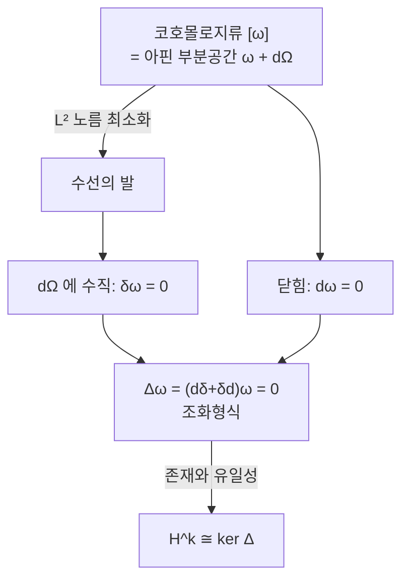

# Hodge 이론과 조화형식

# 개요

[de Rham 코호몰로지](de-rham-cohomology.md)의 원소는 닫힘형식의 동치류다. 한 류 안에는 $\omega+d\eta$ 꼴의 형식이 무한히 많고, 그중 어느 것을 대표원으로 삼을 이유가 없다. 코호몰로지는 순수하게 위상적인 대상이라 어떤 형식도 특별하지 않기 때문이다.

[Riemann 계량](riemannian-metrics.md)을 주면 상황이 완전히 달라진다. 계량이 형식들 사이의 내적을 정의하므로 "류 안에서 가장 짧은 형식" 을 물을 수 있고, 콤팩트 다양체에서는 그런 형식이 정확히 하나 존재한다. 그것이 조화형식이며, Laplace 작용소의 핵으로 특징지어진다.

이 정리가 두 세계를 잇는다. 왼쪽은 구멍의 개수라는 위상 불변량이고, 오른쪽은 타원형 편미분방정식 $\Delta\omega=0$ 의 해공간이다. 계량을 어떻게 바꾸든 해공간의 차원이 변하지 않는다는 뜻이기도 하다. 지표 정리 계열의 원형이고, 대수기하의 Hodge 구조와 물리의 게이지 이론이 모두 여기서 출발한다.

# 직관

## 류 안에서 가장 짧은 형식

콤팩트 다양체 위의 $k$ 형식들에 $L^2$ 내적이 있다고 하자. 코호몰로지류 $[\omega]$ 안에서 노름 $\|\omega+d\eta\|$ 를 최소화하는 문제를 생각한다.

이것은 유한차원 최소제곱과 같은 그림이다. 아핀 부분공간 $\omega+d\Omega^{k-1}$ 에 원점에서 수선의 발을 내리는 것이고, 최소점은 $d\Omega^{k-1}$ 에 수직인 점이다. 수직 조건을 풀어 쓰면 모든 $\eta$ 에 대해 $\langle\omega,d\eta\rangle=0$ 이고, $d$ 의 딸림작용소를 $\delta$ 라 하면 $\delta\omega=0$ 이다.

닫힘형식이면서 $\delta$ 로도 죽는 형식이 최소점이다. 이 두 조건이 $\Delta\omega=0$ 과 같다.



## 왜 하나뿐인가

두 조화형식이 같은 류에 있으면 차이가 완전형식 $d\eta$ 이면서 조화다. 그런데 조화형식 $\alpha=d\eta$ 에 대해

$$
\|\alpha\|^2=\langle d\eta,\alpha\rangle=\langle\eta,\delta\alpha\rangle=0
$$

이다. 콤팩트라 경계항이 없어서 부분적분이 깨끗하게 되는 것이 결정적이다. 경계가 있거나 비콤팩트면 정리가 그대로 성립하지 않는다.

## 왜 존재하는가

유일성은 위처럼 한 줄이지만 존재는 다르다. 무한차원 공간에서 최소점이 실제로 달성된다는 보장이 없다. 최소화 수열이 수렴하는 대상이 매끄러운 형식이 아니라 분포일 수 있다.

여기서 $\Delta$ 가 타원형 작용소라는 사실이 쓰인다. 타원 정칙성 정리가 "$\Delta\omega$ 가 매끄러우면 $\omega$ 도 매끄럽다" 를 말해 주므로, 약한 해가 자동으로 진짜 해가 된다. 게다가 타원 작용소의 핵은 콤팩트 다양체 위에서 유한차원이다. 코호몰로지가 유한차원이라는 위상적 사실이 여기서는 해석학의 정리로 나온다.

## 별작용소가 쌍대성을 준다

$n$ 차원 공간에서 $k$ 형식을 지정하는 것은 $k$ 차원 방향을 고르는 것이고, 계량과 방향이 있으면 그 직교여공간인 $n-k$ 차원 방향이 따라온다. $\star$ 가 그 대응이다.

$\star$ 가 조화형식을 조화형식으로 보내므로 $\mathcal H^k\cong\mathcal H^{n-k}$ 이고 곧 $b_k=b_{n-k}$ 가 나온다. 위상적으로는 Poincaré 쌍대성이라 불리는 정리가 여기서는 선형대수 한 줄이다.

# 정의

다음에서 $M$ 은 방향지어진 $n$ 차원 Riemann 다양체이고, 정리를 말할 때는 콤팩트이고 경계가 없다고 가정한다.

## 형식의 내적과 부피형식

계량이 각 접공간에 내적을 주면, 그것이 $\Lambda^k T^\ast\_pM$ 의 내적으로 유일하게 확장된다. 정규직교 여기저기 $e^1,\dots,e^n$ 에 대해 $\{e^{i_1}\wedge\cdots\wedge e^{i_k}\}\_{i_1<\cdots<i_k}$ 가 정규직교기저가 되도록 잡는 것이다.

방향과 계량이 함께 부피형식 $\mathrm{vol}=e^1\wedge\cdots\wedge e^n$ 을 결정한다.

## Hodge 별작용소

$\star:\Omega^k\to\Omega^{n-k}$ 를 다음 성질로 정의한다. 모든 $k$ 형식 $\alpha,\beta$ 에 대해

$$
\alpha\wedge\star\beta=\langle\alpha,\beta\rangle\,\mathrm{vol}
$$

이 조건이 $\star\beta$ 를 유일하게 결정한다. 정규직교기저에서는 첨자의 여집합을 취하고 부호를 붙이는 연산이다. 예를 들어 $\mathbb R^3$ 의 표준 계량에서

$$
\star\,dx=dy\wedge dz,\qquad \star(dx\wedge dy)=dz,\qquad\star1=dx\wedge dy\wedge dz
$$

이며, 이것이 벡터 해석의 회전과 발산이 같은 $d$ 의 다른 얼굴이라는 사실의 근원이다. Riemann 계량에서 $\star\star=(-1)^{k(n-k)}$ 다.

## $L^2$ 내적과 딸림미분

$$
\langle\!\langle\alpha,\beta\rangle\!\rangle=\int_M\alpha\wedge\star\beta=\int_M\langle\alpha,\beta\rangle\,\mathrm{vol}
$$

이 내적에 대한 $d:\Omega^{k-1}\to\Omega^k$ 의 형식적 딸림작용소를 여미분이라 하고 $\delta:\Omega^k\to\Omega^{k-1}$ 로 쓴다. Riemann 계량에서는 명시적으로

$$
\delta=(-1)^{n(k+1)+1}\star d\,\star
$$

이며, 콤팩트이고 경계가 없으면 Stokes 정리에서 $\langle\!\langle d\alpha,\beta\rangle\!\rangle=\langle\!\langle\alpha,\delta\beta\rangle\!\rangle$ 가 나온다. $d\circ d=0$ 의 딸림이 $\delta\circ\delta=0$ 이다.

## Laplace–de Rham 작용소와 조화형식

$$
\Delta=d\delta+\delta d:\Omega^k\to\Omega^k
$$

$\Delta\omega=0$ 인 형식을 조화형식이라 하고 그 공간을 $\mathcal H^k$ 로 쓴다. 함수, 곧 $k=0$ 인 경우에는 $\delta=0$ 이므로 $\Delta f=\delta df$ 이고, 이것이 부호 규약을 빼면 Laplace–Beltrami 작용소다. 국소좌표로는

$$
\Delta f=-\frac1{\sqrt{|g|}}\partial_i\big(\sqrt{|g|}\,g^{ij}\partial_j f\big)
$$

로, 계량이 유클리드면 $-\sum\partial_i^2$ 가 된다. 이 문서의 부호 규약에서 $\Delta$ 는 양의 준정부호다.

# 성질

## 조화의 세 가지 특징

콤팩트이고 경계가 없으면 다음이 동치다.

$$
\Delta\omega=0\iff d\omega=0\ \text{그리고}\ \delta\omega=0
$$

한 방향은 자명하다. 반대는 부분적분이다.

$$
\langle\!\langle\Delta\omega,\omega\rangle\!\rangle=\langle\!\langle d\omega,d\omega\rangle\!\rangle+\langle\!\langle\delta\omega,\delta\omega\rangle\!\rangle=\|d\omega\|^2+\|\delta\omega\|^2
$$

좌변이 0 이면 두 항이 각각 0 이다. 콤팩트성이 빠지면 무너진다. $\mathbb R^n$ 위의 조화함수는 상수 말고도 얼마든지 있고, 실제로 유계가 아닌 것들이다.

## Hodge 분해

$$
\Omega^k(M)=\mathcal H^k\ \oplus\ d\,\Omega^{k-1}\ \oplus\ \delta\,\Omega^{k+1}
$$

세 조각이 $L^2$ 내적에 대해 서로 직교하는 직합이다. 직교성은 $\langle\!\langle d\alpha,\delta\beta\rangle\!\rangle=\langle\!\langle dd\alpha,\beta\rangle\!\rangle=0$ 처럼 계산으로 바로 나오고, 어려운 부분은 이 셋이 전체를 덮는다는 것이다. 그 증명이 $\Delta$ 의 타원성과 Fredholm 이론이다.

$\mathbb R^3$ 의 벡터장으로 번역하면 "임의의 벡터장은 조화 성분, 기울기 성분, 회전 성분의 합" 이라는 Helmholtz 분해다. 유체역학과 전자기학에서 오래 쓰이던 사실이 일반 다양체로 확장된 것이다.

## Hodge 정리

닫힘형식은 $\delta\Omega^{k+1}$ 성분을 갖지 않으므로 $Z^k=\mathcal H^k\oplus d\Omega^{k-1}$ 이고, 몫을 취하면 다음이 나온다.

$$
H^k_{\mathrm{dR}}(M)\ \cong\ \mathcal H^k
$$

각 코호몰로지류에 조화 대표원이 정확히 하나 있다. 따라서 $b_k=\dim\mathcal H^k$ 가 유한하고, 계량을 바꿔도 이 차원은 변하지 않는다. $\Delta$ 자체는 계량에 완전히 의존하는데 그 핵의 차원만은 위상이 결정한다는 점이 이 정리의 내용 전부다.

## Poincaré 쌍대성

$\star$ 가 $\Delta$ 와 교환하므로, 곧 $\star\Delta=\Delta\star$ 이므로 $\star:\mathcal H^k\to\mathcal H^{n-k}$ 가 동형이다. 따라서

$$
b_k=b_{n-k}
$$

$\star^2=\pm\mathrm{id}$ 이므로 전단사이고, 역은 부호를 붙인 $\star$ 다. 위상적 증명보다 훨씬 짧다. 대신 방향지어진 콤팩트 다양체라는 가정이 $\mathrm{vol}$ 과 경계항 소거에 쓰이며, 방향이 없으면 실계수에서도 성립하지 않는다.

$4k$ 차원에서는 $\star$ 가 $\mathcal H^{2k}$ 를 자기 자신으로 보내고 $\star^2=\mathrm{id}$ 이므로 고유공간 $\mathcal H^\pm$ 로 쪼개진다. 그 차원의 차 $b^+-b^-$ 가 부호수이고, 4 차원 다양체 이론과 Yang–Mills 이론의 자기쌍대 방정식이 이 분해 위에서 전개된다.

## Bochner 소멸 정리

Weitzenböck 공식이 $\Delta$ 를 접속 Laplace 작용소와 곡률항의 합으로 쓴다. 1-형식에서는

$$
\Delta=\nabla^*\nabla+\mathrm{Ric}
$$

이므로 Ricci 곡률이 양의 준정부호면 조화 1-형식 $\omega$ 에 대해 $0=\|\nabla\omega\|^2+\langle\!\langle\mathrm{Ric}\,\omega,\omega\rangle\!\rangle$ 이고 두 항이 모두 0 이어야 한다. $\mathrm{Ric}>0$ 이면 $\omega=0$ 이므로

$$
\mathrm{Ric}>0\ \Longrightarrow\ b_1(M)=0
$$

곡률이라는 국소적 조건이 구멍의 개수라는 전역적 결론을 강제한다. Hodge 정리 없이는 이런 논증이 불가능하다. 곡률은 미분방정식의 계수에만 나타나고, 그 정보를 위상으로 옮기는 통로가 조화형식이기 때문이다.

## 이산판으로 확인

단체 복합체 위에서 $d$ 를 경계사상의 전치로 두면 같은 이야기가 유한차원 선형대수가 된다. $\Delta_k=\partial_{k+1}\partial_{k+1}^{\mathsf T}+\partial_k^{\mathsf T}\partial_k$ 의 핵의 차원이 Betti 수여야 한다.

```python
import numpy as np
from itertools import combinations

def boundary(faces_k, faces_km1):
    """∂_k : C_k -> C_{k-1}. 단체는 정렬된 튜플, 부호는 뺀 꼭짓점 위치로."""
    idx = {f: i for i, f in enumerate(faces_km1)}
    D = np.zeros((len(faces_km1), len(faces_k)))
    for j, f in enumerate(faces_k):
        for i in range(len(f)):
            D[idx[f[:i] + f[i+1:]], j] = (-1) ** i
    return D

def betti(complex_):
    """complex_[k] = k 단체 목록. dim ker Delta_k 를 센다."""
    out = []
    for k in range(len(complex_)):
        n = len(complex_[k])
        L = np.zeros((n, n))
        if k > 0:                                   # delta*d 쪽: ∂_k^T ∂_k
            Dk = boundary(complex_[k], complex_[k-1])
            L += Dk.T @ Dk
        if k + 1 < len(complex_):                   # d*delta 쪽: ∂_{k+1} ∂_{k+1}^T
            Dk1 = boundary(complex_[k+1], complex_[k])
            L += Dk1 @ Dk1.T
        out.append(int(np.sum(np.linalg.eigvalsh(L) < 1e-9)))
    return out

V = tuple(range(4))
sphere = [                                           # 사면체의 경계 = S^2
    [(v,) for v in V],
    list(combinations(V, 2)),
    list(combinations(V, 3)),
]
circle = [[(0,), (1,), (2,)], [(0, 1), (1, 2), (0, 2)]]              # S^1
disk = [[(0,), (1,), (2,)], [(0, 1), (1, 2), (0, 2)], [(0, 1, 2)]]   # 원판

for name, K in [("S^1", circle), ("원판", disk), ("S^2", sphere)]:
    print(f"{name:>4}: dim ker Delta_k = {betti(K)}")

# S^1: dim ker Delta_k = [1, 1]
#  원판: dim ker Delta_k = [1, 0, 0]
# S^2: dim ker Delta_k = [1, 0, 1]
```

$S^1$ 은 구멍 하나라 $b_1=1$ 이고, 삼각형을 메운 원판은 $b_1=0$ 이며, 구는 $b_0=b_2=1$ 이고 $b_1=0$ 이다. $S^2$ 의 결과에서 $b_0=b_2$ 가 보이는데 이것이 Poincaré 쌍대성의 이산판이며, $\star$ 에 해당하는 것이 삼각분할의 쌍대 복합체다.

이산판에서는 타원 정칙성이 필요 없다. 유한차원이라 $\ker\Delta=\ker\partial^{\mathsf T}\cap\ker\partial$ 와 직교분해가 선형대수로 끝난다. 매끄러운 경우의 모든 어려움이 무한차원이라는 점 하나에서 온다는 것을 이 대비가 보여 준다.

# 활용

## 스펙트럼 기하

$\Delta$ 의 고윳값 전체가 다양체의 스펙트럼이다. 고윳값 0 의 중복도가 $b_k$ 이고, 0 이 아닌 고윳값들은 계량에 의존한다.

함수에 대한 첫 번째 비영 고윳값 $\lambda_1$ 은 다양체가 얼마나 "잘록한지" 를 잰다. 잘록한 목이 있으면 $\lambda_1$ 이 작고, 둥글면 크다. 이 관계를 정량화한 Cheeger 부등식이 [그래프 Laplacian](graph-laplacian.md)의 스펙트럼 군집화에서 그대로 다시 등장한다. 이산과 연속에서 같은 정리가 성립하는 것은 우연이 아니라 둘 다 같은 변분 문제이기 때문이다.

"북의 모양을 들을 수 있는가" 라는 Kac 의 질문이 여기서 나왔고, 답은 아니오다. 스펙트럼이 같으면서 등거리가 아닌 다양체 쌍이 존재한다. 다만 스펙트럼에서 차원, 부피, $\chi$ 같은 상당한 정보는 복원된다.

## 조화 1-형식과 사상

$b_1(M)=r$ 이면 조화 1-형식이 $r$ 차원만큼 있다. 각각을 적분하면 $M$ 에서 원환면 $\mathbb R^r/\Lambda$ 로 가는 사상이 나오며, 이것이 Albanese 사상이다.

복소 다양체에서는 이 구성이 훨씬 강해진다. $\Delta$ 가 $\partial$ 과 $\bar\partial$ 에 대해 같은 값을 주는 Kähler 항등식 덕분에 조화형식 공간이 $(p,q)$ 형으로 쪼개지고, Hodge 분해 $H^k=\bigoplus_{p+q=k}H^{p,q}$ 와 $h^{p,q}=h^{q,p}$ 가 나온다. 따라서 Kähler 다양체에서는 홀수 Betti 수가 짝수다. 어떤 다양체가 복소구조를 가질 수 없는지를 이 한 줄로 판정할 수 있다.

## 물리의 장방정식

진공의 Maxwell 방정식은 전자기장 2-형식 $F$ 에 대해 $dF=0$ 과 $\delta F=0$ 이다. 곧 $F$ 가 조화형식이라는 진술이며, $\star$ 가 전기장과 자기장을 맞바꾸는 쌍대성이 된다.

Hodge 분해는 게이지 고정의 기하적 정체이기도 하다. 퍼텐셜 $A$ 의 $d\Omega^0$ 성분은 게이지 변환으로 바꿀 수 있는 부분이고, Lorenz 게이지 $\delta A=0$ 이 그 성분을 제거해 물리적 자유도만 남긴다. 남는 조화 성분이 위상적 자유도이며, 이것이 [de Rham 코호몰로지](de-rham-cohomology.md)에서 본 Aharonov–Bohm 효과의 정체다.

## 계산기하와 데이터

이산 미분형식으로 곡면 메시 위에서 벡터장을 조화, 기울기, 회전 성분으로 분해하는 것이 기하 처리의 표준 도구다. 매개화, 벡터장 설계, 유체 시뮬레이션에서 쓰인다.

순위 집계에도 같은 구조가 나타난다. 비교 결과를 그래프 위의 1-형식으로 보면, 기울기 성분이 일관된 점수로 설명되는 부분이고 나머지가 "가위바위보" 꼴의 비일관성이다. 조화 성분은 전역적 순환에 해당하는 모순이라 어떤 점수로도 설명되지 않으며, 그 크기가 데이터의 비일관성을 정량화한다.

# 연관 문서

## 선수지식

- [de Rham 코호몰로지](de-rham-cohomology.md)
- [Riemann 계량과 측지선](riemannian-metrics.md)

## 더 알아보기

- [Kähler 다양체와 Hodge 분해](kahler-manifolds.md)
- [지표 정리](index-theorem.md)

#differential_geometry #algebraic_topology #analysis
