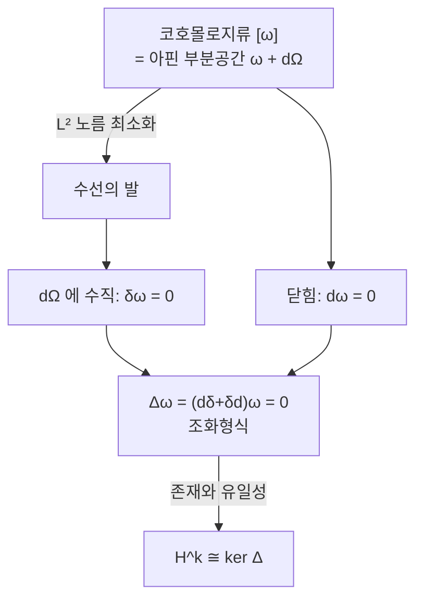

# Hodge 이론

# 개요

[de Rham 코호몰로지](de-rham-cohomology.md)의 원소는 닫힘형식의 동치류다. 한 류 안에는 $\omega+d\eta$ 꼴의 형식이 무한히 많고, 코호몰로지가 위상적 대상인 이상 그중 어느 것도 특별하지 않다.

[Riemann 계량](riemannian-metrics.md)은 형식들 사이의 내적을 주므로 류 안에서 가장 짧은 형식을 물을 수 있게 하고, [콤팩트](compactness.md) 다양체에서는 그런 형식이 정확히 하나 존재한다. 그것이 조화형식이며 Laplace 작용소의 핵으로 특징지어진다.

Hodge 정리는 구멍의 개수라는 위상 불변량과 타원형 편미분방정식 $\Delta\omega=0$ 의 해공간을 잇는다. 계량을 바꿔도 해공간의 차원이 변하지 않는다는 뜻이며, 지표 정리 계열의 원형이다. 대수기하의 Hodge 구조와 물리의 게이지 이론이 여기에 기댄다.

# 직관

## 류 안의 최소 노름 형식

콤팩트 [다양체](manifolds.md) 위의 $k$ 형식들에 $L^2$ 내적이 있다고 하자. 코호몰로지류 $[\omega]$ 안에서 노름 $\Vert\omega+d\eta\Vert$ 를 최소화하는 문제는 유한차원 최소제곱과 같은 그림이다. 아핀 부분공간 $\omega+d\Omega^{k-1}$ 에 원점에서 수선의 발을 내리는 것이고, 최소점은 $d\Omega^{k-1}$ 에 수직인 점이다. 수직 조건은 모든 $\eta$ 에 대해 $\langle\omega,d\eta\rangle=0$ 이고, $d$ 의 딸림작용소를 $\delta$ 라 하면 $\delta\omega=0$ 이다.

닫힘형식이면서 $\delta$ 로도 죽는 형식이 최소점이고, 두 조건이 $\Delta\omega=0$ 과 같다.

## 유일성과 존재성

두 조화형식이 같은 류에 있으면 차이가 완전형식 $d\eta$ 이면서 조화다. 조화형식 $\alpha=d\eta$ 에 대해

$$
\Vert\alpha\Vert^2=\langle d\eta,\alpha\rangle=\langle\eta,\delta\alpha\rangle=0
$$

이다. 콤팩트라 경계항이 없어 부분적분이 성립하며, 경계가 있거나 비콤팩트면 정리가 그대로 성립하지 않는다.

존재는 다르다. 무한차원 공간에서 최소화 수열이 수렴하는 대상은 매끄러운 형식이 아니라 분포일 수 있다. 여기서 $\Delta$ 의 타원성이 쓰인다. 타원 정칙성 정리에 의해 $\Delta\omega$ 가 매끄러우면 $\omega$ 도 매끄러우므로 약한 해가 진짜 해가 되고, 타원 작용소의 핵은 콤팩트 다양체 위에서 유한차원이다. 코호몰로지의 유한차원성이 해석학의 정리로 나온다.

## 별작용소와 쌍대성

$n$ 차원 공간에서 $k$ 차원 방향을 고르면 계량과 방향이 그 직교여공간인 $n-k$ 차원 방향을 결정한다. $\star$ 가 그 대응이다. $\star$ 가 조화형식을 조화형식으로 보내므로 $\mathcal H^k\cong\mathcal H^{n-k}$ 이고 $b_k=b_{n-k}$ 다. 위상적으로 Poincaré 쌍대성이라 부르는 정리가 여기서는 선형대수 한 줄이다.

# 정의

아래에서 $M$ 은 방향지어진 $n$ 차원 Riemann 다양체이고, 정리를 말할 때는 콤팩트이고 경계가 없다고 가정한다.

## 형식의 내적과 부피형식

계량이 각 접공간에 주는 내적은 $\Lambda^k T^\ast\_pM$ 의 내적으로 유일하게 확장된다. 정규직교 여기저기 $e^1,\dots,e^n$ 에 대해 $\lbrace e^{i_1}\wedge\cdots\wedge e^{i_k}\rbrace\_{i_1\lt\cdots\lt i_k}$ 가 정규직교기저가 되도록 잡는다. 방향과 계량이 함께 부피형식 $\mathrm{vol}=e^1\wedge\cdots\wedge e^n$ 을 결정한다.

## Hodge 별작용소

$\star:\Omega^k\to\Omega^{n-k}$ 는 모든 $k$ 형식 $\alpha,\beta$ 에 대해

$$
\alpha\wedge\star\beta=\langle\alpha,\beta\rangle\thinspace\mathrm{vol}
$$

을 만족하는 작용소이고, 이 조건이 $\star\beta$ 를 유일하게 결정한다. 정규직교기저에서는 첨자의 여집합을 취하고 부호를 붙이는 연산이다. $\mathbb R^3$ 의 표준 계량에서

$$
\star\thinspace dx=dy\wedge dz,\qquad \star(dx\wedge dy)=dz,\qquad\star1=dx\wedge dy\wedge dz
$$

이고, 벡터 해석의 회전과 발산이 같은 $d$ 를 차수만 달리해 쓴 것인 까닭이 여기에 있다. Riemann 계량에서 $\star\star=(-1)^{k(n-k)}$ 다.

## $L^2$ 내적과 딸림미분

$$
\langle\negthinspace\langle\alpha,\beta\rangle\negthinspace\rangle=\int_M\alpha\wedge\star\beta=\int_M\langle\alpha,\beta\rangle\thinspace\mathrm{vol}
$$

이 내적에 대한 $d:\Omega^{k-1}\to\Omega^k$ 의 형식적 딸림작용소가 **여미분** $\delta:\Omega^k\to\Omega^{k-1}$ 이다. Riemann 계량에서는

$$
\delta=(-1)^{n(k+1)+1}\star d\thinspace\star
$$

이고, 콤팩트이고 경계가 없으면 Stokes 정리에서 $\langle\negthinspace\langle d\alpha,\beta\rangle\negthinspace\rangle=\langle\negthinspace\langle\alpha,\delta\beta\rangle\negthinspace\rangle$ 가 나온다. $d\circ d=0$ 의 딸림이 $\delta\circ\delta=0$ 이다.

## Laplace–de Rham 작용소와 조화형식

$$
\Delta=d\delta+\delta d:\Omega^k\to\Omega^k
$$

$\Delta\omega=0$ 인 형식이 **조화형식**이고 그 공간을 $\mathcal H^k$ 로 쓴다. $k=0$ 이면 $\delta=0$ 이므로 $\Delta f=\delta df$ 이고, 부호 규약을 빼면 Laplace–Beltrami 작용소다. 국소좌표로는

$$
\Delta f=-\frac1{\sqrt{|g|}}\partial_i\big(\sqrt{|g|}\thinspace g^{ij}\partial_j f\big)
$$

이고 계량이 유클리드면 $-\sum\partial_i^2$ 다. 이 문서의 규약에서 $\Delta$ 는 양의 준정부호다.

# 성질

## 조화형식의 특징

콤팩트이고 경계가 없으면

$$
\Delta\omega=0\iff d\omega=0\ \text{그리고}\ \delta\omega=0
$$

이다. 한 방향은 자명하고, 반대는 부분적분으로 나온다.

$$
\langle\negthinspace\langle\Delta\omega,\omega\rangle\negthinspace\rangle=\langle\negthinspace\langle d\omega,d\omega\rangle\negthinspace\rangle+\langle\negthinspace\langle\delta\omega,\delta\omega\rangle\negthinspace\rangle=\Vert d\omega\Vert^2+\Vert\delta\omega\Vert^2
$$

좌변이 0 이면 두 항이 각각 0 이다. 콤팩트성이 빠지면 무너진다. $\mathbb R^n$ 위에는 상수가 아닌 [조화함수](harmonic-functions.md)가 얼마든지 있다.

## Hodge 분해

$$
\Omega^k(M)=\mathcal H^k\ \oplus\ d\thinspace\Omega^{k-1}\ \oplus\ \delta\thinspace\Omega^{k+1}
$$

세 조각은 $L^2$ 내적에 대해 서로 직교한다. 직교성은 $\langle\negthinspace\langle d\alpha,\delta\beta\rangle\negthinspace\rangle=\langle\negthinspace\langle dd\alpha,\beta\rangle\negthinspace\rangle=0$ 으로 바로 나오고, 셋이 전체를 덮는다는 부분이 $\Delta$ 의 타원성과 Fredholm 이론을 쓴다.

$\mathbb R^3$ 의 벡터장으로 번역하면 임의의 벡터장이 조화 성분, 기울기 성분, 회전 성분의 합이라는 Helmholtz 분해다.

## Hodge 정리

닫힘형식은 $\delta\Omega^{k+1}$ 성분을 갖지 않으므로 $Z^k=\mathcal H^k\oplus d\Omega^{k-1}$ 이고, 몫을 취하면

$$
H^k_{\mathrm{dR}}(M)\ \cong\ \mathcal H^k
$$

이다. 각 코호몰로지류에 조화 대표원이 정확히 하나 있으므로 $b_k=\dim\mathcal H^k$ 가 유한하고 계량을 바꿔도 변하지 않는다. $\Delta$ 는 계량에 의존하지만 그 핵의 차원은 위상이 결정한다.

## Poincaré 쌍대성

$\star\Delta=\Delta\star$ 이므로 $\star:\mathcal H^k\to\mathcal H^{n-k}$ 가 동형이고

$$
b_k=b_{n-k}
$$

다. $\star^2=\pm\mathrm{id}$ 이므로 전단사이고 역은 부호를 붙인 $\star$ 다. 방향지어진 콤팩트 다양체라는 가정이 $\mathrm{vol}$ 과 경계항 소거에 쓰이며, 방향이 없으면 실계수에서도 성립하지 않는다.

$4k$ 차원에서는 $\star$ 가 $\mathcal H^{2k}$ 를 자기 자신으로 보내고 $\star^2=\mathrm{id}$ 이므로 고유공간 $\mathcal H^\pm$ 로 쪼개진다. 그 차원의 차 $b^+-b^-$ 가 부호수이고, 4 차원 다양체 이론과 Yang–Mills 이론의 자기쌍대 방정식이 이 분해 위에서 전개된다.

## Bochner 소멸 정리

Weitzenböck 공식이 $\Delta$ 를 접속 Laplace 작용소와 곡률항의 합으로 쓴다. 1-형식에서는

$$
\Delta=\nabla^\ast\nabla+\mathrm{Ric}
$$

이므로 Ricci 곡률이 양의 준정부호면 조화 1-형식 $\omega$ 에 대해 $0=\Vert\nabla\omega\Vert^2+\langle\negthinspace\langle\mathrm{Ric}\thinspace\omega,\omega\rangle\negthinspace\rangle$ 이고 두 항이 모두 0 이어야 한다. $\mathrm{Ric}\gt 0$ 이면 $\omega=0$ 이므로

$$
\mathrm{Ric}\gt 0\ \Longrightarrow\ b_1(M)=0
$$

이다. 곡률은 미분방정식의 계수에만 나타나고, 그 정보를 위상으로 옮기는 데 조화형식을 쓴다.

# 활용

## 스펙트럼 기하

$\Delta$ 의 고윳값 전체가 다양체의 스펙트럼이다. 고윳값 0 의 중복도가 $b_k$ 이고 0 이 아닌 고윳값은 계량에 의존한다.

함수에 대한 첫 비영 고윳값 $\lambda_1$ 은 다양체가 얼마나 잘록한지를 잰다. 잘록한 목이 있으면 $\lambda_1$ 이 작다. 이를 정량화한 Cheeger 부등식은 [그래프 Laplacian](graph-laplacian.md)의 스펙트럼 군집화에서 같은 변분 문제로 다시 나온다.

Kac 의 "북의 모양을 들을 수 있는가" 에 대한 답은 아니오다. 스펙트럼이 같으면서 등거리가 아닌 다양체 쌍이 존재한다. 다만 차원, 부피, $\chi$ 는 스펙트럼에서 복원된다.

## 조화 1-형식과 사상

$b_1(M)=r$ 이면 조화 1-형식이 $r$ 차원만큼 있다. 각각을 적분하면 $M$ 에서 원환면 $\mathbb R^r/\Lambda$ 로 가는 Albanese 사상이 나온다.

복소 다양체에서는 $\Delta$ 가 $\partial$ 과 $\bar\partial$ 에 대해 같은 값을 주는 Kähler 항등식 덕분에 조화형식 공간이 $(p,q)$ 형으로 쪼개지고 $H^k=\bigoplus_{p+q=k}H^{p,q}$ 와 $h^{p,q}=h^{q,p}$ 가 나온다. Kähler 다양체에서 홀수 Betti 수가 짝수라는 결론이 따라오고, 어떤 다양체가 복소구조를 가질 수 없는지를 이것으로 판정한다.

## 물리의 장방정식

진공의 Maxwell 방정식은 전자기장 2-형식 $F$ 에 대해 $dF=0$ 과 $\delta F=0$ 이고, $F$ 가 조화형식이라는 진술이다. $\star$ 가 전기장과 자기장을 맞바꾸는 쌍대성이 된다.

Hodge 분해는 게이지 고정의 기하적 정체다. 퍼텐셜 $A$ 의 $d\Omega^0$ 성분이 게이지 변환으로 바꿀 수 있는 부분이고, Lorenz 게이지 $\delta A=0$ 이 그 성분을 제거해 물리적 자유도만 남긴다. 남는 조화 성분이 위상적 자유도이며 [de Rham 코호몰로지](de-rham-cohomology.md)의 Aharonov–Bohm 효과에 해당한다.

## 계산기하와 데이터

이산 미분형식으로 곡면 메시 위의 벡터장을 조화, 기울기, 회전 성분으로 분해하는 것이 기하 처리의 표준 도구이고 매개화, 벡터장 설계, 유체 시뮬레이션에 쓰인다.

순위 집계에도 같은 구조가 나타난다. 비교 결과를 그래프 위의 1-형식으로 보면 기울기 성분이 일관된 점수로 설명되는 부분이고 나머지가 비일관성이다. 조화 성분은 전역적 순환에 해당해 어떤 점수로도 설명되지 않으며, 그 크기가 데이터의 비일관성을 정량화한다.

# 연관 문서

## 선수지식

- [de Rham 코호몰로지](de-rham-cohomology.md)
- [Riemann 계량과 측지선](riemannian-metrics.md)

## 더 알아보기

- [Kähler 다양체](kahler-manifolds.md)
- [지표 정리](index-theorem.md)

#differential_geometry #algebraic_topology #analysis
