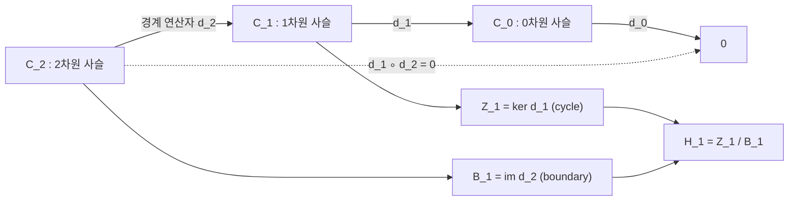

# 단체 호몰로지

# 개요

단체 호몰로지는 공간을 삼각형 조각으로 쪼개고 각 차원에서 경계가 없으면서 무엇의 경계도 아닌 것들을 세어 아벨군을 얻는 방법이다. 0차원은 연결성분의 개수, 1차원은 고리 모양 구멍, 2차원은 속이 빈 방을 센다. [기본군](fundamental-group.md)과 달리 정의부터 아벨군이라 계산이 선형대수로 환원되고 모든 차원에서 정보를 준다. 경계 연산자를 두 번 적용하면 0 이라는 항등식이 이론의 축이다. 호몰로지는 [Euler 지표](euler-characteristic.md), Brouwer 고정점 정리의 고차원 판, 위상 데이터 분석의 persistent homology 로 이어진다.

# 직관

삼각형의 테두리는 시작도 끝도 없으므로 경계가 없다. 내부를 채우면 테두리가 그 면의 경계가 되어 구멍이 아니고, 내부를 비우면 무엇의 경계도 아닌 채로 남아 1차원 구멍 하나가 된다.

호몰로지는 이 구분을 대수화한다. 경계가 없는 것의 집합을 cycle, 무엇의 경계인 것의 집합을 boundary 라 하고 전자를 후자로 나눈다.

두 번 경계를 취하면 0 이라는 것은 경계가 경계를 가지지 않는다는 기하적 관찰이다. 삼각형의 세 변을 방향까지 고려해 더하면 꼭짓점들이 부호가 반대로 두 번씩 나타나 상쇄된다.

# 정의

## 단체복합체

Euclidean 공간의 아핀 독립인 점 k+1 개가 만드는 볼록포가 **k-단체**다. 0-단체는 점, 1-단체는 선분, 2-단체는 삼각형, 3-단체는 사면체다. 단체의 부분집합이 되는 단체를 **면**이라 한다.

단체들의 유한 모음 K 가 **단체복합체**라는 것은 다음 두 조건을 만족한다는 뜻이다.

$$
\sigma\in K,\ \tau\ \text{가 } \sigma \text{의 면}\ \Longrightarrow\ \tau\in K;\qquad
\sigma,\sigma'\in K\ \Longrightarrow\ \sigma\cap\sigma'\ \text{는 공집합이거나 둘의 공통 면}
$$

K 에 속한 단체들의 합집합에 부분공간 위상을 준 것이 K 의 **다면체** 또는 실현이다. 위상공간 X 가 어떤 단체복합체의 실현과 위상동형이면 X 를 삼각화 가능하다고 한다. compact [다양체](manifolds.md)는 3차원 이하에서 항상 삼각화 가능하다.

## 사슬군과 경계 연산자

각 단체에 꼭짓점 순서로 방향을 준다. **n-사슬군**은 방향을 준 n-단체들을 기저로 하는 자유 아벨군이다.

$$
C_n(K)=\bigoplus_{\sigma\ n\text{-단체}}\mathbb{Z}\cdot\sigma
$$

**경계 연산자**는 꼭짓점을 하나씩 뺀 면들의 교대합이고 기저 위의 정의를 선형으로 확장한다[^1].

$$
\partial_n[v_0,\dots,v_n]=\sum_{i=0}^{n}(-1)^{i}\thinspace[v_0,\dots,\widehat{v_i},\dots,v_n]
$$

모자 표시는 그 꼭짓점을 제거했다는 뜻이다. 핵심 항등식은

$$
\partial_{n}\circ\partial_{n+1}=0
$$

이다. 꼭짓점 두 개를 빼는 순서가 두 가지이고, 같은 결과 항이 부호 $(-1)^i(-1)^j$ 와 $(-1)^j(-1)^{i-1}$ 로 두 번 나타나 상쇄된다.

## 호몰로지 군과 Betti 수

위 항등식이 포함관계를 보장하고, 아벨군이므로 몫이 잘 정의된다([아이디얼과 몫환](ideals-quotient-rings.md)과 같은 몫 구성이다).

$$
Z_n=\ker\partial_n,\qquad B_n=\mathrm{im}\partial_{n+1},\qquad B_n\subseteq Z_n
$$

$$
H_n(K)=Z_n/B_n
$$

유한 복합체에서 각 호몰로지 군은 유한생성 아벨군이므로 자유부분과 꼬임부분으로 분해된다. 자유부분의 rank 가 n 번째 **Betti 수**다.

$$
H_n(K)\cong\mathbb{Z}^{\beta_n}\oplus T_n,\qquad \beta_n=\mathrm{rank}H_n(K)
$$

# 성질

## 경계 행렬과 Smith normal form

경계 연산자를 기저에 대해 행렬로 쓰면 성분이 -1, 0, 1 인 정수행렬이다. 정수행렬의 Smith normal form 이 rank 와 꼬임 계수를 모두 주고, Betti 수는 다음으로 나온다[^2].

$$
\beta_n=\mathrm{rank}Z_n-\mathrm{rank}B_n=\bigl(m_n-\mathrm{rank}\partial_n\bigr)-\mathrm{rank}\partial_{n+1}
$$

$m_n$ 은 n-단체의 개수다. 이 계산은 [선형사상](linear-maps.md)의 rank-nullity 를 정수 계수로 되풀이한 것이다.

## 표준 계산 결과

연결 다면체에서 0차 호몰로지는 정수군 하나이고, 0번째 Betti 수는 연결성분의 개수다.

| 공간 | $H_0$ | $H_1$ | $H_2$ | Betti 수 |
| --- | --- | --- | --- | --- |
| 점 | 정수군 | 0 | 0 | 1, 0, 0 |
| 원 | 정수군 | 정수군 | 0 | 1, 1, 0 |
| 2차원 구면 | 정수군 | 0 | 정수군 | 1, 0, 1 |
| 원환면 | 정수군 | 정수군의 두 번 곱 | 정수군 | 1, 2, 1 |
| 실사영평면 | 정수군 | 위수 2 순환군 | 0 | 1, 0, 0 |
| Klein 병 | 정수군 | 정수군과 위수 2 순환군의 곱 | 0 | 1, 1, 0 |

실사영평면과 Klein 병의 1차 호몰로지에 나타나는 위수 2 부분이 **꼬임**이고 방향지음 불가능성의 대수적 흔적이다. Betti 수만으로는 공간을 구별하지 못한다.

## 위상 불변성

서로 다른 삼각화를 택해도 호몰로지 군은 동형이다. 더 강하게 호몰로지는 호모토피 불변량이며 연속사상은 호몰로지 사이의 준동형을 유도한다. 이 불변성을 삼각화에 의존하지 않고 직접 얻는 것이 특이 호몰로지이고, 삼각화 가능한 공간에서 두 이론은 일치한다[^1].

## 기본군과의 관계

경로연결 공간에서 1차 호몰로지는 [기본군](fundamental-group.md)의 아벨화와 동형이다(Hurewicz).

$$
H_1(X)\cong\pi_1(X)^{\mathrm{ab}}=\pi_1(X)/[\pi_1(X),\pi_1(X)]
$$

8자 모양의 기본군은 비가환 자유군이지만 1차 호몰로지는 정수군의 두 번 곱이다. 호몰로지는 계산이 쉬운 대가로 정보를 잃는다.

## 고차원 Brouwer

n 차원 구면의 n 차 호몰로지가 정수군이고 n 차원 원판의 것은 0 이므로 원판에서 경계 구면으로의 retraction 이 없고, 모든 차원의 Brouwer 고정점 정리가 나온다. 기본군으로는 2차원까지만 가능했던 논법이 여기서 완결된다.

# 활용

- Euler 지표의 위상적 정의. 단체 개수의 교대합이 Betti 수의 교대합과 같다. 자세한 진술은 [Euler 지표](euler-characteristic.md)에 있다.

$$
\chi(K)=\sum_{n\ge 0}(-1)^{n}m_n=\sum_{n\ge 0}(-1)^{n}\beta_n
$$

- 위상 데이터 분석. 점구름에 반지름을 키우며 단체복합체의 열을 만들고 각 구멍이 태어나고 죽는 반지름을 기록한다(persistent homology). 노이즈는 짧게, 실제 구조는 길게 살아남는다.
- 센서 네트워크와 커버리지. 통신 반경으로 만든 복합체의 1차 호몰로지가 0 이면 감시 구멍이 없다.
- 그래프. 연결 그래프를 1차원 단체복합체로 보면 1차 Betti 수가 순환 차원, 곧 간선 수에서 신장트리의 간선 수를 뺀 값이다([그래프](graphs.md), [최소 신장트리](minimum-spanning-tree.md)).

속이 빈 삼각형의 Betti 수 계산은 다음과 같다.

[^1]: J. R. Munkres, *Elements of Algebraic Topology*, §5–8 (단체복합체, 경계 연산자, 단체 호몰로지), §34 (Hurewicz 정리). https://graphics.stanford.edu/courses/cs468-02-fall/notes/06.pdf
[^2]: 경계 행렬의 성분이 -1, 0, 1 이고 Smith normal form 으로 Betti 수와 꼬임을 얻는 절차. V. Robins, "Computing Homology", Ch. 3. https://people.physics.anu.edu.au/~vbr110/thesis/ch3-homology.pdf

# 연관 문서

## 선수지식

- [위상 공간](topology.md)
- [군](groups.md)

## 더 알아보기

- [Euler 지표](euler-characteristic.md)
- [de Rham 코호몰로지](de-rham-cohomology.md)
- [Galois 표현과 에탈 코호몰로지](galois-representations.md)
- [Khovanov 호몰로지](khovanov-homology.md)
- [Reidemeister 비틀림과 렌즈 공간](reidemeister-torsion.md)
- [대수적 K 이론과 Quillen–Lichtenbaum](algebraic-k-theory.md)

#algebraic_topology #topology #algebra #graph_theory
