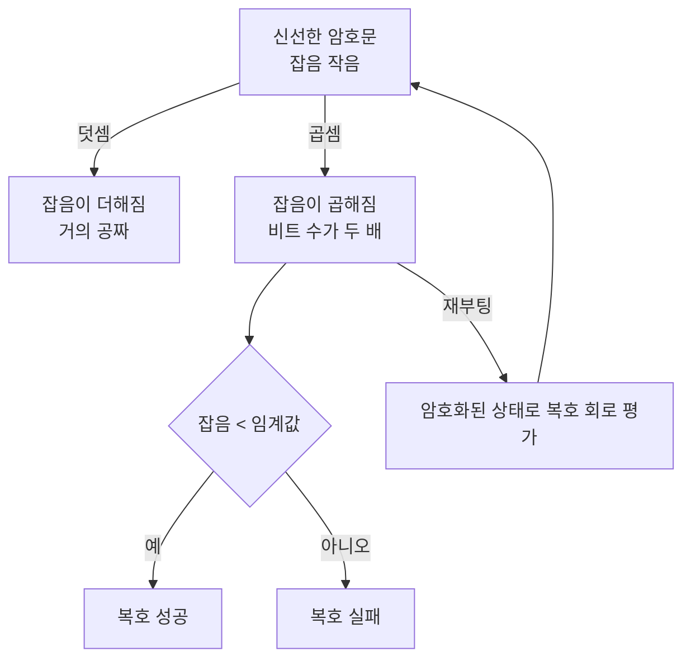

# 완전동형암호

# 개요

암호문을 복호하지 않고 그 위에서 계산할 수 있다면 무엇이 가능한가. 병원이 환자 데이터를 암호화한 채 외부에 맡겨 통계를 내고, 검색 질의를 암호화한 채 서버에 보내 결과만 받아 온다. 서버는 무엇을 계산했는지 끝까지 모른다.

부분적으로는 오래전부터 가능했다. RSA 는 곱셈을, Paillier 는 덧셈을 보존한다. 그러나 덧셈과 곱셈을 동시에 임의 횟수 지원하는 방식은 1978 년에 제기된 뒤 30 년 넘게 미해결이었다. 임의의 계산이 덧셈과 곱셈으로 이루어진 회로로 표현되므로, 둘 다 되면 무엇이든 된다는 점에서 "완전" 이다.

[격자 기반 암호](post-quantum-cryptography.md) 문서에서 본 잡음이 여기서 다시 중심에 선다. 안전성의 근거인 잡음이 연산마다 커지고, 복호 예산을 넘으면 암호문이 쓰레기가 된다. 그래서 오랫동안 유한한 깊이까지만 계산하는 방식밖에 없었다.

Gentry 가 2009 년에 재부팅이라는 자기참조적 기법으로 이 벽을 넘었다. 암호화된 상태에서 복호 회로 자체를 평가하면 잡음이 초기화된다는 착상이다. 원리적 가능성이 열린 뒤 15 년 동안 성능이 수만 배 개선되어 일부 응용에서는 실용 단계에 들어섰다.

# 직관

## 잡음이 안전성이자 예산이다

암호문은 평문에 잡음을 섞은 것이고, 잡음이 없으면 안전하지 않다. 그런데 두 암호문을 더하면 잡음도 더해지고, 곱하면 잡음이 곱해진다.

복호는 잡음이 어떤 임계값보다 작을 때만 성공한다. 따라서 계산 가능한 회로의 깊이가 처음부터 유한하게 정해져 있다. 잡음 예산이라는 말은 이 사정을 그대로 가리킨다.



## 곱셈이 비싼 이유

덧셈에서는 잡음의 크기가 더해진다. 비트 수로 보면 거의 늘지 않는다.

곱셈에서는 잡음의 크기가 곱해진다. 비트 수가 더해지고, 같은 암호문을 제곱하면 비트 수가 두 배가 된다. 회로의 곱셈 깊이가 $d$ 면 잡음 비트가 $2^d$ 배로 늘어나므로, 예산이 $B$ 비트라도 깊이는 $\log B$ 정도까지만 간다.

그래서 이 분야의 모든 기법이 곱셈 깊이를 줄이거나 잡음을 중간에 깎는 데 집중한다.

## 재부팅의 자기참조

Gentry 의 착상은 이렇다. 잡음이 큰 암호문 $c$ 를 평문으로 취급하고, 비밀키를 암호화한 것 $\mathrm{Enc}(sk)$ 를 써서 복호 함수 $\mathrm{Dec}(sk,c)$ 를 동형적으로 평가한다.

결과는 같은 평문의 새 암호문인데, 잡음은 원래 $c$ 의 잡음과 무관하다. 복호 회로를 평가하면서 새로 생긴 잡음만 남기 때문이다. 무한히 계산할 수 있게 된다.

성립하려면 조건이 하나 있다. 자기 자신의 복호 회로를 평가할 만큼의 잡음 예산이 남아 있어야 한다. 이것을 부트스트랩 가능이라 하고, 초기 구성들은 복호 회로를 억지로 얕게 만들어(스쿼싱) 이 조건을 맞췄다. 지금은 복호가 애초에 얕은 방식을 설계한다.

비밀키를 그 자신의 공개키로 암호화한 값을 공개해야 한다는 점이 대가다. 순환 안전성이라는 추가 가정이 필요하며, 표준 가정에서 환원되지 않는다.

# 정의

## 동형암호의 층위

- 부분동형: 한 종류의 연산만 무제한. RSA(곱), Paillier(덧), ElGamal(곱).
- 준동형: 덧셈은 무제한, 곱셈은 한 번. 쌍을 쓴 구성이 여기 속한다.
- 유계동형(leveled): 미리 정한 깊이 $L$ 까지의 회로를 평가한다. 키 크기가 $L$ 에 의존한다.
- 완전동형: 깊이 제한이 없다. 유계동형에 재부팅을 붙여 얻는다.

실무에서는 대부분 유계동형으로 충분하다. 재부팅이 여전히 비싸기 때문이다.

## DGHV: 정수 위의 구성

비밀키가 큰 홀수 $p$ 다. 비트 $m\in\lbrace 0,1\rbrace$ 의 암호문은

$$
c=qp+2r+m
$$

$q$ 는 큰 난수, $r$ 은 작은 난수다. 복호는 $c \bmod p$ 를 중심 잉여로 잡아 다시 2 로 나눈 나머지를 보는 것이다.

$$
\mathrm{Dec}(c)=\big((c\bmod p)\bmod 2\big)
$$

$|2r+m|<p/2$ 인 동안 정확하다. 덧셈과 곱셈이 그대로 평문의 XOR 과 AND 가 된다. 안전성은 근사 최대공약수 문제에 의존하며, 격자 공격으로 분석된다.

## BGV, BFV, CKKS

실무 방식은 모두 Ring-LWE 위에 있다. 평문이 $R_t=\mathbb Z_t[x]/(x^n+1)$ 의 원소이고 암호문이 $R_q$ 의 다항식 쌍이다.

- BGV: 모듈러스 전환으로 각 층마다 잡음을 깎는다. 정수 산술에 적합하다.
- BFV: 평문을 $q/t$ 로 스케일해 넣는다. BGV 와 이론적으로 동치이나 잡음 관리 방식이 다르다.
- CKKS: 복소수 근사 산술을 지원한다. 잡음을 평문의 하위 비트로 흡수해 고정소수점 연산처럼 다루며, 기계학습 응용의 표준이다.
- TFHE: 비트 단위로 매우 빠른 재부팅(수십 밀리초)을 제공한다. 임의 불리언 회로에 적합하다.

평문 공간이 $R_t$ 라는 점에서 한 암호문에 여러 값을 담을 수 있다. 중국인의 나머지 정리로 $R_t$ 를 여러 슬롯으로 쪼개면 한 번의 연산이 수천 개 값에 동시에 적용된다. 이 일괄 처리가 실용 성능의 핵심이다.

## 잡음 관리 기법

- 모듈러스 전환: 암호문 모듈러스를 $q$ 에서 $q'$ 로 낮추면서 잡음도 같은 비율로 줄인다. 절대 잡음이 작아지므로 다음 곱셈의 여유가 생긴다.
- 키 전환(재선형화): 곱셈 결과는 차수가 올라간 암호문이라 그대로 두면 크기가 커진다. 키 전환으로 원래 형태로 되돌린다.
- 재부팅: 위의 자기참조 기법.

# 성질

## 깊이가 벽이다

DGHV 를 직접 구현하면 잡음 예산과 깊이의 관계가 눈에 보인다.

```python
import random
random.seed(7)

# DGHV: 정수 위의 완전동형암호. 비밀은 홀수 p, 암호문은 c = q·p + 2r + m.
P_BITS, Q_BITS, R_BITS = 512, 2048, 16
p = random.getrandbits(P_BITS) | 1 | (1 << (P_BITS - 1))

def enc(m):
    return random.getrandbits(Q_BITS) * p + 2 * random.getrandbits(R_BITS) + m

def dec(c):
    r = c % p
    if r > p // 2: r -= p                      # 중심 잉여
    return r % 2

def noise(c):
    r = c % p
    if r > p // 2: r -= p
    return abs(r).bit_length()                 # 잡음 |2r+m| 의 비트 수

a, b = enc(1), enc(0)
print(f"평문 복원: dec(a)={dec(a)}, dec(b)={dec(b)}")
print(f"덧셈(XOR): dec(a+b)={dec(a + b)},  곱셈(AND): dec(a*b)={dec(a * b)}")
print(f"잡음 비트: a={noise(a)}, a+b={noise(a + b)}, a*b={noise(a * b)}, p={p.bit_length()}\n")

print("신선한 암호문을 계속 곱하면 잡음 비트가 매번 약 17 씩 더해진다")
c = enc(1)
for d in range(40):
    if dec(c) != 1:
        print(f"  깊이 {d} 에서 복호 실패 (잡음 {noise(c)} 비트 >= p 의 {p.bit_length()} 비트)")
        break
    if d % 8 == 0: print(f"  깊이 {d:>2}: 잡음 {noise(c):>3} 비트, 복호 성공")
    c = c * enc(1)

print("\n제곱을 반복하면 잡음 비트가 매번 두 배가 된다")
c = enc(1)
for d in range(10):
    if dec(c) != 1:
        print(f"  깊이 {d} 에서 복호 실패 (잡음 {noise(c)} 비트 >= p 의 {p.bit_length()} 비트)")
        break
    print(f"  깊이 {d:>2}: 잡음 {noise(c):>4} 비트, 복호 성공")
    c = c * c

# 평문 복원: dec(a)=1, dec(b)=0
# 덧셈(XOR): dec(a+b)=1,  곱셈(AND): dec(a*b)=0
# 잡음 비트: a=16, a+b=18, a*b=33, p=512
#
# 신선한 암호문을 계속 곱하면 잡음 비트가 매번 약 17 씩 더해진다
#   깊이  0: 잡음  16 비트, 복호 성공
#   깊이  8: 잡음 137 비트, 복호 성공
#   깊이 16: 잡음 260 비트, 복호 성공
#   깊이 24: 잡음 387 비트, 복호 성공
#   깊이 32: 잡음 510 비트, 복호 성공
#   깊이 35 에서 복호 실패 (잡음 511 비트 >= p 의 512 비트)
#
# 제곱을 반복하면 잡음 비트가 매번 두 배가 된다
#   깊이  0: 잡음   17 비트, 복호 성공
#   깊이  1: 잡음   33 비트, 복호 성공
#   깊이  2: 잡음   65 비트, 복호 성공
#   깊이  3: 잡음  129 비트, 복호 성공
#   깊이  4: 잡음  257 비트, 복호 성공
#   깊이  5: 잡음  511 비트, 복호 성공
#   깊이  6: 잡음  504 비트, 복호 성공
#   깊이 7 에서 복호 실패 (잡음 511 비트 >= p 의 512 비트)
```

두 실험의 대비가 요점이다. 신선한 암호문을 계속 곱하면 잡음이 매번 초기 잡음만큼(17 비트) 더해져 35 층까지 간다. 반면 같은 암호문을 제곱하면 잡음 비트가 두 배씩 되어 6 층에서 끝난다. 회로의 모양이 같은 곱셈 횟수에서도 전혀 다른 깊이 비용을 낸다는 뜻이다.

깊이 6 의 출력은 이미 의미가 없다. 잡음이 $p/2$ 를 넘어 중심 잉여가 감겨 버린 뒤라, 그 지점의 복호 성공은 우연이다. 잡음 예산을 넘긴 암호문은 복호가 틀렸다는 신호조차 주지 않는다는 점이 실무에서 파라미터를 보수적으로 잡는 이유다.

덧셈이 $a+b$ 에서 잡음을 16 비트에서 18 비트로만 늘리는 데 비해 곱셈이 33 비트로 두 배 늘리는 것도 첫 줄에서 확인된다.

## 비용

동형 연산은 평문 연산보다 3 차에서 6 차 자릿수만큼 느리다. 암호문도 평문보다 1000 배 규모로 크다. 일괄 처리로 수천 개 값을 동시에 다루면 상각 비용이 크게 내려가지만, 이는 같은 연산을 여러 데이터에 적용하는 경우에만 통한다.

재부팅은 특히 비싸다. TFHE 계열이 비트당 수십 밀리초, BGV/CKKS 계열이 슬롯이 많은 대신 한 번에 수십 초가 걸린다. 그래서 실무 설계의 첫 단계는 회로 깊이를 재부팅 없이 소화할 수 있는 수준으로 줄이는 것이다.

## 할 수 없는 것

동형암호는 기밀성만 준다. 서버가 약속한 계산을 실제로 했는지는 보장하지 않으므로, 결과의 정확성이 필요하면 검증 가능한 계산이나 영지식 증명을 따로 붙여야 한다.

데이터에 의존하는 분기도 문제다. 서버가 조건을 볼 수 없으므로 양쪽 가지를 모두 계산한 뒤 암호화된 조건으로 선택해야 한다. 비교와 정렬처럼 분기가 본질인 연산의 비용이 특히 크며, 이 때문에 일반 프로그램을 그대로 옮기는 것이 아니라 산술 회로로 재설계해야 한다.

# 활용

## 개인정보를 지키는 통계와 추론

의료와 금융 데이터의 공동 분석이 대표적인 응용이다. 여러 기관이 각자 암호화한 데이터를 모아 통계량을 계산하면 원본은 누구에게도 드러나지 않는다. 유전체 데이터 분석 대회에서 동형암호 기반 방식이 실제로 쓰이고 있다.

기계학습 추론에서는 CKKS 가 근사 산술을 지원해 주로 쓰인다. 다항식으로 근사한 활성화 함수를 쓰는 신경망을 암호문 위에서 평가하는 방식이며, 모델은 서버가 갖고 입력은 사용자가 감춘다. 학습까지 동형으로 하는 것은 깊이가 너무 깊어 아직 실용적이지 않다.

## 비공개 정보 검색

사용자가 어떤 항목을 조회했는지 서버가 모르게 하는 문제다. 동형암호로 질의 벡터를 암호화해 보내면, 서버가 전체 데이터베이스와 내적을 계산해 해당 항목만 남긴 결과를 돌려준다.

비밀번호 유출 확인과 안전 브라우징처럼 대규모로 배치된 사례가 있다. 서버가 데이터베이스 전체를 훑어야 하므로 비용이 크지만, 질의 내용 자체가 민감한 상황에서는 대안이 없다.

## 다자간 계산과의 관계

여러 참여자가 각자의 입력을 감춘 채 공동 함수를 계산하는 문제는 비밀 공유 기반의 다자간 계산으로도 풀린다. 두 방식의 성격이 다르다. 다자간 계산은 계산이 싸지만 통신량이 회로 크기에 비례하고, 동형암호는 통신이 거의 없지만 계산이 비싸다.

통신이 병목이면 동형암호를, 계산이 병목이면 다자간 계산을 쓰는 것이 대략의 기준이며, 둘을 섞은 혼합 구성도 흔하다.

## 표준화와 현황

암호 방식 자체는 IBM, Microsoft, Zama 등의 공개 라이브러리로 널리 배포되어 있고, 파라미터 선택 기준을 정리한 커뮤니티 표준 문서가 나와 있다. 근본적인 안전성은 Ring-LWE 에 있으므로 양자 내성도 함께 따라온다.

남은 과제는 여전히 성능과 사용성이다. 회로 깊이와 파라미터를 자동으로 고르는 컴파일러, 재부팅 가속 하드웨어, CKKS 의 근사 오차를 다루는 정확도 분석이 활발한 연구 주제다.

# 연관 문서

## 선수지식

- [격자 기반 후양자 암호](post-quantum-cryptography.md)

## 더 알아보기

아직 연결한 문서가 없다.

#cryptography #computation
