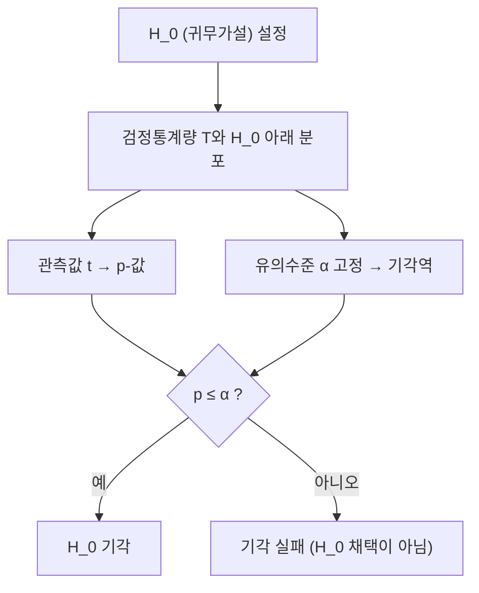

# 가설검정과 p-값

# 개요

가설검정은 데이터가 특정 확률 모형과 얼마나 어긋나는지를 정해진 규칙으로 판정하는 절차다. 귀무가설을 참이라고 가정했을 때 관측된 정도의 극단값이 나올 확률, 즉 p-값을 계산하고, 미리 정한 유의수준과 비교해 기각 여부를 결정한다. 이 틀의 핵심은 두 종류의 오류를 비대칭적으로 취급한다는 점이다. 1종 오류율을 먼저 고정하고 그 제약 아래 검정력을 최대화한다. Neyman–Pearson 보조정리는 단순가설에서 가능도비가 이 최적화의 해임을 말해 준다. p-값은 널리 오용되는 양이기도 해서, 무엇이 아닌지를 아는 것이 정의를 아는 것만큼 중요하다.

# 직관

동전이 공정한지 알고 싶다. 100번 던져 앞면이 60번 나왔다. 공정하다면 앞면 개수는 평균 50, 표준편차 5인 분포를 따르므로 60은 2 표준편차만큼 벗어난 값이다. 공정한 동전에서 이만큼 또는 더 벗어난 결과가 나올 확률은 약 5%다. 이 5%가 p-값이다.

p-값은 "동전이 공정할 확률"이 아니다. 계산 전체가 "동전이 공정하다"는 가정 아래에서 이루어졌으므로, 그 가정의 확률을 말해 줄 수 없다. 이는 조건부확률의 방향을 혼동하는 오류이며, 방향을 바꾸려면 사전확률이 필요하다([Bayes 정리](bayes.md)).

법정 비유가 구조를 잘 보여 준다. 귀무가설은 "무죄"이고, 증거가 무죄 가정 아래 충분히 이례적일 때만 유죄를 선고한다. 무고한 사람을 처벌할 확률(1종 오류)을 낮게 고정하는 대가로, 범인을 놓칠 확률(2종 오류)은 상대적으로 크게 남는다. 기각하지 못했다는 것이 무죄의 증명이 아닌 이유도 같다.



# 정의

모형족 f(x; θ)와 모수공간 Θ가 주어졌을 때, Θ를 서로소인 두 부분 Θ_0과 Θ_1으로 나눈 것이 가설이다. 귀무가설과 대립가설을 다음처럼 쓴다. 한 점만 포함하면 단순가설(simple), 여럿을 포함하면 복합가설(composite)이다.

$$
H_0:\ \theta\in\Theta_0
\qquad\text{대}\qquad
H_1:\ \theta\in\Theta_1
$$

검정(test)은 데이터를 기각/비기각으로 보내는 함수, 또는 기각할 확률을 주는 함수 φ(x)로 형식화한다. 값이 0과 1만 가지면 결정론적 검정, 그 사이 값을 허용하면 무작위화 검정이다.

## 두 종류의 오류

1종 오류는 H_0이 참인데 기각하는 것이고, 2종 오류는 H_1이 참인데 기각하지 못하는 것이다. 각각의 확률을 다음으로 쓴다.

$$
\alpha(\theta)=\mathbb E_\theta[\varphi(X)]\ \ (\theta\in\Theta_0),
\qquad
\beta(\theta)=1-\mathbb E_\theta[\varphi(X)]\ \ (\theta\in\Theta_1)
$$

검정의 크기(size)는 Θ_0 위의 기각확률의 상한이고, 유의수준 α의 검정이란 크기가 α 이하인 검정이다. 검정력(power)은 대립가설 아래의 기각확률이다.

$$
\text{size}=\sup_{\theta\in\Theta_0}\mathbb E_\theta[\varphi(X)],
\qquad
\text{power}(\theta)=\mathbb E_\theta[\varphi(X)]=1-\beta(\theta)
$$

## p-값

검정통계량 T와 관측값 t에 대해, 큰 값이 H_0과 어긋남을 뜻하도록 방향을 잡았다면 p-값은 다음이다.

$$
p=\sup_{\theta\in\Theta_0}\ P_\theta\big(T\ge t\big)
$$

즉 H_0 아래에서 관측된 만큼 또는 더 극단적인 결과가 나올 확률이다[^1]. T가 연속분포를 따르고 H_0이 단순가설이면 p-값 자체가 H_0 아래에서 구간 [0,1]의 균등분포를 따른다. 따라서 p ≤ α로 기각하는 규칙의 1종 오류율은 정확히 α다. 이산분포에서는 p-값의 분포가 균등분포를 확률적으로 지배하므로 실제 크기가 α보다 작아진다(보수적이다).

# 성질

## p-값이 말하지 않는 것

미국통계학회(ASA)는 2016년 성명에서 p-값 사용의 여섯 원칙을 제시했다[^2]. 특히 다음 두 가지가 정의에서 직접 따른다.

첫째, p-값은 H_0이 참일 확률도, 데이터가 우연만으로 생겼을 확률도 아니다. 정의가 H_0을 조건으로 두고 있으므로 방향이 반대다.

$$
P(T\ge t\mid H_0)\ \neq\ P(H_0\mid T\ge t)
$$

둘째, p-값은 효과의 크기나 결과의 중요성을 재지 않는다. 표본이 매우 크면 실질적으로 무의미한 차이도 아주 작은 p-값을 낸다. 반대로 표본이 작으면 큰 효과도 기각에 실패한다. 그래서 p-값만 보고하는 대신 추정값과 신뢰구간을 함께 보는 것이 권장된다.

또한 여러 가설을 검정하면 1종 오류가 누적된다. 독립인 검정 m개를 각각 유의수준 α로 하면 적어도 하나를 잘못 기각할 확률은 다음과 같다.

$$
1-(1-\alpha)^m\qquad(\alpha=0.05,\ m=20\ \Rightarrow\ \approx 0.64)
$$

Bonferroni 보정(각 검정을 α/m으로)이나 false discovery rate 통제가 이 문제를 다룬다. 유의해질 때까지 데이터를 더 모으거나 가설을 바꾸는 관행(p-hacking)은 명목 유의수준을 무의미하게 만든다.

## Neyman–Pearson 보조정리

두 가설이 모두 단순한 경우, 즉 H_0에서 밀도가 f_0, H_1에서 f_1인 경우를 생각한다. 가능도비를 기준으로 기각하는 검정이 최적이다[^3].

$$
\Lambda(x)=\frac{f_1(x)}{f_0(x)},
\qquad
\varphi(x)=\begin{cases}
1, & \Lambda(x)>k\\
\gamma, & \Lambda(x)=k\\
0, & \Lambda(x)<k
\end{cases}
$$

진술은 두 부분이다. 존재: 임의의 α에 대해 위 형태이면서 크기가 정확히 α인 상수 k와 γ가 존재한다. 최적성: 그 검정은 유의수준 α의 모든 검정 가운데 검정력이 최대다.

최적성의 증명 개요. 크기가 α 이하인 임의의 검정 ψ를 잡고 다음 적분을 본다.

$$
\int \big(\varphi(x)-\psi(x)\big)\big(f_1(x)-k f_0(x)\big)\,dx\ \ge\ 0
$$

피적분함수가 항상 음이 아니기 때문이다. Λ(x)>k인 곳에서는 φ=1이므로 첫 인자가 음이 아니고 둘째 인자가 양수이며, Λ(x)<k인 곳에서는 두 인자의 부호가 모두 뒤집힌다. 전개해서 정리하면 φ의 검정력에서 ψ의 검정력을 뺀 값이 k배의 크기 차이 이상이고, ψ의 크기가 α 이하이므로 그 차이가 음이 아니다.

복합가설에는 그대로 확장되지 않는다. 최적 기각역이 대립가설의 어느 점을 보느냐에 따라 달라지기 때문이다. 단조가능도비를 갖는 모형족(대다수의 1모수 지수족)에서는 단측검정에 대해 균등최강력(UMP) 검정이 존재한다. 일반적인 경우에는 [최대가능도 추정](maximum-likelihood.md)을 이용한 가능도비 검정을 쓰고, Wilks 정리가 그 통계량의 점근분포가 카이제곱임을 준다.

## 신뢰구간과의 쌍대성

유의수준 α의 검정족과 신뢰수준 1−α의 구간은 서로를 결정한다. 값 θ_0을 기각하지 않는 θ_0 전체의 집합이 신뢰집합이 되고, 역으로 신뢰집합에 θ_0이 들어 있지 않을 때 기각하면 검정이 된다. 실무에서 신뢰구간이 선호되는 이유는 같은 정보를 담으면서 효과의 크기를 함께 보여 준다는 점이다.

# 활용

## z-검정 예제

모평균이 μ_0인지 검정한다. 분산이 알려져 있거나 표본이 충분히 크면 [중심극한정리](central-limit-theorem.md)에 의해 다음 통계량이 H_0 아래 근사적으로 표준정규분포를 따른다.

$$
Z=\frac{\overline X_n-\mu_0}{\sigma/\sqrt n},
\qquad
p_{\text{양측}}=2\big(1-\Phi(|z|)\big)
$$

동전 예제로 돌아가자. H_0은 성공확률이 0.5, n=100, 앞면 60회다. 표본비율은 0.6이고 H_0 아래 표준오차는 0.05이므로 다음과 같다.

$$
z=\frac{0.6-0.5}{0.05}=2.0,
\qquad
p_{\text{양측}}=2\big(1-\Phi(2.0)\big)\approx 0.0455
$$

유의수준 0.05에서는 기각, 0.01에서는 기각 실패다. 경계 근처의 결론이 유의수준 선택에 좌우된다는 점 자체가 이분법적 판정의 취약함을 보여 준다.

```python
from math import erf, sqrt

Phi = lambda x: 0.5 * (1 + erf(x / sqrt(2)))

def z_test(k, n, p0=0.5):
    se = sqrt(p0 * (1 - p0) / n)
    z = (k / n - p0) / se
    return z, 2 * (1 - Phi(abs(z)))

print(z_test(60, 100))     # (2.0, 0.0455)
print(z_test(600, 1000))   # 같은 비율, 훨씬 작은 p-값
```

## 검정력 설계

표본 크기를 정할 때는 검출하고 싶은 효과 크기 δ, 유의수준 α, 목표 검정력 1−β를 먼저 정하고 필요한 n을 역산한다. 양측 z-검정의 근사식은 다음이다. 여기서 z_q는 표준정규분포의 상위 q 분위수다.

$$
n\ \approx\ \frac{\left(z_{\alpha/2}+z_{\beta}\right)^2\sigma^2}{\delta^2}
$$

검출하려는 효과가 절반으로 줄면 필요한 표본은 네 배가 된다. 반면 사후적으로 계산한 검정력(observed power)은 p-값의 재표현일 뿐이므로 해석에 쓰지 않는다.

## 어디에 쓰이는가

임상시험의 우월성·비열등성 검정, A/B 테스트, 품질관리의 관리도, 난수 생성기의 적합도 검정이 모두 같은 틀을 쓴다. 물리학의 입자 발견 기준인 "5 시그마"는 표준정규분포의 단측 꼬리 확률 약 3×10의 −7제곱에 해당하는 유의수준으로, 동시에 살펴보는 가설이 매우 많다는 사실을 반영해 관례적으로 엄격하게 잡은 값이다. 대안적 틀로는 사후확률과 Bayes factor를 보고하는 방식, 그리고 [Shannon entropy](entropy.md) 기반의 정보량 기준(AIC 등)으로 모형을 비교하는 방식이 있다.

[^1]: R. L. Wasserstein and N. A. Lazar, "The ASA Statement on p-Values: Context, Process, and Purpose", The American Statistician 70(2), 2016. https://www.tandfonline.com/doi/full/10.1080/00031305.2016.1154108
[^2]: American Statistical Association, "ASA Statement on Statistical Significance and P-Values", 2016 (여섯 원칙). https://www.amstat.org/asa/files/pdfs/p-valuestatement.pdf
[^3]: Stanford University, Stats 200, Lecture 6: "Simple alternatives, Neyman–Pearson lemma" (가능도비 검정의 존재와 최적성 진술 및 증명). https://web.stanford.edu/class/stats200/Lecture06.pdf

# 연관 문서

## 선수지식

- [확률변수와 기댓값](random-variables.md)
- [중심극한정리](central-limit-theorem.md)
- [최대가능도 추정](maximum-likelihood.md)

## 더 알아보기

- [신뢰구간](confidence-intervals.md)
