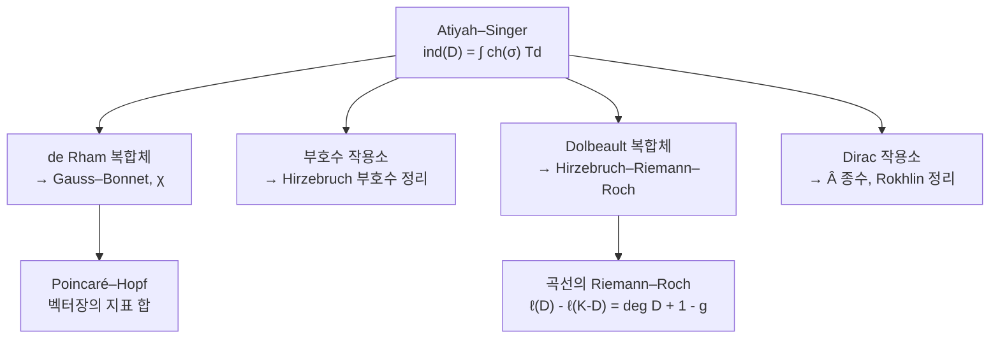

# 지표 정리

# 개요

$D$ 가 콤팩트 다양체 위의 타원 미분작용소면 해공간이 유한차원이므로 정수 하나가 정의된다.

$$
\mathrm{ind}(D)=\dim\ker D-\dim\mathrm{coker}\thinspace D
$$

이것이 **해석적 지표**다. $D$ 의 계수를 연속적으로 흔들면 $\dim\ker D$ 와 $\dim\mathrm{coker}\thinspace D$ 는 각각 뛰지만 차이는 변하지 않는다.

Atiyah–Singer 지표 정리는 이 정수가 $D$ 의 최고차 기호가 정의하는 **위상적 지표**와 같다고 말한다.

$$
\mathrm{ind}(D)=\int_M\mathrm{ch}(\sigma_D)\thinspace\mathrm{Td}(TM\otimes\mathbb C)
$$

우변에는 미분방정식이 없고 다양체의 특성류와 기호의 $K$ 이론 류만 들어간다. 좌변은 해를 세고 우변은 위상을 재는데 두 답이 같다.

특수한 경우들이 이미 큰 정리다. [Gauss–Bonnet](gauss-bonnet.md)은 de Rham 복합체에, Riemann–Roch 는 Dolbeault 복합체에, 부호수 정리는 부호수 작용소에 적용한 결과다. [Hodge 이론](hodge-theory.md)의 조화형식 차원이 위상 불변량이라는 결론을 넓은 작용소 집단으로 확장한 것이 지표 정리다.

# 직관

## 지표의 안정성

유한차원에서 선형사상 $A\colon V\to W$ 의 지표는 $\dim V-\dim W$ 로 $A$ 와 무관하다. 계수가 변하면 핵과 여핵이 같은 만큼 함께 변한다.

무한차원에서도 같다. $D$ 를 연속적으로 움직일 때 핵에서 빠져나간 벡터만큼 여핵에서도 빠져나가므로 차이가 보존된다.

지표는 $D$ 의 연결 성분만 보는 양이다. 타원 작용소의 공간에서 연결 성분을 결정하는 것은 최고차 기호이고, 기호는 여접다발 위의 벡터다발 사상이라 위상적 대상이다.

## 곡면의 de Rham 복합체

$M$ 이 콤팩트 곡면이고 $D=d+d^\ast$ 를 짝수 차수 형식에서 홀수 차수 형식으로 가는 작용소로 보자. Hodge 이론이 핵과 여핵을 조화형식으로 동일시하므로

$$
\mathrm{ind}(D)=b_0-b_1+b_2=\chi(M)
$$

이고 해석적 지표가 Euler 지표다. 위상적 지표 쪽은 Gauss–Bonnet 의 곡률 적분이다.

$$
\frac1{2\pi}\int_MK\thinspace dA=\chi(M)
$$

Gauss–Bonnet 은 de Rham 복합체에 대한 지표 정리다.

## 특수 사례

같은 다양체 위에서 어떤 타원 복합체를 고르느냐에 따라 다른 고전 정리가 나오고, 지표 정리는 이들이 한 등식의 특수화임을 보인다.

# 정의

## 타원 작용소

$E,F$ 가 콤팩트 다양체 $M$ 위의 벡터다발이고 $D\colon\Gamma(E)\to\Gamma(F)$ 가 $m$ 계 미분작용소라 하자. 최고차 계수만 남긴 것이 **주기호**다.

$$
\sigma_D(x,\xi)\colon E_x\to F_x,\qquad (x,\xi)\in T^*M
$$

모든 $\xi\ne0$ 에서 $\sigma_D(x,\xi)$ 가 동형이면 $D$ 가 **타원적**이다. Laplace 작용소는 기호가 $-|\xi|^2$ 라 타원적이고, 파동 작용소는 $\xi$ 가 빛원뿔 위에서 퇴화해 타원적이지 않다.

콤팩트 다양체 위에서 타원 작용소는 Fredholm 이다. 핵과 여핵이 모두 유한차원이므로 지표가 정수로 정의된다.

## 해석적 지표와 위상적 지표

$$
\mathrm{ind}_{\mathrm{an}}(D)=\dim\ker D-\dim\mathrm{coker}\thinspace D
$$

위상적 지표는 기호만으로 만든다. $\sigma_D$ 가 $T^\ast M$ 위에서 콤팩트 받침을 갖는 $K$ 이론 류 $[\sigma_D]\in K(T^\ast M)$ 를 정의하고, 이를 한 점의 $K$ 이론으로 밀어내려 정수를 얻는다. 특성류로 쓰면

$$
\mathrm{ind}_{\mathrm{top}}(D)=(-1)^{\dim M}\int_{T^*M}\mathrm{ch}([\sigma_D])\thinspace\mathrm{Td}(TM\otimes\mathbb C)
$$

이고 $\mathrm{ch}$ 는 Chern 지표, $\mathrm{Td}$ 는 Todd 류다.

> **Atiyah–Singer 지표 정리.** 콤팩트 다양체 위의 모든 타원 작용소에서 $\mathrm{ind}\_{\mathrm{an}}(D)=\mathrm{ind}\_{\mathrm{top}}(D)$ 다.

## 증명 전략

원래 증명은 코보디즘으로 일반 경우를 이미 아는 경우로 환원한다. $K$ 이론을 쓰는 증명은 두 지표가 모두 $K(T^\ast M)$ 위의 준동형이며 몇 가지 공리를 만족함을 보인 뒤, 그 공리가 준동형을 유일하게 결정함을 쓴다.

세 번째가 열핵 방법이다. 0 이 아닌 고윳값들이 양쪽에서 짝을 이뤄 상쇄되므로 항등식

$$
\mathrm{ind}(D)=\mathrm{tr}\thinspace e^{-tD^*D}-\mathrm{tr}\thinspace e^{-tDD^*}
$$

이 모든 $t\gt 0$ 에서 성립한다. 좌변이 $t$ 에 무관하므로 $t\to0$ 극한을 취하면 열핵의 국소 전개에서 특성류 적분이 나온다. 초대칭을 쓰는 물리학자들의 논증이 같은 구조를 따른다.

# 성질

## 주요 특수 사례

| 작용소 / 복합체 | 지표 | 위상적 표현 |
|---|---|---|
| de Rham $d+d^\ast$ | $\chi(M)$ | Euler 류의 적분 (Gauss–Bonnet) |
| 부호수 작용소 | $\mathrm{sign}(M)$ | $L$ 종수 (Hirzebruch) |
| Dolbeault $\bar\partial+\bar\partial^\ast$ | $\sum(-1)^q\dim H^q(M,\mathcal O)$ | Todd 류 (Riemann–Roch) |
| Dirac 작용소 | $\mathrm{ind}\thinspace{\not}D$ | $\hat A$ 종수 |

스핀 다양체에서 $\mathrm{ind}\thinspace{\not}D=\hat A(M)$ 이고 좌변이 정수이므로 $\hat A$ 종수가 정수다. 이 정수성은 위상만으로 자명하지 않으며, 4 차원 스핀 다양체의 부호수가 16 으로 나누어진다는 Rokhlin 정리가 여기서 나온다.

양의 스칼라 곡률을 가지면 Lichnerowicz 공식에 의해 $\ker{\not}D=0$ 이므로 $\hat A(M)=0$ 이어야 한다. 곡률에 대한 기하적 가정이 위상적 장애를 만든다.

## 가정

- **콤팩트성.** 콤팩트하지 않으면 핵이 무한차원일 수 있다. 경계가 있는 경우에는 경계 조건이 필요하고 그때 나오는 것이 Atiyah–Patodi–Singer 정리이며, 국소적이지 않은 보정항 $\eta$ 불변량이 붙는다.
- **타원성.** 쌍곡형이나 포물형 작용소에는 유한차원 핵이 없다.
- **계수의 매끄러움.** 기호가 다발 사상으로 잘 정의되어야 한다.

## 확장

- **동변 지표 정리.** 콤팩트군이 작용하면 지표가 표현이 되고, 그 지표에 대한 국소화 공식이 Atiyah–Bott 고정점 정리다. Lefschetz 고정점 공식이 특수한 경우다.
- **족 지표 정리.** 작용소가 매개변수 공간을 따라 움직이면 지표가 정수가 아니라 $K$ 이론 류가 된다. 게이지 이론의 변칙 계산에 쓰인다.
- **비가환 기하.** Connes 는 엽층의 잎 공간처럼 다양체가 아닌 공간에서도 지표 정리를 세웠다. 공간을 $C^\ast$ 대수로 대체하고 $K$ 이론을 순환 코호몰로지와 짝지운다.
- **물리.** 지표는 초대칭 양자역학의 Witten 지표이고 장론의 변칙이 지표 정리로 계산된다. 열핵 증명이 경로적분 논증과 대응한다.

# 활용

- **해의 개수를 위상으로 센다.** 대수기하에서 선다발의 단면의 차원은 Riemann–Roch 로 계산한다. 곡선에서는 $\ell(D)-\ell(K-D)=\deg D+1-g$ 이므로 종수만 알면 단면 공간의 크기를 알 수 있다.
- **위상을 해석으로 제한한다.** $\hat A$ 종수가 0 이 아니면 그 다양체에 양의 스칼라 곡률 계량이 없다. 지표가 0 이 아니라는 사실이 기하적 구조의 부재를 증명한다.
- **모듈라이 공간의 차원.** 게이지 이론에서 순간자 모듈라이 공간의 차원이 어떤 타원 복합체의 지표로 나온다. Donaldson 불변량과 Seiberg–Witten 이론이 여기서 시작한다.

# 연관 문서

## 선수지식

- [Hodge 이론과 조화형식](hodge-theory.md)
- [Fredholm 작용소와 지표](fredholm-operators.md)
- [Gauss–Bonnet 정리](gauss-bonnet.md)

## 더 알아보기

- [Riemann–Roch 정리](riemann-roch.md)

#differential_geometry #algebraic_topology #theorem
