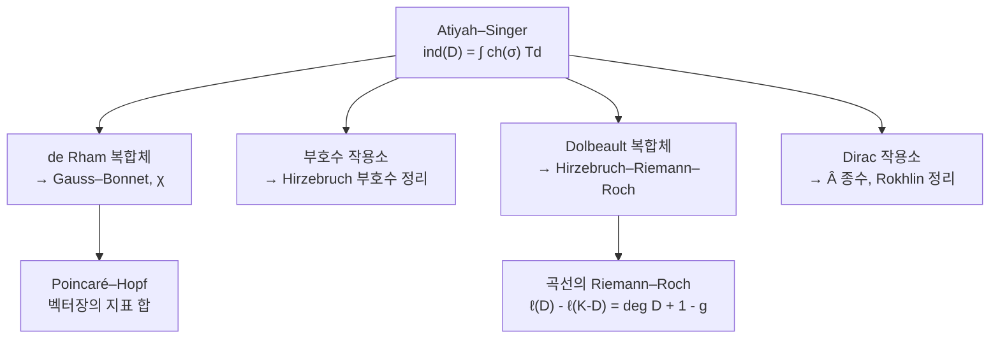

# 지표 정리

# 개요

$D$ 가 콤팩트 다양체 위의 타원 미분작용소면 해공간이 유한차원이다. 그래서 정수 하나를 정의할 수 있다.

$$
\mathrm{ind}(D)=\dim\ker D-\dim\mathrm{coker}\thinspace D
$$

**해석적 지표**라 한다. $D$ 의 계수를 연속적으로 흔들면 $\dim\ker D$ 와 $\dim\mathrm{coker}\thinspace D$ 는 각각 뛰지만, 차이는 변하지 않는다. 해석적으로 정의된 양이 변형에 둔감하다면 위상적 정보만 담고 있을 것이다.

Atiyah–Singer 지표 정리가 그 정보를 정확히 지목한다. 지표는 $D$ 의 최고차 기호가 정의하는 위상적 데이터, 곧 **위상적 지표**와 같다.

$$
\mathrm{ind}(D)=\int_M\mathrm{ch}(\sigma_D)\thinspace\mathrm{Td}(TM\otimes\mathbb C)
$$

우변에는 미분방정식이 전혀 없다. 다양체의 특성류와 기호의 $K$ 이론 류만 들어간다. 좌변은 해를 세는 일이고 우변은 위상을 재는 일인데 두 답이 같다.

특수한 경우들이 이미 큰 정리다. [Gauss–Bonnet](gauss-bonnet.md)은 de Rham 복합체에 적용한 결과이고, Riemann–Roch 는 Dolbeault 복합체에, 부호수 정리는 부호수 작용소에 적용한 결과다. [Hodge 이론](hodge-theory.md)이 "조화형식의 차원이 위상 불변량" 이라고 말한 것을, 훨씬 넓은 작용소 집단으로 확장한 것이 지표 정리다.

# 직관

## 왜 차이만 안정한가

유한차원에서 선형사상 $A\colon V\to W$ 의 지표는 $\dim V-\dim W$ 로 $A$ 와 무관하다. 계수가 변하면 핵과 여핵이 같은 만큼 함께 변하기 때문이다.

무한차원에서도 같은 일이 일어난다. $D$ 를 연속적으로 움직이면 핵에 있던 벡터가 빠져나갈 수 있는데, 그때 여핵에서도 같은 차원이 빠져나간다. 핵과 여핵이 짝을 지어 나타나고 사라지므로 차이가 보존된다.

그러니 지표는 $D$ 의 연결 성분만 보는 양이다. 타원 작용소의 공간에서 연결 성분을 결정하는 것은 최고차 기호이고, 기호는 여접다발 위의 벡터다발 사상이라 순수하게 위상적인 대상이다. 지표 정리가 성립할 여지가 여기서 생긴다.

## 가장 작은 사례에서 확인한다

$M$ 이 콤팩트 곡면이고 $D=d+d^*$ 를 짝수 차수 형식에서 홀수 차수 형식으로 가는 작용소로 보자. Hodge 이론이 핵과 여핵을 조화형식으로 동일시하므로

$$
\mathrm{ind}(D)=b_0-b_1+b_2=\chi(M)
$$

이다. 해석적 지표가 Euler 지표다. 한편 위상적 지표 쪽은 Gauss–Bonnet 의 곡률 적분이 된다.

$$
\frac1{2\pi}\int_MK\thinspace dA=\chi(M)
$$

곧 Gauss–Bonnet 은 de Rham 복합체에 대한 지표 정리다. 미분방정식의 해를 세는 일과 곡률을 적분하는 일이 같은 정수를 준다는 최초의 사례이며, 아래 코드가 이 등식을 다면체 곡면에서 직접 확인한다.

## 특수 사례들이 한 틀에 들어간다

같은 다양체 위에서 어떤 타원 복합체를 고르느냐에 따라 전혀 다른 고전 정리가 나온다. 지표 정리는 이들이 하나의 등식의 그림자임을 보인 것이다.

# 정의

## 타원 작용소

$E,F$ 가 콤팩트 다양체 $M$ 위의 벡터다발이고 $D\colon\Gamma(E)\to\Gamma(F)$ 가 $m$ 계 미분작용소라 하자. 최고차 계수만 남긴 것이 **주기호**다.

$$
\sigma_D(x,\xi)\colon E_x\to F_x,\qquad (x,\xi)\in T^*M
$$

모든 $\xi\ne0$ 에서 $\sigma_D(x,\xi)$ 가 동형이면 $D$ 를 **타원적**이라 한다. Laplace 작용소는 기호가 $-|\xi|^2$ 라 타원적이고, 파동 작용소는 $\xi$ 가 빛원뿔 위에 있을 때 퇴화해 타원적이지 않다.

타원성의 해석적 귀결이 결정적이다. 콤팩트 다양체 위에서 타원 작용소는 Fredholm 이다. 곧 핵과 여핵이 모두 유한차원이고, 따라서 지표가 정수로 잘 정의된다.

## 해석적 지표와 위상적 지표

$$
\mathrm{ind}_{\mathrm{an}}(D)=\dim\ker D-\dim\mathrm{coker}\thinspace D
$$

위상적 지표는 기호만으로 만든다. $\sigma_D$ 가 $T^*M$ 위에서 콤팩트 받침을 갖는 $K$ 이론 류 $[\sigma_D]\in K(T^*M)$ 를 정의하고, 이를 한 점의 $K$ 이론으로 밀어내려 정수를 얻는다. 특성류로 쓰면

$$
\mathrm{ind}_{\mathrm{top}}(D)=(-1)^{\dim M}\int_{T^*M}\mathrm{ch}([\sigma_D])\thinspace\mathrm{Td}(TM\otimes\mathbb C)
$$

이다. $\mathrm{ch}$ 는 Chern 지표, $\mathrm{Td}$ 는 Todd 류다.

> **Atiyah–Singer 지표 정리.** 콤팩트 다양체 위의 모든 타원 작용소에서 $\mathrm{ind}\_{\mathrm{an}}(D)=\mathrm{ind}\_{\mathrm{top}}(D)$ 다.

## 증명 전략

원래 증명은 코보디즘을 써서 일반 경우를 이미 아는 경우로 환원한다. 이후 $K$ 이론을 쓰는 증명이 나왔고, 두 지표가 모두 $K(T^*M)$ 위의 준동형이며 몇 가지 공리를 만족함을 보인 뒤 그 공리가 준동형을 유일하게 결정함을 쓴다.

세 번째 증명이 열핵 방법이다. 항등식

$$
\mathrm{ind}(D)=\mathrm{tr}\thinspace e^{-tD^*D}-\mathrm{tr}\thinspace e^{-tDD^*}
$$

이 모든 $t>0$ 에서 성립한다. 0 이 아닌 고윳값들이 양쪽에서 짝을 이뤄 상쇄되기 때문이다. 좌변이 $t$ 에 무관하므로 $t\to0$ 극한을 취할 수 있고, 열핵의 국소 전개에서 특성류 적분이 나온다. 해석적 양이 국소 기하로 환원되는 과정이 눈에 보이는 증명이며, 초대칭을 쓰는 물리학자들의 논증도 이 구조를 따른다.

# 성질

## 주요 특수 사례

| 작용소 / 복합체 | 지표 | 위상적 표현 |
|---|---|---|
| de Rham $d+d^*$ | $\chi(M)$ | Euler 류의 적분 (Gauss–Bonnet) |
| 부호수 작용소 | $\mathrm{sign}(M)$ | $L$ 종수 (Hirzebruch) |
| Dolbeault $\bar\partial+\bar\partial^*$ | $\sum(-1)^q\dim H^q(M,\mathcal O)$ | Todd 류 (Riemann–Roch) |
| Dirac 작용소 | $\mathrm{ind}\thinspace{\not}D$ | $\hat A$ 종수 |

Dirac 의 경우가 특히 날카롭다. 스핀 다양체에서 $\mathrm{ind}\thinspace{\not}D=\hat A(M)$ 인데, 좌변이 정수이므로 $\hat A$ 종수가 정수여야 한다. 이 정수성이 위상만으로는 자명하지 않고, 여기서 4 차원 스핀 다양체의 부호수가 16 으로 나누어진다는 Rokhlin 정리가 나온다.

더 나아가 양의 스칼라 곡률을 가지면 Lichnerowicz 공식에 의해 $\ker{\not}D=0$ 이므로 $\hat A(M)=0$ 이어야 한다. 곡률에 대한 기하적 가정이 위상적 장애를 만든다. 지표 정리가 해석과 위상을 잇는 다리로 쓰이는 전형이다.

## 무엇이 필요한가

정리의 가정은 생각보다 빡빡하다.

- **콤팩트성.** 콤팩트하지 않으면 핵이 무한차원일 수 있다. 경계가 있는 경우에는 경계 조건이 필요하고, 그때 나오는 것이 Atiyah–Patodi–Singer 정리다. 여기에는 국소적이지 않은 보정항 $\eta$ 불변량이 추가로 붙는다.
- **타원성.** 쌍곡형이나 포물형 작용소에는 유한차원 핵이 없다.
- **계수의 매끄러움.** 기호가 다발 사상으로 잘 정의되어야 한다.

## 확장

- **동변 지표 정리.** 콤팩트군이 작용하면 지표가 표현이 되고, 그 지표(character)에 대한 국소화 공식이 Atiyah–Bott 고정점 정리다. Lefschetz 고정점 공식이 특수한 경우다.
- **족 지표 정리.** 작용소가 매개변수 공간을 따라 움직이면 지표가 정수가 아니라 $K$ 이론 류가 된다. 게이지 이론의 변칙 계산에 쓰인다.
- **비가환 기하.** Connes 는 다양체가 아닌 공간, 예를 들어 엽층의 잎 공간에서도 지표 정리를 세웠다. 공간을 $C^*$ 대수로 대체하고 $K$ 이론을 순환 코호몰로지와 짝지운다.
- **물리.** 지표는 초대칭 양자역학의 Witten 지표이고, 장론의 변칙이 지표 정리로 계산된다. 열핵 증명이 물리의 경로적분 논증과 그대로 대응한다.

# 활용

## 왜 중요한가

같은 대상을 세는 두 가지 방법이 있을 때, 한쪽이 어렵고 다른 쪽이 쉬우면 정리가 도구가 된다.

- **해의 개수를 위상으로 센다.** 대수기하에서 선다발의 단면의 차원은 Riemann–Roch 로 계산한다. 곡선의 경우 $\ell(D)-\ell(K-D)=\deg D+1-g$ 가 되고, 종수만 알면 단면 공간의 크기를 알 수 있다.
- **위상을 해석으로 제한한다.** $\hat A$ 종수가 0 이 아니면 그 다양체에 양의 스칼라 곡률 계량이 없다. 지표가 0 이 아니라는 사실이 기하적 구조의 부재를 증명한다.
- **모듈라이 공간의 차원.** 게이지 이론에서 순간자 모듈라이 공간의 차원이 어떤 타원 복합체의 지표로 나온다. Donaldson 불변량과 Seiberg–Witten 이론의 출발점이다.

지표 정리가 20 세기 수학의 분수령으로 꼽히는 이유는 결과의 강력함만이 아니다. 해석학, 위상수학, 미분기하, 대수기하, 그리고 이론물리가 하나의 등식에서 만난다는 사실 자체가 이후 수학의 조직 방식을 바꾸었다.

# 연관 문서

## 선수지식

- [Hodge 이론과 조화형식](hodge-theory.md)
- [Fredholm 작용소와 지표](fredholm-operators.md)
- [Gauss–Bonnet 정리](gauss-bonnet.md)

## 더 알아보기

- [Riemann–Roch 정리](riemann-roch.md)

#differential_geometry #algebraic_topology #theorem
