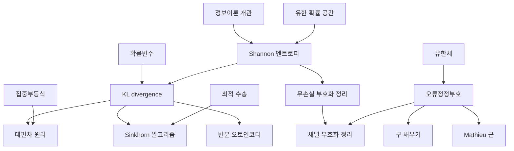

# 정보이론 개관

# 개요

정보이론은 확률분포의 불확실성을 수 하나로 재고, 그 수를 압축과 통신의 한계로 삼는다. 압축률, 통신 속도, 추정의 정확도가 모두 같은 양에 대한 부등식이 된다.

[Shannon 엔트로피](entropy.md)에서 시작한다. 엔트로피로 두 분포의 차이를 재는 [KL divergence](kl-divergence.md)(Kullback–Leibler divergence)와 두 확률변수가 공유하는 정보를 재는 상호정보량을 정의한다. 이 세 양이 Shannon 의 두 정리의 양변을 이룬다. [무손실 부호화 정리](source-coding.md)에서 압축의 하한이 엔트로피이고, [채널 부호화 정리](channel-coding.md)에서 잡음 있는 통신로의 상한이 상호정보량의 최댓값이다.

두 정리는 부호의 존재만 주장한다. 실제 부호는 [오류정정부호](error-correcting-codes.md)가 [유한체](finite-fields.md) 위의 선형대수로 구성하고, 그 조합 구조가 [Mathieu 군과 Golay 부호](mathieu-groups.md), [구 채우기](sphere-packing.md)로 이어진다.

KL divergence 는 통신 밖에서도 쓰인다. [대편차 원리](large-deviations.md)의 속도함수, [지수족](exponential-families.md)의 쌍대 좌표, [Sinkhorn 알고리즘](sinkhorn.md)의 정규화항, [변분 오토인코더](variational-autoencoder.md)의 손실 항이 모두 KL divergence 다.

# 지도

# 갈래

## 정보량

- [확률변수](random-variables.md) — 정보량은 확률변수의 함수를 평균한 값이다
- [Shannon 엔트로피](entropy.md) — 연속성, 단조성, 가법성을 요구하면 $-\sum p\log p$ 가 상수배를 빼고 유일하다
- [KL divergence](kl-divergence.md) — 두 분포의 차이와 두 변수가 공유하는 정보. 비음수성에서 정보이론의 부등식들이 나온다

## Shannon 의 두 정리

- [무손실 부호화 정리](source-coding.md) — 평균 부호 길이의 하한이 엔트로피이고 그 하한에 임의로 가까이 갈 수 있다
- [채널 부호화 정리](channel-coding.md) — 부호율이 채널 용량보다 작으면 오류 확률을 0 으로 보내는 부호가 있고, 크면 어떤 부호로도 보낼 수 없다

## 부호의 구성

- [오류정정부호](error-correcting-codes.md) — 유한체 위의 선형부호. 최소거리가 검출과 정정의 능력을 정한다
- [Mathieu 군과 Golay 부호](mathieu-groups.md) — 이진 Golay 부호의 자기동형군이 산재 단순군이다
- [구 채우기](sphere-packing.md) — 부호를 격자로 올리면 채우기 밀도 문제가 된다

## 확률과 통계

- [대편차 원리](large-deviations.md) — 표본평균이 기댓값에서 벗어날 확률의 지수 감소율이 KL divergence 다
- [지수족](exponential-families.md) — 로그분배함수의 Legendre 변환이 KL divergence 를 준다

## 최적화와 학습

- [Sinkhorn 알고리즘과 엔트로피 정규화](sinkhorn.md) — 최적 수송 문제에 엔트로피 항을 더하면 행렬 스케일링 반복으로 풀린다
- [변분 오토인코더](variational-autoencoder.md) — 사후분포 근사의 손실에 KL divergence 항이 들어간다
- [Lovász 세타 함수](lovasz-theta.md) — 그래프의 Shannon 용량을 반정부호 계획법으로 위에서 잡는다

# 연관 문서

## 선수지식

- [집합](sets.md)

## 더 알아보기

- [Shannon 엔트로피](entropy.md)

#information_theory #probability #computation #overview
