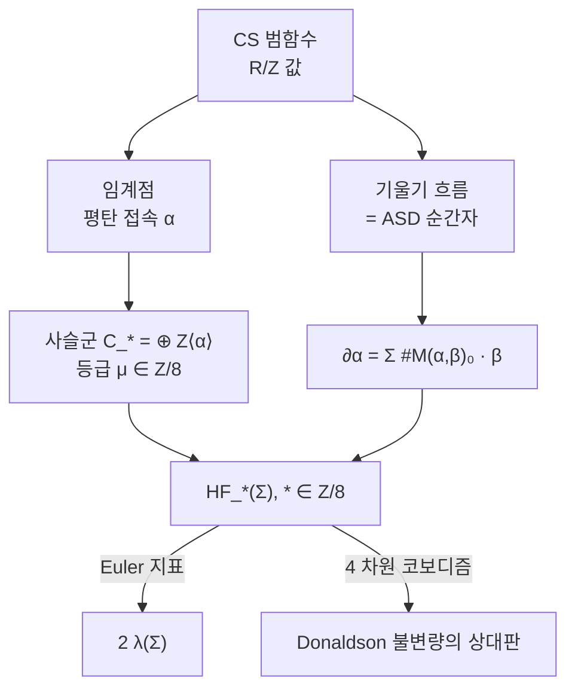

# 순간자 Floer 호몰로지

# 개요

[Casson 불변량](casson-invariant.md)은 호몰로지 3 구 $\Sigma$ 위의 기약 $SU(2)$ 평탄 접속을 부호와 함께 센 **정수 하나**다. 세는 대상이 유한집합이고 각 원소에 $\pm1$ 이 붙으니, 이것은 어떤 사슬복체의 Euler 지표처럼 생겼다.

$$
\lambda(\Sigma)=\sum_{\alpha\in R^*(\Sigma)}\pm1
$$

Euler 지표처럼 생긴 수를 보면 그것을 Euler 지표로 갖는 사슬복체를 찾고 싶어진다. Floer 가 만든 것이 그 복체다. 생성원은 평탄 접속이고, 미분은 두 평탄 접속을 잇는 **순간자**(반자기쌍대 접속)의 개수다.

$$
\chi\big(HF_*(\Sigma)\big)=2\,\lambda(\Sigma)
$$

수 하나가 등급이 붙은 아벨군들의 열로 올라간다. 이런 승격을 **범주화**라 하고, 얻는 것은 두 가지다. 첫째, 정보가 늘어난다. Euler 지표가 같아도 호몰로지가 다를 수 있다. 둘째, 함자성이 생긴다. 4 차원 코보디즘이 군 사이의 준동형을 유도하고, 그래서 3 차원 불변량과 4 차원 Donaldson 이론이 한 틀에서 만난다.

특이한 점은 등급이 $\mathbb Z$ 가 아니라 $\mathbb Z/8$ 이라는 것이다. 이 유한 등급은 계산의 편의가 아니라 [Chern–Simons](chern-simons.md) 범함수가 원 위의 값을 갖는다는 사실의 직접적인 결과다.

# 직관

## 무한차원 Morse 이론

유한차원에서 Morse 호몰로지는 이렇게 만든다. 함수 $f$ 의 임계점을 생성원으로 놓고, 지표 차이가 1 인 두 임계점을 잇는 기울기 흐름선을 세어 미분을 정의한다. 호몰로지는 $f$ 에 의존하지 않고 공간만 본다.

Floer 는 이 절차를 무한차원 공간에 적용했다. 무대는 $\Sigma$ 위 $SU(2)$ 접속들의 공간을 게이지군으로 나눈 것이고, 함수는 Chern–Simons 범함수다.

$$
\mathrm{CS}(A)=\frac1{8\pi^2}\int_\Sigma\operatorname{tr}\Big(A\wedge dA+\tfrac23A\wedge A\wedge A\Big)
$$

두 가지가 곧바로 맞아떨어진다.

- **임계점이 평탄 접속이다.** $\delta\mathrm{CS}=0$ 이 $F_A=0$ 과 같다. 곧 Casson 불변량이 세던 바로 그 대상이다.
- **기울기 흐름선이 순간자다.** $\mathbb R\times\Sigma$ 위에서 기울기 흐름 방정식을 풀어 쓰면 4 차원의 반자기쌍대 방정식 $F^+=0$ 이 된다. 3 차원의 흐름이 4 차원의 게이지장이 되는 것이다.

| 유한차원 Morse | 순간자 Floer |
|---|---|
| 다양체 $M$ | 접속공간 $\mathcal A/\mathcal G$ |
| 함수 $f$ | Chern–Simons 범함수 |
| 임계점 | 평탄 접속 = $\pi_1\Sigma\to SU(2)$ 표현 |
| 기울기 흐름선 | $\mathbb R\times\Sigma$ 위의 순간자 |
| Morse 지표 | 스펙트럼 흐름 (mod 8) |
| $\chi=$ Euler 지표 | $\chi=2\lambda(\Sigma)$ |

## 왜 등급이 $\mathbb Z/8$ 인가

Chern–Simons 범함수는 함수가 아니다. 게이지 변환 $g$ 를 하면

$$
\mathrm{CS}(g\cdot A)=\mathrm{CS}(A)+\deg g,\qquad \deg g\in\mathbb Z
$$

로 값이 옮겨간다. 곧 $\mathcal A/\mathcal G$ 위에서 잘 정의되는 것은 $\mathbb R/\mathbb Z$ 값 함수뿐이다. **원 위의 값을 갖는 Morse 이론**이 되는 것이다.

원 값 함수에서는 절대적인 "높이"가 없으므로 절대 지표도 없다. 남는 것은 두 임계점 사이의 상대 지표이고, 그것도 흐름선을 어떻게 잡느냐에 따라 달라진다. 달라지는 폭이 얼마인지가 문제인데, 감음수 1 짜리 게이지 변환을 걸면 관련된 미분작용소의 지표가 정확히 8 만큼 바뀐다. $SU(2)$ 수반 다발에 대한 반자기쌍대 연산자의 지표가 순간자 수 $k$ 에 대해 $8k-3(1+b^+)$ 꼴인 그 8 이다.

$$
\mu(\alpha,\beta)\in\mathbb Z/8
$$

그래서 Floer 군은 $HF_0,\dots,HF_7$ 여덟 개로 끝난다. 뒤집어 말하면 **양자화된 이론의 흔적**이다. Chern–Simons 레벨의 정수성과 같은 $\pi_3(SU(2))=\mathbb Z$ 에서 나온 숫자다.

# 정의

## 사슬복체

$\Sigma$ 를 정수 호몰로지 3 구라 하자. $H_1(\Sigma)=0$ 이므로 아벨 표현이 자명한 것뿐이고, 기약 표현들이 깨끗하게 분리된다.

> **생성원.** $R^*(\Sigma)=\{\rho:\pi_1\Sigma\to SU(2)\ \text{기약}\}/\text{켤레}$ 의 원소들. 모두 비퇴화(평탄 접속의 변형이 자명)라고 가정하고, 아니면 홀로노미 섭동으로 비퇴화하게 만든다.

> **등급.** $\alpha,\beta$ 사이의 상대 등급 $\mu(\alpha,\beta)\in\mathbb Z/8$ 은 그 둘을 잇는 경로를 따라가는 자기수반 연산자족의 **스펙트럼 흐름**, 곧 고윳값이 0 을 지나며 부호를 바꾸는 횟수의 합이다.

> **미분.** $\mathcal M(\alpha,\beta)$ 를 $\mathbb R\times\Sigma$ 위에서 양끝이 $\alpha,\beta$ 로 수렴하는 순간자들의 모듈라이라 하자. $\mu(\alpha,\beta)=1$ 일 때 평행이동으로 나눈 $\mathcal M(\alpha,\beta)$ 는 0 차원 콤팩트이고,
> $$
> \partial\alpha=\sum_{\mu(\alpha,\beta)=1}\#\mathcal M(\alpha,\beta)\;\beta
> $$
> 로 둔다. 개수는 방향을 준 부호 합이다.

$\partial^2=0$ 은 $\mu=2$ 인 1 차원 모듈라이의 끝을 세어서 나온다. 그 끝이 정확히 "두 번 꺾인 흐름선"들이고, 1 차원 콤팩트 다양체의 경계 개수가 짝수이므로 합이 0 이 된다. 유한차원 Morse 이론의 논법을 그대로 옮긴 것이지만, 모듈라이의 콤팩트성을 확보하는 부분(기포 현상 처리)이 해석학적으로 어렵다.

> **정의.** $HF_*(\Sigma)=H_*(C_*,\partial)$ 를 $\Sigma$ 의 **순간자 Floer 호몰로지**라 한다. $*\in\mathbb Z/8$ 이고, 섭동과 계량의 선택에 의존하지 않는다.

# 성질

## Euler 지표가 Casson 불변량이다

> **정리 (Taubes 1990).** $\displaystyle\chi\big(HF_*(\Sigma)\big)=\sum_{i\in\mathbb Z/8}(-1)^i\operatorname{rank}HF_i(\Sigma)=2\,\lambda(\Sigma)$

$\mathbb Z/8$ 등급에서 $(-1)^i$ 가 잘 정의되는 것은 8 이 짝수이기 때문이다. 우변의 2 는 Casson 불변량의 관례적 정규화에서 온다.

이 등식이 범주화가 제대로 되었다는 확인서다. 호몰로지를 만들 때 쓴 부호, 방향, 섭동이 전부 Casson 이 원래 세던 부호와 맞아떨어진다.

가장 익숙한 예가 Poincaré 구면 $\Sigma(2,3,5)$ 다. 기본군이 위수 120 의 이진 정이십면체군이고, 그 안의 기약 2 차원 표현이 정확히 둘이다. 그러므로 사슬군이 $\mathbb Z^2$ 이고 등급 차이가 홀수라 미분이 0 이 될 수밖에 없어

$$
HF_i\big(\Sigma(2,3,5)\big)=\begin{cases}\mathbb Z,& i=1,5\\0&\text{그 밖}\end{cases}
\qquad\chi=-2=2\cdot(-1)
$$

가 된다. $\lambda(\Sigma(2,3,5))=-1$ 과 맞는다.

## 함자성과 4 차원

Floer 군의 진짜 값어치는 다음 성질에 있다.

> **함자성.** 호몰로지 3 구 $\Sigma_0,\Sigma_1$ 사이의 4 차원 코보디즘 $W$ 는 준동형 $\Phi_W:HF_*(\Sigma_0)\to HF_{*+d}(\Sigma_1)$ 을 유도하고, 코보디즘을 이어 붙이면 준동형이 합성된다.

경계가 있는 4 다양체의 Donaldson 불변량은 수가 아니라 경계의 Floer 군 안의 **원소**가 된다. 4 다양체를 둘로 잘랐을 때 각 조각이 주는 원소의 쌍을 짝지으면 전체의 불변량이 나온다. 이 자르고 붙이기가 3 차원과 4 차원을 잇는 다리이고, 위상장론의 공리에서 요구하는 구조 그대로다.

## 수술 완전 삼각형

매듭 $K\subset\Sigma$ 를 따라 기울기를 바꿔 가며 수술하면 세 다양체가 나오고, 그들의 Floer 군이 긴 완전열을 이룬다.

$$
\cdots\to HF_*(\Sigma_0)\to HF_*(\Sigma_1)\to HF_*(\Sigma_\infty)\to HF_{*-1}(\Sigma_0)\to\cdots
$$

수술로 다양체를 만들고 완전열로 불변량을 따라가는 이 방식이 이후 모든 Floer 이론의 표준 도구가 되었다. Heegaard Floer, 매듭 Floer, [Khovanov 호몰로지](khovanov-homology.md)의 사각형 완전열이 모두 같은 형태를 갖는다.

## 무엇을 새로 알려 주었나

Casson 불변량이 0 이라고 해서 Floer 군이 0 인 것은 아니다. 이 차이가 실제 정리를 낳는다.

| 사실 | 따라 나오는 것 |
|---|---|
| $HF_*(\Sigma)\ne0$ | $\Sigma$ 는 $S^3$ 와 호몰로지 코보디즘이 아니다 |
| 무한히 많은 $\Sigma$ 에서 $HF$ 가 서로 다름 | 호몰로지 코보디즘 군 $\Theta^3_{\mathbb Z}$ 가 무한 생성 |
| 코보디즘 사상이 자명하지 않음 | 4 다양체의 교차형식에 제약 |

Fintushel–Stern 이 Brieskorn 구면들의 Floer 군을 계산해 $\Theta^3_{\mathbb Z}$ 가 $\mathbb Z^\infty$ 를 부분군으로 가짐을 보인 것이 대표적이다. Casson 불변량 하나로는 얻을 수 없던 결론이다.

# 활용

## Brieskorn 구면에서 생성원 세기

$\Sigma(p,q,r)$ 형 호몰로지 구에서는 생성원 목록을 표현론으로 직접 쓸 수 있다. 기본군이

$$
\pi_1\Sigma(p,q,r)=\langle x,y,z\mid x^p=y^q=z^r=xyz\rangle
$$

이고, $SU(2)$ 기약 표현에서 중심원소 $c=x^p$ 는 $\pm1$ 로 간다. $\Sigma(2,3,5)$ 에서 $c=-1$ 인 경우를 보면 각 생성원의 자취가 고정된다.

| 원소 | 관계 | 고윳값 | 자취 |
|---|---|---|---|
| $x$ | $x^2=-1$ | $\pm i$ | $0$ |
| $y$ | $y^3=-1$ | $e^{\pm i\pi/3}$ | $1$ |
| $z$ | $z^5=-1$ | $e^{\pm i\pi k/5}$ 에서 $k=1,3$ | $2\cos(\pi k/5)$ |

$k=5$ 는 $z=-1$ 이 되어 표현이 가약이므로 제외한다. 남은 $k=1,3$ 각각에 대해 $xyz=-1$ 조건이 세 회전축의 상대 각도를 결정하고, 구면 삼각부등식을 만족하는 배치가 켤레를 빼고 하나씩 존재한다. 그래서 생성원이 둘이다.

$c=+1$ 인 경우는 표현이 $\pi_1$ 의 몫인 정이십면체군을 지나야 하는데, 그 군의 2 차원 기약표현이 없으므로 새 생성원이 없다.

## 계산이 어려운 이유와 우회로

정의는 이렇게 명확한데 계산은 어렵다. 미분을 구하려면 4 차원 편미분방정식의 해를 세어야 하고, 모듈라이의 콤팩트성과 방향을 매번 확인해야 한다. Poincaré 구면처럼 등급 이유로 미분이 강제로 0 이 되는 경우가 아니면 손으로 하기 힘들다.

이 어려움이 두 갈래 발전을 낳았다.

- **더 계산하기 쉬운 이론.** Heegaard Floer 호몰로지는 순간자 대신 대칭곱 안의 정칙 원판을 세고, 조합적 계산법까지 있다. 예상되던 순간자 판본과의 동치가 최근 확립되었다.
- **더 많은 것을 담는 이론.** 기약 접속만 세면 정보가 새므로, 자명한 접속까지 포함한 판본(equivariant, Frøyshov 불변량)이 만들어졌다. Kronheimer–Mrowka 가 이 틀에서 매듭의 순간자 호몰로지를 정의하고, Khovanov 호몰로지가 매듭이 자명한지를 언제나 판별한다는 정리를 얻었다.

두 방향 모두 출발점은 같다. **불변량인 수를 복체로 올리면 함자성이 생기고, 함자성이 있으면 잘라 붙일 수 있다.**

# 연관 문서

## 선수지식

- [Casson 불변량](casson-invariant.md)

## 더 알아보기

아직 연결한 문서가 없다.

#algebraic_topology #topology #differential_geometry
