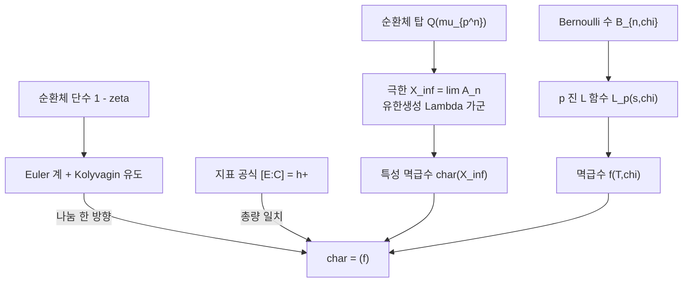

# Iwasawa 주추측과 순환체 단수

# 개요

순환체 `\mathbb Q(\mu_{p^n})` 의 류수 `h_n` 을 하나씩 계산하면 규칙이 보이지 않는다. Iwasawa 의 착상은 **한 층을 보지 말고 탑 전체를 보라**는 것이었다. 층을 무한히 쌓은 `\mathbb Q(\mu_{p^\infty})` 를 놓고 각 층의 류군을 사영극한으로 모으면, 그 극한이 `\Lambda=\mathbb Z_p[[T]]` 위의 유한생성 가군이 된다. `\Lambda` 는 구조정리가 있는 아주 순한 환이라서, 극한 가군은 유사동형을 무시하면 **멱급수 하나**로 요약된다. 이것이 특성 멱급수다.

그 순간 `h_n` 의 불규칙함이 사라진다. 충분히 큰 `n` 에서

$$
\mathrm{ord}_p(h_n)=\mu\,p^{n}+\lambda\,n+\nu
$$

가 성립한다. 세 상수는 특성 멱급수에서 읽는다.

한편 [Dirichlet `L` 함수](dirichlet-l-functions.md)의 특수값을 `p` 진적으로 보간해 얻는 Kubota–Leopoldt `p` 진 `L` 함수 `L_p(s,\chi)` 도 같은 `\Lambda` 안의 원소로 실현된다. 두 대상은 출신이 완전히 다르다. 하나는 이데알류군의 극한이고 다른 하나는 Bernoulli 수의 보간이다.

> **Iwasawa 주추측.** 두 원소가 생성하는 `\Lambda` 의 아이디얼은 같다.

유수 공식이 "류수 × 조절자 = `L` 함수의 값" 이라는 한 층의 등식이라면, 주추측은 그것의 **탑 판본**이다. Mazur 와 Wiles 가 모듈러 곡선의 Eisenstein 합동으로 먼저 증명했고, Rubin 이 [Euler 계](euler-systems.md)로 훨씬 짧은 두 번째 증명을 주었다. 후자가 이 문서의 중심이다.

# 직관

## 탑에서 보면 선형이 된다

`\mathbb Q(\mu_{p^{n+1}})` 의 류수는 앞 층의 류수로 나뉘지만, 몫이 어떻게 커지는지는 한 층만 봐서는 알 수 없다. 탑을 통째로 보면 사정이 다르다.

`\Gamma=\mathrm{Gal}(\mathbb Q(\mu_{p^\infty})/\mathbb Q(\mu_p))\cong\mathbb Z_p` 이고, 각 층의 류군 `A_n` 의 `p` 부분이 `\Gamma` 작용을 가지므로 극한 `X_\infty=\varprojlim A_n` 은 `\mathbb Z_p[[\Gamma]]` 가군이다. `\Gamma` 의 위상생성원 `\gamma` 를 잡고 `T=\gamma-1` 로 두면

$$
\mathbb Z_p[[\Gamma]]\;\cong\;\Lambda=\mathbb Z_p[[T]]
$$

이다. `\Lambda` 는 2 차원 정칙 국소환이고, 유한생성 가군이 유사동형을 무시하면 순환 조각의 직합으로 분해된다. **불규칙해 보이던 수열이 한 가군의 그림자였다**는 것이 Iwasawa 이론의 출발점이다.

## 층을 잘라내는 연산자

`n` 번째 층은 극한에서 `\omega_n=(1+T)^{p^{n}}-1` 로 나눈 몫으로 되돌아온다. 그러므로 `X=\Lambda/(f)` 라면

$$
\#\big(X/\omega_nX\big)=\#\big(\Lambda/(f,\omega_n)\big)=p^{\,v_p(\mathrm{Res}(f,\omega_n))}
$$

이고, 이 종결식의 `p` 부치를 직접 계산해 보면 `n` 에 대해 정확히 선형이 된다. Weierstrass 준비정리로 `f` 를 `p^{\mu}` 곱하기 차수 `\lambda` 의 구별다항식으로 쓸 수 있고, 구별다항식의 근들이 `p` 진 절댓값이 1 보다 작으므로 `\omega_n` 을 그 근에서 평가한 값의 부치가 `n` 에 선형으로 자란다. 여기서 `\lambda` 는 근의 개수, `\mu` 는 `p` 의 거듭제곱 몫이다.

```python
# ord_p # Lambda/(f, omega_n) 이 큰 n 에서 lambda*n + nu 임을 직접 확인한다
p = 3

def mul(a, b, f):                                  # Z[T]/(f), f 는 모닉
    d, r = len(f) - 1, [0] * (len(a) + len(b) - 1)
    for i, x in enumerate(a):
        for j, y in enumerate(b):
            r[i + j] += x * y
    while len(r) > d:
        c = r.pop()
        for k in range(d):
            r[len(r) - d + k] -= c * f[k]
    return r + [0] * (d - len(r))

def power(a, e, f):
    r = [1] + [0] * (len(f) - 2)
    while e:
        if e & 1: r = mul(r, a, f)
        a, e = mul(a, a, f), e >> 1
    return r

def norm(a, f):                                    # Z[T]/(f) 위 곱셈사상의 행렬식
    d, T = len(f) - 1, ([0, 1] + [0] * (len(f) - 3) if len(f) > 2 else [-f[0]])
    cols, e = [], [1] + [0] * (d - 1)
    for _ in range(d):
        cols.append(mul(a, e, f)); e = mul(e, T, f)
    def det(m):
        if len(m) == 1: return m[0][0]
        return sum((-1) ** j * m[0][j] * det([r[:j] + r[j + 1:] for r in m[1:]])
                   for j in range(len(m)))
    return det([[cols[j][i] for j in range(d)] for i in range(d)])

def order(f, n):                                   # ord_p # Lambda/(f, omega_n)
    w = power([1, 1] + [0] * (len(f) - 3) if len(f) > 2 else [1 - f[0]], p ** n, f)
    w[0] -= 1
    x, v = norm(w, f), 0
    while x % p == 0:
        x //= p; v += 1
    return v

for f, name in ([[3, 1], "T + 3"], [[3, 0, 1], "T^2 + 3"], [[6, 3, 1], "T^2 + 3T + 6"]):
    print(f"{name:14s}", [order(f, n) for n in range(6)])

# T + 3          [1, 2, 3, 4, 5, 6]        lambda = 1, nu = 1
# T^2 + 3        [1, 4, 6, 8, 10, 12]      lambda = 2, nu = 2  (n >= 1 부터)
# T^2 + 3T + 6   [1, 3, 5, 7, 9, 11]       lambda = 2, nu = 1  (n >= 1 부터)
```

`n=0` 항이 공식에서 벗어나는 것도 보인다. 정리가 "충분히 큰 `n`" 을 요구하는 이유가 이 어긋남이다. `X=\Lambda/(p^{m})` 로 두면 `\#(X/\omega_nX)=p^{m\,p^{n}}` 이 되어 `\mu` 항이 나타난다.

## 두 개의 멱급수

이제 `\Lambda` 안에 서로 다른 출신의 원소가 두 개 놓인다.

| 출신 | 대상 | 무엇을 재는가 |
|---|---|---|
| 대수 | `\mathrm{char}_\Lambda X_\infty^{(\chi)}` | 각 층의 이데알류군 `\chi` 성분의 크기 |
| 해석 | `L_p(s,\chi)` 에 대응하는 `f(T,\chi)` | Bernoulli 수 `B_{n,\chi}` 의 `p` 진 보간 |

둘 다 "모든 층에서 같은 유한량을 보간" 한다. 한 층에서는 해석적 유수 공식이 그 일치를 보장하는데, 유수 공식은 크기의 **곱**만 말하고 `\Lambda` 가군으로서의 세부는 말하지 않는다. 주추측은 세부까지 같다는 주장이다.

## Euler 계가 여기서 하는 일

Rubin 의 증명은 한 방향의 나눔을 [Euler 계](euler-systems.md)로 얻는다. 순환체의 단수

$$
c_n=1-\zeta_{p^{n}},\qquad
\mathrm{N}_{\mathbb Q(\mu_{p^{n+1}})/\mathbb Q(\mu_{p^{n}})}\big(1-\zeta_{p^{n+1}}\big)=1-\zeta_{p^{n}}
$$

는 탑 위에 이미 놓여 있는 대수적 원소이고, 도체를 곱해 가며 자취 관계를 보면 Euler 인자 `1-\mathrm{Fr}_\ell^{-1}` 이 나타난다. 곧 `T=\mathbb Z_p(1)` 에 대한 Euler 계다. Kolyvagin 유도를 씌우면 이데알류군을 위에서 누르는 부등식이 나오고, 그 부등식이 `\mathrm{char}\,X_\infty` 가 `f(T,\chi)` 로 나뉜다는 진술이 된다.

반대 방향은 세는 방식만 바꾸면 공짜다. 순환체 단수의 지표가 류수와 같다는 고전적 사실

$$
\big[\,E:\,C\,\big]=h^{+}
$$

이 전체 크기를 고정해 주므로, 한쪽 나눔에 크기 일치를 더하면 등호가 나온다. **Euler 계는 상한을 주고 유수 공식은 총량을 주며, 둘이 만나 등식이 된다.** 이 구도는 뒤에 타원곡선 주추측에서도 그대로 반복된다.



# 정의

## 순환 `\mathbb Z_p` 확대와 Iwasawa 대수

`\mathbb Q(\mu_{p^\infty})/\mathbb Q` 의 Galois 군은 `\Delta\times\Gamma` 로 쪼개진다. `\Delta\cong(\mathbb Z/p)^{\times}` 는 위수 `p-1` 의 유한군, `\Gamma\cong\mathbb Z_p` 다. `\Gamma` 의 고정체 탑 `\mathbb Q_n` 이 순환 `\mathbb Z_p` 확대다.

$$
\Lambda=\mathbb Z_p[[\Gamma]]=\varprojlim_n\mathbb Z_p[\Gamma/\Gamma^{p^{n}}]\ \cong\ \mathbb Z_p[[T]],\qquad T=\gamma-1
$$

동형은 Serre 의 정리이며, 이후 모든 계산이 이 멱급수환 안에서 이루어진다.

## 구조정리와 특성 아이디얼

**정리.** 유한생성 `\Lambda` 가군 `X` 에 대해 유한 핵과 여핵을 갖는 사상

$$
X\ \longrightarrow\ \Lambda^{r}\oplus\bigoplus_{i}\Lambda/(p^{m_i})\oplus\bigoplus_{j}\Lambda/(f_j^{n_j})
$$

가 존재한다. `f_j` 는 구별다항식(모닉이고 최고차 외의 계수가 `p` 로 나뉨)이다. `X` 가 비틀림이면 `r=0` 이고

$$
\mathrm{char}_\Lambda(X)=\Big(p^{\sum_i m_i}\prod_j f_j^{n_j}\Big),\qquad
\mu=\sum_i m_i,\quad \lambda=\sum_j n_j\deg f_j
$$

로 둔다. 이 아이디얼이 `X` 의 유사동형류를 거의 결정한다.

## Iwasawa 의 성장 공식

**정리.** `A_n` 을 `\mathbb Q_n` 의 이데알류군의 `p` 부분이라 하면, 충분히 큰 `n` 에서

$$
\mathrm{ord}_p\#A_n=\mu\,p^{n}+\lambda\,n+\nu
$$

이다. `\mu,\lambda` 는 `X_\infty=\varprojlim A_n` 의 불변량이고 `\nu` 는 상수다.

**Ferrero–Washington 정리.** 아벨 수체의 순환 `\mathbb Z_p` 확대에서는 `\mu=0` 이다. 그러므로 순환체의 경우 성장은 순수하게 `\lambda n+\nu` 다.

## Kubota–Leopoldt `p` 진 `L` 함수

`\chi` 를 도체가 `p` 의 거듭제곱인 지표라 하자. 다음 보간 성질로 유일하게 결정되는 `p` 진 해석함수 `L_p(s,\chi)` 가 존재한다.

$$
L_p(1-n,\chi)=-\big(1-\chi\omega^{-n}(p)\,p^{\,n-1}\big)\frac{B_{n,\chi\omega^{-n}}}{n},\qquad n\ge1
$$

`\omega` 는 Teichmüller 지표다. Mazur 는 이 함수를 `\Gamma` 위의 `p` 진 측도로 실현했고, 측도는 `\Lambda` 의 원소와 같은 것이므로 `L_p(s,\chi)` 에 대응하는 멱급수 `f(T,\chi)\in\Lambda` 가 얻어진다.

## 주추측의 진술

`\chi` 를 `\Delta` 의 홀수 지표라 하고 `X_\infty^{(\chi)}` 를 `\chi` 고유성분이라 하자.

$$
\mathrm{char}_\Lambda\big(X_\infty^{(\chi)}\big)=\big(f(T,\chi^{-1}\omega)\big)
$$

짝수 지표 쪽은 단수 가군과 순환체 단수의 몫으로 같은 진술을 쓴다. 양변 모두 `\Lambda` 의 아이디얼이고, 등식은 "크기" 가 아니라 "가군 구조" 수준의 일치를 주장한다.

# 성질

## Herbrand–Ribet 은 첫 층 판본이다

주추측을 `T=0` 에서 읽으면 고전적 정리가 나온다.

**정리(Herbrand–Ribet).** `p` 가 홀소수, `k` 가 짝수, `2\le k\le p-3` 일 때

$$
p\mid B_k\quad\Longleftrightarrow\quad A^{(\omega^{1-k})}\ne0
$$

Herbrand 가 `\Leftarrow` 를, Ribet 이 `\Rightarrow` 를 증명했다. Herbrand 쪽은 Stickelberger 원소가 류군을 소멸시킨다는 사실에서 바로 나오는 쉬운 방향이고, Ribet 쪽은 Eisenstein 급수와 첨점형식의 합동에서 비자명한 불분해 확대를 만들어 류군의 원소를 **생산**해야 한다. 어려운 방향이 언제나 "군이 크다" 쪽이라는 점이 이 이론의 일관된 특징이다.

Mazur–Wiles 는 Ribet 의 방법을 탑 전체로 밀어 올린 것이고, Rubin 은 반대 방향(군이 작다)을 Euler 계로 잡아 남은 절반을 채운 것이다.

## 순환체 단수와 지표 공식

`E` 를 `\mathbb Q(\mu_{p^{n}})^{+}` 의 단수군, `C\subset E` 를 순환체 단수가 생성하는 부분군이라 하자.

$$
\big[\,E:C\,\big]=h^{+}
$$

가 성립한다(Kummer, Sinnott). 이 공식이 Euler 계 증명에서 **총량을 고정하는 역할**을 한다. Euler 계는 "류군이 `L_p` 가 허용하는 것보다 크지 않다" 를 주고, 지표 공식은 두 변의 전체 크기가 같음을 보장하므로, 각 `\chi` 성분에서도 등호가 된다.

`\big(1-\zeta\big)` 들이 실제로 단수는 아니다. `1-\zeta_{p^{n}}` 은 `p` 위의 소원소이고, 단수가 되는 것은 그 비 `\frac{1-\zeta^{a}}{1-\zeta}` 다. Euler 계로 쓰는 것도 이 비들이다.

## Rubin 증명의 뼈대

1. **Euler 계의 확보.** `c_n=\frac{1-\zeta_{n}^{a}}{1-\zeta_n}` 들이 `H^1(\mathbb Q(\mu_n),\mathbb Z_p(1))` 안에서 자취 관계 `\mathrm{cor}(c_{n\ell})=(1-\mathrm{Fr}_\ell^{-1})c_n` 을 만족한다. Kummer 이론으로 단수군이 곧 `H^1(\cdot,\mathbb Z_p(1))` 이므로 대수적 원소가 그대로 코호몰로지 류다.
2. **유도.** Kolyvagin 유도 연산자로 `\kappa_n` 을 만든다. 각 `\kappa_n` 은 `n` 밖에서만 국소 조건을 만족한다.
3. **상호법칙.** [Poitou–Tate](poitou-tate.md) 의 대역 상호법칙으로 이데알류군의 원소를 하나씩 죽인다. `\ell` 을 Chebotarev 로 고르는 자유가 여기서 쓰인다.
4. **결론.** `\#X_\infty^{(\chi)}` 가 `L_p` 쪽이 허용하는 크기 이하임을 얻어 한쪽 나눔이 나온다.
5. **등호.** 해석적 유수 공식과 지표 공식으로 총량이 같음을 확인하고 등호로 올린다.

`\Lambda` 가 2 차원 정칙 국소환이라 "각 높이 1 소아이디얼에서 나눔을 확인하면 전체 나눔" 이라는 간단한 논리가 4 단계를 정리해 준다.

## 무엇이 아직 열려 있는가

| 진술 | 상태 |
|---|---|
| 순환체 주추측 (`\mathbb Q` 위) | 증명됨 (Mazur–Wiles, Rubin) |
| 허수이차체 위 주추측 | 증명됨 (Rubin, 타원 단수) |
| `\mu=0` (아벨 기저) | 증명됨 (Ferrero–Washington) |
| 일반 총실체에서 `\mu=0` | 열림 |
| Vandiver 추측 `p\nmid h^{+}` | 열림 (대규모 수치 검증만) |
| 총실체 위 주추측 | 거의 증명됨 (Wiles), `p=2` 등 예외 |

Vandiver 추측은 주추측에서 따라 나오지 않는다. 주추측은 홀수 성분을 완전히 기술하지만 짝수 성분이 0 인지는 말하지 않기 때문이다. 이 비대칭이 순환체 산술의 남은 미지 영역이다.

# 활용

## 정칙소수와 Fermat

`p` 가 `h` 를 나누지 않는 정칙소수일 조건이 `p\nmid B_2B_4\cdots B_{p-3}` 와 동치라는 Kummer 의 기준이 Herbrand–Ribet 의 특수한 경우다. Kummer 는 이 조건 아래 Fermat 방정식의 첫째 경우를 해결했고, 주추측은 그 기준이 왜 `L` 함수의 언어로 쓰이는지를 설명한다. `p` 가 `B_k` 를 나누는 방식과 류군이 커지는 방식이 같은 멱급수에 기록되어 있다.

## 타원곡선의 주추측과 BSD

같은 도식이 [타원곡선](elliptic-curves.md)에 옮겨진다. `E` 의 Selmer 군을 순환 `\mathbb Z_p` 탑 위에서 모아 `\Lambda` 가군을 만들고, 그 특성 아이디얼이 Mazur–Swinnerton-Dyer 의 `p` 진 `L` 함수와 같다는 것이 타원곡선 주추측이다. Kato 의 Euler 계가 한쪽 나눔을, Skinner–Urban 이 Eisenstein 합동으로 반대쪽을 주었다. 이 정리에서 `p` 진 [BSD](birch-swinnerton-dyer.md) 와, 조건부로 고전적 BSD 의 일부가 따라 나온다. 순환체에서 본 "Euler 계가 상한, 합동이 하한" 의 구도가 그대로 반복된다.

## `p` 진 `L` 함수의 계산

주추측은 계산 도구이기도 하다. 류군을 직접 계산하기 어려운 층에서도 `L_p` 의 `\lambda` 불변량을 Bernoulli 수로 계산해 류군의 성장을 예측할 수 있고, 반대로 작은 층의 류군에서 `L_p` 의 영점 위치를 읽을 수 있다. Iwasawa 불변량 표가 수백만까지의 소수에 대해 이 방식으로 작성되어 있다.

## Stark 계열 추측으로의 확장

`L` 함수의 특수값이 대수적 원소로 실현된다는 Stark 의 예측은 순환체 단수를 일반 수체로 확장하려는 시도다. Rubin–Stark 원소가 예측대로 존재한다면 그것이 Euler 계를 이루고, 총실체 위의 주추측과 Gross–Stark 추측이 같은 논법으로 정리될 것이다. 아직 존재성 자체가 추측 단계이며, [Euler 계](euler-systems.md) 문서에서 말한 "목록이 짧다" 는 한계가 여기서도 그대로 나타난다.

[^1]: 표준 교재는 L. Washington, *Introduction to Cyclotomic Fields* (2판, Springer 1997) 7, 13, 15 장. 주추측의 두 증명은 B. Mazur, A. Wiles, *Class fields of abelian extensions of* `\mathbb Q`, Invent. Math. **76** (1984) 와 K. Rubin 의 부록(Washington 2판 15 장). Ferrero–Washington 은 Ann. of Math. **109** (1979). 타원곡선 쪽은 C. Skinner, E. Urban, *The Iwasawa main conjectures for* `\mathrm{GL}_2`, Invent. Math. **195** (2014). 본문의 성장 공식 수치 확인은 직접 계산한 것이다.

# 연관 문서

## 선수지식

- [Euler 계와 Kolyvagin 유도류](euler-systems.md)
- [Stickelberger 원소와 Gauss 합](stickelberger.md)

## 더 알아보기

- [Vandiver 추측과 순환체의 짝수 성분](vandiver-conjecture.md)

#number_theory #theorem #algebra
