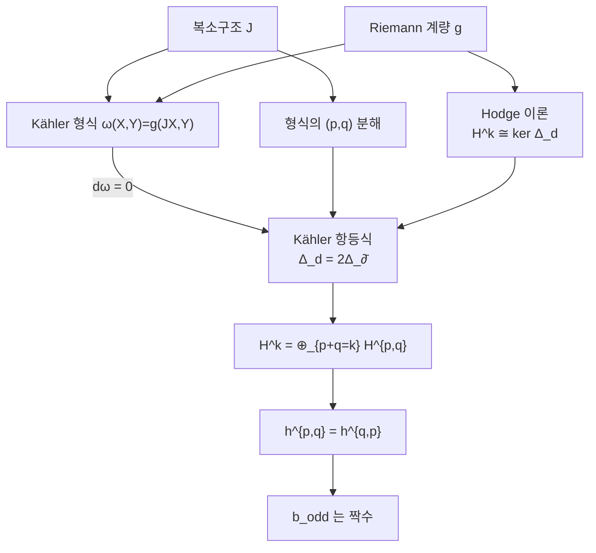

# Kähler 다양체와 Hodge 분해

# 개요

[Hodge 이론](hodge-theory.md)은 Riemann 계량 하나를 주고 코호몰로지류마다 조화 대표원을 얻었다. 복소 다양체에서는 구조가 하나 더 있다. 각 접공간에 $i$ 를 곱하는 연산이 있고, 그 결과 미분형식이 [정칙](holomorphic-functions.md) 방향과 반정칙 방향으로 쪼개진다.

세 구조가 동시에 놓인다. 계량 $g$ 와 복소구조 $J$ 와 둘이 만드는 2-형식 $\omega$ 다. 셋이 서로 정합적이고 $\omega$ 가 닫혀 있으면 Kähler 다양체라 한다. 조건은 한 줄 $d\omega=0$ 뿐인데 결과가 압도적이다.

Laplace 작용소가 $\Delta_d$ 와 $\Delta_\partial$ 과 $\Delta_{\bar\partial}$ 세 종류로 정의되는데 Kähler 조건이 이들을 하나로 만든다. 그러면 조화형식 공간이 $(p,q)$ 성분으로 쪼개지고, 위상 불변량인 Betti 수가 복소구조를 아는 더 세밀한 수들로 분해된다. $b_1$ 이 반드시 짝수라든가, 복소 다양체가 언제 사영공간에 들어가는가 같은 질문의 답이 여기서 나온다.

복소 사영공간의 닫힌 부분다양체는 모두 Kähler 다. 곧 모든 사영 대수다양체가 이 이론의 대상이며, 이것이 Hodge 이론이 대수기하의 기본 도구가 된 이유다.

# 직관

## 형식이 두 방향으로 쪼개진다

복소좌표 $z_j=x_j+iy_j$ 에서 $dz_j=dx_j+i\,dy_j$ 와 $d\bar z_j=dx_j-i\,dy_j$ 를 쓰면, 복소값 $k$ 형식이 $dz$ 를 $p$ 개, $d\bar z$ 를 $q$ 개 쓴 항들의 합으로 유일하게 쓰인다. 이것이 $(p,q)$ 분해이고 $p+q=k$ 다.

외미분도 따라서 쪼개진다. $d=\partial+\bar\partial$ 에서 $\partial$ 이 $p$ 를 1 올리고 $\bar\partial$ 가 $q$ 를 1 올린다. $d^2=0$ 을 전개하면 $\partial^2=\bar\partial^2=0$ 과 $\partial\bar\partial+\bar\partial\partial=0$ 이 나온다.

$\bar\partial$ 만 쓴 복합체의 코호몰로지가 Dolbeault 코호몰로지 $H^{p,q}$ 다. 정칙 대상만 보는 복소해석적 불변량이며, 일반 복소 다양체에서는 위상적 코호몰로지와 아무 관계가 없다.

## Kähler 조건이 둘을 묶는다

일반적으로 $H^k_{\mathrm{dR}}$ 와 $H^{p,q}$ 사이에는 관계가 없다. $d$ 에 대한 조화형식과 $\bar\partial$ 에 대한 조화형식이 다른 공간이기 때문이다.

$d\omega=0$ 이 이 벽을 허문다. Kähler 항등식이 $\Delta_d=2\Delta_{\bar\partial}=2\Delta_\partial$ 를 주고, 세 작용소의 핵이 같아진다. $\Delta_{\bar\partial}$ 는 $(p,q)$ 를 보존하므로 그 핵이 자동으로 $(p,q)$ 성분으로 쪼개지고, $\Delta_d$ 의 핵도 그렇게 쪼개진다. 위상적 불변량이 복소구조를 아는 조각들로 나뉜다.



## 왜 홀수 Betti 수가 짝수인가

$\Delta_{\bar\partial}$ 가 실 작용소의 복소화이므로 켤레가 조화형식을 조화형식으로 보내고, $(p,q)$ 를 $(q,p)$ 로 바꾼다. 따라서 $h^{p,q}=h^{q,p}$ 다.

$k$ 가 홀수면 $p+q=k$ 인 쌍들이 $(p,q)$ 와 $(q,p)$ 로 완전히 짝지어진다. $p=q$ 인 항이 없기 때문이다. 그래서

$$
b_k=\sum_{p+q=k}h^{p,q}=2\sum_{p<q}h^{p,q}
$$

가 짝수다. 이 한 줄이 강력한 판정 도구가 된다. $b_1$ 이 홀수인 복소 다양체는 복소구조를 가지더라도 Kähler 계량을 가질 수 없다. $S^1\times S^3$ 에 복소구조를 준 Hopf 곡면이 $b_1=1$ 이라 대표적인 비Kähler 예다.

# 정의

## 복소 다양체와 복소구조

전이함수가 정칙인 복소 좌표근방계를 가진 다양체가 복소 다양체다. 실차원은 $2n$ 이고 복소차원을 $n$ 이라 한다.

각 접공간에 $J^2=-\mathrm{id}$ 인 자기준동형이 유도되며 이를 개복소구조라 한다. 복소화한 접공간이 $J$ 의 고유공간으로 $T^{1,0}\oplus T^{0,1}$ 로 쪼개지고, 쌍대에서 $dz$ 와 $d\bar z$ 가 각각 이 분해에 대응한다.

## Hermite 계량과 Kähler 형식

Riemann 계량 $g$ 가 $g(JX,JY)=g(X,Y)$ 를 만족하면 Hermite 계량이라 한다. 이때

$$
\omega(X,Y)=g(JX,Y)
$$

가 비퇴화 2-형식이 되며, 이것이 Kähler 형식(또는 기본 2-형식)이다. $g,J,\omega$ 중 둘이 나머지를 결정한다.

국소좌표에서는 $\omega=\frac i2\sum h_{j\bar k}\,dz_j\wedge d\bar z_k$ 꼴이고, $(h_{j\bar k})$ 가 양의 정부호 Hermite 행렬이다.

## Kähler 다양체

$d\omega=0$ 이면 Kähler 다양체라 한다. 동치인 조건이 여럿 있다.

- $\nabla J=0$ 이다. 곧 Levi-Civita 접속이 복소구조를 보존한다.
- 각 점 근처에서 계량이 유클리드 계량과 2 차까지 일치한다(정칙 정규좌표의 존재).
- 국소적으로 $\omega=i\partial\bar\partial\varphi$ 인 실함수 $\varphi$ 가 존재한다(Kähler 퍼텐셜).

셋째 조건이 실용적이다. 복소 다양체 전체에 걸친 계량을 함수 하나로 기술할 수 있다는 뜻이며, Calabi 추측 같은 문제가 $\varphi$ 에 대한 편미분방정식이 된다.

## 주요 예

- $\mathbb C^n$ 에서는 표준 계량이 Kähler 이고 $\omega=\frac i2\sum dz_j\wedge d\bar z_j$ 다.
- 복소 원환면 $\mathbb C^n/\Lambda$ 에는 평탄한 계량이 내려온다.
- 복소 사영공간 $\mathbb{CP}^n$ 에서는 Fubini–Study 계량이 $\omega_{FS}=\frac i2\partial\bar\partial\log\|Z\|^2$ 로 주어진다.
- 위의 것들의 복소 부분다양체: $\omega$ 의 제한이 다시 닫혀 있으므로 Kähler 다. 따라서 모든 사영 대수다양체가 Kähler 다.

## Dolbeault 코호몰로지와 Hodge 수

$$
H^{p,q}_{\bar\partial}(M)=\frac{\ker\bar\partial|_{\Omega^{p,q}}}{\mathrm{im}\,\bar\partial|_{\Omega^{p,q-1}}},\qquad h^{p,q}=\dim_{\mathbb C}H^{p,q}
$$

$h^{p,q}$ 를 격자 모양으로 배열한 것이 Hodge 다이아몬드다.

# 성질

## Kähler 항등식

$L\alpha=\omega\wedge\alpha$ 와 그 딸림 $\Lambda=L^*$ 를 쓰면 다음이 성립한다.

$$
[\Lambda,\bar\partial]=-i\partial^*,\qquad [\Lambda,\partial]=i\bar\partial^*
$$

증명은 $\mathbb C^n$ 에서 직접 확인한 뒤, Kähler 계량이 각 점에서 2 차까지 평탄하다는 사실로 일반 경우에 옮기는 것이다. 대수적 항등식 두 줄이 전체 이론을 떠받친다.

여기서 곧바로 다음이 나온다.

$$
\Delta_d=2\Delta_{\bar\partial}=2\Delta_\partial
$$

Kähler 조건이 없으면 세 작용소가 다르고, 아래의 모든 결론이 무너진다.

## Hodge 분해

콤팩트 Kähler 다양체에서

$$
H^k(M;\mathbb C)=\bigoplus_{p+q=k}H^{p,q},\qquad \overline{H^{p,q}}=H^{q,p}
$$

따라서 $b_k=\sum_{p+q=k}h^{p,q}$ 이고 $h^{p,q}=h^{q,p}$ 다. Serre 쌍대성이 $h^{p,q}=h^{n-p,n-q}$ 를 더해 주므로 Hodge 다이아몬드가 가로세로 두 방향으로 대칭이다.

따름결과가 여럿이다.

- $b_k$ 가 홀수 $k$ 에서 짝수다.
- $h^{1,1}\ge1$ 이다. $[\omega]$ 자신이 $H^{1,1}$ 의 0 이 아닌 원소이기 때문이다.
- $b_2\ge1$ 이고, 같은 이유로 $[\omega]^k\ne0$ 이라 $b_{2k}\ge1$ 이다. $S^6$ 이 복소구조를 가지더라도 Kähler 일 수 없는 이유가 $b_2=0$ 이다.

## 강한 Lefschetz 정리

$L=\omega\wedge(-)$ 의 거듭제곱이 동형을 준다.

$$
L^k:H^{n-k}(M;\mathbb R)\xrightarrow{\ \sim\ }H^{n+k}(M;\mathbb R)
$$

특히 $b_{n-k}=b_{n+k}$ 이고, $k\le n$ 인 범위에서 $b_{k-2}\le b_k$ 로 Betti 수가 가운데까지 단조증가한다. 위상만으로는 결코 나오지 않는 제약이며, 어떤 다양체가 사영 대수다양체가 될 수 있는지를 걸러 내는 첫 번째 검사다.

증명은 $L$ 과 $\Lambda$ 와 등급에서 오는 작용소가 $\mathfrak{sl}_2$ 를 이룬다는 관찰이다. 코호몰로지 전체가 $\mathfrak{sl}_2$ 의 표현이 되고, 표현론의 표준 결과가 정리를 준다.

## Hodge 다이아몬드 계산

```python
from math import comb

def torus_diamond(g):
    """복소 g 차원 원환면: h^{p,q} = C(g,p)·C(g,q)."""
    return [[comb(g, p) * comb(g, q) for q in range(g + 1)] for p in range(g + 1)]

def betti(h):
    n = len(h) - 1
    return [sum(h[p][k - p] for p in range(max(0, k - n), min(n, k) + 1))
            for k in range(2 * n + 1)]

for g in (1, 2, 3):
    h = torus_diamond(g)
    b = betti(h)
    print(f"복소 {g} 차원 원환면")
    for row in h:
        print("   h^{p,q}:", row)
    print(f"   b_k = {b}   (C(2g,k) = {[comb(2*g, k) for k in range(2*g+1)]})")
    print(f"   홀수 b_k = {b[1::2]}  전부 짝수인가: {all(x % 2 == 0 for x in b[1::2])}")

for n in (1, 2, 3):                        # CP^n: h^{p,p} = 1, 나머지 0
    h = [[1 if p == q else 0 for q in range(n + 1)] for p in range(n + 1)]
    print(f"CP^{n}: b_k = {betti(h)}")

# 복소 1 차원 원환면
#    h^{p,q}: [1, 1]
#    h^{p,q}: [1, 1]
#    b_k = [1, 2, 1]   (C(2g,k) = [1, 2, 1])
#    홀수 b_k = [2]  전부 짝수인가: True
# 복소 2 차원 원환면
#    h^{p,q}: [1, 2, 1]
#    h^{p,q}: [2, 4, 2]
#    h^{p,q}: [1, 2, 1]
#    b_k = [1, 4, 6, 4, 1]   (C(2g,k) = [1, 4, 6, 4, 1])
#    홀수 b_k = [4, 4]  전부 짝수인가: True
# 복소 3 차원 원환면
#    h^{p,q}: [1, 3, 3, 1]
#    h^{p,q}: [3, 9, 9, 3]
#    h^{p,q}: [3, 9, 9, 3]
#    h^{p,q}: [1, 3, 3, 1]
#    b_k = [1, 6, 15, 20, 15, 6, 1]   (C(2g,k) = [1, 6, 15, 20, 15, 6, 1])
#    홀수 b_k = [6, 20, 6]  전부 짝수인가: True
# CP^1: b_k = [1, 0, 1]
# CP^2: b_k = [1, 0, 1, 0, 1]
# CP^3: b_k = [1, 0, 1, 0, 1, 0, 1]
```

원환면에서 Betti 수가 $\binom{2g}k$ 로 나오는데, 이것은 $T^{2g}$ 의 위상적 Betti 수와 정확히 같다. Hodge 분해가 Vandermonde 항등식 $\sum_p\binom gp\binom g{k-p}=\binom{2g}k$ 을 실현하는 셈이며, 위상적으로 보이던 하나의 수가 복소구조에 따라 $g+1$ 개의 조각으로 나뉜다.

$\mathbb{CP}^n$ 에서는 홀수 Betti 수가 모두 0 이고 짝수 자리에 1 씩 있다. $H^{2k}$ 를 $[\omega]^k$ 가 생성하며, 강한 Lefschetz 가 요구하는 $b_{n-k}=b_{n+k}$ 도 바로 보인다.

## Kähler 가 아닌 복소 다양체

복소구조는 있으나 Kähler 계량이 없는 예가 여럿 있다.

- Hopf 곡면 $(\mathbb C^2\setminus0)/(z\sim2z)\cong S^1\times S^3$ 은 $b_1=1$ 이라 홀수다.
- Iwasawa 다양체: $d\omega=0$ 인 계량이 없고, 위상적 코호몰로지와 Dolbeault 코호몰로지의 관계가 깨진다.

이 예들이 Kähler 조건이 실질적 제약임을 보인다. 반대로 Kodaira 매장 정리는 $[\omega]$ 가 정수 코호몰로지류로 잡히면 그 다양체가 사영공간에 매장됨을 말한다. 곧 "정수 Kähler 류를 가진다" 와 "사영 대수다양체다" 가 동치다. 기하적 조건이 대수적 결론을 주는 정리다.

# 활용

## 대수기하의 기본 도구

사영 대수다양체가 모두 Kähler 이므로, 위의 모든 결론이 대수기하에 그대로 적용된다. $h^{p,0}$ 은 정칙 $p$ 형식의 개수이고, $h^{1,0}$ 이 곡선의 종수이며, $h^{n,0}$ 이 기하종수다. 곡면 분류에서 Hodge 수가 기본 불변량으로 쓰인다.

Hodge 구조라는 이름으로 추상화하면, 다양체의 족에서 Hodge 분해가 어떻게 변하는지를 추적하는 변분 Hodge 이론이 된다. 모듈라이 공간의 기하가 이 변화로 기술되고, 주기 사상과 Torelli 정리가 그 중심 결과다.

## Hodge 추측

$H^{2k}(M;\mathbb Q)\cap H^{k,k}$ 의 원소를 Hodge 류라 한다. 대수적 부분다양체는 언제나 Hodge 류를 주는데, 역이 성립하는가. 곧 모든 Hodge 류가 대수적 순환의 유리계수 결합인가.

이것이 Hodge 추측이며 밀레니엄 문제 중 하나다. $k=1$ 인 경우는 Lefschetz 의 $(1,1)$ 정리로 참이고, 일반적으로는 열려 있다. 해석적으로 정의된 조건이 대수적 대상의 존재를 보장하는가라는 물음이라, 위상과 해석과 대수를 모두 건드린다.

## Calabi–Yau 와 물리

$c_1=0$ 인 콤팩트 Kähler 다양체에 Ricci 평탄한 Kähler 계량이 유일하게 존재한다는 것이 Calabi 추측이고 Yau 가 증명했다. 그 다양체가 Calabi–Yau 다양체다.

끈이론의 여분 차원이 복소 3 차원 Calabi–Yau 로 말려 있다고 보는 모형에서, 관측 가능한 입자의 세대 수 같은 물리량이 Hodge 수로 결정된다. 거울대칭은 서로 다른 두 Calabi–Yau 가 같은 물리를 주며 그 Hodge 다이아몬드가 $h^{p,q}\leftrightarrow h^{n-p,q}$ 로 뒤집힌다는 예측이고, 이 예측에서 나온 유리곡선 개수의 공식이 대수기하에서 독립적으로 검증되면서 열거기하라는 분야를 새로 열었다.

## 비아벨 Hodge 대응

기본군의 표현과 다양체 위의 정칙 대상을 대응시키는 이론이 Simpson 등에 의해 세워졌다. 평탄한 접속, Higgs 다발, 조화 사상이 같은 대상의 세 얼굴이라는 내용이며, 조화형식의 존재 정리가 여기서도 다리 역할을 한다.

Kähler 다양체의 기본군에 강한 제약이 따라 나온다. 예를 들어 자유군 $F_n$ 은 $n\ge2$ 이면 콤팩트 Kähler 다양체의 기본군이 될 수 없다. 어떤 군이 Kähler 군인가라는 질문이 이 이론의 주요 주제다.

# 연관 문서

## 선수지식

- [Hodge 이론과 조화형식](hodge-theory.md)
- [정칙함수와 Cauchy 적분 정리](holomorphic-functions.md)

## 더 알아보기

아직 연결한 문서가 없다.

#differential_geometry #algebraic_topology #complex_analysis
