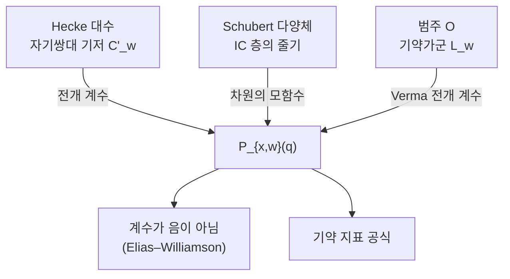

# Kazhdan–Lusztig 다항식

# 개요

[Borel–Weil–Bott 정리](borel-weil-bott.md)는 표수 $0$ 에서 기약표현의 지표를 결정한다. 깃발다양체 위 직선다발의 코호몰로지가 한 자리에만 살고 그 자리에서 Weyl 지표 공식이 나온다. 표수 $p$ 에서는 코호몰로지가 여러 차수에 흩어지고 기약가군의 지표가 닫힌 공식으로 주어지지 않는다.

Kazhdan 과 Lusztig 은 1979 년에 이 빈자리를 메울 조합적 대상을 정의했다.[^1] Weyl 군(더 일반적으로 Coxeter 군) $W$ 의 군환을 매개변수 $q$ 로 변형한 **Iwahori–Hecke 대수** $\mathcal H$ 를 잡고, 거기에 자연스러운 대합에 대해 자기쌍대인 기저 $\lbrace C'\_w\rbrace$ 가 유일하게 존재함을 보인다. 표준기저로 전개할 때 나오는 계수가

$$
C'\_w=q^{-\ell(w)/2}\sum_{x\le w}P_{x,w}(q)\thinspace T_x,\qquad P_{x,w}\in\mathbb Z[q]
$$

**Kazhdan–Lusztig 다항식**이다. 정의는 조합적이어서 Coxeter 군의 Bruhat 순서와 길이 함수만 쓴다.

같은 다항식이 다른 두 곳에서도 나타난다. 기하에서는 Schubert 다양체 $X_w$ 의 교차 코호몰로지 층의 줄기 차원이고, 표현론에서는 범주 $\mathcal O$ 의 기약가군을 Verma 가군으로 전개한 계수다. 세 세계의 일치가 Kazhdan–Lusztig 추측이었고 지금은 정리다.

# 직관

## Hecke 대수로의 변형

Weyl 군 $W$ 의 군환 $\mathbb Z[W]$ 에서 단순반사 $s$ 는 $s^2=1$ 을 만족한다. 이를 한 매개변수 풀어 준다.

$$
(T_s-q)(T_s+1)=0\quad\Longleftrightarrow\quad T_s^2=(q-1)T_s+q
$$

$q=1$ 을 넣으면 $T_s^2=1$ 이라 군환으로 돌아온다. $q$ 를 소수 거듭제곱으로 두면 이 대수는 유한체 위 군 $G(\mathbb F_q)$ 의 Borel 부분군에 대한 이중잉여류 대수로 실현된다. 변형은 정보를 잃지 않고 $q$ 라는 눈금을 더한다.

## 자기쌍대 기저

$\mathcal H$ 에는 자연스러운 대합이 있다.

$$
\overline{q}=q^{-1},\qquad \overline{T_w}=T_{w^{-1}}^{-1}
$$

표준기저 $T_w$ 는 이 대합에 대해 자기쌍대가 아니다. 그런데 다음 두 조건을 동시에 만족하는 기저는 **유일하게** 존재한다.

1. $\overline{C'\_w}=C'\_w$ (자기쌍대)
2. $C'\_w$ 를 $T_x$ 로 전개할 때 계수의 차수가 엄격히 제한됨

대칭성, Bruhat 순서에 대한 상삼각 전개, 차수 제한이 함께 걸리면 자유도가 사라진다. 구조는 Gram–Schmidt 와 같다. Kazhdan–Lusztig 다항식은 그 유일한 답의 계수이고, 같은 종류의 기저가 양자군의 정준기저와 결정기저로 이어진다.

## 특이점의 척도

$P_{x,w}(q)$ 는 Schubert 다양체 $X_w=\overline{BwB/B}$ 의 점 $x$ 근방에서 교차 코호몰로지 층의 줄기를 기술한다.

$$
P_{x,w}(q)=\sum_i \dim\mathcal H^{2i}\bigl(\mathrm{IC}(X_w)\bigr)\_x\thickspace q^{i}
$$

$X_w$ 가 $x$ 에서 매끄러우면 교차 코호몰로지가 상수층이라 $P_{x,w}=1$ 이고, 특이하면 여분의 코호몰로지가 $q$ 의 양의 차수 항으로 나타난다. 다항식의 크기가 특이점의 복잡도를 잰다.

계수가 차원이므로 음이 아닌 정수이고, 계산이 특이점 해소를 요구하므로 어렵다.

## 패턴 회피와 매끄러움

$W=S_n$ 에서 $P_{e,w}=1$ 인 것은 $w$ 가 두 패턴 $3412$ 와 $4231$ 을 피하는 것과 동치다(Lakshmibai–Sandhya).

```javascript
// w 가 패턴 p 를 포함하는가: 자리 몇 개를 뽑아 상대 순서가 p 와 같은가
const contains = (w, p) => {
  const n = w.length, k = p.length, idx = [];
  const rec = (start, depth) => {
    if (depth === k) {
      const vals = idx.map(i => w[i]);
      const rank = vals.map(v => 1 + vals.filter(u => u < v).length);
      return rank.every((r, i) => r === p[i]);
    }
    for (let i = start; i < n; i++) { idx[depth] = i; if (rec(i + 1, depth + 1)) return true; }
    return false;
  };
  return rec(0, 0);
};

const perms = (a) => a.length <= 1 ? [a] :
  a.flatMap((x, i) => perms([...a.slice(0, i), ...a.slice(i + 1)]).map(r => [x, ...r]));

const singular = (n) => perms([...Array(n)].map((_, i) => i + 1))
  .filter(w => contains(w, [3,4,1,2]) || contains(w, [4,2,3,1]));
```

$S_3$ 까지는 모든 Schubert 다양체가 매끄럽고 KL(Kazhdan–Lusztig) 다항식이 전부 $1$ 이다. 비자명한 예는 $S_4$ 에서 처음 나오며 $3412$ 와 $4231$ 둘이다. $S_5$ 에서는 $120$ 개 가운데 $32$ 개가 특이하다.

$$
P_{e,3412}=1+q,\qquad P_{e,4231}=1+q
$$

이 두 순열이 표현론 계산의 최소 반례로 쓰인다. 매끄러운 순열의 개수는 큰 Schröder 수 $1,2,6,22,88,366,\dots$ 로 지수적으로 자라지만 $n!$ 보다 훨씬 느려서, $n$ 이 커지면 매끄러운 쪽이 희소해진다.

## 세 세계의 일치



조합에서 정의하고 기하에서 의미를 얻고 표현론에서 쓴다. 세 화살표 각각이 하나의 정리다.

# 정의

## Iwahori–Hecke 대수

$(W,S)$ 를 Coxeter 계, $\ell$ 을 길이 함수라 하자. $\mathcal H$ 는 $\mathbb Z[q^{1/2},q^{-1/2}]$ 위 자유가군으로 기저 $\lbrace T_w\rbrace_{w\in W}$ 를 갖고 곱셈이

$$
T_sT_w=\begin{cases}T_{sw} & \ell(sw)\gt\ell(w)\cr qT_{sw}+(q-1)T_w & \ell(sw)\lt\ell(w)\end{cases}
$$

로 정해진다. 결합법칙은 Coxeter 관계에서 따라오고 $T_w$ 는 가역이다.

## Bruhat 순서

$x\le w$ 는 $w$ 의 어떤 축소 표현에서 문자 몇 개를 지워 $x$ 의 축소 표현을 얻을 수 있다는 관계다. [깃발다양체](borel-weil-bott.md)에서는 Schubert 세포의 닫힘 관계 $X_x\subseteq X_w$ 와 같다. $S_n$ 에서는 순열의 rank 행렬 비교로 판정된다.

## KL 기저와 다항식

$\iota\colon\mathcal H\to\mathcal H$ 를 $q^{1/2}\mapsto q^{-1/2}$ 와 $T_w\mapsto T_{w^{-1}}^{-1}$ 로 정의되는 환 대합이라 하자. 각 $w\in W$ 에 대해

$$
\iota(C'\_w)=C'\_w,\qquad C'\_w=q^{-\ell(w)/2}\sum_{x\le w}P_{x,w}(q)T_x
$$

이고 $P_{w,w}=1$ 이며 $x\lt w$ 이면 $\deg P_{x,w}\le\frac{\ell(w)-\ell(x)-1}{2}$ 인 원소 $C'\_w$ 가 유일하게 존재한다. 차수 상계를 하나만 느슨하게 해도 자유도가 생기므로 이 상계가 유일성을 준다.

## 재귀 계산

유일성의 증명이 알고리즘을 준다. $\ell(sw)\lt\ell(w)$ 인 단순반사 $s$ 를 잡고 $v=sw$ 라 하면

$$
P_{x,w}=q^{1-c}P_{sx,v}+q^{c}P_{x,v}-\sum_{x\le z\lt v,\ sz\lt z}\mu(z,v)\thinspace q^{(\ell(w)-\ell(z))/2}P_{x,z}
$$

$c=1$ 이면 $sx\lt x$ 이고 $c=0$ 이면 $sx\gt x$ 이며 $\mu(z,v)$ 는 $P_{z,v}$ 의 최고차 계수다. 길이에 대한 귀납으로 계산되지만 항의 수가 Bruhat 구간의 크기만큼 늘어난다. $E_8$ 의 전체 KL 다항식 표를 얻은 Atlas 프로젝트(2007)는 대규모 분산 계산이었다.

## $\mu$ 계수

$\ell(w)-\ell(x)$ 가 홀수일 때의 최고차 계수 $\mu(x,w)$ 가 KL 그래프의 간선 가중치가 되고, 그 그래프의 연결성분이 **셀**을 정의한다. 셀은 $\mathcal H$ 의 가군을 쪼개며, Lusztig 은 이를 통해 유한군의 기약표현을 유니포턴트 궤도와 짝지었다.

# 성질

## Kazhdan–Lusztig 추측

원래 추측은 범주 $\mathcal O$ 의 기약 최고무게 가군 $L_w$ 의 지표에 관한 것이다.

$$
\mathrm{ch}\thinspace L_w=\sum_{x\le w}(-1)^{\ell(w)-\ell(x)}P_{x,w}(1)\thinspace\mathrm{ch}\thinspace M_x
$$

$M_x$ 는 Verma 가군이다. Beilinson–Bernstein 과 Brylinski–Kashiwara 가 1981 년에 독립적으로 증명했고 요지는 국소화다. 리 대수 가군의 범주를 깃발다양체 위 $\mathcal D$ 가군의 범주와 동치로 만든 뒤 Riemann–Hilbert 대응으로 편향층으로 옮기면 지표 계수가 IC(intersection cohomology) 층의 줄기 차원이 되고, 기하 쪽에서는 Deligne 의 순수성 정리가 결론을 준다.

## 계수의 양수성

기하적 해석이 있는 Weyl 군에서는 계수가 차원이므로 음이 아니다. 일반 Coxeter 군에는 대응하는 다양체가 없어 오랫동안 열려 있었고, Elias 와 Williamson 이 2014 년에 **Soergel 쌍가군**의 범주에 강한 Lefschetz 와 Hodge–Riemann 쌍선형 관계를 직접 세워 증명했다.[^2] 대수적 대상에 Hodge 구조를 부여하는 이 방법론이 이후 여러 곳에 쓰였다.

## Lusztig 추측과 Williamson 의 반례

표수 $p$ 에서 대수군 $G$ 의 기약가군 지표를 KL 다항식으로 주려는 것이 Lusztig 추측이다. $p$ 가 충분히 크면 성립하고, 처음에는 Coxeter 수 $h$ 에 대해 $p\ge 2h-2$ 면 되리라 기대했다.

Williamson 은 $\mathrm{SL}\_n$ 에서 반례의 무한족을 만들었다.[^3] 필요한 $p$ 의 하계가 $n$ 의 다항식이 아니라 지수적으로 자란다. 표수 $p$ 표현론은 KL 다항식이 아니라 $p$ 에 의존하는 **$p$ 진 KL 다항식**을 요구하며, Riche–Williamson 이 그 틀을 정리했다.

## 계산의 어려움

$P_{x,w}$ 의 계산은 $\char35{}\mathrm P$ 난해로 여겨진다. 재귀가 Bruhat 구간 전체를 훑고 $S_n$ 에서 구간의 크기가 초지수적으로 자란다. 실무에서는 다음이 계산을 줄인다.

- $P_{x,w}=P_{x',w'}$ 가 되는 조합적 대칭(포물형 축약, 결합 하강 집합)이 많다.
- 매끄러움 판정은 패턴 회피로 다항시간에 끝난다.
- 많은 $w$ 에 대해 구간이 격자 모양이라 닫힌 공식이 존재한다.

# 활용

## 기약 지표의 계산

범주 $\mathcal O$ 와 유한 Chevalley 군의 지표표에서 Weyl 지표 공식이 주지 못하는 자리를 KL 다항식이 채운다. $\mathcal O$ 의 사영가군 $P_x$ 의 Verma 여과 중복도가 $[P_x:M_w]=P_{x,w}(1)$ 이라는 BGG(Bernstein–Gelfand–Gelfand) 상반성이 있어, 다항식 표 하나가 지표, 사영분해, Ext 군을 동시에 준다.

## Schubert 다양체의 기하

$X_w$ 의 특이점 판정, 국소 교차 코호몰로지, 유리 매끄러움 여부가 $P_{x,w}$ 로 읽힌다. Schubert 계산의 구조상수는 [Schur 다항식](schur-polynomials.md) 조합론과 이어지고 특이점 정보는 KL 조합론과 이어져, 두 조합론이 같은 다양체의 다른 측면을 본다.

## 정준기저의 원형

양자군 $U_q(\mathfrak g)$ 의 정준기저(Lusztig), 결정기저(Kashiwara), KLR(Khovanov–Lauda–Rouquier) 대수의 범주화가 자기쌍대성과 삼각성으로 기저를 고정하는 KL 의 도식을 따른다. 그 기저들의 구조상수가 음이 아닌 정수라는 것도 적절한 범주에서 대상의 차원으로 실현해 증명된다. KL 다항식이 이 방법론이 처음 작동한 자리다.

## 범주화라는 관점

Soergel 쌍가군의 범주는 $P_{x,w}$ 를 수의 열이 아니라 벡터공간의 열로 본다. 다항식의 등식이 대상의 동형으로 올라가고 계수의 양수성이 차원의 음이 아님으로 환원된다. Khovanov 호몰로지가 Jones 다항식에 대해 하는 것과 같은 상승이며, 현대 표현론의 표준 도구다.

[^1]: D. Kazhdan, G. Lusztig, *Representations of Coxeter groups and Hecke algebras*, Invent. Math. **53** (1979), 165–184. 기하적 해석은 같은 저자의 *Schubert varieties and Poincaré duality*, Proc. Sympos. Pure Math. **36** (1980).

[^2]: B. Elias, G. Williamson, *The Hodge theory of Soergel bimodules*, Ann. of Math. **180** (2014), 1089–1136.

[^3]: G. Williamson, *Schubert calculus and torsion explosion*, J. Amer. Math. Soc. **30** (2017), 1023–1046. 부록에 Kontsevich 의 관련 계산이 실려 있다. 매끄러운 순열의 개수가 큰 Schröder 수라는 것은 Haiman 과 Bóna 의 결과다.

# 연관 문서

## 선수지식

- [Coxeter 군](coxeter-groups.md)
- [Borel–Weil–Bott 정리와 깃발다양체](borel-weil-bott.md)

## 더 알아보기

- [범주 O 와 BGG 상반성](category-o.md)

#algebra #combinatorics #group_theory #construction
