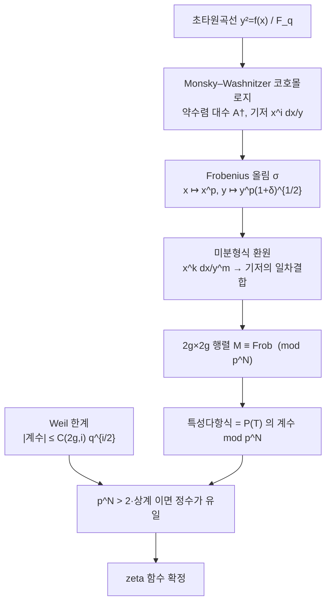

# Kedlaya 알고리즘과 p 진 점 세기

# 개요

[Dwork](dwork-rationality.md)는 유한체 위 다양체의 zeta 함수가 유리함수임을 $p$ 진 해석학으로 증명했다. 증명이 끝나면 자연스러운 질문이 남는다. **그 유리함수를 실제로 계산할 수 있는가.**

Dwork 의 증명은 원리적으로 구성적이다. 완전연속 작용소의 Fredholm 행렬식을 유한 정밀도로 잘라 내면 Frobenius 의 특성다항식이 나온다. 하지만 Dwork 의 급수는 수렴이 느리고 정밀도 관리가 지저분해서 실제 계산에는 쓰기 어려웠다. 이 간극을 메운 것이 Monsky–Washnitzer 코호몰로지이고, 그것으로 초타원곡선의 zeta 함수를 실용적으로 계산한 것이 Kedlaya 알고리즘(2001)이다.

핵심 구조는 두 절댓값을 조합하는 것이다.

$$
\underbrace{\text{Frobenius 를 }p^N\text{ 정밀도로 계산}}_{p\ \text{진}}
\ +\
\underbrace{|\alpha_j|=\sqrt q\ \text{(Weil 한계)}}_{\text{아르키메데스}}
\ \Longrightarrow\
\text{정수 계수를 정확히 확정}
$$

특성다항식의 계수는 정수이고, Weil 한계가 그 크기의 상계를 준다. 그러므로 $p^N$ 이 그 상계의 두 배를 넘을 만큼만 $p$ 진 정밀도를 확보하면 정수가 **유일하게 복원**된다. 근사계산이 정확한 답을 주는 것이다. 이 문서는 이 원리를 가장 작은 경우에서 직접 확인하고, 그 위에 Kedlaya 의 전체 구조를 얹는다.

비용 구조가 중요하다. Kedlaya 알고리즘은 $\mathbb F_{p^n}$ 위 종수 $g$ 곡선에 대해 $p$ 에는 대략 **선형**, $n$ 과 $g$ 에는 다항식이다. 그래서 $p$ 가 작고 확대차수가 큰 영역을 맡는다. 반대로 Schoof–Elkies–Atkin 은 $\log p$ 의 다항식이라 $p$ 가 클 때 이긴다. 두 알고리즘은 경쟁하지 않고 영역을 나눈다.

# 직관

## 정밀도를 유한하게 자를 수 있는 이유

$p$ 진 계산이 정확한 답을 주는 일이 왜 가능한가. 실수에서는 $\sqrt2$ 를 소수점 아래 100 자리까지 알아도 $\sqrt2$ 를 "안다" 고 할 수 없다. 하지만 답이 **정수**이고 그 정수의 **크기를 미리 안다면** 사정이 다르다.

$|m|<M$ 인 정수 $m$ 을 찾는데 $m\bmod p^N$ 을 알고 $p^N>2M$ 이라 하자. 그러면 $m$ 은 유일하다. 잉여류 안에 크기 $M$ 이하의 정수가 하나뿐이기 때문이다. 이것이 전부다.

zeta 함수의 분자 $P(T)=\prod_{j=1}^{2g}(1-\alpha_jT)$ 에서 계수는 $\alpha_j$ 의 기본대칭식이고, Weil 한계 $|\alpha_j|=\sqrt q$ 가

$$
|\,i\text{ 번째 계수}\,|\le\binom{2g}{i}q^{i/2}
$$

를 준다. 크기가 미리 잡혀 있다. 남은 일은 $p$ 진 정밀도를 그 두 배 위로 올리는 것뿐이다.

## 가장 작은 경우 : Hasse 불변량

종수 $1$ 에서 이 원리가 한 줄로 드러난다. $E:y^2=f(x)$ 이면 [이차 지표](gauss-sums.md)로

$$
a_p=-\sum_{x\in\mathbb F_p}\chi(f(x)),\qquad \chi(u)=u^{(p-1)/2}
$$

이고, $\sum_{x\in\mathbb F_p}x^k$ 가 $(p-1)\mid k$ 이고 $k>0$ 일 때만 $-1$ 이라는 사실을 쓰면 $f^{(p-1)/2}$ 의 $x^{p-1}$ 계수 하나만 살아남는다.

$$
a_p\equiv\big[\,x^{p-1}\,\big]\,f(x)^{(p-1)/2}\pmod p
$$

이 계수를 **Hasse 불변량**이라 한다. 이것은 Frobenius 가 코호몰로지에 작용한 것을 정밀도 $p^1$ 로 계산한 값이다. 그리고 $|a_p|\le2\sqrt p$ 이므로 $4\sqrt p<p$ 곧 $p>16$ 이면 $a_p$ 가 유일하게 복원된다. **정밀도 하나로 점 세기가 끝난다.**

Kedlaya 알고리즘은 이것의 일반화다. 정밀도를 $p^1$ 에서 $p^N$ 으로 올리고, 종수 $1$ 을 종수 $g$ 로, 소수체를 $\mathbb F_{p^n}$ 으로 올린다. 구조는 그대로다.



## 왜 "약수렴" 인가

$\mathbb F_q$ 위 곡선의 $p$ 진 코호몰로지를 만들려면 곡선을 $\mathbb Z_q$ 로 들어올려야 한다. 좌표환 $\mathbb F_q[x,y]/(y^2-f)$ 를 그냥 들어올린 $\mathbb Z_q$ 대수의 de Rham 코호몰로지는 너무 크다. 반대로 $p$ 진 완비화를 취하면 수렴반경이 정확히 $1$ 인 급수까지 다 들어와서 코호몰로지가 무한차원이 된다.

Monsky 와 Washnitzer 의 해법은 **수렴반경이 $1$ 보다 조금 큰** 급수만 남기는 것이다. 이 **약수렴 대수**(dagger algebra) $A^\dagger$ 의 de Rham 코호몰로지가 유한차원이고, 차원이 정확히 위상적으로 기대되는 값이다. 종수 $g$ 인 홀수차 초타원곡선의 아핀 조각에서 $H^1$ 의 기저가

$$
\frac{dx}{y},\ \frac{x\,dx}{y},\ \dots,\ \frac{x^{2g-1}dx}{y}
$$

로 $2g$ 개다.

"반경이 $1$ 보다 조금 크다" 는 조건을 [Dwork 문서](dwork-rationality.md)에서 이미 보았다. 분해함수 $\theta(x)=\exp(\pi(x-x^p))$ 의 수렴반경이 $p^{(p-1)/p^2}>1$ 이었던 것, 그 초과수렴이 작용소를 완전연속으로 만들었던 것과 같은 조건이다. Monsky–Washnitzer 는 Dwork 의 초과수렴을 대수의 정의 안으로 옮겨 넣은 것이다.

## Frobenius 를 어떻게 올리는가

$\sigma$ 를 $\mathbb Z_q$ 의 Frobenius 올림이라 하고 $x\mapsto x^p$ 로 확장한다. $y$ 는 $y^2=f(x)$ 를 만족해야 하므로 $\sigma(y)^2=f^\sigma(x^p)$ 여야 한다. 이것을 $y^{2p}$ 로 묶으면

$$
\sigma(y)=y^p\Big(1+\underbrace{\frac{f^\sigma(x^p)-f(x)^p}{y^{2p}}}_{=\,\delta}\Big)^{1/2}
=y^p\sum_{k\ge0}\binom{1/2}{k}\delta^k
$$

가 된다. $\delta$ 의 분자가 $p$ 로 나뉘므로 $\delta$ 는 $p$ 진으로 작고 급수가 수렴한다. 정밀도 $p^N$ 만 필요하므로 $k$ 를 $O(N)$ 에서 자른다. 무한급수가 유한 합이 된다.

이제 $\sigma(x^i\,dx/y)$ 를 계산하면 기저가 아닌 $x^k\,dx/y^m$ 꼴이 잔뜩 나온다. 이것을 기저로 되돌리는 것이 **환원**이고, $d(x^ay^b)$ 가 코호몰로지에서 $0$ 이라는 관계식을 반복 적용하는 선형대수다. 환원이 끝나면 $2g\times2g$ 행렬이 남고, 그 특성다항식이 $P(T)$ 다.

# 정의

## zeta 함수와 복원 문제

$C$ 를 $q=p^n$ 인 $\mathbb F_q$ 위의 매끄러운 사영곡선이라 하고 종수를 $g$ 라 하자.

$$
Z(C,T)=\frac{P(T)}{(1-T)(1-qT)},\qquad
P(T)=\prod_{j=1}^{2g}(1-\alpha_jT)\in\mathbb Z[T],\quad|\alpha_j|=\sqrt q
$$

**점 세기 문제**란 $P(T)$ 를 계산하는 것이다. $\#C(\mathbb F_q)=q+1-\sum\alpha_j$ 이므로 점 개수는 따름이다.

$P$ 는 함수방정식 때문에 자기역수적이다. 그러므로 계수 $2g$ 개 가운데 절반 $g$ 개만 독립이다.

## 약수렴 대수

$A=\mathbb Z_q[x_1,\dots,x_m]/I$ 라 할 때 **약수렴 대수** $A^\dagger$ 는 계수가 지수적으로 빨리 $0$ 으로 가는 멱급수, 곧 어떤 $\rho>1$ 에 대해 반경 $\rho$ 에서 수렴하는 급수들의 대수다. $A^\dagger\otimes\mathbb Q$ 의 de Rham 코호몰로지를 $A$ 의 **Monsky–Washnitzer 코호몰로지**라 한다.

- 유한차원이다.
- $\mathbb F_q$ 위의 원래 대수만으로 결정된다(들어올림 선택에 무관하다).
- Frobenius 가 작용하고, 그 대각합이 Lefschetz 공식으로 점 개수를 준다.

$$
\#C(\mathbb F_{q^k})=\sum_{i}(-1)^i\,\mathrm{tr}\big(\mathrm{Frob}^k\mid H^i_{\mathrm{MW}}\big)
$$

Berthelot 의 강성(rigid) 코호몰로지가 이것을 특이점과 비적정 경우까지 일반화한 것이다.

## Kedlaya 알고리즘

$C:y^2=f(x)$ 이고 $\deg f=2g+1$ 이며 $f$ 는 분리가능하고 $p\ne2$ 라 하자.

1. 목표 정밀도 $N$ 을 정한다. Weil 한계에서 오는 계수 상계의 두 배를 $p^N$ 이 넘도록 잡는다.
2. $H^1$ 의 기저 $x^i\,dx/y$ 를 $0\le i<2g$ 에 대해 고정한다.
3. $\sigma(x)=x^p$ 와 $\sigma(y)=y^p(1+\delta)^{1/2}$ 를 $p^N$ 정밀도로 전개한다.
4. 각 기저원소의 상을 환원 공식으로 기저의 일차결합으로 되돌려 행렬 $M$ 을 얻는다.
5. $\det(1-TM)$ 의 계수를 정수로 복원한다. $P(T)$ 가 나온다.

$\mathbb F_{p^n}$ 위에서 비용은 대략 $\tilde O(p\,n^3g^4)$ 다. $p$ 에 선형인 것이 이 알고리즘의 한계이자 성격이다.

# 성질

## 두 절댓값의 협업

> **복원 원리.** $m\in\mathbb Z$ 이고 $|m|\le M$ 일 때 $m\bmod p^N$ 을 알고 $p^N>2M$ 이면 $m$ 이 유일하게 정해진다.

$P(T)=\sum_ic_iT^i$ 에서 $|c_i|\le\binom{2g}{i}q^{i/2}$ 이므로 필요한 정밀도가

$$
N>\log_p\Big(2\binom{2g}{g}q^{g/2}\Big)\approx\frac{gn}{2}+O(g)
$$

이다. 함수방정식으로 절반만 계산하면 이 정도면 충분하다. 정밀도가 $n$ 에 선형이고 $g$ 에 선형이라 전체 비용이 다항식 안에 머문다.

이 구조가 $p$ 진 알고리즘의 전형이다. 답이 정수라는 것, 그 크기를 아르키메데스 쪽에서 안다는 것, 그리고 $p$ 진 쪽에서 유한 정밀도로 계산할 수 있다는 것. 셋이 모이면 근사가 정확해진다. [Dwork 의 유리성 증명](dwork-rationality.md)에서 Borel–Dwork 판정이 두 절댓값을 묶었던 것과 정확히 같은 논법이며, 다만 거기서는 존재 증명이고 여기서는 계산이다.

## Hasse 불변량이 주는 것과 주지 못하는 것

정밀도 $p^1$ 만 쓰면 $a_p\bmod p$ 만 얻는다. 종수 $1$ 인 소수체에서는 $4\sqrt p<p$ 덕분에 이것으로 충분하지만 일반적으로는 부족하다.

- $p\le13$ 이면 $4\sqrt p>p$ 라 후보가 둘 이상 남을 수 있다.
- $\mathbb F_{p^n}$ 으로 올라가면 $|a|\le2\sqrt{p^n}$ 이라 필요한 정밀도가 $n/2$ 자리로 늘어난다. $p^1$ 은 턱없이 모자라다.
- 종수가 커지면 계수가 여러 개라 각각 정밀도가 필요하다.

그러니 Hasse 불변량은 Kedlaya 의 $N=1,g=1,n=1$ 사례다. 정밀도를 올리는 기계가 바로 Monsky–Washnitzer 환원이다.

## 초특이성과 Newton 다각형

Hasse 불변량이 $0$ 이라는 것은 $a_p\equiv0\pmod p$ 라는 뜻이고, [Newton 다각형](newton-polygon.md)에서 본 대로 $P(T)=1-a_pT+pT^2$ 의 다각형이 곧은 한 변이 되어 기울기가 $\frac12,\frac12$ 다. 곡선이 **초특이**다.

일반 종수에서도 같다. Frobenius 행렬 $M$ 의 특성다항식의 Newton 다각형이 곡선의 **Newton 다각형**이고, 그것이 $p$ 진 불변량의 계층을 준다. Kedlaya 알고리즘은 $P(T)$ 를 통째로 주므로 이 다각형도 함께 준다.

## 알고리즘 지형

| 알고리즘 | 비용 | 잘하는 영역 |
|---|---|---|
| 완전 탐색 | $O(q)$ | 장난감 크기 |
| Shanks–Mestre (baby-step giant-step) | $\tilde O(q^{1/4})$ | 중간 크기, 종수 1 |
| Schoof–Elkies–Atkin | $\log q$ 의 다항식 | **종수 1 과 큰 $p$ 일 때** |
| Kedlaya (MW 코호몰로지) | $\tilde O(p\,n^3g^4)$ | **임의 종수와 작은 $p$ 와 큰 $n$ 일 때** |
| Lauder–Wan (Dwork 직계) | $p$ 에 다항식 | 일반 다양체 |
| Harvey (Kedlaya 개량) | $\tilde O(p^{1/2})$ | 중간 크기 $p$ |

$p=2$ 에서는 Kedlaya 의 가설이 깨져서 Mestre 의 AGM 이나 Satoh 의 정준 올림이 쓰인다. 암호 실무에서 $\mathbb F_{2^n}$ 곡선을 다룰 때 이 계열이 표준이었다.

# 활용

## 정밀도 하나로 점을 센다

원리를 가장 작은 경우에서 끝까지 확인한다. Hasse 불변량을 계산하고, Weil 한계로 정수를 복원하고, 직접 센 값과 맞춰 본다. 브루트포스 결과를 계산 쪽에 알려 주지 않는다.

```python
def polymul(u, v, p):
    w = [0] * (len(u) + len(v) - 1)
    for i, ui in enumerate(u):
        if ui:
            for j, vj in enumerate(v):
                w[i + j] = (w[i + j] + ui * vj) % p
    return w

def a_p_bruteforce(p, a, b):
    """a_p = p + 1 - #E(F_p),  E : y^2 = x^3 + ax + b."""
    n = 1                                            # 무한원점
    for x in range(p):
        c = (x * x % p * x + a * x + b) % p
        n += 1 if c == 0 else (2 if pow(c, (p - 1) // 2, p) == 1 else 0)
    return p + 1 - n

def hasse_invariant(p, a, b):
    """f(x)^{(p-1)/2} 의 x^{p-1} 계수.  = a_p mod p."""
    f = [b % p, a % p, 0, 1]                         # x^3 + ax + b
    r, e, base = [1], (p - 1) // 2, f
    while e:
        if e & 1: r = polymul(r, base, p)
        base, e = polymul(base, base, p), e >> 1
    return r[p - 1] % p if p - 1 < len(r) else 0

CURVE = (1, 1)                                       # y^2 = x^3 + x + 1
PRIMES = [5, 7, 11, 13, 17, 19, 23, 29, 31, 37, 41, 43, 47, 53, 59, 61, 67, 71]

print(f"{'p':>4} {'a_p (직접 셈)':>14} {'Hasse 불변량':>14} {'a_p mod p':>11}  일치")
ok_all = True
for p in PRIMES:
    ap, h = a_p_bruteforce(p, *CURVE), hasse_invariant(p, *CURVE)
    ok = (ap - h) % p == 0
    ok_all &= ok
    print(f"{p:>4} {ap:>14} {h:>14} {ap % p:>11}  {ok}")
print(f"\n  모든 소수에서 합동 성립 : {ok_all}")

#    p   a_p (직접 셈)      Hasse 불변량   a_p mod p  일치
#    5             -3              2           2  True
#    7              3              3           3  True
#   11             -2              9           9  True
#   13             -4              9           9  True
#   17              0              0           0  True
#   19             -1             18          18  True
#   23             -4             19          19  True
#   29             -6             23          23  True
#   31             -1             30          30  True
#   37            -10             27          27  True
#   41              7              7           7  True
#   43             10             10          10  True
#   47            -12             35          35  True
#   53             -4             49          49  True
#   59             -3             56          56  True
#   61             12             12          12  True
#   67             12             12          12  True
#   71             13             13          13  True
#
#   모든 소수에서 합동 성립 : True
```

계수 하나가 $a_p\bmod p$ 를 전부 담고 있다. $\mathbb F_p$ 의 점을 한 번도 세지 않고 다항식 거듭제곱만 했다.

## Weil 한계가 정수를 확정한다

```python
print("  구간 (-2√p, 2√p) 의 길이가 4√p.  4√p < p (곧 p > 16) 이면 반드시 유일하다.")
print("  충분조건일 뿐이라 더 작은 p 에서도 유일할 수 있다.")
print(f"{'p':>4} {'4√p':>8} {'후보 수':>8} {'복원한 a_p':>11} {'참값':>7}  일치")
for p in PRIMES:
    h, lim = hasse_invariant(p, *CURVE), 2 * p ** 0.5
    cands = [c for c in range(-int(lim), int(lim) + 1) if (c - h) % p == 0]
    ap = a_p_bruteforce(p, *CURVE)
    rec = cands[0] if len(cands) == 1 else None
    print(f"{p:>4} {4*p**0.5:>8.3f} {len(cands):>8} "
          f"{str(rec):>11} {ap:>7}  {rec == ap if rec is not None else '유일하지 않음'}")

#   구간 (-2√p, 2√p) 의 길이가 4√p.  4√p < p (곧 p > 16) 이면 반드시 유일하다.
#   충분조건일 뿐이라 더 작은 p 에서도 유일할 수 있다.
#    p      4√p     후보 수     복원한 a_p      참값  일치
#    5    8.944        2        None      -3  유일하지 않음
#    7   10.583        2        None       3  유일하지 않음
#   11   13.266        1          -2      -2  True
#   13   14.422        1          -4      -4  True
#   17   16.492        1           0       0  True
#   19   17.436        1          -1      -1  True
#   23   19.183        1          -4      -4  True
#   29   21.541        1          -6      -6  True
#   31   22.271        1          -1      -1  True
#   37   24.331        1         -10     -10  True
#   41   25.612        1           7       7  True
#   43   26.230        1          10      10  True
#   47   27.423        1         -12     -12  True
#   53   29.120        1          -4      -4  True
#   59   30.725        1          -3      -3  True
#   61   31.241        1          12      12  True
#   67   32.741        1          12      12  True
#   71   33.705        1          13      13  True
```

$p\ge11$ 에서 후보가 하나로 좁혀지고 그것이 참값이다. $p=5,7$ 에서 실패하는 것이 정밀도가 모자란다는 말이고, 정밀도를 $p^2$ 로 올리면 거기서도 풀린다. **이것이 Kedlaya 알고리즘이 하는 일의 전부**다. 나머지는 정밀도를 올리고 종수를 올리는 기계장치다.

## 초특이 소수를 골라낸다

```python
for p in PRIMES:
    if hasse_invariant(p, *CURVE) == 0:
        print(f"  p={p:3d}  Hasse 불변량 = 0   a_p = {a_p_bruteforce(p, *CURVE)}"
              f"   Newton 다각형 기울기 1/2, 1/2  →  초특이")

#   p= 17  Hasse 불변량 = 0   a_p = 0   Newton 다각형 기울기 1/2, 1/2  →  초특이
```

$p\le71$ 에서 이 곡선이 초특이가 되는 소수는 $17$ 하나다. 초특이 소수는 희박하고(Elkies 가 무한히 많음을 증명했다), 그 희박함이 [Newton 다각형](newton-polygon.md)의 일반적 위치가 보통(ordinary)이라는 사실의 다른 표현이다.

## 어디에 쓰이는가

- **곡선 암호.** [타원곡선](elliptic-curves.md)이나 초타원곡선으로 암호를 세우려면 군의 위수를 알아야 한다. 위수가 작은 소인수를 가지면 Pohlig–Hellman 으로 [이산로그](discrete-logarithm.md)가 깨진다. 곡선을 무작위로 뽑고 위수를 세어 조건에 맞을 때까지 반복하는 것이 표준 절차이고, 그 "세기" 가 이 알고리즘이다.
- **$p$ 진 불변량 계산.** 초특이성, Newton 다각형, 형식군의 높이, $p$ 진 높이와 $p$ 진 $L$ 함수의 수치 실험이 전부 이 계산에 의존한다.
- **수치 실험이 만든 추측.** 대량의 $a_p$ 표가 Sato–Tate 분포, BSD 추측의 수치 검증, 모듈러성 판정의 근거가 되었다. LMFDB 같은 데이터베이스의 곡선 자료가 이 계열 알고리즘의 산출물이다.
- **일반 다양체로.** Lauder–Wan 은 Dwork 의 원래 방법을 되살려 임의의 다양체에 대한 $p$ 다항시간 알고리즘을 주었고, Lauder 의 변형법은 매개변수를 움직이며 미분방정식을 푸는 방식으로 비용을 더 낮췄다.

[^1]: K. Kedlaya, *Counting points on hyperelliptic curves using Monsky–Washnitzer cohomology*, J. Ramanujan Math. Soc. **16** (2001), 323–338 (errata 18 (2003)). 약수렴 대수와 코호몰로지는 P. Monsky, G. Washnitzer, *Formal cohomology I*, Ann. of Math. **88** (1968), 181–217. 일반 다양체는 A. Lauder, D. Wan, *Counting points on varieties over finite fields of small characteristic*, in *Algorithmic Number Theory* (MSRI, 2008). 개량된 비용은 D. Harvey, *Kedlaya's algorithm in larger characteristic*, IMRN (2007). Hasse 불변량과 초특이 소수는 J. Silverman, *The Arithmetic of Elliptic Curves* (2판, 2009) V장. 본문의 수치 계산은 직접 한 것이다.

# 연관 문서

## 선수지식

- [Dwork 의 유리성 정리와 지수합](dwork-rationality.md)

## 더 알아보기

아직 연결한 문서가 없다.

#number_theory #algorithms #computation #cryptography
