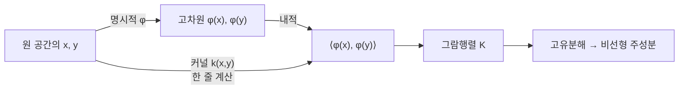

# 커널 PCA

# 개요

[주성분 분석](principal-component-analysis.md)은 데이터가 저차원 평면 근처에 있을 때 그 평면을 찾는다. 그런데 데이터가 원이나 나선 위에 있으면 어떤 평면도 구조를 담지 못한다. 동심원 두 개는 분산이 모든 방향에서 같으므로 PCA 가 아무 정보도 주지 않는다.

해법은 데이터를 먼저 고차원으로 보내는 것이다. 적당한 사상 $\phi$ 로 옮기면 휘어 있던 구조가 펴져서 선형이 된다. 원 위의 점들을 반지름 제곱 좌표로 보내면 두 원이 서로 다른 높이의 평면이 되는 식이다. 옮긴 공간에서 보통의 PCA 를 하면 원래 공간에서는 비선형인 성분을 얻는다.

문제는 $\phi$ 가 보통 아주 고차원이거나 무한차원이라는 것이다. 커널 기법이 이 문제를 없앤다. PCA 가 필요로 하는 것은 좌표가 아니라 내적뿐이므로, $\langle\phi(x),\phi(y)\rangle$ 를 직접 계산하는 함수 하나만 있으면 $\phi$ 를 절대 명시하지 않고도 전 과정을 수행할 수 있다.

# 직관

## PCA 는 내적만 쓴다

`n` 개의 점을 `d` 차원에서 다룰 때 PCA 는 $d\times d$ 공분산행렬의 고유벡터를 구한다. 그런데 같은 정보가 $n\times n$ 그람행렬 $XX^{\mathsf T}$ 에도 들어 있다. 두 행렬은 0 이 아닌 고유값이 같고 고유벡터가 서로 옮겨진다.

$$
X^{\mathsf T}X\,v=\lambda v\quad\Longleftrightarrow\quad XX^{\mathsf T}(Xv)=\lambda(Xv)
$$

그람행렬의 성분은 점들 사이의 내적뿐이다. 따라서 좌표를 몰라도 내적만 알면 PCA 를 할 수 있다. `d` 가 `n` 보다 훨씬 클 때는 이쪽이 오히려 싸다는 부수적 이득도 있다.

## 커널이 내적을 대신한다

$k(x,y) = \langle\phi(x),\phi(y)\rangle$ 를 만족하는 함수 `k` 를 커널이라 한다. 중요한 것은 많은 유용한 $\phi$ 에 대해 `k` 가 원래 공간에서 간단한 식으로 계산된다는 점이다.



2차 다항 커널 $k(x,y) = (x^{\mathsf T}y+1)^2$ 는 2 차원에서 6 차원 특징공간에 대응한다. Gauss 커널 $k(x,y)=\exp(-\lVert x-y\rVert^2/2\sigma^2)$ 는 무한차원에 대응한다. 어느 쪽이든 계산은 원래 좌표에서 몇 번의 곱셈으로 끝난다.

## 중심화를 잊으면 안 된다

PCA 는 데이터를 평균에서 뺀 뒤 시작한다. 커널 PCA 에서는 특징공간의 평균을 빼야 하는데, 그 평균은 명시할 수 없다. 그런데 뺄 필요가 없다. 중심화된 내적이 원래 커널 값들의 조합으로 표현되기 때문이다. 이것이 아래의 이중 중심화 공식이다.

# 정의

## 커널과 특징공간

대칭함수 $k:\mathcal X\times\mathcal X\to\mathbb R$ 가 양의 준정부호라는 것은 임의의 유한한 점들 $x_1,\dots,x_n$ 에 대해 행렬 `K_{ij}=k(x_i,x_j)` 가 양의 준정부호라는 뜻이다.

이 조건이면 어떤 [내적 공간](inner-product-spaces.md) $\mathcal H$ 와 사상 $\phi:\mathcal X\to\mathcal H$ 가 존재해 $k(x,y)=\langle\phi(x),\phi(y)\rangle$ 가 성립한다. Moore–Aronszajn 정리이며, $\mathcal H$ 를 재생 커널 Hilbert 공간이라 한다. $\phi$ 를 만들 필요는 없고 존재만 알면 된다.

| 커널 | 식 | 특징공간 |
|---|---|---|
| 선형 | $x^{\mathsf T}y$ | 원 공간, 보통의 PCA |
| 다항 `p` 차 | $(x^{\mathsf T}y+c)^p$ | `p` 차 이하 단항식들 |
| Gauss(RBF) | $\exp(-\lVert x-y\rVert^2/2\sigma^2)$ | 무한차원 |
| 라플라스 | $\exp(-\lVert x-y\rVert/\sigma)$ | 무한차원 |

## 중심화된 그람행렬

`K_{ij}=k(x_i,x_j)` 에서 특징공간의 평균을 뺀 그람행렬은 다음과 같다. $\mathbf 1$ 은 모든 성분이 `1/n` 인 $n\times n$ 행렬이다.

$$
\tilde K=K-\mathbf 1K-K\mathbf 1+\mathbf 1K\mathbf 1
$$

성분으로 쓰면 $\tilde K_{ij}=K_{ij}-\bar K_{i\cdot}-\bar K_{\cdot j}+\bar K$ 이며, 행평균과 열평균과 전체평균을 빼고 더한 것이다.

## 절차

1. $\tilde K$ 를 만든다.
2. $\tilde K a^{(m)}=n\lambda_m a^{(m)}$ 를 풀어 상위 고유쌍을 얻는다.
3. 특징공간에서 단위 길이가 되도록 $\lVert a^{(m)}\rVert^2 = 1/(n\lambda_m)$ 로 정규화한다.
4. 새 점 `x` 의 `m` 번째 성분 점수를 다음으로 계산한다.

$$
z_m(x)=\sum_{i=1}^na^{(m)}_i\,\tilde k(x_i,x)
$$

$\tilde k$ 는 새 점에도 같은 중심화를 적용한 커널 값이다. 고유벡터 `a^{(m)}` 은 특징공간의 주축을 데이터 점들의 계수로 표현한 것이다. 주축 자체를 쓰지 못하고 계수만 쓰는 것이 커널 PCA 의 특징이다.

# 성질

## 주축은 데이터가 span 하는 공간 안에 있다

특징공간이 무한차원이어도 중심화된 공분산연산자의 상은 $\{\phi(x_i)-\bar\phi\}$ 가 span 하는 최대 `n-1` 차원 부분공간이다. 따라서 0 이 아닌 고유값에 대응하는 고유벡터는 반드시

$$
v=\sum_{i=1}^n a_i\big(\phi(x_i)-\bar\phi\big)
$$

꼴로 쓰인다. 이 표현을 고유방정식에 넣고 양변에 $\phi(x_j)-\bar\phi$ 를 내적하면 $\tilde K$ 에 대한 유한차원 고유문제가 나온다. 무한차원 문제가 $n\times n$ 문제로 줄어드는 근거가 이것이며, 표현 정리의 한 사례다.

## 성분의 개수는 `n-1` 까지

중심화 때문에 $\tilde K$ 는 항상 $\mathbf 1$ 방향의 고유값 0 을 가진다. 따라서 유효한 성분은 최대 `n-1` 개다. 선형 PCA 가 $\min(n-1,d)$ 개로 제한되는 것과 달리, 커널 PCA 는 원 공간의 차원 `d` 와 무관하게 표본 수까지 성분을 뽑을 수 있다. 이것이 유연함의 원천이자 과적합의 원천이다.

## 역상 문제

선형 PCA 는 저차원 점수를 원 공간으로 되돌리는 재구성이 행렬 곱 한 번이다. 커널 PCA 는 그렇지 않다. 특징공간의 점 $\sum_m z_m v_m$ 에 대응하는 원 공간의 점 `x` 가 존재하지 않을 수 있기 때문이다. $\phi$ 의 상은 특징공간 전체가 아니라 휘어진 부분다양체다.

그래서 재구성은 다음 최적화로 근사한다.

$$
\hat x=\arg\min_x\ \big\lVert\phi(x)-P_M\phi(x_0)\big\rVert^2
$$

이 문제는 볼록이 아니며 국소해에 빠질 수 있다. 잡음 제거에 커널 PCA 를 쓸 때 실제로 걸리는 걸림돌이다.

## 비용

$\tilde K$ 가 $n\times n$ 이므로 저장에 `O(n^2)`, 고유분해에 `O(n^3)` 이 든다. 원 공간 차원 `d` 와 무관하지만 표본 수에는 세제곱으로 커지므로, 표본이 많으면 선형 PCA 보다 훨씬 비싸다. 실무에서는 Nyström 근사나 무작위 특징으로 `K` 를 저계수 근사한다.

새 점 하나의 점수를 구하는 데도 모든 학습 점과의 커널 값이 필요해 `O(n)` 이다. 선형 PCA 의 `O(d)` 와 대비된다.

## 커널과 대역폭의 선택

Gauss 커널의 $\sigma$ 가 결과를 지배한다. 너무 작으면 `K` 가 거의 항등행렬이 되어 모든 점이 서로 직교하므로 구조가 사라지고, 너무 크면 모든 커널 값이 1 에 가까워져 선형 PCA 로 퇴화한다. 점들 사이 거리의 중앙값 근처를 출발점으로 삼는 것이 흔한 기준이다.

선형 PCA 가 가진 명확한 목적함수의 의미가 약해진다는 점도 대가다. 설명분산비율은 특징공간의 것이지 원 공간의 것이 아니므로, 몇 개의 성분을 남길지를 판단하기 어렵다.

## 수치로 확인

2차 다항 커널의 명시적 특징사상을 적어 두 가지를 검사한다. 커널 값이 특징벡터의 내적과 같은지, 그리고 이중 중심화 공식이 특징공간에서 실제로 평균을 뺀 것과 같은지다.

```python
import math, random

rng = random.Random(0)
X = [(rng.gauss(0, 1), rng.gauss(0, 1)) for _ in range(6)]

def k(a, b):                      # 2차 다항 커널
    return (a[0]*b[0] + a[1]*b[1] + 1) ** 2

def phi(a):                       # 대응하는 명시적 특징사상
    x, y = a
    return (x*x, y*y, math.sqrt(2)*x*y, math.sqrt(2)*x, math.sqrt(2)*y, 1.0)

def dot(u, v):
    return sum(p*q for p, q in zip(u, v))

n = len(X)
err = max(abs(k(X[i], X[j]) - dot(phi(X[i]), phi(X[j])))
          for i in range(n) for j in range(n))
print("kernel trick 오차:", round(err, 12))

K = [[k(X[i], X[j]) for j in range(n)] for i in range(n)]
rows = [sum(r)/n for r in K]
tot = sum(rows)/n
Kc = [[K[i][j] - rows[i] - rows[j] + tot for j in range(n)] for i in range(n)]

P = [phi(x) for x in X]
mean = [sum(p[d] for p in P)/n for d in range(len(P[0]))]
Pc = [[p[d] - mean[d] for d in range(len(mean))] for p in P]
err2 = max(abs(Kc[i][j] - dot(Pc[i], Pc[j])) for i in range(n) for j in range(n))
print("중심화 오차:", round(err2, 12))
# kernel trick 오차: 0.0
# 중심화 오차: 0.0
```

두 오차가 모두 0 이다. 앞의 것은 $(x^{\mathsf T}y+1)^2$ 를 전개하면 여섯 개 단항식의 내적이 된다는 항등식이고, 뒤의 것은 $\phi$ 를 한 번도 쓰지 않고 특징공간의 중심화를 수행할 수 있다는 주장이다. 커널 PCA 가 성립하는 두 축이 그대로 확인된다.

# 활용

## 비선형 구조의 시각화

동심원, 나선, 초승달처럼 선형 방법이 무력한 자료에서 두세 개의 커널 주성분만으로 구조가 분리되는 경우가 많다. 군집 알고리즘의 전처리로 쓰면 원 공간에서 선형 분리가 불가능하던 군집이 분리 가능해진다.

## 다른 커널 방법과의 공통 구조

같은 치환이 다른 선형 방법들에도 그대로 적용된다. 내적만 쓰는 알고리즘이면 무엇이든 커널화할 수 있다는 것이 일반 원리다.

| 선형 방법 | 커널 판 |
|---|---|
| PCA | 커널 PCA |
| 선형회귀, 능형회귀 | 커널 능형회귀, Gauss 과정 회귀 |
| 판별분석 | 커널 판별분석 |
| 최대 여백 분류기 | 서포트 벡터 머신 |

## 다양체 학습과의 관계

Isomap, 라플라시안 고유사상, 확산 사상 같은 다양체 학습 기법들은 각각 특정한 커널을 쓴 커널 PCA 로 다시 쓸 수 있다. 측지거리에서 만든 행렬을 이중 중심화하는 Isomap 의 절차가 그 예다. 서로 달라 보이는 차원 축소 기법들이 "어떤 유사도 행렬을 고유분해하는가" 라는 하나의 틀로 정리된다.

## 언제 쓰지 않는가

표본이 수만 개를 넘으면 `O(n^3)` 이 감당되지 않으므로 근사가 필요하다. 해석 가능성이 중요한 경우에도 불리하다. 선형 PCA 의 성분은 원 변수들의 가중합이라 읽을 수 있지만, 커널 성분은 학습 점들에 대한 계수로만 표현되어 의미를 읽기 어렵다. 표현력이 필요하면서 표본이 많다면 오토인코더 쪽이 실용적인 선택이 된다.

# 연관 문서

## 선수지식

- [주성분 분석](principal-component-analysis.md)

## 더 알아보기

아직 연결한 문서가 없다.

#linear_algebra #statistics #machine_learning
