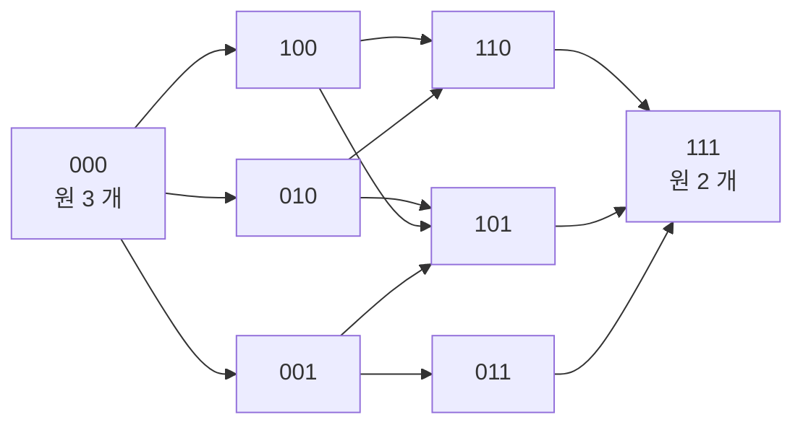

# Khovanov 호몰로지

# 개요

[Jones 다항식](knot-invariants.md)은 매듭 도식의 교차점을 두 가지로 끊어 나온 $2^n$ 개의 상태에 부호와 무게를 붙여 더한 것이고, 상태합은 정수 계수의 Laurent 다항식 하나를 준다. 부호를 붙여 더한 수는 어떤 복합체의 [Euler 지표](euler-characteristic.md)일 수 있다.

Khovanov 는 1999 년에 각 상태에 수 대신 벡터공간을 놓고[^1] 상태 사이의 이음 변경마다 그 벡터공간들 사이의 사상을 놓아 사슬 복합체를 만들었다. 그 복합체의 [호몰로지](homology.md) $Kh^{i,j}(K)$ 는 도식에 의존하지 않는 매듭 불변량이고, 이중 등급을 부호와 무게로 환산한 Euler 지표가 정확히 Jones 다항식이다.

$$
\sum_{i,j}(-1)^i q^{\thinspace j}\dim Kh^{i,j}(K)=(q+q^{-1})\thinspace V(K)(q^2)
$$

수 불변량을 호몰로지로 들어 올리는 것을 **범주화**라 한다. $Kh$ 는 Euler 지표를 취하면 사라지는 꼬임 부분군을 남기고, Jones 다항식이 같은 두 매듭을 구별하는 예가 있다. 복합체는 수와 달리 사상을 받으므로 매듭 사이의 매끄러운 곡면이 $Kh$ 사이의 준동형을 유도하고, 이 함자성에서 4 차원 위상의 정보가 나온다. Rasmussen 의 $s$ 불변량이 Milnor 추측의 조합적 증명을 준 것이 그 예다.

# 직관

## 범주화의 착상

Kauffman 괄호에서 상태 $s$ 는 $A^{a(s)-b(s)}\delta^{|s|-1}$ 을 기여한다. 2 차원 등급벡터공간의 등급별 차원이 $q+q^{-1}$ 이고 $\delta=-A^2-A^{-2}$ 는 부호를 빼면 그것이므로, 다음과 같이 읽는다.

- 상태의 원 하나에 2 차원 등급벡터공간 $A=\langle 1,X\rangle$ 이고 $\deg 1=1$ 과 $\deg X=-1$
- 원이 $k$ 개인 상태에 $A^{\otimes k}$
- 남은 부호는 호몰로지 차수의 교대합으로 들어간다

$\delta$ 의 음부호는 원의 무게가 아니라 사슬 복합체의 부호다. 이 해석이 성립하려면 상태들 사이에 미분이 있어야 한다.

## 상태의 정육면체

교차점이 $n$ 개면 상태는 $\lbrace 0,1\rbrace^n$ 의 꼭짓점이다[^2]. 0 을 A-이음, 1 을 B-이음이라 하자. 좌표 하나를 $0\to1$ 로 바꾸는 것이 정육면체의 모서리이고, 이때 도식에서 바뀌는 것은 이음 하나뿐이므로 원의 개수는 정확히 하나 늘거나 하나 준다.

원 두 개가 하나로 합쳐지는 모서리에는 곱셈 $m:A\otimes A\to A$ 를, 하나가 둘로 갈라지는 모서리에는 여곱셈 $\Delta:A\to A\otimes A$ 를 놓는다. 정육면체의 모든 정사각형 면이 가환이 되도록 $A$ 를 고르는 것이 가능한데, 그 조건이 바로 $A$ 가 **Frobenius 대수**라는 것이다.

가환인 채로는 $d^2=0$ 이 아니다. 각 정사각형이 반가환이 되도록 모서리 $\alpha\to\beta$ 가 $i$ 번째 좌표를 바꿀 때 부호 $(-1)^{\alpha_1+\cdots+\alpha_{i-1}}$ 를 붙이면 $d^2=0$ 이다. 정육면체의 꼭짓점을 $|\alpha|$ 로 층을 나누면 복합체가 된다.

## Frobenius 대수

$A=\mathbb Z[X]/(X^2)$ 는 2 차원 대수이고, 곱과 여곱이 동시에 산다.

$$
m(1\otimes1)=1,\quad m(1\otimes X)=m(X\otimes1)=X,\quad m(X\otimes X)=0
$$
$$
\Delta(1)=1\otimes X+X\otimes1,\qquad \Delta(X)=X\otimes X
$$

$A$ 는 $H^\ast(S^2)$ 와 같은 꼴이다. 원 몇 개가 합쳐지고 갈라지는 것은 2 차원 cobordism 이므로, 원의 모임에 벡터공간을 cobordism 에 사상을 붙이는 일은 1+1 차원 **TQFT**(topological quantum field theory)를 고르는 일이다. 1+1 차원 TQFT 는 가환 Frobenius 대수와 같고, Khovanov 의 $A$ 는 그중 가장 작은 비자명한 것이다. 면에 해당하는 두 cobordism 이 동위이므로 정육면체의 면이 가환이다.

## Euler 지표

각 꼭짓점의 $A^{\otimes k}$ 를 등급별로 세어 $q$ 의 다항식으로 쓰면 $(q+q^{-1})^k$ 이고, 호몰로지 차수의 교대합이 상태합의 $\delta^{|s|}$ 항을 복원한다. 사슬 수준과 호몰로지의 교대합이 같으므로 Jones 다항식은 $Kh$ 에서 등급별 개수만 남긴 것이고, 잃는 것은 자유 부분의 개별 자리와 꼬임 부분이다.

# 정의

## 등급 이동

등급벡터공간 $W$ 에 대해 $W\lbrace s\rbrace$ 는 등급을 $s$ 만큼 올린 것이다. $\dim_q W\lbrace s\rbrace=q^s\dim_q W$ 다. 복합체 $C$ 에 대해 $C[t]$ 는 호몰로지 차수를 $t$ 만큼 올린 것이다.

## 정육면체 복합체

방향을 준 도식 $D$ 의 교차점이 $n$ 개이고 양교차가 $n_+$ 개, 음교차가 $n_-$ 개라 하자. $\alpha\in\lbrace 0,1\rbrace^n$ 마다 그 이음으로 얻은 원들의 모임 $D_\alpha$ 가 있고 원의 개수를 $k_\alpha$ 라 한다. $r=|\alpha|$ 로 두고

$$
V_\alpha=A^{\otimes k_\alpha}\lbrace\thinspace r+n_+-2n_-\thinspace\rbrace,\qquad
C^{\thinspace r-n_-}(D)=\bigoplus_{|\alpha|=r}V_\alpha
$$

미분은 모서리별 사상의 부호합이다.

$$
d=\sum_{\alpha\to\beta}(-1)^{\alpha_1+\cdots+\alpha_{i-1}}\thinspace d_{\alpha\to\beta},
\qquad d_{\alpha\to\beta}\in\lbrace m,\Delta\rbrace\otimes\mathrm{id}
$$

$m,\Delta$ 가 등급을 $-1$ 만큼 내리고 $r$ 이 $1$ 늘어 등급 이동이 $+1$ 이므로 $d$ 가 $q$ 등급을 보존한다. 복합체가 $q$ 등급마다 갈라지고 호몰로지는 이중 등급을 갖는다.

$$
Kh^{i,j}(D)=H^i\big(C^{\bullet,j}(D)\big)
$$

**정리(Khovanov).** $Kh^{i,j}$ 는 Reidemeister 이동에서 변하지 않는다. 따라서 매듭 불변량이다.

$n_+,n_-$ 로 준 이동은 Jones 다항식의 비틀림수 보정과 같은 일을 해서 R1 에서 생기는 어긋남을 상쇄한다.

## 정규화한 Jones 다항식과의 관계

$$
\hat J(K)(q)=\sum_{i,j}(-1)^i q^{\thinspace j}\dim_{\mathbb Q} Kh^{i,j}(K;\mathbb Q)=(q+q^{-1})\thinspace V(K)(q^2)
$$

풀린 매듭에서는 $Kh^{0,-1}=Kh^{0,1}=\mathbb Z$ 이고 나머지는 $0$ 이므로 $\hat J=q+q^{-1}$ 이다.

## Lee 변형과 $s$ 불변량

$A$ 의 관계를 $X^2=0$ 대신 $X^2=1$ 로 바꾸면 Lee 호몰로지 $Kh_{\mathrm{Lee}}$ 가 나온다. $q$ 등급은 여과로만 남고 호몰로지는 단순해진다.

**정리(Lee).** $\ell$ 성분 링크에서 $\dim_{\mathbb Q}Kh_{\mathrm{Lee}}=2^{\ell}$ 이다[^4]. 특히 매듭이면 $Kh_{\mathrm{Lee}}\cong\mathbb Q^2$ 이고 두 생성원 모두 호몰로지 차수 $0$ 에 있다.

Khovanov 복합체의 $q$ 여과가 Lee 호몰로지에 여과를 남기므로 $\mathbb Q^2$ 의 생성원이 살아남는 여과 준위를 물을 수 있다. 두 준위는 $2$ 만큼 차이가 나고 그 평균이 **Rasmussen 불변량**이다[^3].

$$
s(K)\in2\mathbb Z
$$

# 성질

## Jones 다항식과의 차이

- **꼬임.** 오른손 삼엽매듭은 $Kh^{3,7}=\mathbb Z/2$ 를 갖는다. 유리수 계수에서는 보이지 않고 Euler 지표에도 기여하지 않는다. 교대 매듭에서 꼬임의 분포는 Shumakovitch 가 기술했다.
- **분리력.** Jones 다항식이 같은데 $Kh$ 가 다른 매듭 쌍이 있다. 다만 $Kh$ 도 매듭을 완전히 분류하지는 않는다.
- **풀린 매듭 검출.** $Kh(K)$ 가 풀린 매듭의 것과 같으면 $K$ 는 풀린 매듭이다(Kronheimer–Mrowka, 2011). 증명은 조합적이지 않고 instanton 호몰로지와의 스펙트럼 열을 쓴다. Jones 다항식이 풀린 매듭을 검출하는지는 알려져 있지 않다[^5].
- **교대 매듭.** 교대 매듭의 $Kh$ 는 $j-2i$ 가 두 값에만 실리고 그 두 대각선 위의 정보는 Jones 다항식과 행렬식으로 결정되므로 새 정보가 없다. 새 정보는 비교대 매듭에서 나온다.

## 4 차원 정보

$\mathbb R^3\times[0,1]$ 안의 매끄러운 곡면 $\Sigma$ 가 $K_0$ 와 $K_1$ 을 이으면 준동형 $Kh(K_0)\to Kh(K_1)$ 이 유도되고, 이 대응은 함자적이다. 여기서 $s$ 의 성질이 나온다.

- $|s(K)|\le2g_4(K)$ 다. 여기서 $g_4$ 는 매끄러운 4 차원 종수, 곧 $B^4$ 안에서 $K$ 를 메우는 매끄러운 곡면의 최소 종수다.
- $s$ 는 준동형 $\mathcal C\to2\mathbb Z$ 다. $\mathcal C$ 는 콩코던스 군.
- 양의 매듭에서 등호가 성립하므로 $(p,q)$ 원환 매듭의 매끄러운 4 차원 종수가 $(p-1)(q-1)/2$ 라는 **Milnor 추측**이 따라온다. 원래 증명은 게이지 이론(Kronheimer–Mrowka)이었고 Rasmussen 의 증명은 조합적이다.
- $s$ 와 Ozsváth–Szabó 의 $\tau$ 는 알려진 예에서 $s=2\tau$ 를 만족하다가 Hedden–Ording 의 반례로 분리되었다.
- Freedman–Gompf–Morrison–Walker 는 $s$ 로 4 차원 매끄러운 Poincaré 추측의 반례 후보를 검사하려 했다. 계산은 후보를 모두 통과시켜 $s$ 로는 반례를 가려내지 못했다[^6].

## 계산

$\mathbb Z$ 계수 정육면체 복합체의 크기는 $\sum_\alpha 2^{k_\alpha}$ 로 교차수에 지수적이다. 도식을 tangle 로 잘라 각 조각의 복합체를 소거로 줄이고 이어 붙이는 Bar–Natan 의 국소 알고리즘이 수십 교차 매듭까지 다룬다. 소거 없이 Smith 표준형만 쓰면 십여 교차에서 막힌다.

## 변형과 다른 이론과의 관계

- $\mathfrak{sl}\_2$ 를 $\mathfrak{sl}\_N$ 으로 바꾸면 Khovanov–Rozansky 호몰로지가 나오고 HOMFLY(Hoste–Ocneanu–Millett–Freyd–Lickorish–Yetter) 다항식을 범주화한다. 재료는 행렬 인수분해다.
- 홀수 Khovanov 호몰로지는 같은 Euler 지표를 주면서 다른 꼬임을 갖는다. $\mathbb Z/2$ 계수에서 둘이 만난다.
- Khovanov 호몰로지에서 Heegaard Floer 계열의 불변량으로 가는 스펙트럼 열이 여럿 있고, 두 이론을 잇는 주된 수단이다.
- 안정 호모토피 유형까지 들어 올린 Lipshitz–Sarkar 의 구성이 있다. Steenrod 연산이 실제로 새 정보를 주는 예가 있다.
- [Reshetikhin–Turaev 불변량](reshetikhin-turaev.md)과의 관계는 한 층 위에 있다. RT(Reshetikhin–Turaev) 는 [모듈러 텐서범주](modular-tensor-categories.md)에서 수를 뽑고 Khovanov 는 그 수의 범주화를 노린다. 3 차원 [다양체](manifolds.md) 불변량의 범주화는 훨씬 어렵고 부분적으로만 알려져 있다.

# 활용

## 삼엽매듭의 Khovanov 호몰로지

정육면체를 펼치고 이중 등급마다 경계행렬을 세워 Smith 표준형으로 호몰로지를 읽는다. 꼬임을 보려면 $\mathbb Q$ 가 아니라 $\mathbb Z$ 위에서 계산해야 한다. 오른손 삼엽매듭의 결과는 $Kh^{0,1}=Kh^{0,3}=Kh^{2,5}=Kh^{3,9}=\mathbb Z$ 와 $Kh^{3,7}=\mathbb Z/2$ 다.

Euler 지표 $q+q^3+q^5-q^9$ 는 $(q+q^{-1})(q^2+q^6-q^8)$ 과 같고, 오른손 삼엽매듭의 Jones 다항식 $V=t+t^3-t^4$ 에 $t=q^2$ 를 넣은 것이다.

$Kh^{3,7}=\mathbb Z/2$ 는 Euler 지표에 기여하지 않으므로 Jones 다항식으로는 볼 수 없는 정보다.

거울상을 취하면 이중 등급이 뒤집힌다. Jones 쪽의 $V(K^\ast)(t)=V(K)(t^{-1})$ 이 자유 부분에서 $Kh^{i,j}(K^\ast)\cong Kh^{-i,-j}(K)$ 로 올라간 것이다. 오른손과 왼손의 $Kh$ 가 다르므로 삼엽매듭은 카이랄이다.

호몰로지 차수 $0$ 에 남는 두 자리 $Kh^{0,1}$ 과 $Kh^{0,3}$ 이 Lee 이론에서 살아남는 두 생성원에 대응한다. 여과 준위 $1$ 과 $3$ 의 평균에서 $s=2$ 이고 $|s|\le2g_4$ 에서 $g_4\ge1$ 이다. 삼엽매듭은 $(2,3)$ 원환 매듭이고 Milnor 추측이 주는 값도 $(2-1)(3-1)/2=1$ 이다.

## 4 차원 위상과 범주화

- **매끄러운 4 차원 위상.** $s$ 가 슬라이스 종수의 하한을 조합적으로 주므로, 어떤 매듭이 $B^4$ 안에서 원판을 메우는지 판정할 때 먼저 쓴다.
- **콩코던스 군의 구조.** $s$ 가 준동형이므로 콩코던스 군에서 무한 계수의 자유 부분군을 분리하는 데 쓰인다.
- **매듭표.** Bar–Natan 의 국소 알고리즘을 구현한 프로그램이 매듭표 전체의 $Kh$ 를 채워 두었다.
- **범주화.** Khovanov 의 구성은 수 불변량이 무엇의 Euler 지표인가라는 물음을 표준 질문으로 만들었고, 양자군의 범주화와 Heegaard Floer 와의 스펙트럼 열, 안정 호모토피 유형으로의 승격이 이어졌다.

[^1]: M. Khovanov, *A categorification of the Jones polynomial*, Duke Math. J. 101 (2000). 원전.
[^2]: D. Bar-Natan, *On Khovanov's categorification of the Jones polynomial*, Algebr. Geom. Topol. 2 (2002). 정육면체 구성과 계산을 정리한 표준 참고문헌.
[^3]: J. Rasmussen, *Khovanov homology and the slice genus*, Invent. Math. 182 (2010). $s$ 불변량과 Milnor 추측의 조합적 증명.
[^4]: E. S. Lee, *An endomorphism of the Khovanov invariant*, Adv. Math. 197 (2005). 변형 이론과 $2^\ell$ 정리.
[^5]: P. B. Kronheimer, T. S. Mrowka, *Khovanov homology is an unknot-detector*, Publ. IHES 113 (2011). Jones 다항식이 풀린 매듭을 검출하는지는 답이 없는 물음으로 제시되어 있다.
[^6]: M. Freedman, R. Gompf, S. Morrison, K. Walker, *Man and machine thinking about the smooth 4-dimensional Poincaré conjecture*, Quantum Topology **1** (2010), 171–208. 반례 후보를 $s$ 불변량으로 검사한 계산과 그 결과를 싣는다.

# 연관 문서

## 선수지식

- [매듭 불변량](knot-invariants.md)
- [단체 호몰로지](homology.md)

## 더 알아보기

아직 연결한 문서가 없다.

#topology #algebraic_topology #construction #computation
