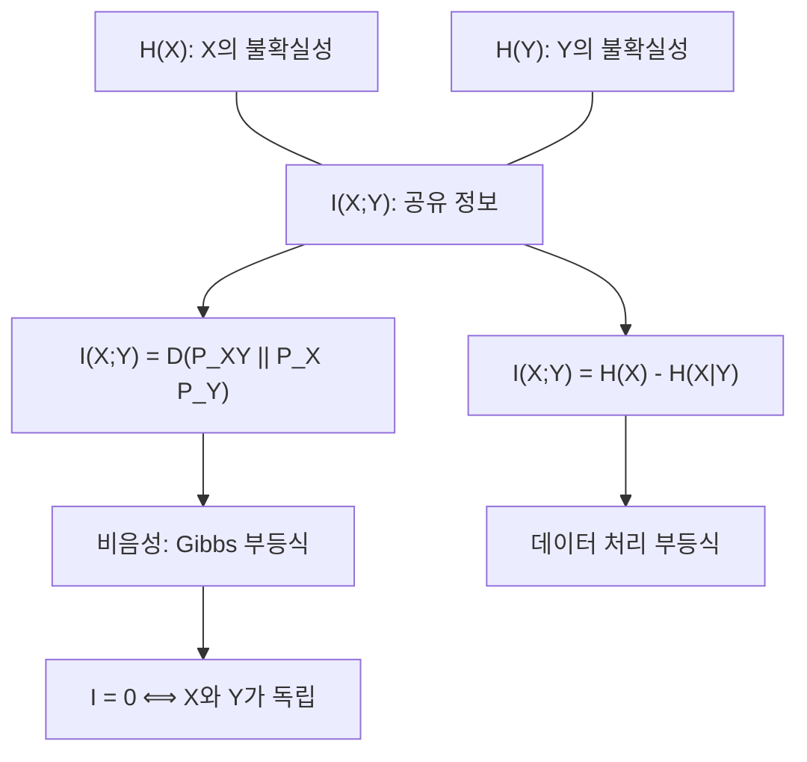

# KL divergence와 상호정보량

# 개요

Kullback–Leibler divergence는 두 확률분포가 얼마나 다른지를 재는 양이다. 거리는 아니지만, "참 분포가 `P` 인데 `Q` 라고 믿고 부호화할 때 낭비되는 평균 비트 수"라는 해석 덕분에 [Shannon entropy](entropy.md)의 자연스러운 상대 버전이 된다.

상호정보량은 결합분포와 주변분포의 곱 사이의 KL divergence다. 두 [확률변수](random-variables.md)가 서로에 대해 알려 주는 정보의 양이며, 독립성으로부터의 이탈을 정량화한다. 선형 상관과 달리 어떤 형태의 의존성이든 잡아내고, 0이 되는 것과 독립인 것이 정확히 동치다.

이 문서의 축은 셋이다. Jensen 부등식에서 나오는 비음성(Gibbs 부등식), 비대칭성과 삼각부등식 실패라는 한계, 그리고 최대가능도 추정이 KL divergence 최소화와 같다는 통계적 의미다.

# 직관

부호화로 보는 것이 가장 빠르다. 참 분포 `P` 에 최적화된 부호는 결과 `x` 에 `-log p(x)` 비트를 배정하고, 평균 길이가 엔트로피다. 그런데 분포를 `Q` 로 잘못 알고 있으면 `-log q(x)` 비트를 쓰게 되고, 평균 길이는 교차 엔트로피다. KL divergence는 그 차이, 즉 순수한 낭비분이다.

$$
D(P\,\|\,Q) = \underbrace{\mathbb{E}_{P}[-\log q]}_{\text{교차 엔트로피}} - \underbrace{\mathbb{E}_{P}[-\log p]}_{\text{엔트로피}} .
$$

이 해석에서 두 가지가 곧바로 따라온다. 낭비는 음수일 수 없으므로 비음성이고, 기댓값을 `P` 로만 잡으므로 `P` 와 `Q` 의 역할이 대칭이 아니다.

비대칭성은 실제로 의미가 있다. `D(P||Q)` 는 `P` 가 질량을 두는 곳에서 `Q` 가 0에 가까우면 폭발하므로, 이 방향을 최소화하면 `Q` 가 `P` 의 지지집합 전체를 덮으려 한다(질량 덮기). 반대 방향 `D(Q||P)` 를 최소화하면 `Q` 는 `P` 의 한 봉우리에 몰려도 손해를 보지 않는다(최빈값 찾기). 변분추론에서 어느 방향을 쓰는지에 따라 근사의 성격이 달라지는 이유다.

상호정보량은 "결합분포가 독립 모형에서 얼마나 떨어져 있는가"를 같은 척도로 잰 것이다.



# 정의

## KL divergence

같은 표본공간 위의 두 분포 `P`, `Q` 에 대해, 이산인 경우

$$
D(P\,\|\,Q) = \sum_{x} p(x)\,\log\frac{p(x)}{q(x)}
$$

로 정의한다. 관례로 `0 log(0/q) = 0` 이고, `p(x) > 0` 인데 `q(x) = 0` 인 `x` 가 있으면 값은 무한대다. 연속인 경우, 그리고 일반적인 [측도](measure.md) 공간에서는 [Radon–Nikodym 정리](radon-nikodym.md)가 주는 밀도로 쓴다.

$$
D(P\,\|\,Q) = \int \log\!\left(\frac{dP}{dQ}\right) dP ,
$$

단 `P` 가 `Q` 에 대해 절대연속일 때만 유한할 수 있다. 로그의 밑이 2면 단위는 비트, 자연로그면 nat이다.

## 조건부 divergence와 연쇄법칙

결합분포에 대해서는 다음 연쇄법칙이 성립한다.

$$
D(P_{XY}\,\|\,Q_{XY}) = D(P_X\,\|\,Q_X) + \mathbb{E}_{x \sim P_X}\big[ D(P_{Y|X=x}\,\|\,Q_{Y|X=x}) \big].
$$

## 상호정보량

두 확률변수의 결합분포와 주변분포의 곱 사이의 divergence로 정의한다.

$$
I(X;Y) = D\big(P_{XY}\,\|\,P_X \otimes P_Y\big) = \sum_{x,y} p(x,y) \log\frac{p(x,y)}{p(x)p(y)} .
$$

엔트로피로 쓰면 다음 항등식들이 모두 같은 양을 가리킨다.

$$
I(X;Y) = H(X) - H(X\mid Y) = H(Y) - H(Y\mid X) = H(X) + H(Y) - H(X,Y).
$$

조건부 상호정보량은 다음과 같다.

$$
I(X;Y\mid Z) = H(X\mid Z) - H(X\mid Y, Z).
$$

# 성질

## Gibbs 부등식: 비음성과 등호 조건

주장. `D(P||Q) ≥ 0` 이고, 등호는 `P = Q` 일 때에만 성립한다.

증명. 로그는 오목함수이므로 Jensen 부등식을 쓴다([볼록성](convexity.md) 참조). `P` 의 지지집합 위에서

$$
-D(P\,\|\,Q) = \mathbb{E}_{P}\!\left[\log \frac{q(X)}{p(X)}\right] \le \log \mathbb{E}_{P}\!\left[\frac{q(X)}{p(X)}\right] = \log \sum_{x:\, p(x)>0} q(x) \le \log 1 = 0 .
$$

첫 부등식의 등호는 로그의 순강한 오목성 때문에 비율 `q/p` 가 `P` 에 대해 거의 확실히 상수일 때에만, 둘째 등호는 `Q` 가 `P` 의 지지집합 밖에 질량을 두지 않을 때에만 성립한다. 두 조건을 합치면 `P = Q` 다.

따름정리. 상호정보량은 항상 0 이상이고, 0이 되는 것은 결합분포가 주변분포의 곱과 같을 때, 즉 독립일 때뿐이다. 또한 조건을 붙이면 엔트로피가 줄어든다.

$$
H(X \mid Y) \le H(X).
$$

유한한 표본공간에서 `Q` 를 균등분포로 잡으면 `D(P||Q) = log|X| - H(P)` 이므로, 엔트로피의 최댓값이 균등분포에서 달성된다는 사실도 같은 부등식의 특수한 경우다.

## 비대칭성과 삼각부등식 실패

KL divergence는 거리 공리를 두 개나 어긴다. Bernoulli 분포로 확인하면 충분하다. 매개변수 0.1, 0.5, 0.9인 세 분포를 `P`, `Q`, `R` 라 하자(자연로그 기준).

$$
D(P\,\|\,Q) \approx 0.368,\qquad D(Q\,\|\,P) \approx 0.511 .
$$

두 값이 다르므로 대칭이 아니다. 또한

$$
D(P\,\|\,R) \approx 1.758 \;>\; D(P\,\|\,Q) + D(Q\,\|\,R) \approx 0.879
$$

이므로 삼각부등식도 성립하지 않는다. 그래서 KL divergence는 metric이 아니며 "거리"라는 말을 쓰지 않는다.

그래도 완전히 제멋대로는 아니다. 세 가지 구조가 남는다.

- 대칭화한 Jensen–Shannon divergence의 제곱근은 실제로 metric이다.
- Pinsker 부등식이 총변동거리를 위에서 눌러 준다.[^2]

$$
\|P - Q\|_{TV} \le \sqrt{\tfrac{1}{2} D(P\,\|\,Q)} .
$$

- KL divergence는 음의 엔트로피를 생성함수로 하는 Bregman divergence이며, 가까운 두 분포에 대해서는 이차 근사가 Fisher 정보 행렬로 주어진다.

$$
D(P_{\theta}\,\|\,P_{\theta+\delta}) = \tfrac{1}{2}\,\delta^{\top} I(\theta)\, \delta + o(\|\delta\|^2).
$$

이 국소 이차형식이 정보기하에서 쓰는 Riemann 계량이다.

## 상호정보량의 성질

- 대칭. 정의에서 바로 `I(X;Y) = I(Y;X)`.
- 비음성. Gibbs 부등식의 따름정리이며, 0인 것과 독립인 것이 동치다.
- 연쇄법칙.

$$
I(X; Y_1, \ldots, Y_n) = \sum_{i=1}^{n} I(X; Y_i \mid Y_1,\ldots,Y_{i-1}).
$$

- 데이터 처리 부등식. `X -> Y -> Z` 가 Markov 연쇄이면([Markov 연쇄](markov-chains.md))

$$
I(X;Z) \le I(X;Y).
$$

`Y` 를 어떻게 가공해도 `X` 에 대한 정보가 늘어나지 않는다는 뜻이다. 이는 통계량의 충분성, 추정의 하한, 통신로 부호화의 역정리에 모두 쓰인다.

- 상호정보량은 조건을 붙일 때 늘 수도 줄 수도 있다. 즉 `I(X;Y|Z)` 와 `I(X;Y)` 사이에는 일반적인 대소 관계가 없다.

# 활용

## 최대가능도 추정은 KL 최소화다

자료 `x_1, ..., x_n` 이 참 분포에서 독립 추출되었다고 하자. 로그가능도를 표본 크기로 나누면

$$
\frac{1}{n}\sum_{i=1}^{n} \log p_{\theta}(x_i) = \mathbb{E}_{\hat{P}_n}\big[\log p_{\theta}\big]
$$

이고, 여기서 `hat P_n` 은 경험분포다. 경험분포의 엔트로피는 `theta` 와 무관하므로

$$
\arg\max_{\theta} \frac{1}{n}\sum_{i=1}^{n} \log p_{\theta}(x_i) = \arg\min_{\theta} D\big(\hat{P}_n \,\|\, P_{\theta}\big).
$$

즉 [최대가능도 추정](maximum-likelihood.md)은 경험분포에 가장 가까운 모형을 KL 기준으로 고르는 일이다. [큰 수의 법칙](law-of-large-numbers.md)으로 경험분포가 참 분포로 가므로, 모형이 틀린 경우에도 추정량은 참 분포에 KL 기준으로 가장 가까운 모형(유사참 모수)으로 수렴한다. 분류 문제에서 쓰는 교차 엔트로피 손실이 정확히 이 목적함수이고, [지수족](exponential-families.md)에서는 이 최소화가 적률 맞추기로 환원된다.

Bayes 쪽에서는 증거 하한(ELBO)이 로그 주변가능도에서 근사 사후분포와 참 사후분포 사이의 KL을 뺀 값이다. 변분 [Bayes 추론](bayesian-inference.md)이 하는 일이 그 KL을 줄이는 것이다.

## 가설검정에서의 지수

단순 가설검정에서 오류 확률은 표본 크기에 대해 지수적으로 감소하고, 그 지수가 KL divergence다(Stein 보조정리). 경험분포가 어떤 집합에 들어갈 확률의 지수 감쇠율을 주는 Sanov 정리도 같은 양을 쓴다. 이 때문에 KL divergence는 [가설검정과 p-값](hypothesis-testing.md)이나 대편차 이론에서 자연스러운 통화 단위가 된다.

## 특징 선택과 표현 학습

상호정보량은 변수 사이의 비선형 의존까지 잡으므로 특징 선택의 기준으로 쓰인다. 결정트리의 정보 이득이 곧 분할 변수와 라벨 사이의 상호정보량이다. 표현 학습에서는 표현과 라벨 사이의 상호정보량은 키우고 표현과 입력의 잉여 정보는 줄이는 정보 병목 관점이 쓰인다. 다만 고차원 연속 변수에서 상호정보량을 표본으로 추정하는 일은 어렵고, 추정량의 분산이 크다는 점은 실무에서 늘 문제가 된다.

## 계산 예제

```python
from math import log

def kl(p, q):
    # p, q: 같은 지지집합 위의 확률 리스트
    return sum(pi * log(pi / qi) for pi, qi in zip(p, q) if pi > 0)

def bern(t):
    return [1 - t, t]

P, Q, R = bern(0.1), bern(0.5), bern(0.9)
print("비대칭", round(kl(P, Q), 4), round(kl(Q, P), 4))
print("삼각부등식", round(kl(P, R), 4), ">", round(kl(P, Q) + kl(Q, R), 4))

# 결합분포에서 상호정보량
joint = {(0, 0): 0.4, (0, 1): 0.1, (1, 0): 0.1, (1, 1): 0.4}
px = {x: sum(v for (a, b), v in joint.items() if a == x) for x in (0, 1)}
py = {y: sum(v for (a, b), v in joint.items() if b == y) for y in (0, 1)}
mi = sum(v * log(v / (px[a] * py[b])) for (a, b), v in joint.items() if v > 0)
print("상호정보량(nat)", round(mi, 4), "비트", round(mi / log(2), 4))

# 최대가능도 = KL 최소화: Bernoulli 자료에서 확인
data = [1, 1, 0, 1, 0, 1, 1, 0, 1, 1]          # 성공 7회
phat = sum(data) / len(data)
for t in (0.5, 0.6, 0.7, 0.8):
    ll = sum(log(t if d else 1 - t) for d in data) / len(data)
    print(t, "평균로그가능도", round(ll, 4), "KL", round(kl(bern(phat), bern(t)), 4))
```

경험 비율 0.7에서 평균 로그가능도가 최대가 되고 동시에 KL이 0이 된다. 두 곡선은 상수만큼 차이 나는 같은 함수다.[^1]

[^1]: Wikipedia, "Kullback–Leibler divergence", https://en.wikipedia.org/wiki/Kullback%E2%80%93Leibler_divergence
[^2]: Wikipedia, "Pinsker's inequality", https://en.wikipedia.org/wiki/Pinsker%27s_inequality

# 연관 문서

## 선수지식

- [Shannon entropy](entropy.md)
- [확률변수와 기댓값](random-variables.md)

## 더 알아보기

- [변분 오토인코더](variational-autoencoder.md)
- [Sinkhorn 알고리즘과 엔트로피 정규화](sinkhorn.md)

#information_theory
