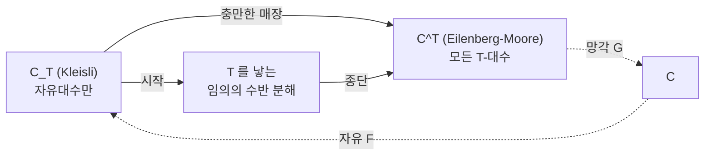

# Kleisli 범주와 Eilenberg–Moore 범주

# 개요

[Monad](monads.md)는 수반에서 나온다. $F \dashv G$ 가 있으면 $T = GF$ 가 monad 다. 반대로 monad $T$ 가 주어졌을 때 $T = GF$ 가 되는 수반은 여럿이고, 이들 전체가 하나의 범주를 이룬다.

그 범주에는 양 끝이 있다. Kleisli 범주가 시작대상이고 Eilenberg–Moore 범주가 종단대상이므로, $T$ 를 낳는 가장 작은 분해와 가장 큰 분해가 존재하고 다른 모든 분해가 그 사이에 낀다.

두 끝의 성격은 다르다. Kleisli 는 부수효과를 가진 함수들의 범주로 프로그래밍의 `bind` 와 do 표기가 사는 곳이고, Eilenberg–Moore 는 $T$ 가 서술하는 대수 구조의 범주로 monoid, 군, 볼록집합이 사는 곳이다. 같은 monad 를 계산으로 읽는가 대수로 읽는가가 두 구성으로 갈린다.

# 직관

## 자유대수와 모든 대수

$T$ 가 리스트 monad 라 하자. $T$ 대수는 리스트를 하나의 값으로 접는 방법이고, 법칙을 붙이면 정확히 monoid 다.

monoid 에는 집합 $X$ 위의 자유 monoid $X^\ast$ 처럼 $T$ 가 만들어 낸 것과 $(\mathbb Z, +)$ 처럼 원래 있던 것이 있다. 둘 다 $T$ 대수지만 전자는 아무 집합에서나 자동으로 생긴다.

Kleisli 범주는 자유대수만 모은 것이고 Eilenberg–Moore 범주는 모든 대수를 모은 것이므로, 전자가 후자의 충만한 부분범주가 된다.

## Kleisli 사상

$X$ 에서 $Y$ 로 가는 Kleisli 사상은 $C$ 의 사상 $X \to T(Y)$ 다. $T$ 가 "실패할 수 있음" 이면 부분함수이고, "여럿을 반환함" 이면 비결정적 함수이며, "로그를 남김" 이면 부작용이 있는 함수다.

$f : X \to T(Y)$ 와 $g : Y \to T(Z)$ 는 치역과 정의역이 맞지 않아 그대로 이어 붙일 수 없다. monad 의 $\mu$ 가 그 어긋남을 메워 합성을 만들고, 그 결과가 Kleisli 범주다.

프로그래밍의 `bind` 가 이 합성이고 do 표기는 Kleisli 합성을 보통 함수 합성처럼 쓰는 문법이다.

## 최소와 최대

$T$ 를 낳는 분해가 주어지면 자유대수가 그 안에 있어야 하므로 Kleisli 에서 그쪽으로 가는 [함자](functors.md)가 항상 있다. 임의의 분해에 등장하는 대상은 $T$ 로 계산되는 구조를 가지므로 Eilenberg–Moore 로 보낼 수 있다.

# 정의

## 분해의 범주

monad $T$ 를 고정한다. 대상은 $T = GF$ 이고 unit 과 $\mu$ 가 monad 의 것과 일치하는 수반 $F \dashv G : \mathcal D \to \mathcal C$ 이다.

사상 $(\mathcal D, F, G) \to (\mathcal D', F', G')$ 은 함자 $K : \mathcal D \to \mathcal D'$ 로 $KF = F'$ 와 $G'K = G$ 를 만족하는 것이다. 이 범주를 $\mathrm{Adj}(T)$ 라 쓴다.

## Kleisli 범주

$\mathcal C_T$ 의 대상은 $\mathcal C$ 의 대상과 같다. 사상은 다음이다.

$$
\mathcal C_T(X,Y)=\mathcal C(X,T(Y))
$$

항등사상은 $\eta_X$ 이고, $f : X \to T(Y)$ 와 $g : Y \to T(Z)$ 의 합성은 다음이다.

$$
g\odot f=\mu_Z\circ T(g)\circ f
$$

monad 법칙이 이 합성의 결합법칙과 단위법칙이다. 자유 함자 $F_T : \mathcal C \to \mathcal C_T$ 는 대상에 항등이고 사상 $f$ 를 $\eta\circ f$ 로 보내며, 망각 함자 $G_T$ 는 $X \mapsto T(X)$ 다.

## Eilenberg–Moore 범주

$\mathcal C^T$ 의 대상은 $T$ 대수 $(A, a: T(A)\to A)$ 로 다음 두 법칙을 만족하는 것이다.

$$
a\circ\eta_A=\mathrm{id}\_A,\qquad a\circ\mu_A=a\circ T(a)
$$

사상 $(A,a) \to (B,b)$ 는 $h : A \to B$ 로 $h\circ a = b\circ T(h)$ 를 만족하는 것이다. 망각 함자 $G^T : \mathcal C^T \to \mathcal C$ 는 $(A,a)\mapsto A$ 이고, 그 왼쪽 수반은 자유대수 $X \mapsto (T(X), \mu_X)$ 다.

## 비교 함자

임의의 분해 $F \dashv G : \mathcal D \to \mathcal C$ 에 대해 다음이 $\mathrm{Adj}(T)$ 의 사상이다.

$$
K:\mathcal D\to\mathcal C^T,\qquad D\mapsto\big(G(D),\ G(\varepsilon_D)\big)
$$

$\varepsilon$ 은 counit 이다. 이 $K$ 를 비교 함자 라 한다.

# 성질

## 시작대상과 종단대상

$\mathcal C_T$ 는 $\mathrm{Adj}(T)$ 의 시작대상이고 $\mathcal C^T$ 는 종단대상이다.

종단성은 위의 $K$ 가 존재하고 유일함에서 나온다. 조건 $G^TK = G$ 가 $K$ 의 바탕 대상을 $G(D)$ 로, $KF = F^T$ 가 자유대수 위에서의 값을 강제하고 나머지는 자연성으로 결정된다.

시작성도 같은 방식이다. $L : \mathcal C_T \to \mathcal D$ 를 $X \mapsto F(X)$ 로 두면 조건이 이 정의를 강제한다. Kleisli 사상 $f : X \to T(Y)$ 는 $F(X) \to F(Y)$ 로 $\varepsilon_{F(Y)}\circ F(f)$ 를 통해 옮겨진다.

## Kleisli 범주의 매장

$\mathcal C^T$ 로 가는 비교 함자를 $\mathcal C_T$ 에 적용하면 $X \mapsto (T(X),\mu_X)$ 이고 충만하고 충실하다. $\mathcal C_T$ 는 자유대수들이 이루는 $\mathcal C^T$ 의 충만한 부분범주와 동치다.

$$
\mathcal C^T\big((T(X),\mu_X),(T(Y),\mu_Y)\big)\cong\mathcal C(X,T(Y))=\mathcal C_T(X,Y)
$$

왼쪽에서 오른쪽은 $\eta_X$ 와의 합성이고 오른쪽에서 왼쪽은 확장 연산 $(-)^\ast$ 이며, 두 구성이 서로 역이다.

## 극한과 쌍대극한

$\mathcal C^T$ 는 $\mathcal C$ 가 가진 모든 극한을 가지며 망각 함자가 그것을 보존하고 반사한다. 대수의 곱은 바탕 대상의 곱에 성분별 구조를 준 것이다. 쌍대극한은 일반적으로 존재가 보장되지 않고, 군의 자유곱이 집합의 합집합과 다른 것이 그 예다.

$\mathcal C_T$ 는 $\mathcal C$ 의 쌍대극한을 물려받지만 극한은 대개 갖지 못한다.

## Monadicity

비교 함자 $K$ 가 동치일 때 $G$ 를 monadic 하다고 한다. 이 경우 $\mathcal D$ 는 $\mathcal C$ 위의 대수 범주로 완전히 재구성된다.

Beck 의 monadicity 정리가 판정 기준을 준다. $G$ 가 왼쪽 수반을 가지고, 동형을 반사하며, $G$ 가 분할 쌍대평행쌍을 가지는 평행쌍의 여핵을 만들고 보존하면 monadic 이다.

| 망각 함자 | monadic 인가 |
|---|---|
| $\mathbf{Grp}\to\mathbf{Set}$ | 예 |
| $\mathbf{Ring}\to\mathbf{Set}$ | 예 |
| $R\text{-}\mathbf{Mod}\to\mathbf{Set}$ | 예 |
| $\mathbf{Top}\to\mathbf{Set}$ | 아니오 |
| $\mathbf{Field}\to\mathbf{Set}$ | 아니오 |

위상공간에서는 같은 바탕집합에 서로 다른 위상이 있고 연속 전단사가 동형이 아닐 수 있어 동형을 반사하지 못한다. 체는 왼쪽 수반 가 없다.

콤팩트 Hausdorff 공간의 범주가 초필터 monad 에 대해 monadic 이라는 것이 이 정리의 대표적 응용이다.

# 활용

## 프로그래밍의 do 표기

Kleisli 범주는 효과를 가진 계산의 범주다. `return` 이 $\eta$ 이고 $\gt\gt =$ 가 확장 연산이며, do 표기는 Kleisli 합성의 연쇄를 명령형처럼 보이게 쓴 문법이다.

monad 법칙이 이 표기의 정당성이다. 결합법칙이 do 블록을 어디서 끊어 함수로 빼내도 의미가 같음을, 단위법칙이 `return` 을 넣고 빼도 같음을 보장한다.

## monad 로 본 대수 구조

Eilenberg–Moore 범주는 monad 가 서술하는 대수 구조가 무엇인지를 답한다. 거꾸로 어떤 구체적 범주가 어떤 monad 의 대수 범주인지를 묻는 것이 monadicity 문제이고, 답이 예이면 자유대상의 존재와 극한의 계산과 여핵의 구성이 일반 정리로 내려온다.

분포 monad 의 대수는 볼록집합이고 초필터 monad 의 대수는 콤팩트 Hausdorff 공간이다. 대수 구조의 범위가 그만큼 넓다.

## 효과의 합성과 monad 변환자

Kleisli 범주를 층층이 쌓아 여러 효과를 조합하는 것이 monad 변환자다. 두 monad 의 합성이 일반적으로 monad 가 아니므로 필요한 장치이고, 합성이 가능한 조건을 주는 것이 분배 법칙이다. 분배 법칙은 한쪽 monad 를 다른 쪽의 Eilenberg–Moore 범주로 들어 올리는 자료와 같다.

## 의미론

부분성, 비결정성, 확률, 상태, 입출력 같은 계산 효과를 monad 로 모형화하면 프로그램의 의미가 Kleisli 사상이 된다. 서로 다른 효과를 같은 틀에서 비교하고 프로그램 변환의 정당성을 범주적 등식으로 환원할 수 있다. Moggi 의 계산의 monad 의미론이며 함수형 언어 설계에 반영되었다.

# 연관 문서

## 선수지식

- [Monad](monads.md)

## 더 알아보기

아직 연결한 문서가 없다.

#category_theory #computation #algebra #construction
