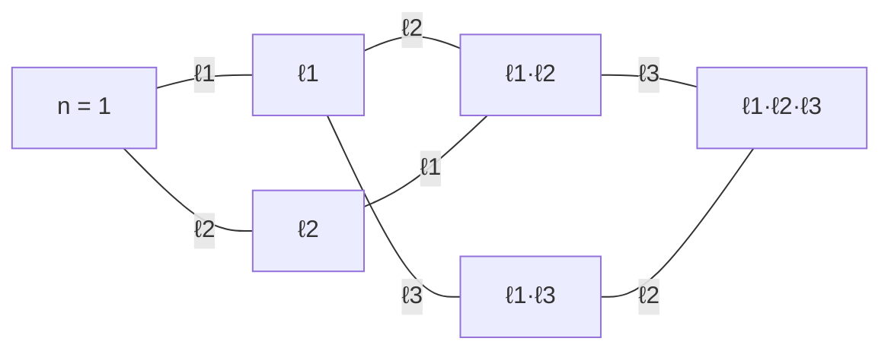

# Kolyvagin 계와 핵심계수

# 개요

[Euler 계](euler-systems.md)의 논법에는 두 가지 한계가 있다. 결론이 상계뿐이라 Selmer 군이 이보다 작다는 것은 얻어도 정확한 크기는 얻지 못하고, 자취 정합성을 만족하는 대수적 원소의 탑을 만드는 존재성 문제가 사례마다 따로 풀려야 한다.

Mazur 와 Rubin 은 Euler 계 자체를 버리고 거기서 나온 유도류의 족만 남겨 공리화했다. 이것이 **Kolyvagin 계**이고, 물음이 그런 족의 존재에서 그런 족 전체가 이루는 가군의 구조로 바뀐다.

Selmer 구조 $\mathcal F$ 에 **핵심계수** $\chi(\mathcal F)\in\mathbb Z$ 라는 정수 하나가 붙고 이 수가 가군을 결정한다.

| $\chi(\mathcal F)$ | Kolyvagin 계의 가군 $\mathbf{KS}(T,\mathcal F)$ |
| --- | --- |
| $0$ | $0$ (쓸 수 있는 계가 없다) |
| $1$ | 자유 순위 $1$ — 생성원 하나가 Selmer 군을 **정확히** 계산한다 |
| $\ge2$ | 지나치게 크고 경직성이 없다 |

핵심계수는 국소 데이터만으로 계산된다. 각 자리에서 국소 조건의 차원과 $H^0$ 의 차원을 빼서 더하면 되므로, Kolyvagin 계 논법이 통하는지가 유한한 선형대수로 판정된다. 상계가 등식으로 바뀌는 지점이 여기다.

# 직관

## 유도류의 공리화

Euler 계 $\mathbf{c}=\lbrace c_F\rbrace$ 는 수체의 탑 위에 얹힌 거대한 대상이고, Kolyvagin 유도 연산자가 거기서 유도류 $\kappa_n\in H^1(K,T)$ 를 뽑아낸다. 실제 증명에서 쓰이는 것은 $\kappa_n$ 뿐이다. $c_F$ 는 $\kappa_n$ 을 만든 뒤 다시 등장하지 않는다.

그러므로 $\kappa$ 가 만족하는 성질을 정의로 삼는다. 조건은 둘이다.

1. $\kappa_n$ 은 $n$ 에서 **변형된** Selmer 군에 산다. 곧 $n$ 의 소인수 $\ell$ 마다 원래 조건을 어기되, 정확히 지정된 방식으로만 어긴다.
2. $\kappa_n$ 과 $\kappa_{n\ell}$ 은 $\ell$ 자리에서 **정합**한다. $\kappa_n$ 의 불분기 성분이 $\kappa_{n\ell}$ 의 분기 성분을 결정한다.

두 번째 조건이 Euler 계의 자취 정합성을 대신한다. 자취 관계가 $\ell$ 자리의 국소 관계로 번역된 것이다.

## 국소 조건의 변형

Selmer 군은 자리마다 부분군 $H^1_{\mathcal F}(K_v,T)\subseteq H^1(K_v,T)$ 를 지정해 잘라낸 것이고, 한 자리 $\ell$ 에서 조건을 넓히면 Selmer 군이 커진다.

[국소 Tate 쌍대성](poitou-tate.md) 아래 조건을 넓히면 그 소멸자가 좁아져 쌍대 Selmer 군 $H^1_{\mathcal F^\ast}(K,T^\ast)$ 가 작아지고, 두 변화량이 정확히 상쇄된다.

$$
\frac{|H^1_{\mathcal F'}(K,T)|}{|H^1_{\mathcal F}(K,T)|}\cdot\frac{|H^1_{\mathcal F^*}(K,T^*)|}{|H^1_{\mathcal F'^*}(K,T^*)|}=\frac{|H^1_{\mathcal F'}(K_\ell,T)|}{|H^1_{\mathcal F}(K_\ell,T)|}
$$

한쪽이 올라간 만큼 다른 쪽이 내려가고 기울기는 국소적으로 읽힌다. $\ell$ 자리를 하나 열어 $s$ 의 국소 성분을 죽이는 Kolyvagin 논법이 이 조작이다.

## 핵심계수

위 항등식은 차 $\dim H^1_{\mathcal F}(K,T)-\dim H^1_{\mathcal F^\ast}(K,T^\ast)$ 가 국소 데이터로 정해진다는 뜻이고, 이 차가 핵심계수 $\chi(\mathcal F)$ 다.

Kolyvagin 소수 $\ell$ 에서 쓰는 변형은 불분기 조건을 같은 크기의 가로지름 조건으로 바꾸는 것이므로 $\chi$ 가 변하지 않는다. $\chi$ 는 $n$ 에 의존하지 않고 Kolyvagin 계가 돌아다니는 격자 전체에서 상수다.

## 핵심계수 $1$

$\chi=1$ 은 Selmer 쪽과 쌍대 Selmer 쪽의 균형이 한 칸 어긋나 있다는 뜻이다. 이 한 칸이 Kolyvagin 계에 자유도 $1$ 을 주고 그 자유도가 곱셈 상수 하나로 나타나므로, 어떤 Euler 계에서 나온 계든 서로 상수배다.

$\chi=0$ 이면 자유도가 없어 계가 $0$ 뿐이고 $\chi\ge2$ 이면 계가 너무 많아 하나로 나머지를 통제하지 못한다.

타원곡선에서 자기쌍대 구조 자체는 $\chi=0$ 이고 $p$ 자리의 조건을 완화해야 $\chi=1$ 이 된다. 그 계산에서 $-1$ 을 기여하는 것은 실수 자리다. 복소켤레의 $+1$ 고유공간이 $1$ 차원이라는 것, 곧 $E(\mathbb R)$ 이 실차원 하나를 갖는다는 것이 균형을 어긋나게 만든다.

# 정의

이하 $R$ 은 $\mathbb Z/p^k$ 또는 $\mathbb Z_p$ 이고 $T$ 는 $R$ 위 자유이고 $G_K$ 가 연속으로 작용하는 가군이다. $T^\ast=\mathrm{Hom}(T,\mu_{p^k})$ 를 Cartier 쌍대라 한다.

## Selmer 구조

**Selmer 구조** $\mathcal F$ 는 다음 자료다.

- 유한집합 $\Sigma\supseteq\lbrace p,\infty\rbrace\cup\lbrace T\text{ 가 분기하는 자리}\rbrace$
- 각 $v\in\Sigma$ 마다 부분가군 $H^1_{\mathcal F}(K_v,T)\subseteq H^1(K_v,T)$

$v\notin\Sigma$ 에서는 불분기 조건 $H^1_{\mathrm{ur}}(K_v,T)=H^1(K_v^{\mathrm{ur}}/K_v,T^{I_v})$ 를 쓴다. 그러면

$$
H^1_{\mathcal F}(K,T)=\ker\Big(H^1(K_\Sigma/K,T)\longrightarrow\bigoplus_{v\in\Sigma}\frac{H^1(K_v,T)}{H^1_{\mathcal F}(K_v,T)}\Big)
$$

이다. **쌍대 구조** $\mathcal F^\ast$ 는 각 자리에서 국소 Tate 쌍대성의 소멸자로 정의한다.

$$
H^1_{\mathcal F^*}(K_v,T^*):=H^1_{\mathcal F}(K_v,T)^{\perp}
$$

$\mathcal F=\mathcal F^\ast$ 이면 **자기쌍대**라 한다. 타원곡선의 $T=E[p^k]$ 에 Weil 쌍이 주는 구조가 대표적이다.

## 세 가지 변형

한 자리 $\ell$ 에서 조건을 바꾸는 방식은 셋이다.

| 이름 | 조건 | 기호 |
| --- | --- | --- |
| 완화(relaxed) | $H^1(K_\ell,T)$ 전체 | $\mathcal F^{\ell}$ |
| 엄격(strict) | $0$ | $\mathcal F_{\ell}$ |
| 가로지름(transverse) | 아래 정의 | $\mathcal F(\ell)$ |

**Kolyvagin 소수**란 $\ell\notin\Sigma$ 이면서 $\ell\equiv1\ (\mathrm{mod}\ p^k)$ 이고 $\mathrm{Fr}_\ell$ 이 $T$ 위에 자명하게 작용하는 소수다. 이때 국소 코호몰로지가 두 조각으로 갈린다.

$$
H^1(K_\ell,T)=H^1_{\mathrm{f}}(K_\ell,T)\oplus H^1_{\mathrm{tr}}(K_\ell,T),\qquad H^1_{\mathrm{f}}\cong T\cong H^1_{\mathrm{tr}}
$$

$H^1_{\mathrm{f}}$ 는 불분기 부분이고 $H^1_{\mathrm{tr}}$ 는 $\ell$ 의 차수 $p^k$ 순종 확대 $K_\ell(\ell^{1/p^k})$ 에서 죽는 류들이며, 둘은 크기가 같다. **가로지름 조건**은 $\ell$ 에서 $H^1_{\mathrm{f}}$ 대신 $H^1_{\mathrm{tr}}$ 를 쓰는 것이다.

$n$ 이 Kolyvagin 소수들의 곱일 때 $\mathcal F(n)$ 은 $n$ 의 모든 소인수에서 가로지름으로 바꾼 구조다. $\mathcal N$ 을 그런 $n$ 들의 집합이라 하면, $\mathcal N$ 은 $n$ 과 $n\ell$ 을 잇는 간선으로 그래프가 된다.



Kolyvagin 계는 이 그래프의 각 정점에 코호몰로지 류를 하나씩 얹고, 간선마다 정합 조건을 부과한 것이다.

## 유한-특이 사상

Kolyvagin 소수 $\ell$ 에서 두 조각이 모두 $T$ 와 동형이므로, 그 동형을 합성해 표준 동형

$$
\phi_\ell^{\mathrm{fs}}\colon H^1_{\mathrm{f}}(K_\ell,T)\ \xrightarrow{\ \sim\ }\ H^1_{\mathrm{tr}}(K_\ell,T)
$$

를 얻는다. $\ell\equiv1\ (\mathrm{mod}\ p^k)$ 라는 요구가 이 동형을 준다. 이것이 **유한-특이 사상**이고 자취 정합성이 번역되어 앉는 자리다.

## Kolyvagin 계

$$
\mathbf{KS}(T,\mathcal F,\mathcal P)=\Big\lbrace\kappa=(\kappa_n)_{n\in\mathcal N}\ :\ \kappa_n\in H^1_{\mathcal F(n)}(K,T),\ \ \phi_\ell^{\mathrm{fs}}\big(\mathrm{loc}_\ell(\kappa_n)\big)=\mathrm{loc}_\ell(\kappa_{n\ell})\ \ (\forall\thinspace\ell\mid n\ell)\Big\rbrace
$$

$\mathcal P$ 는 허용하는 Kolyvagin 소수의 집합이고 위 집합은 $R$ 가군을 이룬다. 정의에 대수적 원소의 탑이 나오지 않고 코호몰로지와 국소 조건만 쓰인다.

## 핵심계수

$R=\mathbb F_p$ 인 경우(일반 $R$ 은 잔여체로 환원한다) **핵심계수**를

$$
\chi(\mathcal F):=\dim_{\mathbb F_p}H^1_{\mathcal F}(K,T)-\dim_{\mathbb F_p}H^1_{\mathcal F^*}(K,T^*)
$$

로 정의한다. 정의는 대역적이지만 아래 Greenberg–Wiles 공식이 국소 데이터로 계산해 준다.

# 성질

## Greenberg–Wiles 공식

Selmer 군의 대역 Euler 표수 공식은 다음과 같다.

$$
\frac{|H^1_{\mathcal F}(K,T)|}{|H^1_{\mathcal F^*}(K,T^*)|}=\frac{|H^0(K,T)|}{|H^0(K,T^*)|}\prod_{v}\frac{|H^1_{\mathcal F}(K_v,T)|}{|H^0(K_v,T)|}
$$

곱은 모든 자리에 걸치고 $v\notin\Sigma$ 에서 항이 $1$ 이라 유한 곱이다. 증명은 [Poitou–Tate 완전열](poitou-tate.md)에 국소 Euler 표수 공식을 결합하는 것이다. 양변에 $\log_p$ 를 씌우면

$$
\chi(\mathcal F)=\sum_v\Big(\dim H^1_{\mathcal F}(K_v,T)-\dim H^0(K_v,T)\Big)+\dim H^0(K,T)-\dim H^0(K,T^*)
$$

가 되고 우변은 전부 국소 계산이다.

## 시소 보조정리

$\mathcal F\subseteq\mathcal F'$ 가 자리 $\ell$ 하나에서만 다르다 하자. Greenberg–Wiles 를 두 구조에 적용해 나누면 다른 모든 자리의 항이 지워지고 직관 절의 항등식이 남는다.

$$
\frac{|H^1_{\mathcal F'}(K,T)|}{|H^1_{\mathcal F}(K,T)|}\cdot\frac{|H^1_{\mathcal F^*}(K,T^*)|}{|H^1_{\mathcal F'^*}(K,T^*)|}=\frac{|H^1_{\mathcal F'}(K_\ell,T)|}{|H^1_{\mathcal F}(K_\ell,T)|}
$$

따름결과는 둘이다.

- **완화는 $\chi$ 를 올린다.** $\ell$ 에서 불분기 조건, 곧 $\dim=\dim H^0(K_\ell,T)$ 인 조건을 전체로 넓히면 $\chi$ 가 $\dim H^1(K_\ell,T)-\dim H^1_{\mathrm{ur}}(K_\ell,T)$ 만큼 커진다. Kolyvagin 소수에서 이 값은 $\mathrm{rank}\thinspace T$ 다.
- **가로지름은 $\chi$ 를 보존한다.** $H^1_{\mathrm{f}}$ 와 $H^1_{\mathrm{tr}}$ 의 크기가 같으므로 우변이 $1$ 이다. 그러므로 모든 $n\in\mathcal N$ 에 대해 $\chi(\mathcal F(n))=\chi(\mathcal F)$ 다.

두 번째가 핵심계수를 불변량으로 만든다. Kolyvagin 계는 $\mathcal N$ 위를 돌아다니지만 $\chi$ 는 어디서나 같다.

## 자기쌍대 구조의 핵심계수

$\mathcal F=\mathcal F^\ast$ 이고 $T\cong T^\ast$ 이면 두 군이 같으므로 $\chi=0$ 이다. $K=\mathbb Q$ , $T=E[p]$ , $p\ge5$ 이고 $E[p]$ 가 기약이며 $E$ 가 $p$ 에서 좋은 환원을 가질 때 자리별 기여는 다음과 같다.

| 자리 $v$ | $\dim H^1_{\mathcal F}(\mathbb Q_v,T)$ | $\dim H^0(\mathbb Q_v,T)$ | 기여 |
| --- | --- | --- | --- |
| $\infty$ | $0$ | $1$ | $-1$ |
| $p$ | $1$ | $0$ | $+1$ |
| 나쁜 환원 $\ell$ | $\dim H^1_{\mathrm{ur}}$ | 같음 | $0$ |
| 그 밖 | $\dim H^1_{\mathrm{ur}}$ | 같음 | $0$ |

$p$ 가 홀수라 $H^1(\mathbb R,T)=0$ 이고 $\det=-1$ 이므로 복소켤레의 고유공간이 $1$ 차원씩 갈려 $\dim H^0(\mathbb R,T)=1$ 이다. 합이 $0$ 이므로 자기쌍대 구조만으로는 Kolyvagin 계가 없다.

## $p$ 에서의 완화

위 표에서 $v=p$ 의 조건만 $H^1(\mathbb Q_p,T)$ 전체로 바꾸면 $\dim H^1(\mathbb Q_p,E[p])=2$ 이므로 기여가 $+2$ 가 되고

$$
\chi(\mathcal F^{p})=-1+2=1
$$

이다. 실수 자리의 $-1$ 이 남아 균형을 한 칸 어긋나게 만든다. 이 완화된 구조의 쌍대는 $p$ 에서 엄격한 구조이므로 결론은 엄격 Selmer 군의 정확한 크기이고, [Kato](euler-systems.md) 의 zeta 원소가 사는 자리다.

다음은 자리별 기여를 더해 두 경우를 비교한다.

```javascript
// chi(F) = sum_v ( dim H^1_F(K_v,T) - dim H^0(K_v,T) ) + dim H^0(K,T) - dim H^0(K,T*)
// K = Q, T = E[p], p >= 5, E[p] 기약, E 는 p 에서 좋은 환원.
function coreRank(localConditions, h0Global = 0, h0GlobalDual = 0) {
  const sum = localConditions.reduce((acc, { dimF, dimH0 }) => acc + dimF - dimH0, 0);
  return sum + h0Global - h0GlobalDual;
}

const selfDual = [
  { v: 'inf', dimF: 0, dimH0: 1 }, // H^1(R,T)=0, T^{c=1} 은 1 차원
  { v: 'p', dimF: 1, dimH0: 0 }, // Bloch-Kato 유한부분
  { v: 'bad', dimF: 1, dimH0: 1 }, // 불분기: 두 차원이 같다
];
const relaxedAtP = selfDual.map((c) => (c.v === 'p' ? { ...c, dimF: 2 } : c));

console.log(coreRank(selfDual)); // 0  -> Kolyvagin 계가 없다
console.log(coreRank(relaxedAtP)); // 1  -> 자유 순위 1
```

## 주정리

$T$ 가 잔여 표현의 상이 충분히 크다는 조건을 만족한다고 하자. Mazur–Rubin 의 결론은 셋이다.

- $\chi(\mathcal F)=0$ 이면 $\mathbf{KS}(T,\mathcal F,\mathcal P)=0$ 이다. 정합 조건이 너무 많아 $0$ 만 살아남는다.
- $\chi(\mathcal F)=1$ 이면 $\mathbf{KS}(T,\mathcal F,\mathcal P)$ 는 **자유 순위 $1$ 인** $R$ 가군이다.
- $\chi(\mathcal F)\ge2$ 이면 가군이 매우 크고, 원소 하나가 나머지를 결정하지 못한다.

$\chi=1$ 이면 서로 다른 Euler 계에서 나온 Kolyvagin 계가 서로 상수배다. 어떤 Euler 계를 썼는가가 사라지고 그 계가 $p$ 로 몇 번 나누어지는가만 남는다.

## Selmer 군의 계산

$\chi=1$ 이고 $\kappa$ 가 $\mathbf{KS}$ 의 생성원이라 하자. 각 $i\ge0$ 에 대해

$$
\partial_i(\kappa):=\min\lbrace\thinspace\mathrm{ord}_p(\kappa_n)\ :\ n\in\mathcal N,\ \nu(n)\le i\thinspace\rbrace
$$

로 두면($\nu(n)$ 은 $n$ 의 소인수 개수, $\mathrm{ord}\_p$ 는 $\kappa_n$ 이 $p$ 로 나누어지는 횟수), $\partial_i$ 는 감소하다가 $0$ 에서 멈추는 열이고, 그 감소 폭이 쌍대 Selmer 군 $H^1_{\mathcal F^\ast}(K,T^\ast)$ 의 초등인자를 그대로 준다. 특히 길이가

$$
\mathrm{length}_R\thinspace H^1_{\mathcal F^*}(K,T^*)=\sum_{i\ge0}\partial_i(\kappa)
$$

로 등식이 나온다. Euler 계가 주던 부등식이 여기서 등식이 된다. 남는 것은 $\kappa$ 가 생성원인지, 곧 $\partial_0(\kappa)$ 가 최소값인지를 확인하는 문제이고 이것이 Euler 계 쪽에서 넘어오는 유일한 입력이다.

$\kappa_1\not\equiv0\ (\mathrm{mod}\ p)$ 이면 모든 $\partial_i=0$ 이라 $H^1_{\mathcal F^\ast}(K,T^\ast)=0$ 이다. 유도류가 $p$ 로 나누어지지 않으면 Selmer 군이 죽는다는 Kolyvagin 의 고전적 결론이 이 형식에서 한 줄이다.

## 핵심 정점

$\chi=1$ 일 때 $\mathcal N$ 의 정점 가운데 $\dim H^1_{\mathcal F(n)}(K,T)=1$ 이고 $H^1_{\mathcal F(n)^\ast}(K,T^\ast)=0$ 인 것을 **핵심 정점**(core vertex)이라 한다. 핵심 정점이 항상 존재하고 그래프 안에 조밀하게 퍼져 있다는 것이 [Chebotarev](chebotarev.md) 논법으로 증명되며, 이것이 위 구조 정리의 기술적 열쇠다. 증명의 무게가 적당한 $\ell$ 을 고르는 데 실려 있는 것은 Kolyvagin 의 원래 논법과 같다.

# 활용

## Euler 계에서 Kolyvagin 계로

Euler 계가 주어지면 유도 연산자를 적용해 $\kappa_n$ 을 만들고, 자취 관계가 두 번째 공리로 번역된다. 곧 자연스러운 사상

$$
\lbrace\text{Euler 계}\rbrace\longrightarrow\mathbf{KS}(T,\mathcal F,\mathcal P)
$$

이 있다. 이 사상은 단사도 전사도 아니지만 $\chi=1$ 이면 치역이 자유 순위 $1$ 가군 안에 앉으므로 어느 배수인지만 따지면 된다. 이론의 무게중심이 존재성에서 정수 하나의 계산으로 옮겨 간다.

## 순환체 주추측

$T=\mathbb Z_p(1)$ 과 순환체 단수의 Euler 계가 원형이다. $\mathbb Q$ 의 단수 계수가 $1$ 이라는 것의 코호몰로지판으로 $\chi=1$ 이 나오고, Kolyvagin 계의 생성원이 순환체 단수가 주는 계와 상수배로 비교된다. 그 상수를 해석적 유수 공식으로 계산하면 [Iwasawa 주추측](iwasawa-main-conjecture.md)이 나오고, Rubin 의 원래 증명이 얻던 한쪽 나눔이 등식으로 강화된다.

## 타원곡선의 Selmer 군

$T=T_p(E)$ 에서 $p$ 자리를 완화한 구조가 $\chi=1$ 이고, Kato 의 zeta 원소가 그 구조의 Kolyvagin 계를 준다. 결론은 엄격 Selmer 군의 크기가 $p$ 진 $L$ 함수의 소멸 차수로 정확히 주어진다는 것이고, 이 진술이 [BSD](birch-swinnerton-dyer.md) 의 $p$ 진 판본이다. Heegner 점 쪽 입력과 합쳐지면 해석적 순위 $\le1$ 에서 $\text{Ш}$ 의 $p$ 부분 위수까지 통제된다.

## 이분 Euler 계

허수이차체 위의 반순환 상황에서는 자리 $\ell$ 이 분해하는지 관성인지에 따라 국소 조건의 차원이 달라져, 소수를 하나 더할 때 $\chi$ 가 $0$ 과 $1$ 을 번갈아 오간다. Howard 는 이 경우를 **이분 Euler 계**라 부르고 $\chi=0$ 인 정점에 코호몰로지 류 대신 모듈러 형식의 특수값을 얹었다. Gross–Zagier 와 Kolyvagin 이 하나의 격자 위에 놓인다.

## 형식화의 범위

Kolyvagin 계의 문법에 필요한 것은 Galois 가군 하나와 국소 조건의 지정뿐이다. [변형환](deformation-rings.md)의 접공간 계산, 고차 무게 모듈러 형식의 Bloch–Kato 추측, $p$ 진 $L$ 함수와 Selmer 군의 비교가 같은 언어로 진술된다. 국소 조건을 하나 바꿀 때 Selmer 군이 얼마나 변하는가가 공통의 물음이고, 그 답을 담은 정수가 핵심계수다.

[^1]: B. Mazur, K. Rubin, *Kolyvagin Systems*, Memoirs AMS **168** (2004) 가 핵심계수와 구조 정리의 원전이다. Greenberg–Wiles 공식은 A. Wiles, *Modular elliptic curves and Fermat's Last Theorem*, Ann. of Math. **141** (1995) 의 부록과 R. Greenberg 의 계산에서 왔고, 교과서 서술은 K. Rubin, *Euler Systems* (Annals of Math. Studies 147, 2000) 의 1 장에 있다. 이분 Euler 계는 B. Howard, *Bipartite Euler systems*, J. reine angew. Math. **597** (2006).

# 연관 문서

## 선수지식

- [Euler 계와 Kolyvagin 유도류](euler-systems.md)

## 더 알아보기

아직 연결한 문서가 없다.

#number_theory #theorem #algebra
