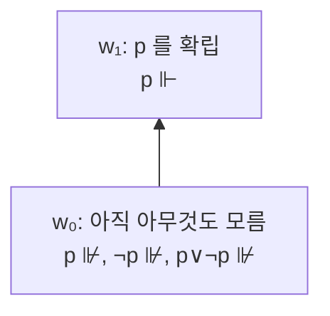

# 직관주의 논리의 Kripke 의미론

# 개요

[직관주의 논리](intuitionism.md)는 배중률을 받아들이지 않는다. 그런데 "받아들이지 않는다" 를 어떻게 정확히 보일 수 있는가. 증명 체계 안에서는 어떤 식이 증명되지 않는다는 사실을 직접 말하기 어렵다.

Kripke 의미론이 그 도구를 제공한다. 아직 결론이 나지 않은 상태들을 [부분순서](partial-orders.md)로 배열하고, 순서가 커질수록 정보가 늘어나는 것으로 해석한다. 그러면 "지금은 $p$ 도 $\neg p$ 도 성립하지 않는" 상태를 그림 하나로 제시할 수 있고, 배중률이 타당하지 않다는 것이 반례로 증명된다.

이 의미론은 직관주의 논리에 대해 건전하고 완전하다. 즉 모든 Kripke 모형에서 참인 식은 정확히 증명 가능한 식이며, 그래서 증명 불가능성을 보이는 표준적인 방법이 되었다.

# 직관

## 정보는 쌓이기만 한다

상태 $w \le v$ 는 $v$ 가 $w$ 보다 더 많은 것을 아는 미래다. 한 번 확립된 사실은 취소되지 않는다는 것이 이 의미론의 기본 규칙이고, 수학적 증명이 그렇다는 관찰을 반영한다. 아직 참인지 모르는 명제는 지금 성립하지 않을 뿐 나중에 성립할 수 있다.

여기서 직관주의의 성격이 자연스럽게 나온다. $p \vee \neg p$ 를 주장하려면 지금 둘 중 하나를 확립해야 한다. $p$ 를 아직 모르고, 미래에 $p$ 가 확립될 가능성도 남아 있다면 $\neg p$ 도 주장할 수 없다. 따라서 배중률이 성립하지 않는다.

## 함의는 미래 전체를 본다

고전 논리에서 $A \to B$ 는 현재의 진리값만 본다. 여기서는 다르다. 지금 이후의 모든 상태에서 $A$ 가 성립할 때마다 $B$ 도 성립해야 한다.

이 차이가 결정적이다. 함의가 미래를 양화하므로, 나중에 $A$ 가 확립될 가능성이 있다면 지금 $A \to B$ 를 주장하려면 그 경우까지 대비해야 한다. 부정은 $A \to \bot$ 이므로 "어떤 미래에도 $A$ 가 확립되지 않는다" 를 뜻하고, 이것이 "지금 $A$ 를 모른다" 보다 훨씬 강한 주장이다.



$w_0$ 에서 $p$ 가 성립하지 않는다. 그렇다고 $\neg p$ 가 성립하지도 않는다. 미래 $w_1$ 이 $p$ 를 확립하기 때문이다. 따라서 $p \vee \neg p$ 가 $w_0$ 에서 성립하지 않는다.

# 정의

## Kripke frame 과 모형

Kripke frame 은 상태들의 부분순서집합 $W$ 다. $w \le v$ 는 $v$ 가 $w$ 보다 더 많은 정보를 가진 미래 상태라는 뜻이다. 각 원자명제 $p$ 가 성립하는 상태들은 위로 닫혀야 한다.

$$
w\Vdash p\ \text{이고}\ w\le v\quad\Longrightarrow\quad v\Vdash p
$$

## Forcing

$$
\begin{aligned}
w\Vdash A\wedge B&\iff w\Vdash A\ \text{이고}\ w\Vdash B\\
w\Vdash A\vee B&\iff w\Vdash A\ \text{또는}\ w\Vdash B\\
w\Vdash A\to B&\iff \forall v\ge w\,(v\Vdash A\Rightarrow v\Vdash B)\\
w&\nVdash\bot
\end{aligned}
$$

부정은 $\neg A := A \to \bot$ 로 정의하므로 $w \Vdash \neg A$ 는 "$w$ 이후의 어떤 상태도 $A$ 를 성립시키지 않는다" 를 뜻한다.

식이 모든 Kripke 모형의 모든 상태에서 성립하면 타당하다고 한다.

# 성질

## Persistence

모든 논리식이 위로 닫힘을 만족한다. $w \Vdash A$ 이고 $w \le v$ 이면 $v \Vdash A$ 다.

원자명제에서는 모형의 조건이고, 복합식에서는 구조적 귀납으로 증명한다. 함의의 경우 $v$ 이후의 상태들이 $w$ 이후의 상태들에 포함되므로 조건이 그대로 이어진다. 함의의 정의가 모든 미래를 양화한 덕에 이 성질이 자동으로 보존된다는 점이 설계의 핵심이다.

## 배중률의 반례

두 상태 $w_0 \le w_1$ 만 있고 원자명제 $p$ 가 $w_1$ 에서만 성립하는 모형을 보자.

- $w_0 \nVdash p$ 다. 모형의 정의에 의해 그렇다.
- $w_0 \nVdash \neg p$ 다. $w_1 \ge w_0$ 이고 $w_1 \Vdash p$ 이므로 함의의 조건이 깨진다.
- 따라서 $w_0 \nVdash p \vee \neg p$ 다.

이것은 배중률의 부정을 증명한 것이 아니다. 배중률이 모든 직관주의 모형에서 타당하지는 않음을 보인 반례다. 직관주의 논리는 $\neg(p \vee \neg p)$ 를 증명하지 않으며, 오히려 $\neg\neg(p \vee \neg p)$ 는 증명한다.

```python
def forces(model, w, f):
    """model: (states, leq, atoms). f: ('atom', p) | ('and'|'or'|'imp', A, B) | ('bot',)."""
    states, leq, atoms = model
    tag = f[0]
    if tag == "bot":
        return False
    if tag == "atom":
        return f[1] in atoms[w]
    if tag == "and":
        return forces(model, w, f[1]) and forces(model, w, f[2])
    if tag == "or":
        return forces(model, w, f[1]) or forces(model, w, f[2])
    if tag == "imp":
        return all(not forces(model, v, f[1]) or forces(model, v, f[2])
                   for v in states if leq(w, v))
    raise ValueError(tag)


states = ["w0", "w1"]
leq = lambda a, b: a == b or (a, b) == ("w0", "w1")
atoms = {"w0": set(), "w1": {"p"}}
M = (states, leq, atoms)

P = ("atom", "p")
NOT = lambda A: ("imp", A, ("bot",))
lem = ("or", P, NOT(P))

print(forces(M, "w0", P))            # False
print(forces(M, "w0", NOT(P)))       # False
print(forces(M, "w0", lem))          # False: 배중률 반례
print(forces(M, "w1", lem))          # True
print(forces(M, "w0", NOT(NOT(lem))))  # True: 이중부정은 성립
print(forces(M, "w0", ("imp", NOT(NOT(P)), P)))   # False: ¬¬p → p 도 실패
```

$w_0$ 에서 배중률과 이중부정 제거가 모두 실패하고, 배중률의 이중부정은 성립한다. 고전 논리와 직관주의 논리의 간극이 정확히 이중부정만큼이라는 사실이 수치로 확인된다.

## 건전성과 완전성

직관주의 명제논리의 정리와 모든 Kripke 모형에서 타당한 식이 정확히 일치한다. 건전성은 각 추론 규칙이 forcing 을 보존함을 확인하는 귀납이고, 완전성은 무모순인 이론들을 상태로 삼는 정준 모형을 구성해 얻는다.

따라서 증명 불가능성을 보이려면 반모형 하나를 제시하면 충분하다. 유한 모형 성질도 성립하므로 반례를 유한한 그림으로 찾을 수 있고, 그 결과 직관주의 명제논리의 정리 판정은 결정 가능하다. 다만 PSPACE-완전이라 고전 명제논리의 coNP-완전보다 어렵다.

## 다른 의미론과의 관계

| 의미론 | 구조 | 대응 |
|---|---|---|
| Kripke | 부분순서 상태 | 정보의 증가 |
| [Heyting algebra](heyting-algebras.md) | 격자 | 대수적 진리값 |
| 위상 | 열린집합 | $\vee$ 는 합집합, $\to$ 는 내부 |

세 의미론이 모두 직관주의 논리에 대해 완전하며 서로 번역된다. Kripke frame 의 위로 닫힌 집합들이 Heyting algebra 를 이루고, 위상공간의 열린집합 격자도 그렇다. 격자에서 $A \to B$ 가 $A \wedge x \le B$ 를 만족하는 최대의 $x$ 로 정의되는데, 이 상대 여원의 개념이 Kripke 의 "모든 미래에 대한 양화" 와 같은 일을 한다.

# 활용

## 증명 불가능성의 도구

어떤 식이 직관주의적으로 증명되지 않음을 보일 때 표준적으로 쓰인다. 배중률, 이중부정 제거, Peirce 법칙, de Morgan 법칙의 한쪽 방향이 모두 작은 유한 모형으로 반박된다. 거꾸로 어떤 고전적 정리를 직관주의적으로 살리려면 이중부정을 적절히 삽입해야 한다는 지침도 반모형을 보며 얻는다.

## 양상논리와 지식

같은 구조가 양상논리에서 필연성과 가능성을 해석하는 데 쓰인다. 접근가능성 관계의 성질에 따라 서로 다른 양상 체계가 나오며, 반사적이고 추이적이면 S4 가 되고 그것이 직관주의 논리의 번역 대상이다.

인식논리에서는 상태가 "행위자가 구별하지 못하는 세계" 이고, 분산 시스템의 지식 논리에서는 프로세스가 관측한 것들이다. 시간 논리에서는 상태가 시점이 된다. 하나의 틀이 여러 해석을 지탱한다.

## 계산과의 연결

상태를 계산 단계로 읽으면 persistence 가 "이미 계산된 값은 사라지지 않는다" 가 된다. [Curry–Howard 대응](curry-howard.md)에서 직관주의 증명이 프로그램에 대응하므로, 이 의미론은 프로그램이 실행되며 정보를 쌓아 가는 과정의 모형이 된다. 타입 시스템의 부분타입 관계, 점진적 타이핑, 정보 흐름 분석이 같은 순서 구조를 공유한다.[^1]

[^1]: Stanford Encyclopedia of Philosophy, *Intuitionistic Logic*, §5. Kripke 의미론, persistence 조건과 forcing 절. https://plato.stanford.edu/entries/logic-intuitionistic/

# 연관 문서

## 선수지식

- [직관주의](intuitionism.md)
- [부분순서](partial-orders.md)

## 더 알아보기

- [Heyting algebra](heyting-algebras.md)

#logic
