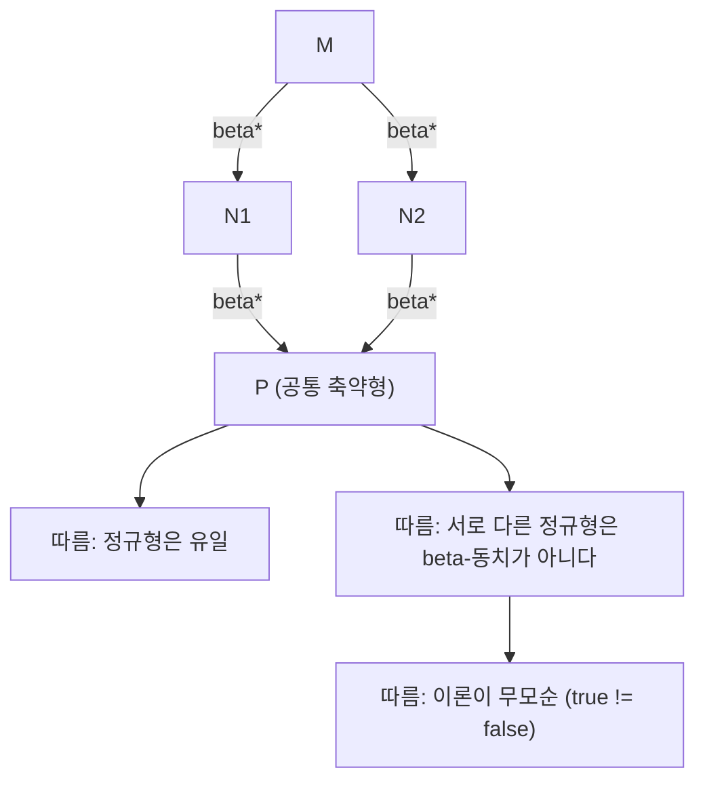

# Lambda calculus

# 개요

Lambda calculus는 Alonzo Church가 1930년대에 도입한 계산 모델이다. 기본 대상은 오직 [함수](functions.md)뿐이고, 연산은 함수를 만드는 추상(abstraction)과 함수를 적용하는 적용(application) 둘뿐이다. 숫자, 진리값, 자료구조, 재귀는 모두 함수로 부호화된다.

이렇게 빈약한 문법이 Turing 기계와 같은 계산 능력을 갖는다는 것이 핵심 사실이다. Church의 lambda-정의가능성, Kleene의 일반 재귀함수, Turing의 기계가 모두 같은 함수족을 잡아낸다는 결과가 Church–Turing 논제의 경험적 근거이며, 동시에 [계산 가능성](computability.md)의 결정불가능성 결과들이 lambda calculus로도 그대로 옮겨진다.

계산 모델로서의 의의 외에 두 가지 쓰임이 더 있다. 하나는 프로그래밍 언어의 의미론이다. 함수형 언어는 사실상 lambda calculus에 자료형과 최적화를 덧붙인 것이고, 클로저·고차함수·지연 평가의 의미가 여기서 정의된다. 다른 하나는 증명론이다. 단순 타입을 붙이면 항이 증명, 타입이 명제가 되는 Curry–Howard 대응이 나타나고, 이때 계산 능력은 떨어지지만 모든 계산이 반드시 끝난다.

# 직관

lambda 항은 "이름 붙이지 않은 함수"를 적는 표기법이다. $x$ 를 받아 $x + 1$ 을 주는 함수를 $\lambda x.\thinspace x + 1$ 로 쓰고, 인자에 적용하는 것은 나란히 쓰는 것으로 표현한다. 계산이란 $(\lambda x.\thinspace M)\thinspace N$ 이라는 모양을 발견해 $M$ 안의 $x$ 를 $N$ 으로 치환하는 일의 반복이다. 이 한 가지 규칙( $\beta$ 축약)이 전부다.

데이터를 함수로 표현하는 발상이 처음에는 낯설다. 자연수 $n$ 을 "어떤 함수를 $n$ 번 반복 적용하는 연산자"로 정의하면, 덧셈은 반복의 이어 붙이기, 곱셈은 반복의 중첩이 된다. 같은 방식으로 참/거짓은 "두 인자 중 어느 쪽을 고르는가"로, 순서쌍은 "두 성분을 받는 선택자에게 자신을 넘기는 함수"로 정의된다. 자료구조가 자신에 대한 사용법으로 정의되는 셈이다.

재귀는 더 미묘하다. 이름이 없으니 정의 안에서 자기를 부를 수 없다. 해결책은 "자기 자신을 인자로 받는" 항을 만들어 고정점을 취하는 것이다. Y combinator가 정확히 그 일을 한다. $Y\thinspace g$ 가 $g\thinspace(Y\thinspace g)$ 로 축약되므로 $g$ 는 자기 자신의 결과를 인자로 받아 쓸 수 있고, 이렇게 이름 없이 재귀가 생긴다. 여기에는 대가가 있다. 같은 장치가 축약이 영원히 끝나지 않는 항도 만들어 내며, 실제로 $(\lambda x.\thinspace x\thinspace x)(\lambda x.\thinspace x\thinspace x)$ 는 자기 자신으로 축약되기를 무한히 반복한다.

계산 순서에 자유도가 있다는 점도 중요하다. 한 항 안에 축약 가능한 자리가 여러 개일 수 있는데, Church–Rosser 정리가 "어느 순서로 줄이든 결국 만날 수 있다"고 보장한다. 그래서 정규형은 유일하고, 계산 결과는 전략에 의존하지 않는다. 다만 정규형에 **도달하는지**는 전략에 의존한다.

# 정의

## 항의 문법

가산 무한개의 변수 집합에서 lambda 항을 귀납적으로 정의한다.

$$
M, N \thickspace::=\thickspace x \thickspace\mid\thickspace \lambda x.\thinspace M \thickspace\mid\thickspace M\thinspace N
$$

$x$ 는 변수, $\lambda x.\thinspace M$ 은 추상, $M\thinspace N$ 은 적용이다. 관례적으로 적용은 왼쪽 결합이어서 $M\thinspace N\thinspace P$ 는 $(M\thinspace N)\thinspace P$ 이고, 추상의 몸통은 최대한 오른쪽으로 뻗어서 $\lambda x.\thinspace M\thinspace N$ 은 $\lambda x.\thinspace (M\thinspace N)$ 이다.

자유변수 집합은 $\mathrm{FV}(x) = \lbrace x\rbrace$ 와 $\mathrm{FV}(\lambda x.\thinspace M) = \mathrm{FV}(M) \setminus \lbrace x\rbrace$ 와 $\mathrm{FV}(M\thinspace N) = \mathrm{FV}(M) \cup \mathrm{FV}(N)$ 로 정의한다. 자유변수가 없는 항을 닫힌 항 또는 combinator라 한다.

## 세 가지 변환

**$\alpha$ -변환.** 속박변수의 이름은 의미를 갖지 않는다. $y$ 가 $M$ 에서 자유롭지 않을 때 $\lambda x.\thinspace M$ 과 $\lambda y.\thinspace M[x := y]$ 를 같은 항으로 본다. 이후 모든 항은 $\alpha$ -동치류로 다룬다.

**$\beta$ -축약.** 계산 규칙이다.

$$
(\lambda x.\thinspace M)\thinspace N \thickspace\to_\beta\thickspace M[x := N]
$$

여기서 치환은 포획 회피(capture-avoiding)여야 한다. 즉 $N$ 의 자유변수가 $M$ 안의 추상에 붙잡히지 않도록 필요하면 $\alpha$ -변환을 먼저 한다. $(\lambda x.\thinspace M)\thinspace N$ 꼴의 부분항을 redex라 하고, redex가 없는 항을 정규형(normal form)이라 한다.

**$\eta$ -변환.** 외연성(extensionality)을 표현한다. $x$ 가 $M$ 에서 자유롭지 않을 때

$$
\lambda x.\thinspace M\thinspace x \thickspace\to_\eta\thickspace M .
$$

두 함수가 모든 인자에 대해 같은 값을 주면 같다는 원리의 문법적 대응이다.

$\to^\ast$ 로 여러 단계 축약을, $=_\beta$ 로 $\beta$ -축약으로 생성되는 동치관계를 쓴다.

## Church 수와 산술

자연수 $n$ 을 "함수를 $n$ 번 적용하는 연산자"로 정의한다.

$$
\underline{n} \thickspace=\thickspace \lambda f.\thinspace\lambda x.\thinspace \underbrace{f\thinspace(f\thinspace(\cdots(f}_{n}\thinspace x)\cdots))
$$

즉 $\underline 0 = \lambda f.\lambda x.\thinspace x$ 와 $\underline 1 = \lambda f.\lambda x.\thinspace f\thinspace x$ 와 $\underline 2 = \lambda f.\lambda x.\thinspace f\thinspace(f\thinspace x)$ 다. 산술 연산은 다음과 같다.

- 후자: $\mathrm{succ} = \lambda n.\lambda f.\lambda x.\thinspace f\thinspace(n\thinspace f\thinspace x)$
- 덧셈: $\mathrm{plus} = \lambda m.\lambda n.\lambda f.\lambda x.\thinspace m\thinspace f\thinspace(n\thinspace f\thinspace x)$
- 곱셈: $\mathrm{mult} = \lambda m.\lambda n.\lambda f.\thinspace m\thinspace(n\thinspace f)$
- 거듭제곱: $\mathrm{exp} = \lambda m.\lambda n.\thinspace n\thinspace m$

진리값과 조건은 선택자로 정의한다. $\mathrm{true} = \lambda x.\lambda y.\thinspace x$ 와 $\mathrm{false} = \lambda x.\lambda y.\thinspace y$ 와 $\mathrm{ifelse} = \lambda b.\lambda t.\lambda e.\thinspace b\thinspace t\thinspace e$ 다. 그러면 $\mathrm{iszero} = \lambda n.\thinspace n\thinspace(\lambda z.\thinspace \mathrm{false})\thinspace\mathrm{true}$ 가 된다. 순서쌍은 $\mathrm{pair} = \lambda a.\lambda b.\lambda s.\thinspace s\thinspace a\thinspace b$ 와 $\mathrm{fst} = \lambda p.\thinspace p\thinspace\mathrm{true}$ 와 $\mathrm{snd} = \lambda p.\thinspace p\thinspace\mathrm{false}$ 다. 전자(predecessor)는 Kleene의 기법으로 $(n, n-1)$ 쌍을 반복 갱신해 얻는다.

## 고정점 combinator

**정의.** $Y = \lambda f.\thinspace (\lambda x.\thinspace f\thinspace(x\thinspace x))\thinspace(\lambda x.\thinspace f\thinspace(x\thinspace x))$ 다.

**성질.** 임의의 $g$ 에 대해

$$
Y\thinspace g \thickspace\to_\beta\thickspace (\lambda x.\thinspace g\thinspace(x\thinspace x))\thinspace(\lambda x.\thinspace g\thinspace(x\thinspace x)) \thickspace\to_\beta\thickspace g\thinspace\big((\lambda x.\thinspace g\thinspace(x\thinspace x))\thinspace(\lambda x.\thinspace g\thinspace(x\thinspace x))\big)
$$

이고 마지막 항은 $g\thinspace(Y\thinspace g)$ 와 같은 항이다. 따라서 $Y\thinspace g =_\beta g\thinspace(Y\thinspace g)$ 이며, $Y\thinspace g$ 는 $g$ 의 고정점이다.

재귀 함수는 "자기 자신을 인자로 받는" 함수의 고정점으로 얻는다. 계승을 예로 들면

$$
F = \lambda r.\thinspace\lambda n.\ \mathrm{ifelse}\ (\mathrm{iszero}\ n)\ \underline{1}\ (\mathrm{mult}\ n\ (r\ (\mathrm{pred}\ n)))
$$

에 대해 $\mathrm{fact} = Y\thinspace F$ 다. 값 호출(call-by-value) 언어에서는 $Y$ 가 발산하므로 한 단계 지연을 넣은 $Z = \lambda f.\thinspace (\lambda x.\thinspace f\thinspace(\lambda v.\thinspace x\thinspace x\thinspace v))\thinspace(\lambda x.\thinspace f\thinspace(\lambda v.\thinspace x\thinspace x\thinspace v))$ 를 쓴다.

## 축약 전략

한 항에 redex가 여럿 있을 때 어느 것을 먼저 줄일지가 전략이다.

- **정규 순서(normal order).** 가장 왼쪽 바깥쪽 redex부터. 지연 평가에 대응한다.
- **값 호출(applicative order).** 인자를 먼저 정규형으로 만든 뒤 적용한다. 대부분의 실제 언어가 쓴다.

두 전략은 결과가 같지만 종료성이 다르다. 예컨대 $\Omega = (\lambda x.\thinspace x\thinspace x)(\lambda x.\thinspace x\thinspace x)$ 로 둔 $(\lambda x.\thinspace \lambda y.\thinspace y)\thinspace\Omega$ 는 정규 순서에서는 $\lambda y.\thinspace y$ 로 끝나지만 값 호출에서는 $\Omega$ 를 먼저 줄이려다 발산한다.

# 성질

## Church–Rosser 정리

**정리 (합류성, confluence).** $M \to^\ast N_1$ 이고 $M \to^\ast N_2$ 이면, 어떤 $P$ 가 존재하여 $N_1 \to^\ast P$ 이고 $N_2 \to^\ast P$ 다. $\beta\eta$ 축약에 대해서도 성립한다.



증명은 한 단계 축약을 여러 redex를 동시에 줄이는 평행 축약(parallel reduction)으로 바꾼 뒤, 평행 축약이 다이아몬드 성질을 만족함을 귀납으로 보이는 Tait–Martin-Löf 방식이 표준이다.

따름정리 세 개.

1. **정규형의 유일성.** 항이 정규형을 가지면 그것은 $\alpha$ -동치를 제외하고 유일하다. 두 정규형이 공통 축약형을 가져야 하는데, 정규형은 더 줄지 않으므로 서로 같아야 한다.
2. **무모순성.** $\mathrm{true}$ 와 $\mathrm{false}$ 는 서로 다른 정규형이므로 $=_\beta$ 로 동일시되지 않는다. 즉 모든 항을 같다고 증명하는 붕괴가 일어나지 않는다.
3. **표준화 정리.** 항이 정규형을 가지면 정규 순서 축약이 반드시 그 정규형에 도달한다. 정규 순서는 "종료성 면에서 최선"이다.

## 계산 능력과 결정불가능성

**정리 (Church, Kleene, Turing).** 함수 $f : \mathbb N^k \to \mathbb N$ 가 lambda-정의가능한 것과 Turing 계산가능한 것은 동치다. 즉 Church 수로 입출력을 부호화할 때 $F\thinspace\underline n =_\beta \underline{f(n)}$ 인 항 $F$ 가 존재하는 것과 $f$ 를 계산하는 Turing 기계가 있는 것이 같다[^1].

증명의 한쪽은 원시 재귀 도식과 최소화 연산자를 lambda 항으로 구성하는 것이고(최소화에는 고정점 combinator가 쓰인다), 다른 쪽은 lambda 항의 축약 과정을 기계로 시뮬레이션하는 것이다. 이 동치가 Church–Turing 논제의 핵심 증거다. 논제 자체는 "직관적으로 계산가능하다"는 비형식적 개념을 다루므로 수학적 정리가 아니라 경험적 주장이다.

계산 능력이 같으니 결정불가능성도 따라온다.

- 주어진 항이 정규형을 갖는지는 결정불가능하다(정지 문제에 대응).
- 두 항이 $=_\beta$ 인지도 결정불가능하다(Church의 정리). Scott–Curry 정리는 더 강하게, $\beta$ -동치로 닫힌 자명하지 않은 항 집합은 결정불가능하다고 말한다. 이는 [Rice 정리](rice-theorem.md)의 lambda calculus 판본이다.
- 반면 [유한 오토마타](finite-automata.md)처럼 계산 능력이 제한된 모델에서는 이런 질문들이 모두 결정가능하다. 표현력과 분석가능성의 교환은 여기서도 같다.

## 단순 타입과 정규화

**단순 타입 lambda calculus(STLC).** 타입을 기본 타입과 함수 타입 $A \to B$ 로 정의하고, 항에 타입 판정 규칙을 준다. 변수는 문맥에서 타입을 받고, $\lambda x : A.\thinspace M$ 은 $M : B$ 일 때 $A \to B$ 를 가지며, 적용 $M\thinspace N$ 은 $M : A \to B$ 이고 $N : A$ 일 때 $B$ 를 갖는다.

**정리 (강한 정규화).** STLC의 모든 타입 있는 항은 어떤 축약 순서로도 유한 단계 안에 정규형에 도달한다.

증명은 Tait의 계산가능성 술어(reducibility) 논법이 표준이다. 타입 구조에 대한 귀납으로 "계산가능한 항" 개념을 정의하고, 모든 타입 있는 항이 계산가능함을 보인다. 단순한 항 크기에 대한 귀납으로는 실패한다는 점이 이 증명의 요점이다.

강한 정규화의 대가는 표현력이다. $\lambda x.\thinspace x\thinspace x$ 는 타입을 붙일 수 없고(자기 적용은 $A = A \to B$ 를 요구한다), 따라서 $Y$ 도 타입을 갖지 못한다. STLC에서 표현 가능한 수치 함수는 확장 다항식 수준에 그치므로 Turing 완전하지 않다. 실제 언어는 재귀를 원시 연산으로 추가하거나(`fix`), 다형성·의존 타입 같은 더 강한 체계를 쓴다.

**Curry–Howard 대응.** 타입을 명제로, 항을 증명으로 읽으면 STLC는 [직관주의 논리](intuitionism.md)의 함의 단편과 정확히 대응한다. 함수 타입은 함의, 곱 타입은 논리곱, 합 타입은 논리합이며, $\beta$ -축약은 증명의 정규화(cut 제거)에 해당한다. 이 대응이 형식 증명 보조 도구(Coq, Agda, Lean)의 설계 원리다[^2].

# 활용

## Python으로 본 Church 수

lambda 항을 파이썬의 익명 함수로 그대로 옮길 수 있다. 값 호출 언어이므로 재귀에는 `Z` combinator를 쓴다.

```python
# Church 수: n = λf.λx. f^n(x)
zero = lambda f: lambda x: x
succ = lambda n: lambda f: lambda x: f(n(f)(x))
plus = lambda m: lambda n: lambda f: lambda x: m(f)(n(f)(x))
mult = lambda m: lambda n: lambda f: m(n(f))
expo = lambda m: lambda n: n(m)

to_int = lambda n: n(lambda k: k + 1)(0)
of_int = lambda k: zero if k == 0 else succ(of_int(k - 1))

two, three = of_int(2), of_int(3)
print(to_int(plus(two)(three)), to_int(mult(two)(three)), to_int(expo(two)(three)))
# 5 6 8

# 진리값과 조건
true = lambda x: lambda y: x
false = lambda x: lambda y: y
# 값 호출이므로 분기를 지연시키려고 thunk 를 넘긴다
ifelse = lambda b: lambda t: lambda e: b(t)(e)()
iszero = lambda n: n(lambda _: false)(true)
print(to_int(ifelse(iszero(zero))(lambda: of_int(7))(lambda: of_int(9))))
# 7

# 전자(predecessor): (n, n-1) 쌍을 n 번 갱신한다
pair = lambda a: lambda b: lambda s: s(a)(b)
fst = lambda p: p(lambda a: lambda b: a)
snd = lambda p: p(lambda a: lambda b: b)
step = lambda p: pair(succ(fst(p)))(fst(p))
pred = lambda n: snd(n(step)(pair(zero)(zero)))
print(to_int(pred(of_int(5))))
# 4

# Z combinator: 값 호출에서 쓰는 고정점 연산자
Z = (lambda f: (lambda x: f(lambda v: x(x)(v)))(lambda x: f(lambda v: x(x)(v))))
fact_body = lambda rec: lambda n: 1 if n == 0 else n * rec(n - 1)
fact = Z(fact_body)
print([fact(k) for k in range(7)])
# [1, 1, 2, 6, 24, 120, 720]

# Church 수만으로 쓴 계승
church_fact_body = lambda rec: lambda n: ifelse(iszero(n))(
    lambda: of_int(1)
)(lambda: mult(n)(rec(pred(n))))
print(to_int(Z(church_fact_body)(of_int(5))))
# 120
```

`fact` 정의 어디에도 자기 이름이 나오지 않는다는 점이 요점이다. 재귀는 언어의 원시 기능이 아니라 고정점 combinator로부터 유도된 것이다.

## 언어와 시스템에서의 쓰임

- **함수형 언어의 핵심.** Haskell, OCaml, Scheme의 의미론은 lambda calculus에 상수·자료형·평가 전략을 더한 것으로 정의된다. 컴파일러 중간 표현(GHC의 Core 등)도 타입 있는 lambda calculus다.
- **클로저와 고차함수.** 자유변수를 담은 환경과 함께 함수를 값으로 다루는 구현이 곧 lambda 추상의 기계적 실현이다. 주류 명령형 언어의 람다/클로저 기능도 같은 기원이다.
- **평가 전략의 설계.** 지연 평가는 정규 순서의 공학적 구현(그래프 축약, thunk)이고, 엄격 평가는 값 호출이다. 두 전략의 종료성 차이가 그대로 언어 설계의 절충으로 나타난다.
- **증명 보조 도구.** 의존 타입 체계(Calculus of Constructions 등)는 STLC를 확장한 것이며, 정리 증명은 타입이 붙은 항을 구성하는 일이다. 강한 정규화가 논리적 무모순성과 직결된다.
- **대수적 관점.** 항을 대상으로, 축약을 사상으로 보면 lambda calculus는 데카르트 닫힌 [범주](category.md)의 내부 언어로 해석된다. 타입은 대상, 항은 사상, 함수 타입은 지수 대상이다.

## 관련 개념과의 경계

- **combinator 논리.** 변수 속박을 없애고 $S = \lambda x.\lambda y.\lambda z.\thinspace x\thinspace z\thinspace(y\thinspace z)$ 와 $K = \lambda x.\lambda y.\thinspace x$ 두 combinator만으로 같은 계산 능력을 얻는다. 변수 이름 처리를 피하려는 구현에서 쓰인다.
- **계산 복잡도.** lambda calculus는 계산 가능성을 논하기에는 좋지만 비용 모델이 자명하지 않다. 축약 단계 수와 실제 시간의 관계는 별도 연구 주제이며, 여기서의 결과들은 [계산 가능성](computability.md)의 층위이지 [NP-완전성](np-completeness.md)의 층위가 아니다.
- **논리와의 관계.** Church는 원래 lambda calculus를 수학의 기초 체계로 제안했으나 초기 체계가 Kleene–Rosser 역설로 무너졌고, 계산 부분만 떼어낸 것이 오늘날의 형태다. 이 경험이 타입 도입의 동기가 되었으며, 그 연장선에서 [Gödel 불완전성 정리](godel-incompleteness.md)와 같은 계열의 자기 지시 현상이 고정점 combinator로 나타난다.

[^1]: A. M. Turing, Computability and λ-Definability, Journal of Symbolic Logic 2(4), 1937, https://www.jstor.org/stable/2268280
[^2]: H. Barendregt, The Lambda Calculus: Its Syntax and Semantics, North-Holland, 1984, https://archive.org/details/lambdacalculusit0000bare

# 연관 문서

## 선수지식

- [계산 가능성과 정지 문제](computability.md)
- [함수](functions.md)

## 더 알아보기

- [Curry–Howard 대응](curry-howard.md)

#computation #logic
